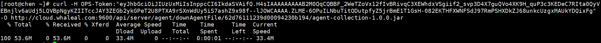

## Add Host

##### 预准备

1.安装java环境 

[安装配置java](https://www.whaleal.com/thread?topicId=238)
 

2.配置域名解析 

[域名解析](https://www.whaleal.com/thread?topicId=239)
    
    
    也可把cloud.whaleal.com直接替换为Server服务器IP地址

3.安装ioStat插件

    yum install sysstat

 

#### 添加主机

1.点击Server导航栏进入主机页面,右侧添加主机按钮点击后弹出提示页面。
    
    前三步为预准备内容，第四步为生成的agentId(作为主机的唯一标识符)，之后的步骤复制命令在主机命令行进行执行。
    a标签处有详细步骤。
 

a.预准备完成后在提示页面点击生成agent按钮，之后操作在主机命令行执行。

·复制下载AGENT_JAR命令并执行。

·复制启动AGENT命令并执行。

执行完毕后在Server主机列表页面将会显示添加的主机。

