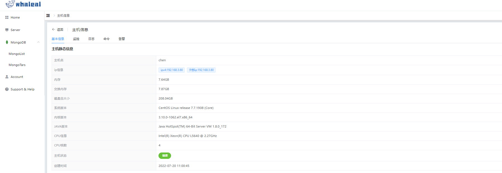
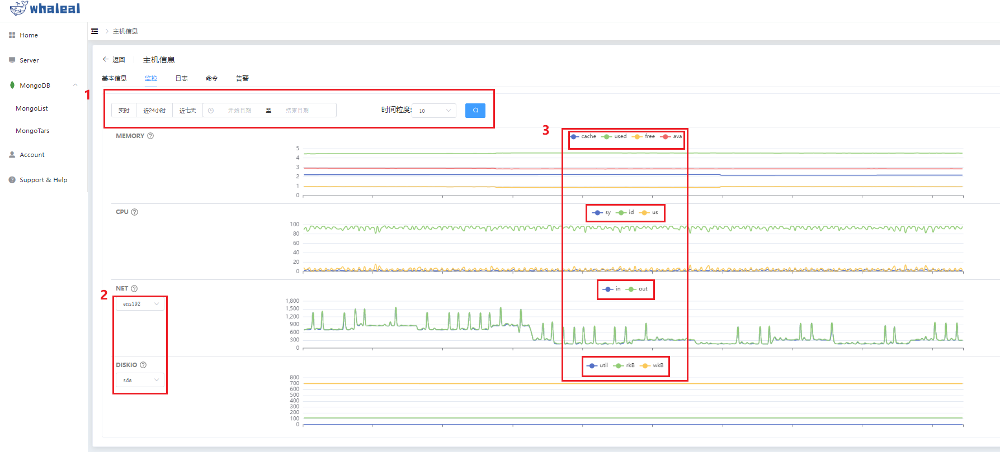
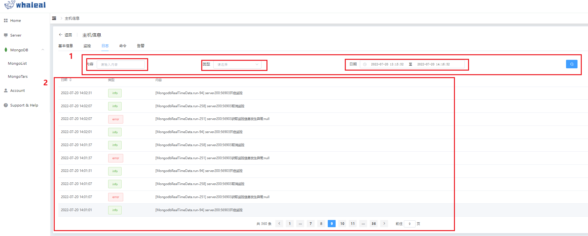
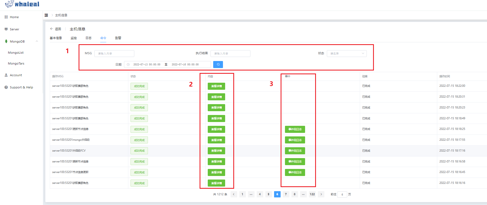
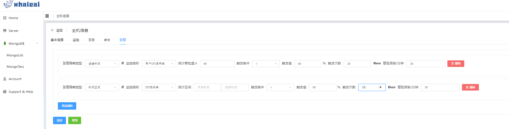

## Host information

### 一. 点击Server导航栏查看一些主机的基本状况。

    1.主机名称
    2.系统信息
    3.主机内核
    4.主机agent存活时长
    5.主机状态
    6.针对主机的操作

 

#### 对于主机的操作有脱离纳管与更新主机信息两个功能。

- 脱离纳管即移除主机，详情操作--> [RemoveHost](RemoveHost.md)

- 更新主机信息是将主机信息再次获取，之后更新页面内容。其主要获取内容有主机的静态信息与其监控数据与主机状态。  
(由于主机异常宕机，手动重启后前端不会直接更新主机的状态，点击更新主机信息后将刷新主机状态)

 

### 二. 点击主机名称进入主机信息页面查看主机详情与操作

    1.主机信息
    2.监控
    3.日志
    4.命令
    5.告警

1.主机信息：
 
    主要展示主机的一些基本静态信息

 

2.监控：

    监控信息是将 MEMORY,CPU,NET,DISKIO 的一些信息进行图形化的显示。
    （1）处可以选择显示不同时间范围内的图形数据，或显示时间范围内不同颗粒度的图形数据。
    （2）处的NET与DISKIO 处可通过下拉框选择显示所需要的内容。
    （3）处可通过点击图形按钮进行数据的隐藏与显示

 

3.日志：

    日志是对主机的活动进行记录，其中包括操作者的操作，定时执行的任务等。显示具体的执行事件、事件执行的状况与执行的具体内容。
    （1）处是对日志的筛选功能，比如只看某时间段或某类型或具有某内容的日志信息。
    （2）处为搜索到的日志信息在前端页面进行展示。

 

4.命令：

    命令即对主机层面的操作或对mongo集群的操作，其操作状态、内容、事件、结果与操作事件等一同显示。
    操作MSG：显示操作的功能，包括主机操作与人为操作。
    状态：操作不同功能时各阶段的状态（实时更新）。
    内容：点击查看详情可以查看到集群的详细内容等。
    事件：事件包括主机的操作事件与操作者的操作事件（在前端页面的操作会有事件组日志，可点击查看详情查看事件的执行过程）。
    （1）处对是过滤条件的设置，可以模糊查询MSG内容与对时间范围内的命令进行显示。
    （2）处点击查看详情可显示JSON格式的命令详细信息。
    （3）处点事件组日志可查看详细的事件执行情况。

    
    

 

5.告警：

    告警是对主机的各项指标进行阈值的设定，达到阈值触发告警后将发送钉钉、邮件或短信进行通知主机存在异常。
    在其页面可针对使用者的情况进行阈值的设定与添加触发告警的条件与指标。

