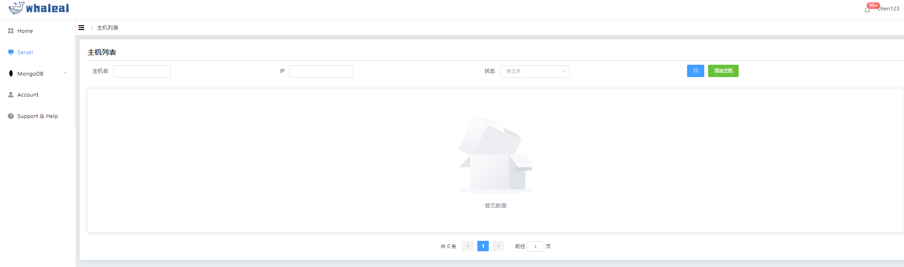

## Remove Host

1.点击Server导航栏进入主机页面,右侧操作点击脱离纳管。

2.直接使用命令行将agent进程kill掉。（谨慎操作）

a.脱离纳管后该主机的agent进程将会被关闭，Whaleal平台主机列表将不显示此主机。同时该主机相关的MONGODB节点的状态同步改为“主机脱离纳管”

b.agent进程被kill掉后，主机被强制脱离纳管，在平台页面将不显示此主机。

