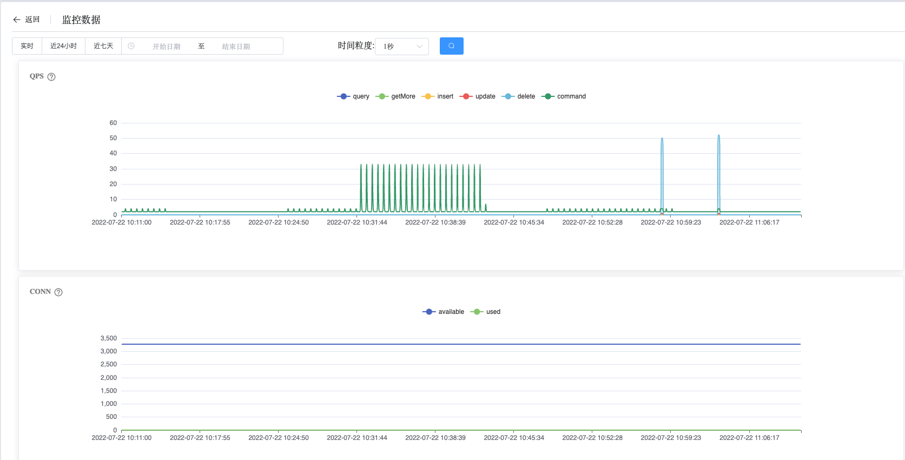
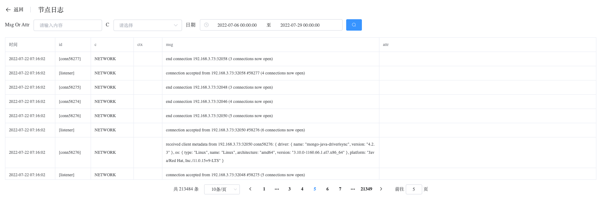
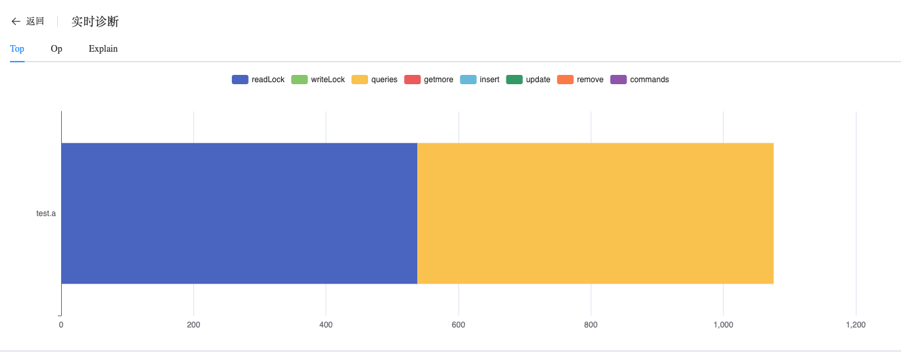
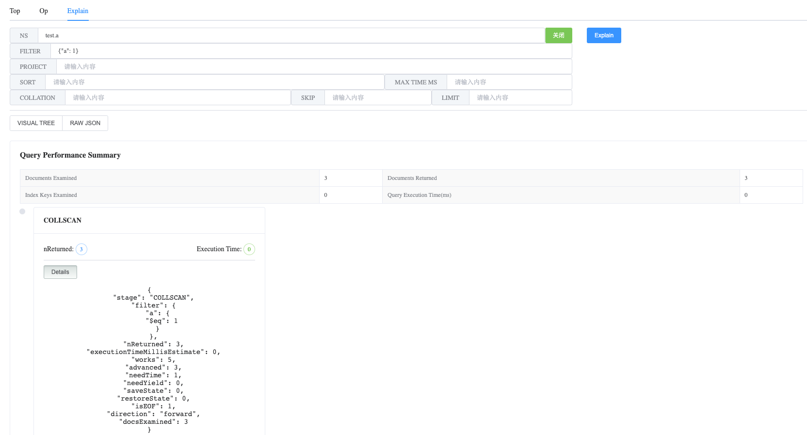
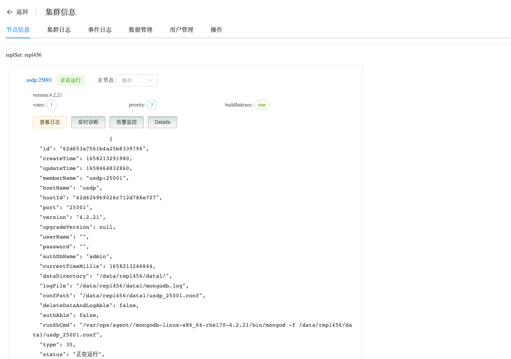

## Info ReplicaSet

```
Manage ReplicaSet 可以执行以下操作：
 - Monitoring Data
 - MongoDB Logs
 - Real-time Diagnosis
 - Alert
 - Details
 - Operation
```

查看 ReplicaSet 节点数据

a. 进入页面左侧导航栏

b. 点击 MongoDB 选项按钮，选择 MongoList 选项

c. 在 MongoDB 静态信息页面，点击类型为 “复制集” 的集群名

### Monitoring Data

查看 Monitoring 数据

a. 在集群信息页面，选择节点信息

b. 在节点信息下，点击节点名称（一般为 hostname:端口）

Whaleal Platform 提供非常丰富的监控指标，并提供任意时间范围查询、过滤。




### MongoDB Logs

查看 MongoDB Logs 数据

a. 在集群信息页面，选择节点信息

b. 在节点信息下，点击查看日志

Whaleal Platform 记录并保存完整的 MongoDB 日志，提供过滤操作，遇到问题可以方便快速定位。



### Real-time Diagnosis

查看 Real-time Diagnosis 数据

a. 在集群信息页面，选择节点信息

b. 在节点信息下，点击实时诊断

**Top**

Top 展示当前时间点热集合。



**Op**


**Explain



### Alert

查看 Alert 数据

a. 在集群信息页面，选择节点信息

b. 在节点信息下，点击告警监控


### Details

查看 Details 数据

a. 在集群信息页面，选择节点信息

b. 在节点信息下，点击 Details



### Operation

对于此节点进行其他操作，包含：更新节点信息、启动节点、关闭节点、重启节点、删除节点、脱离纳管、打开/关闭QPS监控、打开/关闭TopAndOp监控、打开/关闭MongoDBLog收集。

* 更新节点信息：默认间隔10秒触发更新节点信息，点击按钮立刻出发，展示节点最新状态信息

* 启动节点：点击后可将关闭的节点启动

* 关闭节点：点击后可将启动节点 ShutDown 

* 重启节点：可将运行中的节点重新启动

* 删除节点：将此节点从集群中移除

* 脱离纳管：Whaleal Platform 不再监控、管理此节点

* 打开/关闭QPS监控：是否收集QPS监控数据

* 打开/关闭TopAndOp监控：是否收集实时诊断数据

* 打开/关闭MongoDBLog收集：是否收集MongoDB日志数据

