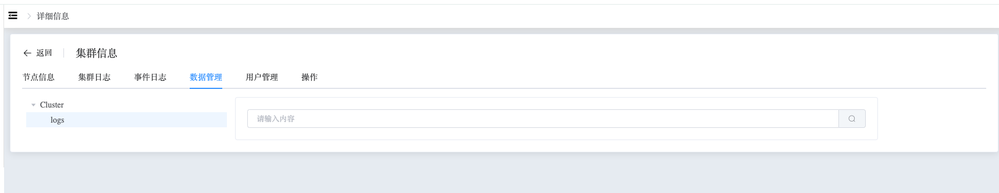

## Data

```
Data 可以执行以下操作：
 - Find Data
```

### Find Data

查看集群内数据

a. 进入页面左侧导航栏

b. 点击 MongoDB 选项按钮，选择 MongoList 选项

c. 在 MongoDB 静态信息页面，点击类型为 “分片” 的集群名

d. 在集群信息页面，选择数据管理

可通过页面的方式查看集群中存储的数据，方便用户对数据进行查询。




通过在输入框中填写查询条件，进行查询

