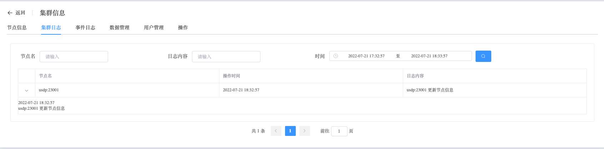

## Cluster Logs

```
Cluster Logs 可以执行以下操作：
 - Cluster Logs
```

### Cluster Logs

查看 Cluster Logs 数据

a. 进入页面左侧导航栏

b. 点击 MongoDB 选项按钮，选择 MongoList 选项

c. 在 MongoDB 静态信息页面，点击类型为 “单实例” 的集群名

d. 在集群信息页面，选择集群日志



