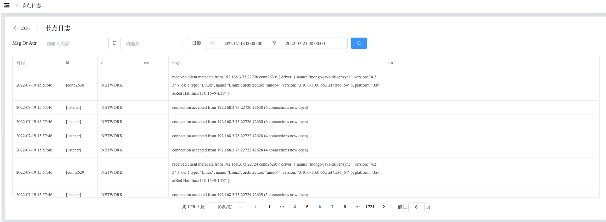

## Info Standalone

```
Manager Standalone 可以执行以下操作：
 - Monitoring Data
 - MongoDB Logs
 - Real-time Diagnosis
 - Alert
 - Details
 - Operation
```

查看 Standalon 节点数据

a. 进入页面左侧导航栏

b. 点击 MongoDB 选项按钮，选择 MongoList 选项

c. 在 MongoDB 静态信息页面，点击类型为 “单实例” 的集群名

### Monitoring Data

查看 Monitoring 数据

a. 在集群信息页面，选择节点信息

b. 在节点信息下，点击节点名称（一般为 hostname:端口）


### MongoDB Logs

查看 MongoDB Logs 数据

a. 在集群信息页面，选择节点信息

b. 在节点信息下，点击查看日志




### Real-time Diagnosis

查看 Real-time Diagnosis 数据

a. 在集群信息页面，选择节点信息

b. 在节点信息下，点击实时诊断

**Top**


**Op**


**Explain**


### Alert

查看 Alert 数据

a. 在集群信息页面，选择节点信息

b. 在节点信息下，点击告警监控


### Details

查看 Details 数据

a. 在集群信息页面，选择节点信息

b. 在节点信息下，点击 Details


### Operation

对于此节点进行其他操作，包含：更新节点信息、启动节点、关闭节点、重启节点、脱离纳管、打开/关闭QPS监控、打开/关闭TopAndOp监控、打开/关闭MongoDBLog收集。

