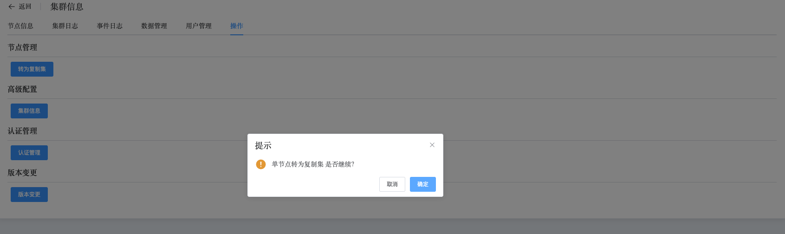
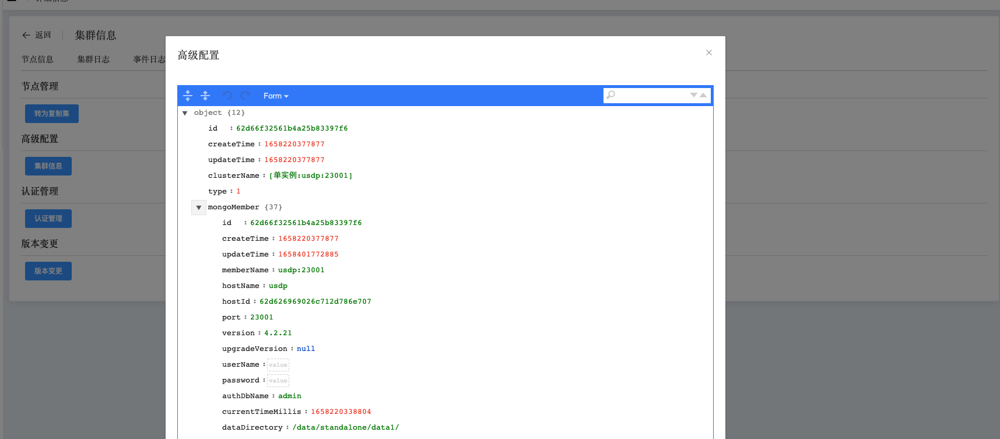

## Operation

```
Operation 可以执行以下操作：
 - Standalone to ReplicaSet
 - Cluster Info
 - Authentication
 - Modify Version
```

集群操作

a. 进入页面左侧导航栏

b. 点击 MongoDB 选项按钮，选择 MongoList 选项

c. 在 MongoDB 静态信息页面，点击类型为 “单实例” 的集群名

d. 在集群信息页面，选择操作

### Standalone to ReplicaSet



### Cluster Info

查看集群中节点配置信息



### Authentication

开启认证，必须指定一个用户在admin库下


### Modify Version

通过选择版本，对集群版本进行升降级操作

