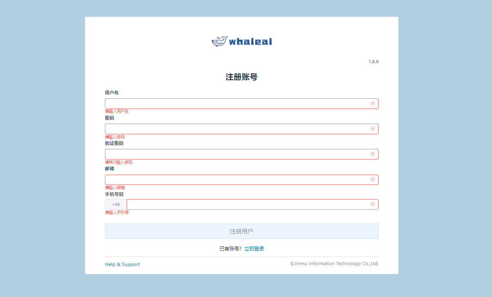
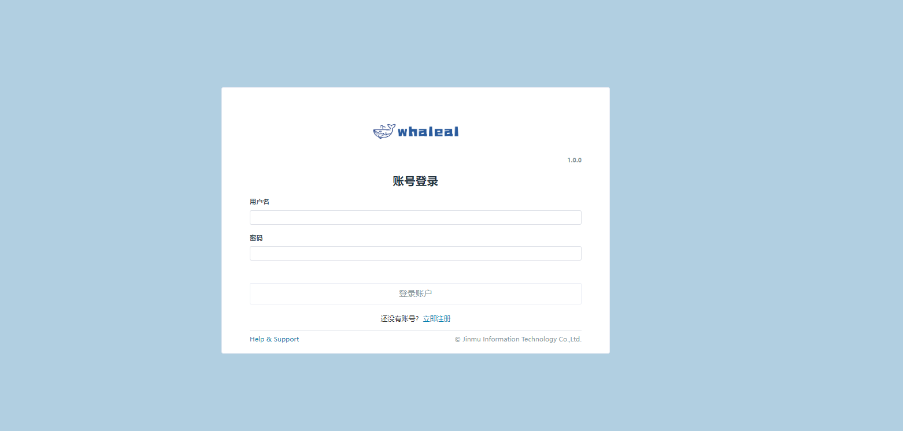

## Whaleal Platform ChangeLog

### Whaleal Platform V1.0.0

    Whaleal Platform V1.0.0，为本平台最初发行版本。

其平台包含功能模块大致如下：
    
#### 1.登录注册

- 注册

注册账号：账号注册时，无需验证手机号和邮箱正确性只验证基本格式与是否已存在，一般建议填写手机号（仅支持中国大陆手机号）和邮箱。




- 登录

  登录方式：手机+密码，邮箱+密码，账号+密码。



<br>

#### 2.首页

  
- Host

   - 显示主机、CPU、内存、磁盘的存活状态以扇形图形式展示。

- Host Summary

  - 显示CPU、Memory、Disk、NetIn、NetOut 前五的存详情数据，以图表的形式展示。

- Mongo

  - 显示Mongo节点、Mongo集群、Mongo集群类型的实时情况，以扇形图形式展示。

- MongoDB Summary

  - 显示Cluster 、Collection 、Crashed 、Qps 、Connection、Slowest 前五的存详情数据，以图表的形式展示。

<br>


#### 3.主机列表

- 主机统计
    
  - 页面将已被平台纳管的主机大致信息进行展示，同时可以对主机进行脱离纳管更新数据等操作。

- 添加主机

  - 点击添加主机按钮可以进行主机的添加，详情添加过程在[AddHost](../02-Usage/Host/AddHost.md)。

- 主机信息
  
  - 点击主机名称进入主机的详情页面页面内有主机的基本信息、监控、日志、命令、告警等。详情在[HostInfos](../02-Usage/Host/HostInfos.md)处有介绍.

<br>


#### 4.Mongo列表

- Mongo静态信息

  - 页面展示已被纳管进平台的集群信息，也可对想要集群进行搜索定位，同时可以对集群进行不同操作。例如更新节点信息、启动、关闭、重启、脱离纳管、重命名等操作。


- 创建项目

  - 点击创建项目按钮可以选择不同的集群类型在平台上进行创建。创建类型有单节点、复制集、分片等。也可将未被平台纳管的集群纳管到平台中来。
    - 创建单节点详细步骤-->[CreateStandalone](../02-Usage/MongoDB/CreateDeployment/CreateStandalone.md)
    - 创建复制集详细步骤-->[CreateReplicaSet](../02-Usage/MongoDB/CreateDeployment/CreateReplicaSet.md)
    - 创建分片详细步骤-->[CreateShardedCluster](../02-Usage/MongoDB/CreateDeployment/CreateShardedCluster.md)

- Mongo集群操作


- Mongo介质包管理

  - 在创建集群时选择不同mongo版本进行创建，此版本mongo可通过MongoTars页面进行上传.
    - 上传介质包详情步骤-->[UploadMongoTar](../02-Usage/MongoDB/UploadMongoTar.md)


####  5.用户中心

- 个人中心

  - 个人中心页面显示注册时所填写的个人信息，可以在此页面进行更改与添加信息。

- 用户管理

  - 用管理页面只有admin账号可以进行显示与操作，在页面中可以删除用户与对用户赋权。
    - 点击用户名进入用户资源页面，可以对此用户进行权限管理如添加主机与创建集群功能。在Server与Mongo页面可以对某个主机或集群对此用户显示与隐藏。

- 账户配置

  - 账户配置页面可以设置时区，同时可以设置是否接受告警通知。

####  6.Support & Help


- [文档专栏](https://docs.whaleal.com/)
  - 鲸云社区文档专栏


- [社区地址](https://www.whaleal.com/)
  - 鲸云社区


<br>
<br>
<br>
<br>


---
---


##### Whaleal Platform Agent V1.0.0
```


```