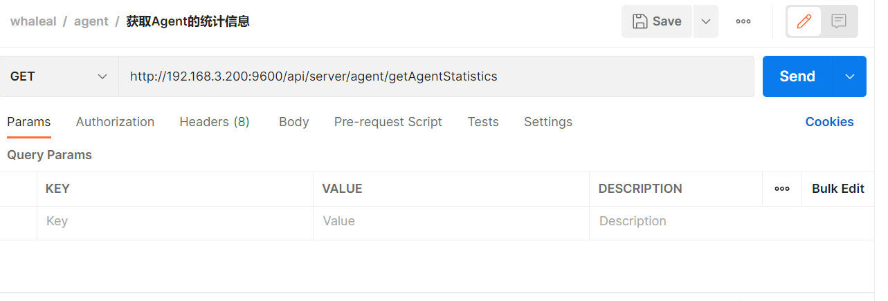
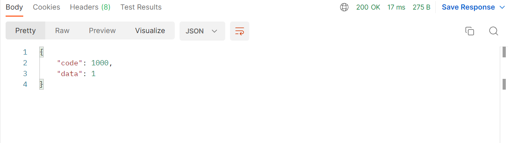
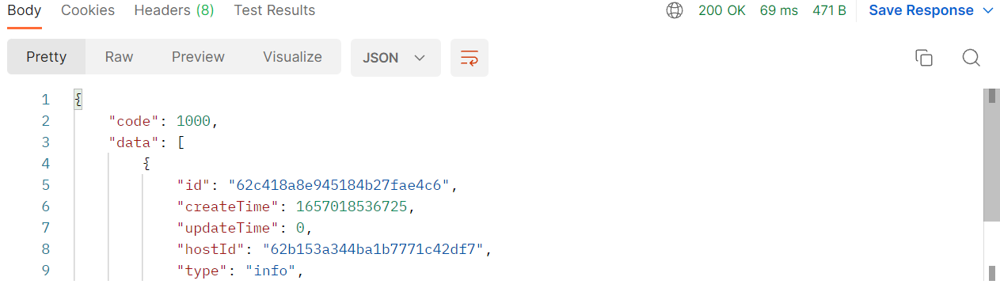
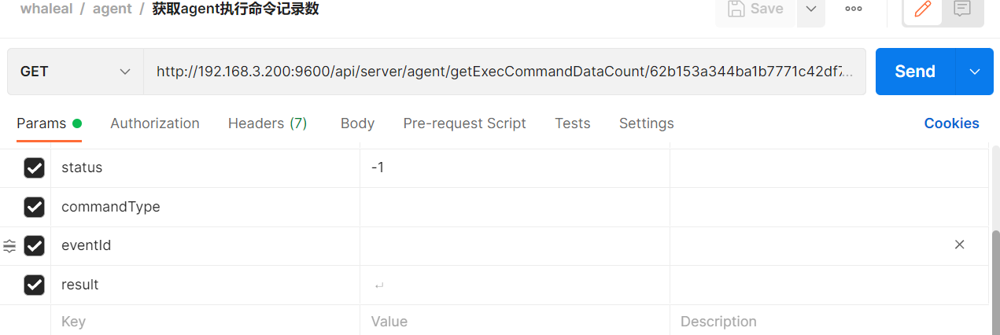
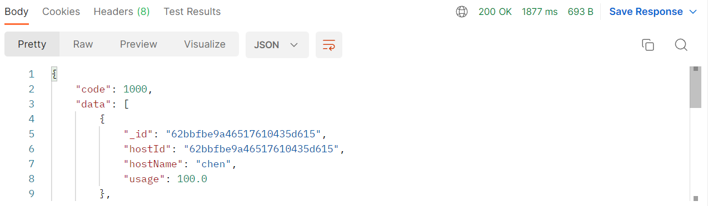
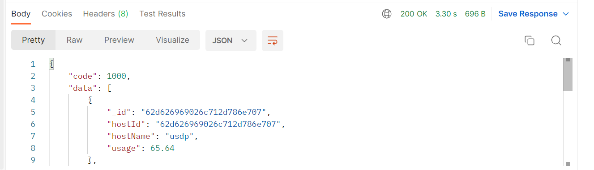
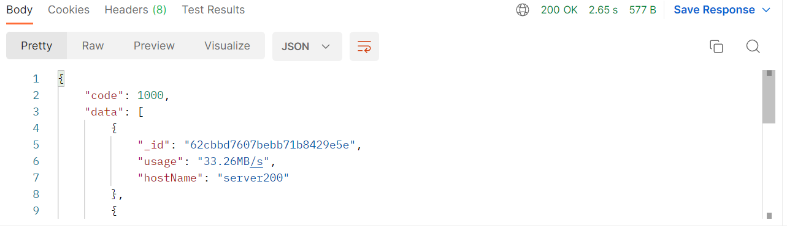
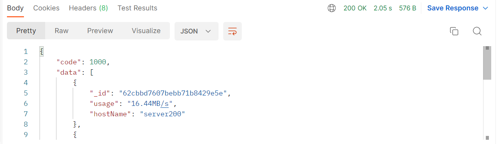

# Agent接口
此接口调用时须在请求头中设置OPS-Token ，填写参数发起请求，返回内容为 JSON 格式的信息。

### 请求头默认格式，特殊情况特殊声明

| KEY                |     VALUE      |     
| -------------------|----------------------|
| Accept-Encoding        |         gzip, deflate, br |     
| Connection          |         keep-alive           |          
| Content-Type          |         application/json |    
| OPS-Token          |         "token"           |     
---

---

#### 1 根据主机名模糊查询主机基本信息（主机名和主机ID）

1.1 请求路径：

Get : http://192.168.3.200:9600/api/server/agent/getAllAgentHostNameAndHostId

---
1.2 请求参数：

| Name                |     Located in     |           Description         |     Required    |        Schema   |
| -------------------|----------------------|-------------------------------|-----------------|-----------   |
| hostName          |         params           |            主机名称            |        No       |string        |

----

1.3 返回结果

|               |     Description    |           Schema              |  
| --------------|----------------------|---------------------------
| code        |   状态符:1000成功,其余异常 |                       |    
| data       |         返回数据         |                        |        

---

#### 2.获取Agent的统计信息

2.1 请求路径：

Get : http://192.168.3.200:9600/api/server/agent/getAgentStatistics

2.2 请求参数：

| Name                |     Located in     |           Description         |     Required    |        Schema   |
| -------------------|----------------------|-------------------------------|-----------------|-----------   |
|       |                    |                        |               |        |

2.3 返回结果:

|               |     Description    |           Schema              |  
| -------------------|----------------------|---------------------------
| code        |   状态符:1000成功,其余异常 |            long           |    
| data.activeAgentNum    |         Agent存活数         |            long            |    
| data.activeAgentCpuNum     |         Agent CPU存活数         |            long            |    
| data.activeAgentDiskNum     |         Agent 磁盘存活数         |            long            |    
| data.deadAgentMemoryNum     |         Agent 内存死亡数         |            long            |    
| data.deadAgentCpuNum     |         Agent CPU死亡数         |            long            |    
| data.activeAgentMemoryNum    |         Agent 内存存活数         |            long            |    
| data.deadAgentNum     |         Agent 死亡数         |            long            |    
| data.deadAgentDiskNum    |         Agent 磁盘死亡数         |            long            |    

#### 3.获取所有主机信息

3.1 请求路径：

GET  http://192.168.3.200:9600/api/server/agent/getAllAgentData/{{pageIndex}}/{{pageSize}}

---
1.2 请求参数：

| Name                |     Located in     |           Description         |     Required    |        Schema   |
| -------------------|----------------------|-------------------------------|-----------------|-----------   |
| pageIndex          |         path           |            第几页           |        yes       |int        |
| pageSize          |         path         |            每页大小            |        yes      |int        |
| hostName          |         params           |            主机名称            |        No       |string        |
| Ip          |         params           |            主机ip            |        No       |string        |
| Status          |         params           |            主机状态            |        No       |Boolean        |

----

3.3 返回结果

|               |     Description    |           Schema              |  
| --------------|----------------------|---------------------------
| code        |   状态符:1000成功,其余异常 |                       |    
| data       |         返回数据         |            List\<HostInfoMongoEntity>            |        

~~~
{
    "code": 1000,
    "data": [
        {
            "id": "62b153a344ba1b7771c42df7",
            "createTime": 1657077138160,
            "updateTime": 1657096989910,
            "hostId": "62b153a344ba1b7771c42df7",
            "hostName": "server100",
            "hostNameLong": "server100",
            "ipInfo": [
                {
                    "ip": "192.168.3.100",
                    "type": "ipv4"
                },
                {
                    "ip": "192.168.3.100",
                    "type": "外部ip"
                }
            ],
            "memory": 128722,
            "osVersion": "CentOS Linux release 7.9.2009 (Core)",
            "cpuInfo": " Intel(R) Xeon(R) CPU E5-2670 v2 @ 2.50GHz",
            "cpuNum": 40,
            "swap": 4095,
            "kernelInfo": "3.10.0-1160.24.1.el7.x86_64",
            "totalDiskSize": 7893956,
            "run": true,
            "systemPropertyInfo": {
                ...
            }
        }
    ]
}
~~~
---

#### 4.获取所有主机count

4.1 请求路径：

GET http://192.168.3.200:9600/api/server/agent/getAllAgentCount

---

4.2 请求参数：

| Name                |     Located in     |           Description         |     Required    |        Schema   |
| -------------------|----------------------|-------------------------------|-----------------|-----------   |
| hostName          |         params           |            主机名称            |        No       |string        |
| ip          |         params           |            主机ip            |        No       |string        |
| status          |         params           |            主机状态            |        No       |Boolean        |

----

4.3 返回结果

|               |     Description    |           Schema              |  
| --------------|----------------------|---------------------------
| code        |   状态符:1000成功,其余异常 |                      |    
| data       |         返回数量         |                       |        

---

#### 5.获取某主机静态信息

5.1 请求路径：

GET http://192.168.3.200:9600/api/server/agent/getAgentInfo/{{hostId}}

---
5.2 请求参数：

| Name                |     Located in     |           Description         |     Required    |        Schema   |
| -------------------|----------------------|-------------------------------|-----------------|-----------   |
| hostId         |         path           |            主机id           |        yes       |string        |

----

5.3 返回结果

|               |     Description    |           Schema              |  
| --------------|----------------------|---------------------------
| code        |   状态符:1000成功,其余异常 |                         |    
| data       |         返回数据         |            HostInfoMongoEntity            |        

~~~
{
    "code": 1000,
    "data": {
        "id": "62bbfbe9a46517610435d615",
        "createTime": 1657077194390,
        "updateTime": 1657097252146,
        "hostId": "62bbfbe9a46517610435d615",
        "hostName": "chen",
        "hostNameLong": "chen",
        "ipInfo": [
            {
                "ip": "192.168.3.80",
                "type": "ipv4"
            },
            {
                "ip": "192.168.3.80",
                "type": "外部ip"
            }
        ],
        "memory": 7821,
        "osVersion": "CentOS Linux release 7.7.1908 (Core)",
        "cpuInfo": " Intel(R) Xeon(R) CPU L5640 @ 2.27GHz",
        "cpuNum": 4,
        "swap": 8063,
        "kernelInfo": "3.10.0-1062.el7.x86_64",
        "totalDiskSize": 213035,
        "run": true,
        "systemPropertyInfo": {
           ...
        }
    }
}

~~~

---

#### 6.获取agent的监控信息

6.1 请求路径：

GET http://192.168.3.200:9600/api/server/agent/getAgentMonitor/map/{{hostId}}/{{type}}

---

6.2 请求参数：

| Name                |     Located in     |           Description         |     Required    |        Schema   |
| -------------------|----------------------|-------------------------------|-----------------|-----------   |
| hostId         |         path           |            主机id            |        yes       |string        |
| type         |         path           |            监控类型            |        yes       |string        |
| startTimeForTimeInterval         |         params           |      某时间段的开始时间            |        yes       |long        |
| endTimeForTimeInterval         |         params           |            某时间段的结束时间    |        yes       |long        |
| timeGranularity         |         params           |            时间粒度            |        yes       |long        |

----

6.3 返回结果

|               |     Description    |           Schema              |  
| --------------|----------------------|---------------------------
| code        |   状态符:1000成功,其余异常 |                      |    
| data       |         返回数据         |        Map<String,Object>                |        

~~~
{
    "code": 1000,
    "data": {
        "内存/GB": {
            "cache": [
                24.85,
                36.33,
                37.58,
                43.05,
                49.25,
                48.12,
                47.66,
                46.84
            ]
            "name": "net",
            "message": {
                "in": "流入流量 单位KB/S",
                "out": "流出流量 单位KB/S"
            }
        },
        "diskIO/KB": {
            "data": {
                "dm-2": {
                    "util": [
                        0.6,
                        0.59,
                        0.59,
                        0.59,
                        0.59,
                        0.59,
                        0.58,
                        0.58
                    ]
                }
            },
            "name": "diskIO",
            "message": {
                "util": "使用率 单位百分比",
                "rkB": "读 单位KB/S",
                "wkB": "写 单位KB/S"
            }
        }
    },
    "size": 8,
    "createTime": [
        1656504001000,
        1656584997000,
        1656590401000,
        1656633601000,
        1656676801000,
        1656720001000,
        1656763201000,
        1656806401000
    ]
}
~~~

---

#### 7.获取agent的日志信息，结果分页展示

7.1 请求路径：

GET http://192.168.3.200:9600/api/server/agent/logData/{{hostId}}/{{pageIndex}}/{{pageSize}}

---

7.2 请求参数：

| Name                |     Located in     |           Description         |     Required    |        Schema   |
| -------------------|----------------------|-------------------------------|-----------------|-----------   |
| hostid          |         path           |            主机id           |        yes       |string        |
| pageIndex          |         path           |            第几页            |        yes       |Integer        |
| pageSize          |         path           |            每页数量            |        yes       |Integer        |
| type          |         params           |            日志类别            |        No       |string        |
| startTime          |         params           |            开始时间            |        yes       |long        |
| endTime          |         params           |            结束时间            |        yes       |long        |
| content          |         params           |            关键字            |        No       |string        |

----

7.3 返回结果

|               |     Description    |           Schema              |  
| --------------|----------------------|---------------------------
| code        |   状态符:1000成功,其余异常 |                       |    
| data       |         返回数据         |     AgentLogEntity         |       

---

#### 8.获取agent的日志信息数量

8.1 请求路径：

GET http://192.168.3.200:9600/api/server/agent/logCount/{{hostId}}

---

8.2 请求参数：

| Name                |     Located in     |           Description         |     Required    |        Schema   |
| -------------------|----------------------|-------------------------------|-----------------|-----------   |
| hostid          |         path           |            主机id           |        yes       |string        |
| type          |         params           |            日志类别            |        No       |string        |
| startTime          |         params           |            开始时间            |        yes       |long        |
| endTime          |         params           |            结束时间            |        yes       |long        |
| content          |         params           |            关键字            |        No       |string        |

----

8.3 返回结果

|               |     Description    |           Schema              |  
| --------------|----------------------|---------------------------
| code        |   状态符:1000成功,其余异常 |                       |    
| data       |         返回数量        |                        |       

---

#### 9.操作agent的命令

9.1 请求路径：

GET http://192.168.3.200:9600/api/server/agent/operate/{{hostId}}/{{operateType}}

---

9.2 请求参数：

| Name                |     Located in     |           Description         |     Required    |        Schema   |
| -------------------|----------------------|-------------------------------|-----------------|-----------   |
| hostId          |         path           |            主机id            |        yes       |string        |
| operateType          |         path           |   操作类别:mongo,host      |        yes       |string        |

----

9.3 返回结果

|               |     Description    |           Schema              |  
| --------------|----------------------|---------------------------
| code        |   状态符:1000成功,其余异常 |                       |    
| msg       |         返回消息         |            string            |       

#### 10.生成agentId

10.1 请求路径：

GET http://192.168.3.200:9600/api/server/agent/generateAgentId

---

10.2 请求参数：

| Name                |     Located in     |           Description         |     Required    |        Schema   |
| -------------------|----------------------|-------------------------------|-----------------|-----------   |
|           |                     |                        |               |        |

----

10.3 返回结果

|               |     Description    |           Schema              |  
| --------------|----------------------|---------------------------
| code        |   状态符:1000成功,其余异常 |                       |    
| data       |         agentid         |       string                 |        

---

#### 11.下载agentFile

11.1 请求路径：

GET http://192.168.3.200:9600/api/server/agent/downAgentFile/{{agentId}}/agent-collection-1.0.0.jar

---

11.2 请求参数：

| Name                |     Located in     |           Description         |     Required    |        Schema   |
| -------------------|----------------------|-------------------------------|-----------------|-----------   |
| agentId          |         Path           |            agentId            |        Yes       |string        |

----

11.3 返回结果

|               |     Description    |           Schema              |  
| --------------|----------------------|---------------------------
| code        |   状态符:1000成功,其余异常 |                       |    
| File       |         二进制流形式返回文件         |       File                 |        

---

#### 12.获取agent执行命令记录

12.1 请求路径：

GET http://192.168.3.200:9600/api/server/agent/getExecCommandDataList/{{hostId}}/{{pageIndex}}/{{pageSize}}

---

12.2 请求参数：

| Name                |     Located in     |           Description         |     Required    |        Schema   |
| -------------------|----------------------|-------------------------------|-----------------|-----------   |
| hostId          |         Path           |            主机名称            |        Yes       |string        |
| pageIndex          |         Path           |            分页页数            |        Yes       |Integer        |
| pageSize          |         Path           |            分页大小            |        Yes       |Integer        |
| Status          |         params           |            状态            |        No       |Int        |
| startTime          |         params           |            开始时间            |        Yes       |Long        |
| endTime          |         params           |            结束时间            |        Yes       |Long        |
| commandType          |         params           |            命令类型            |        No       |string        |
| result          |         params           |            结果            |        No       |string        |
| eventId          |         params           |            事件id            |        No       |string        |

----

12.3 返回结果

|               |     Description    |           Schema              |  
| --------------|----------------------|---------------------------
| code        |   状态符:1000成功,其余异常 |                       |    
| data       |         返回数据         |             List\<CommandEntity>            |        

---

#### 13.获取agent执行命令记录数

13.1 请求路径：

GET http://192.168.3.200:9600/api/server/agent/getExecCommandDataCount/{{hostId}}

---

13.2 请求参数

| Name                |     Located in     |           Description         |     Required    |        Schema   |
| -------------------|----------------------|-------------------------------|-----------------|-----------   |
| hostId          |         Path           |            主机名称            |        Yes       |string        |
| Status          |         params           |            状态            |        No       |int|
| startTime          |         params           |            开始时间            |        Yes       |Long        |
| endTime          |         params           |            结束时间            |        Yes       |Long        |
| commandType          |         params           |            命令类型            |        No       |string        |
| result          |         params           |            结果            |        No       |string        |
| eventId          |         params           |            时间id            |        No       |string        |

----

13.3 返回结果

|               |     Description    |           Schema              |  
| --------------|----------------------|---------------------------
| code        |   状态符:1000成功,其余异常 |                       |    
| data       |         返回数数量         |            long            |        

---

####  14.获取主机cpu使用率前五

14.1 请求路径：

GET http://192.168.3.200:9600/api/server/agent/getHost/CpuUsage/top/five

---

14.2 请求参数：

| Name                |     Located in     |           Description         |     Required    |        Schema   |
| -------------------|----------------------|-------------------------------|-----------------|-----------   |
| beginTime          |         params           |            开始时间            |        Yes       |Long        |
| endTime          |         params           |            结束时间            |        Yes       |Long        |

----

14.3 返回结果

|               |     Description    |           Schema              |  
| --------------|----------------------|---------------------------
| code        |   状态符:1000成功,其余异常 |                       |    
| data.\[index].host       |         主机id         |         String               |        
| data.\[index].hostName       |         主机名称         |         String               |        
| data.\[index].usage       |         使用率         |         Double               |        

---

####  15.获取主机内存使用率前五

15.1 请求路径：

GET http://192.168.3.200:9600/api/server/agent/getHost/MemUsage/top/five

---

15.2 请求参数：

| Name                |     Located in     |           Description         |     Required    |        Schema   |
| -------------------|----------------------|-------------------------------|-----------------|-----------   |
| beginTime          |         params           |            开始时间            |        Yes       |Long        |
| endTime          |         params           |            结束时间            |        Yes       |Long        |

----

15.3 返回结果

|               |     Description    |           Schema              |  
| --------------|----------------------|---------------------------
| code        |   状态符:1000成功,其余异常 |                       |    
| data.\[index].host       |         主机id         |         String               |        
| data.\[index].hostName       |         主机名称         |         String               |        
| data.\[index].usage       |         使用率         |         Double               |      

---

#### 16.获取主机磁盘使用率前五

16.1 请求路径：

GET http://192.168.3.200:9600/api/server/agent/getHost/DiskUsage/top/five

---

16.2 请求参数：

| Name                |     Located in     |           Description         |     Required    |        Schema   |
| -------------------|----------------------|-------------------------------|-----------------|-----------   |
| beginTime          |         params           |            开始时间            |        Yes       |Long        |
| endTime          |         params           |            结束时间            |        Yes       |Long        |

----

16.3 返回结果

|               |     Description    |           Schema              |  
| --------------|----------------------|---------------------------
| code        |   状态符:1000成功,其余异常 |                       |    
| data.\[index].host       |         主机id         |         String               |        
| data.\[index].hostName       |         主机名称         |         String               |        
| data.\[index].usage       |         使用率         |         Double               |  

---

####  17.获取网卡输入使用率前五

17.1 请求路径：

GET http://192.168.3.200:9600/api/server/agent/getHost/NetIn/top/five

---

17.2 请求参数：

| Name                |     Located in     |           Description         |     Required    |        Schema   |
| -------------------|----------------------|-------------------------------|-----------------|-----------   |
| beginTime          |         params           |            开始时间            |        Yes       |Long        |
| endTime          |         params           |            结束时间            |        Yes       |Long        |

----

17.3 返回结果

|               |     Description    |           Schema              |  
| --------------|----------------------|---------------------------
| code        |   状态符:1000成功,其余异常 |                       |    
| data.\[index].host       |         主机id         |         String               |        
| data.\[index].hostName       |         主机名称         |         String               |        
| data.\[index].usage       |         使用率         |         Double               |  

---

####  18.获取网卡输出使用率前五

18.1 请求路径：

GET http://192.168.3.200:9600/api/server/agent/getHost/NetOut/top/five

---

18.2 请求参数：

| Name                |     Located in     |           Description         |     Required    |        Schema   |
| -------------------|----------------------|-------------------------------|-----------------|-----------   |
| beginTime          |         params           |            开始时间            |        Yes       |Long        |
| endTime          |         params           |            结束时间            |        Yes       |Long        |

----

18.3 返回结果

|               |     Description    |           Schema              |  
| --------------|----------------------|---------------------------
| code        |   状态符:1000成功,其余异常 |                       |    
| data.\[index].host       |         主机id         |         String               |        
| data.\[index].hostName       |         主机名称         |         String               |        
| data.\[index].usage       |         使用率         |         Double               |  

---
---

## Info

|       Name        |     Type    |           Description       |   
| --------------|----------------------|--------------------|
| id        |   string |         Id              |   
| name        |   string |         主机名称              |   

___

## ipInfo

|       Name        |     Type    |           Description       |   
| --------------|----------------------|--------------------|
| id        |   string |         Id              |   
| Type        |   string |         主机名称              |   

---  

## HostInfoMongoEntity

|       Name         |     Type             |    Description      |   
| ------------       |----------            |---------------------|
| id                 |   string             |         Id          |   
| ipInfo             |   List<ipInfo>             |         Ip信息     |   
| systemPropertyInfo |   systemPropertyInfo |         系统参数信息     |   
| createTime         |   时间戳             |         创建时间     |   
| updateTime         |   时间戳             |         更新时间     |   
| hostName           |   string             |         主机名称     |   
| hostId             |   string             |         主机id     |   
| hostNameLong       |   string             |         主机长名称     |   
| Memory             |   int             |         内存     |   
| osVersion          |   string             |         系统版本     |   
| cpuNum             |   int             |         Cpu数     |   
| swap               |   int             |         交换内存     |   
| kernelInfo         |   string             |         内核信息     |   
| totalDiskSize      |   Int             |         总磁盘大小     |   
| run                |   Boolean             |         是否正在运行     |   

---
---
