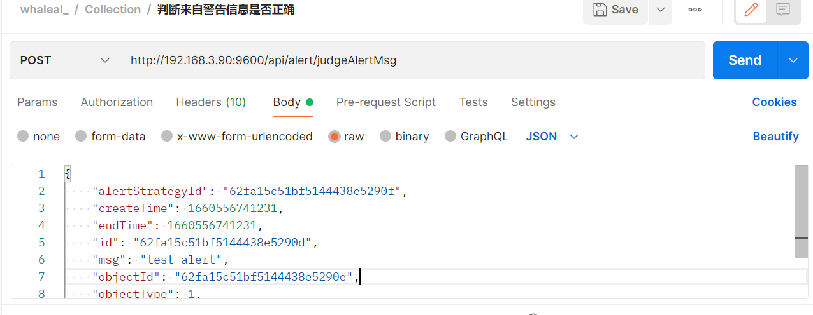
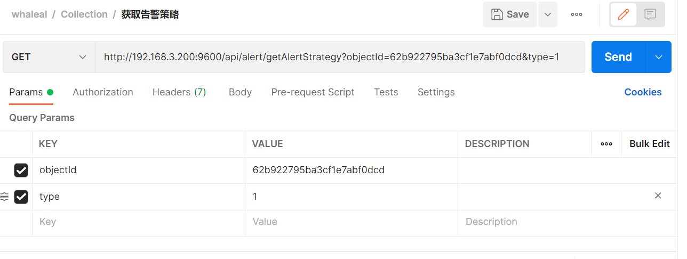

# Alert接口
接口调用时须在请求头中设置OPS-Token ，填写参数发起请求，返回内容为 JSON 格式的信息，返回特殊实体类将在最后提供实体类表格。
其参数为时间类型都以时间戳形式传递。

有些接口调用时需用到hostId、objectId
~~~
hostId在“根据主机名模糊查询主机基本信息”接口处获取。

objectId 为主机id或mongo节点id，mongo节点id在“查找mongoDB集群信息数据”接口返回结果集中data集合的中mongo集合的“id”。
~~~

### 请求头默认格式，特殊情况特殊声明

| KEY                |     VALUE      |     
| -------------------|----------------------|
| Accept-Encoding        |         gzip, deflate, br |     
| Connection          |         keep-alive           |          
| Content-Type          |         application/json |    
---

####  1 判断来自警告信息是否正确

1.1 请求路径：

POST http://{Server-Host}:{端口}/api/alert/judgeAlertMsg

---

1.2 请求参数：

| Name                |     Located in     |           Description         |     Required    |        Schema   |
| -------------------|----------------------|-------------------------------|-----------------|-----------   |
|    AlertMsgEntity   |      body      |       告警信息实体类      |      yes            |    AlertMsgEntity

----

1.3 返回结果

|               |     Description    |           Schema              |  
| --------------|----------------------|---------------------------
| code        |   状态符:1000成功,其余异常 |           int            |    
| data       |         返回信息        |                string         | 

---
---

####  2 获取告警策略

2.1 请求路径：

GET http://{Server-Host}:{端口}/api/alert/getAlertStrategy

---

2.2 请求参数：

| Name                |     Located in     |           Description         |     Required    |        Schema   |
| -------------------|----------------------|-------------------------------|-----------------|-----------   |
|     objectId        |        params              |           对象id               |    yes              |string
|     type        |         params             |            类型:1 agent,2 mongo             |           yes       |string

----

2.3 返回结果

|               |     Description    |           Schema              |  
| --------------|----------------------|---------------------------
| code        |   状态符:1000成功,其余异常 |        int               |    
| data       |         返回数据        |             list            | 

---
---

####  3 获取所有成员警告策略

3.1 请求路径：

GET http://{Server-Host}:{端口}/api/alert/getAllMongoMemberAlertStrategy

---

3.2 请求参数：

| Name                |     Located in     |           Description         |     Required    |        Schema   |
| -------------------|----------------------|-------------------------------|-----------------|-----------   |
|     hostId        |        params              |           主机id               |    yes              |string

----

3.3 返回结果

|               |     Description    |           Schema              |  
| --------------|----------------------|---------------------------
| code        |   状态符:1000成功,其余异常 |         int              |    
| data       |         返回数据        |           list              | 

---
---

####  4 更新警告信息

4.1 请求路径：

POST http://{Server-Host}:{端口}/api/alert/update

---

4.2 请求参数：

| Name                |     Located in     |           Description         |     Required    |        Schema   |
| -------------------|----------------------|-------------------------------|-----------------|-----------   |
|     alertStrategyEntity        |        body              |           告警策略实体类               |    yes              |alertStrategyEntity

----

4.3 返回结果

|               |     Description    |           Schema              |  
| --------------|----------------------|---------------------------
| code        |   状态符:1000成功,其余异常 |         int              |    
| data       |         返回数据        |              string           | 

---
---

---  

## AlertStrategyEntity

|       Name         |     Type             |    Description      |   
| ------------       |----------            |---------------------|
| name                 |   string             |         主机或mongoMember警告策略名称          |   
| objectId             |   string             |         主机id or mongoMemberId     |   
| type                 |   string |         1 agent 2 mongo     |   
| timeFrequencyStrategyList         |   List\<TimeFrequencyStrategy>             |         时间区间警告策略     |   
| continuousGranularityStrategyList         |      List\<ContinuousGranularityStrategy>          |         连续时间警告策略     |   

---
---

## TimeFrequencyStrategy

|       Name         |     Type             |    Description      |   
| ------------       |----------            |---------------------|
| startHour                 |   int             |         小时时间范围的起点          |   
| endHour             |   int            |         小时时间范围的结点     |   

---
---

## HostInfoMongoEntity

|       Name         |     Type             |    Description      |   
| ------------       |----------            |---------------------|
| duration                 |   int             |         统计颗粒度          |   

---
---
