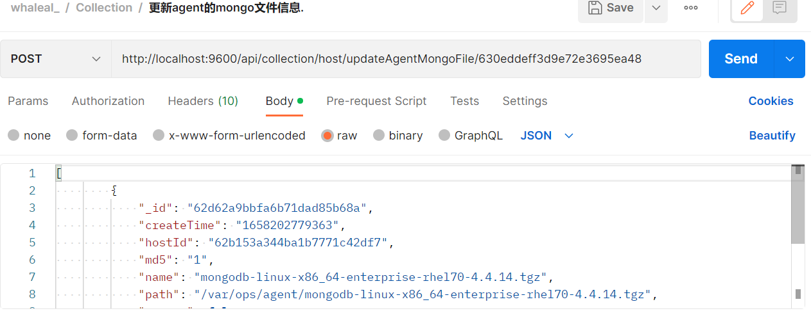
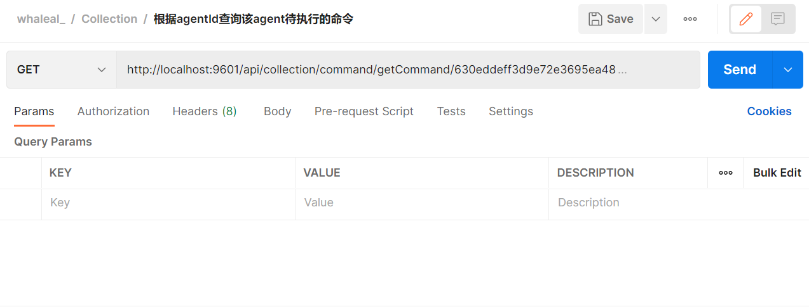
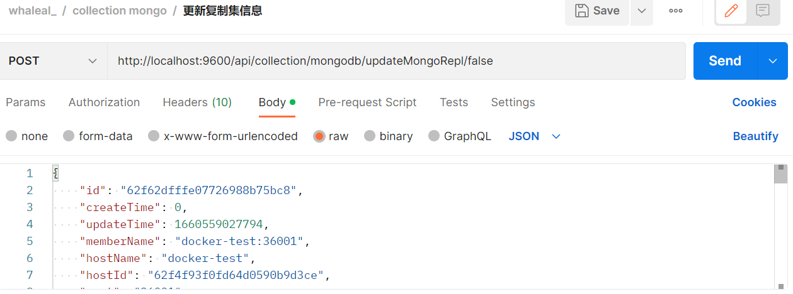
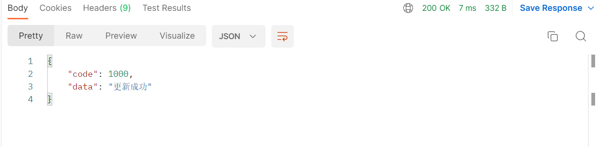
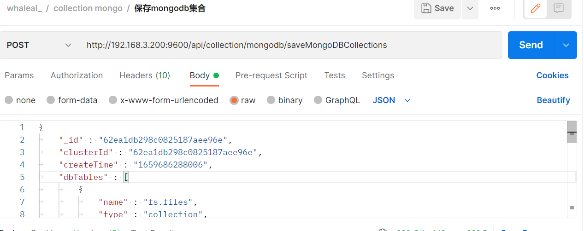
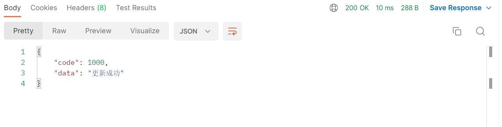

# Collection接口
接口调用时须在请求头中设置OPS-Token ，填写参数发起请求，返回内容为 JSON 格式的信息，返回特殊实体类将在最后提供实体类表格。
其参数为时间类型都以时间戳形式传递。

有些接口调用时需用到hostId、agentId、clusterId、eventId
~~~
hostId在“根据主机名模糊查询主机基本信息”接口处获取。

agentId在"生成agentId"接口处获取。

eventId在"获取集群日志信息"接口处找到所需事件的id

clusterId在“查找mongoDB集群信息数据”接口返回结果集中。
~~~

### 请求头默认格式，特殊情况特殊声明

agentId在"生成agentId"接口处获取。

| KEY                |     VALUE      |     
| -------------------|----------------------|
| Accept-Encoding        |         gzip, deflate, br |     
| Connection          |         keep-alive           |          
| Content-Type          |         application/json |    
| agentId          |         "agentId"           |     
---

####  1 保存agent端的日志记录.

1.1 请求路径：

POST http://{Server-Host}:{端口}/api/collection/agent/save/log

---

1.2 请求参数：

| Name                |     Located in     |           Description         |     Required    |        Schema   |
| -------------------|----------------------|-------------------------------|-----------------|-----------   |
|      agentLogEntity      |    body       |  日志信息实体对象       |       yes         |AgentLogEntity

----

1.3 返回结果

|               |     Description    |           Schema              |  
| --------------|----------------------|---------------------------
| code        |   状态符:1000成功,其余异常 |        int               |    
| msg       |         返回消息         |         string                | 

---
---

####  2 更新agent的mongo文件信息.

2.1 请求路径：

POST http://{Server-Host}:{端口}/api/collection/agent/updateAgentMongoFile/{{agentId}}

---

2.2 请求参数：

| Name                |     Located in     |           Description         |     Required    |        Schema   |
| -------------------|----------------------|-------------------------------|-----------------|-----------   |
|       agentId     |      path               |           agentId              |   string             |
|       mongoFileList     |      body               |           命令实体类              |   List<MongoFile>             |

----

2.3 返回结果

|               |     Description    |           Schema              |  
| --------------|----------------------|---------------------------
| code        |   状态符:1000成功,其余异常 |       int                |    
| msg       |         返回消息         |          string               | 

---
---

####  3 根据agentId查询该agent待执行的命令.

3.1 请求路径：

GET http://{Server-Host}:{端口}/api/collection/command/agent/get/{{hostId}}

---

3.2 请求参数：

| Name                |     Located in     |           Description         |     Required    |        Schema   |
| -------------------|----------------------|-------------------------------|-----------------|-----------   |
|      hostId      |       path              |              主机id           |      yes          |  string

----

3.3 返回结果

|               |     Description    |           Schema              |  
| --------------|----------------------|---------------------------
| code        |   状态符:1000成功,其余异常 |       int                |    
| data       |         返回数据         |         list                | 

---
---

#### 4 更新命令实体对象的状态.

4.1 请求路径：

PUT http://{Server-Host}:{端口}/api/collection/command/agent/update

---

4.2 请求参数：

| Name                |     Located in     |           Description         |     Required    |        Schema   |
| -------------------|----------------------|-------------------------------|-----------------|-----------   |
|     commandEntity       |        body             |         命令实体类  |    yes            |   commandEntity

----

4.3 返回结果

|               |     Description    |           Schema              |  
| --------------|----------------------|---------------------------
| code        |   状态符:1000成功,其余异常 |         int              |    
| data       |         返回消息         |            string             | 

---
---

####  5 更新时间戳

5.1 请求路径：

GET http://{Server-Host}:{端口}/api/collection/hostInfo/updateRunTime/{{hostId}}/{{timeStamp}}

---

5.2 请求参数：

| Name                |     Located in     |           Description         |     Required    |        Schema   |
| -------------------|----------------------|-------------------------------|-----------------|-----------   |
|      hostId      |         path            |        主机id                 |       yes          | string
|      timeStamp      |         path            |        时间戳                 |       yes          | string

----

5.3 返回结果

|               |     Description    |           Schema              |  
| --------------|----------------------|---------------------------
| code        |   状态符:1000成功,其余异常 |         int              |    
| data       |         返回消息        |           string              | 

---
---

####  6 保存主机信息

6.1 请求路径：

POST http://{Server-Host}:{端口}/api/collection/hostInfo

---

6.2 请求参数：

| Name                |     Located in     |           Description         |     Required    |        Schema   |
| -------------------|----------------------|-------------------------------|-----------------|-----------   |
|      hostInfoMongoEntity      |         body            |        主机信息实体类                 |       yes          | hostInfoMongoEntity

----

6.3 返回结果

|               |     Description    |           Schema              |  
| --------------|----------------------|---------------------------
| code        |   状态符:1000成功,其余异常 |        int               |    
| data       |         返回消息        |           string              | 

---
---

####  7 保存主机实时信息

7.1 请求路径：

POST http://{Server-Host}:{端口}/api/collection/hostRealTime/addHostRealTimeData

---

7.2 请求参数：

| Name                |     Located in     |           Description         |     Required    |        Schema   |
| -------------------|----------------------|-------------------------------|-----------------|-----------   |
|      HostRealTimeDataMongoEntity      |         body            |        主机实时信息实体类                 |       yes          | HostRealTimeDataMongoEntity

----

7.3 返回结果

|               |     Description    |           Schema              |  
| --------------|----------------------|---------------------------
| code        |   状态符:1000成功,其余异常 |          int             |    
| data       |         返回消息        |            string             | 

---
---

####  8 agent调用此接口来获取server端的时间

8.1 请求路径：

GET http://{Server-Host}:{端口}/api/collection/util/get/server/date

---

8.2 请求：

----

8.3 返回结果

|               |     Description    |           Schema              |  
| --------------|----------------------|---------------------------
| code        |   状态符:1000成功,其余异常 |          int             |    
| data       |         时间戳        |             string           | 

---
---

####  9 agent通过调用此接口来获取请求agent的ip

9.1 请求路径：

GET http://{Server-Host}:{端口}/api/collection/util/get/agent/ip

---

9.2 请求：

----

9.3 返回结果

|               |     Description    |           Schema              |  
| --------------|----------------------|---------------------------
| code        |   状态符:1000成功,其余异常 |       int                |    
| data       |         返回ip        |           string              | 

---
---
####  10 mongo进行日志记录

10.1 请求路径：

POST http://{Server-Host}:{端口}/api/collection/mongo/insertMongoClusterLog/{{clusterId}}/{{eventId}}

---

10.2 请求参数：

| Name                |     Located in     |           Description         |     Required    |        Schema   |
| -------------------|----------------------|-------------------------------|-----------------|-----------   |
|     clusterId        |      path                |           集群id               |      yes            | string
|     eventId        |         path             |           事件id               |           yes       |string
|     logList        |         body             |         日志列表                 |             yes     |List\<LogInfo>

----

10.3 返回结果

|               |     Description    |           Schema              |  
| --------------|----------------------|---------------------------
| code        |   状态符:1000成功,其余异常 |         int              |    
| data       |         返回消息        |          string              | 

---
---

####  11 插入mongo成员日志

11.1 请求路径：

POST http://{Server-Host}:{端口}/api/collection/mongo/insertMongoMemberLog/{{clusterId}}/{{memberInfo}}/{{eventId}}

---

11.2 请求参数：

| Name                |     Located in     |           Description         |     Required    |        Schema   |
| -------------------|----------------------|-------------------------------|-----------------|-----------   |
|       clusterId      |       path               |        集群id                  |       yes           |string
|       memberInfo      |         path             |       成员信息                   |      yes            |string
|       eventId      |       path               |          事件id                |       yes           |string
|       logList      |       path               |          日志列表                |      yes            |List\<LogInfo>

----

11.3 返回结果

|               |     Description    |           Schema              |  
| --------------|----------------------|---------------------------
| code        |   状态符:1000成功,其余异常 |       int                |    
| data       |         返回消息        |         string                | 

---
---

####  12 更新mongo节点信息

12.1 请求路径：

POST http://{Server-Host}:{端口}/api/collection/mongo/updateMongo

---

12.2 请求参数：

| Name                |     Located in     |           Description         |     Required    |        Schema   |
| -------------------|----------------------|-------------------------------|-----------------|-----------   |
|       MongoMember      |       body               |        mongo集群成员     |       yes           |MongoMember

----

12.3 返回结果

|               |     Description    |           Schema              |  
| --------------|----------------------|---------------------------
| code        |   状态符:1000成功,其余异常 |        int               |    
| data       |         返回消息        |          string               | 

---
---

####  13 更新复制集信息

13.1 请求路径：

POST http://{Server-Host}:{端口}/api/collection/mongo/updateMongoRepl/{{isUpdateMemberList}}

---

13.2 请求参数：

| Name                |     Located in     |           Description         |     Required    |        Schema   |
| -------------------|----------------------|-------------------------------|-----------------|-----------   |
|       isUpdateMemberList      |       path               |        是否更新成员列表  |       yes           |Boolean
|       MongoReplica      |         body             |       mongo复制集|      yes            |MongoReplica

----

13.3 返回结果

|               |     Description    |           Schema              |  
| --------------|----------------------|---------------------------
| code        |   状态符:1000成功,其余异常 |         int              |    
| data       |         返回消息        |           string              | 

---
---

####  14 更新集群信息

14.1 请求路径：

POST http://{Server-Host}:{端口}/api/collection/mongo/updateCluster

---

14.2 请求参数：

| Name                |     Located in     |           Description         |     Required    |        Schema   |
| -------------------|----------------------|-------------------------------|-----------------|-----------   |
|       MongoClusterInformation      |       body  |        集群实体对象      |       yes           |MongoClusterInformation

----

14.3 返回结果

|               |     Description    |           Schema              |  
| --------------|----------------------|---------------------------
| code        |   状态符:1000成功,其余异常 |          int             |    
| data       |         返回消息        |            string             | 

---
---

####  15 保存mongo成员的实时信息

15.1 请求路径：

POST http://{Server-Host}:{端口}/api/collection/mongodb/realtime/save/one/{{tableName}}

---

15.2 请求参数：

| Name                |     Located in     |           Description         |     Required    |        Schema   |
| -------------------|----------------------|-------------------------------|-----------------|-----------   |
|       tableName      |       path               |        表名                  |       yes           |string
|       MongodbNodeMetrics      |         body             |       mongo实时数据对象     |      yes            |MongodbNodeMetrics

----

15.3 返回结果

|               |     Description    |           Schema              |  
| --------------|----------------------|---------------------------
| code        |   状态符:1000成功,其余异常 |       int                |    
| data       |         返回消息        |         string                | 

---
---

####  16 保存一批监控数据到数据库中

16.1 请求路径：

POST http://{Server-Host}:{端口}/api/collection/mongodb/realtime/save/many

---

16.2 请求参数：

| Name                |     Located in     |           Description         |     Required    |        Schema   |
| -------------------|----------------------|-------------------------------|-----------------|-----------   |
|       mongoDBRealtimeDataEntityList      |       body               |        保存mongo成员的实时信息集合 |       yes           |List<MongodbNodeMetrics>

----

16.3 返回结果

|               |     Description    |           Schema              |  
| --------------|----------------------|---------------------------
| code        |   状态符:1000成功,其余异常 |         int              |    
| data       |         返回消息        |           string              | 

---
---

####  17 获取agent实例上的mongo节点信息

17.1 请求路径：

POST http://{Server-Host}:{端口}/api/collection/mongodb/agent/mongoMember/{{agentId}}

---

17.2 请求参数：

| Name                |     Located in     |           Description         |     Required    |        Schema   |
| -------------------|----------------------|-------------------------------|-----------------|-----------   |
|       agentId      |       path               |        agentId                  |       yes           |string

----

17.3 返回结果

|               |     Description    |           Schema              |  
| --------------|----------------------|---------------------------
| code        |   状态符:1000成功,其余异常 |         int              |    
| data       |         返回数据        |            list             | 

~~~
{
    "code": 1000,
    "data": [
        {
            "id": "62d6506ec5b6206027b99052",
            "createTime": 1658212462005,
            "updateTime": 1658302192001,
            "memberName": "chen:56902",
            "hostName": "chen",
            "hostId": "62bbfbe9a46517610435d615",
            "port": "56902",
            "version": "4.2.21",
            "upgradeVersion": null,
            "userName": "lhp1234",
            "password": "123456",
            "authDbName": "admin",
            "currentTimeMillis": 1658212462005,
            "dataDirectory": "/home/chen/data56902/data/",
            "logFile": "/home/chen/data56902/data/log.log",
            "confPath": "/home/chen/data56902/data/chen_56902.conf",
            "deleteDataAndLogAble": false,
            "authAble": true,
            "runShCmd": "/var/ops/agent//mongodb-linux-x86_64-rhel70-4.2.21/bin/mongod -f /home/chen/data56902/data/chen_56902.conf",
            "type": 45,
            "status": "正在运行",
            "monitorServerStatus": true,
            "monitorTopAndOp": true,
            "collectMongoLog": true,
            "mongoLogFileOffset": 0,
            "operaLogTemp": [],
            "votes": 1,
            "priority": 1.0,
            "delay": 0,
            "buildIndexes": true,
            "procId": "5599",
            "clusterId": "62d65068561b4a25b8339740",
            "replId": "62d6506dc5b6206027b99050",
            "clusterName": null,
            "tags": {},
            "configurationOptions": {
                "sharding_clusterRole": "configsvr",
                "security_keyFile": "/home/chen/data56902/data/test_lhp_shard_configSecurityKeyFile.key",
                "security_authorization": "enabled",
                "systemLog_destination": "file",
                "storage_wiredTiger_engineConfig_cacheSizeGB": "0.3",
                "systemLog_path": "/home/chen/data56902/data/log.log",
                "processManagement_fork": "true",
                "storage_dbPath": "/home/chen/data56902/data/",
                "systemLog_logAppend": "true",
                "net_bindIp": "0.0.0.0",
                "net_port": "56902",
                "replication_replSetName": "test_lhp_shard_config",
                "securityKeyFileValue": "rY3mNY3x3EBUuOJ1BkwNYRnOUmaCxpOAo91VIKx2HepwIvwXFmJt3jzmC+TrJPwz\r\ns+zdhFLGd4IkGlwGwm/3W1dUzRyu+EwsrZeS+b0rqp/5im6h6tL7mdwflx8F+9K5\r\nSYilORoQbSNLavo6eRrHNpLVF9BMkTLFqcPI6REVfX+vuSI+WLpz4GGLKUEe63h3\r\nCYtp2MDkRJoglEbR1qpLIfKYeh9IIL+hTCFQM/OMFa/K4DYhbH6flzrn7PSH2Nj+\r\n5905VxR8jw7D/W0uL+eP9zSBUOEnpL/R7e12c22HcAtHfYHQ6HKmntCWap5EVu7R\r\nkTSy36L5S9BLdOr/p43uVK7yMH/jmlEP9G9tww8iM/BEUQMwScHjnPcCRdkAK5Dc\r\nt6VHsMAXD6c2xG+esO2j5hd0rZxh64fG1Z2spm5YlWPqXGXemLLQ8zZr7fO9jS2S\r\nJQyr+SLZ9eeCxj395uMaA8XdO2THlYdCZmLmLoi06f1LFEiOq2cDKyKAD1eQWxGI\r\njm9SjLr38SXUy0IMNCMD2aPl2wpIO8abb+iEytMnNIH6rxKWULyZEFSGoMsmzYrF\r\n6LzT6T56y+dodo49U/A5L/3z+eaVxBc21Tu/KEJbngFDDvUjYojefoe3MJuU4XyX\r\n0fH17zhIdt7YEXkSQVaHcqbwn8VwiDvqtJFw+Orfsw2MO/zQPk+ig0e3sbQTuFIX\r\nQhku30QK50QRW6Az8OVgw6op3ZikDH+roCZejfi9iwVz6Wt4iMVRVfzdJ+9cxHM1\r\n08G1QnFmz0qJinjFFLJOC4W6Yknf4HxGJE1jHPBmCmKoS7yWH2y6/aEvmoqcwAie\r\nBK5z0lUzkqrOvJMCXv7+NfIErdUw8qrfoeLQSo/rZhp+b8BZWEc8JycUjDbGK0Rh\r\nT+oKRBlNFwvsd4zPCeEXw/kt3lpaT8ZFLr3Gp23qYXzy0/dT1RHaIn59tDapwsKd\r\nRPCpRnBwnE4N4DLu1J6xWGvCpWQxBZKJuZTcc5fSHukFKKWY"
            },
            "operateVersion": 8168
        }
    ]
}
~~~

---
---

####  18 保存mongo.log日志

18.1 请求路径：

POST http://{Server-Host}:{端口}/api/collection/mongodb/save/mongoLog/{{mongoMemberId}}/{{fileOffset}}

---

18.2 请求参数：

| Name                |     Located in     |           Description         |     Required    |        Schema   |
| -------------------|----------------------|-------------------------------|-----------------|-----------   |
|       mongoMemberId      |       path               |        mongo成员id                  |       yes           |string
|       fileOffset      |         path             |       文件偏移     |      yes            |long
|       logList      |         body             |       日志列表     |      yes            |List\<String>

----

18.3 返回结果

|               |     Description    |           Schema              |  
| --------------|----------------------|---------------------------
| code        |   状态符:1000成功,其余异常 |        int               |    
| data       |         文件偏移        |         string                | 

---
---

####  19 保存 mongo top and op

19.1 请求路径：

POST http://{Server-Host}:{端口}/api/collection/mongodb/save/mongoTopAndOp

---

19.2 请求参数：

| Name                |     Located in     |           Description         |     Required    |        Schema   |
| -------------------|----------------------|-------------------------------|-----------------|-----------   |
|       documentList      |       body               |     Document列表 |       yes           |List<Document>

----

19.3 返回结果

|               |     Description    |           Schema              |  
| --------------|----------------------|---------------------------
| code        |   状态符:1000成功,其余异常 |        int               |    
| data       |         返回消息        |          string               | 

---
---

####  20 更新fcv

20.1 请求路径：

GET http://{Server-Host}:{端口}/api/collection/mongodb/updateFCV/{{clusterId}}/{{fcv}}

---

20.2 请求参数：

| Name                |     Located in     |           Description         |     Required    |        Schema   |
| -------------------|----------------------|-------------------------------|-----------------|-----------   |
|       clusterId      |       path               |        集群id                  |       yes           |string
|       fcv      |         path             |       fcv     |      yes            |string

----

20.3 返回结果

|               |     Description    |           Schema              |  
| --------------|----------------------|---------------------------
| code        |   状态符:1000成功,其余异常 |         int              |    
| data       |         返回消息        |           string              | 

---
---

####  21 保存mongodb集合

21.1 请求路径：

POST http://{Server-Host}:{端口}/api/collection/mongodb/saveMongoDBCollections

---

21.2 请求参数：

| Name                |     Located in     |           Description         |     Required    |        Schema   |
| -------------------|----------------------|-------------------------------|-----------------|-----------   |
|       mongoDBCollections      |         body             |       mongo实集合     |      yes            |mongoDBCollections

----

21.3 返回结果

|               |     Description    |           Schema              |  
| --------------|----------------------|---------------------------
| code        |   状态符:1000成功,其余异常 |       int                |    
| data       |         返回消息        |          string               | 

---
---

####  22 保存mongo成员用户

22.1 请求路径：

POST http://{Server-Host}:{端口}/api/collection/mongodb/saveMongoDBClusterUser/{{clusterId}}

---

22.2 请求参数：

| Name                |     Located in     |           Description         |     Required    |        Schema   |
| -------------------|----------------------|-------------------------------|-----------------|-----------   |
|       clusterId      |       path               |        集群id                  |       yes           |string
|       list      |         body             |       document列表     |      yes            |List\<Document>

----

22.3 返回结果

|               |     Description    |           Schema              |  
| --------------|----------------------|---------------------------
| code        |   状态符:1000成功,其余异常 |        int               |    
| data       |         返回消息        |             string            | 

---
---

####  23 保存mongo成员角色

23.1 请求路径：

POST http://{Server-Host}:{端口}/api/collection/mongodb/saveMongoDBClusterRole/{{clusterId}}

---

23.2 请求参数：

| Name                |     Located in     |           Description         |     Required    |        Schema   |
| -------------------|----------------------|-------------------------------|-----------------|-----------   |
|       clusterId      |       path               |        集群id                  |       yes           |string
|       list      |         body             |       document列表     |      yes            |List\<Document>

----

23.3 返回结果

|               |     Description    |           Schema              |  
| --------------|----------------------|---------------------------
| code        |   状态符:1000成功,其余异常 |         int              |    
| data       |         返回消息        |              string           | 

---
---

## AgentLogEntity

|       Name         |     Type             |    Description      |   
| ------------       |----------            |---------------------|
| hostId                 |   string             |         主机id          |   
| type             |   string             |         日志类型     |   
| content              |   string |         内容     |   

---
---

## MongoFile

|       Name         |     Type             |    Description      |   
| ------------       |----------            |---------------------|
| shortName                 |   string             |         姓          |   
| Name             |   string             |         名     |   
| Size              |   Long |         大小     |   
| Md5               |   string             |         文件校验     |   
| version         |   string             |         版本     |   
| path           |   string             |         路径     |   
| hostId             |   string             |         主机id     |   

---
---

## commandEntity

|       Name         |     Type             |    Description      |   
| ------------       |----------            |---------------------|
| hostId                 |   string             |         主机id          |   
| commandType             |   string             |         命令类型     |   
| status              |   Integer |    当前状态:1 下发,2 正在执行,3 正常已完成,4 异常完成,5 异常完成但是不影响后续执行     |   
| eventId               |   string             |         所属事件组     |   
| commandNote         |   string             |         具体命令操作注释     |   
| content           |   string             |         命令内容     |   
| execResult             |   string             |         执行结果     |   

---
---

___

## ipInfo

|       Name        |     Type    |           Description       |   
| --------------|----------------------|--------------------|
| id        |   string |         Id              |   
| Type        |   string |         主机名称              |   

---  

## HostInfoMongoEntity

|       Name         |     Type             |    Description      |   
| ------------       |----------            |---------------------|
| id                 |   string             |         Id          |   
| ipInfo             |   List<ipInfo>             |         Ip信息     |   
| systemPropertyInfo |   systemPropertyInfo |         系统参数信息     |   
| createTime         |   时间戳             |         创建时间     |   
| updateTime         |   时间戳             |         更新时间     |   
| hostName           |   string             |         主机名称     |   
| hostId             |   string             |         主机id     |   
| hostNameLong       |   string             |         主机长名称     |   
| Memory             |   int             |         内存     |   
| osVersion          |   string             |         系统版本     |   
| cpuNum             |   int             |         Cpu数     |   
| swap               |   int             |         交换内存     |   
| kernelInfo         |   string             |         内核信息     |   
| totalDiskSize      |   Int             |         总磁盘大小     |   
| run                |   Boolean             |         是否正在运行     |   

---
---

## HostRealTimeDataMongoEntity

|       Name         |     Type             |    Description      |   
| ------------       |----------            |---------------------|
| hostId                 |   string             |         主机id          |   
| hostName             |   string             |         主机名称     |   
| timeGranularity              |   int |         颗粒度值     |   
| cpuInfo               |   CpuInfo             |         cpu使用信息     |   
| memoryInfo         |   MemoryInfo             |         内存使用信息     |   
| diskInfoList           |   List<DiskInfo>             |         磁盘使用信息     |   
| diskInAndOutInfoList             |   List<DiskInAndOutInfo>             |         磁盘io信息     |   
| netInAndOutInfoList             |   List<NetInAndOutInfo>             |         网络带宽io信息     |   

---
---

## CpuInfo

|       Name         |     Type             |    Description      |   
| ------------       |----------            |---------------------|
| us                 |   double             |         用户空间占用CPU百分比          |   
| sy             |   double             |         内核空间占用CPU百分比     |   
| ni              |   double |         用户进程空间内改变过优先级的进程占用CPU百分比     |   
| id               |   double             |         空闲CPU百分比     |   
| wa         |   double             |         等待输入输出的CPU时间百分比     |   
| hi           |   double            |         硬中断占用CPU的百分比     |   
| si             |   double             |         软中断占用CPU的百分比     |   
| st             |   double            |         虚拟CPU等待实际CPU的时间的百分比     |   

---
---

## DiskInAndOutInfo

|       Name         |     Type             |    Description      |   
| ------------       |----------            |---------------------|
| memTotal                 |   long             |         物理内存总量          |   
| memFree             |   long             |         空闲内存总量     |   
| memUsed              |   long |         使用的物理内存总量     |   
| memBuffCache               |   long             |         用作内核缓存的内存量     |   
| memAvail         |   long             |         代表可用于进程下一次分配的物理内存数量     |   
| swapTotal           |   long           |         交换区总量     |   
| swapFree             |  long            |         空闲交换区总量     |   
| swapUsed             |   long       |         使用的交换区总量     |   

---
---

## NetInAndOutInfo

|       Name         |     Type             |    Description      |   
| ------------       |----------            |---------------------|
| networkCardName                 |   string             |         网卡名          |   
| io             |   double             |         流入流量     |   
| out              |   double |         流出流量     |   

---
---

## HostRealTimeDataMongoEntity

|       Name         |     Type             |    Description      |   
| ------------       |----------            |---------------------|
| hostId                 |   string             |         主机id          |   
| hostName             |   string             |         主机名称     |   
| timeGranularity              |   int |         颗粒度值     |   
| cpuInfo               |   CpuInfo             |         cpu使用信息     |   
| memoryInfo         |   MemoryInfo             |         内存使用信息     |   
| diskInfoList           |   List<DiskInfo>             |         磁盘使用信息     |   
| diskInAndOutInfoList             |   List<DiskInAndOutInfo>             |         磁盘io信息     |   
| netInAndOutInfoList             |   List<NetInAndOutInfo>             |         网络带宽io信息     |   

---
---

## DiskInfo

|       Name         |     Type             |    Description      |   
| ------------       |----------            |---------------------|
| fileSystem                 |   string             |         分区名          |   
| type             |   string             |         分区类型     |   
| size              |   long |         总大小     |   
| used               |   long             |         使用大小     |   
| utilization         |   double             |         使用率     |   
| mountedOn           |   string            |         挂载位置     |   

---
---

## LogInfo

|       Name         |     Type             |    Description      |   
| ------------       |----------            |---------------------|
| createTime                 |   string             |         创建时间          |   
| log             |   string             |         日志     |   

---
---

## MongoMember

|       Name         |     Type             |    Description      |   
| ------------       |----------            |---------------------|
| memberName                 |   string             |         主机名:端口          |   
| hostName             |   string             |         主机名     |   
| hostId              |   Long |         主机id     |   
| port               |   string             |         端口     |   
| version         |   string             |         版本     |   
| upgradeVersion           |   string             |         升降级版本     |   
| password           |   string             |         节点密码     |   
| authDbName           |   string             |         认证库     |   
| currentTimeMillis           |   long             |         当前时间戳     |   
| dataDirectory           |   string             |         数据目录     |   
| userName             |   string             |         节点用户名     |   
| logFile             |   string             |         日志文件     |   
| confPath             |   string             |         配置文件路径     |   
| deleteDataAndLogAble             |   string             |         是否强制删除     |   
| authAble             |   string             |         是否开启认证     |   
| runShCmd             |   string             |         执行启动命令     |   
| type             |   enum             |         节点类型     |   

注 type:11 单例
*
* 
 普通复制集
* 31 普通成员节点

* 32 隐藏节点
* 33 仲裁节点
* 34 隐藏延迟节点
* 35 主节点
* 
 config复制集
* 41 config普通成员节点
* 42 config隐藏节点
* 43 config仲裁节点
* 44 config隐藏延迟节点
* 45 config主节点
* 
 shard复制集
* 51 shard普通成员节点
* 52 shard隐藏节点
* 53 shard仲裁节点
* 54 shard隐藏延迟节点
* 55 shard主节点
* 
 mongoS
* 61 mongoS

---
---

## MongoReplica

|       Name         |     Type             |    Description      |   
| ------------       |----------            |---------------------|
| replicaName                 |   string             |         集群名          |   
| memberList             |   List<MongoMember>             |         成员列表     |   
| type              |   enum |         大小     |   
| clusterId               |   string             |         所属集群id     |   
| deleteDataAndLogAble         |   boolean             |         是否强制删除已经存在的数据目录和日志文件     |   
| status           |   string             |         状态     |   
| operaLog             |   List<String             |         复制集操作日志     |   
| replicationSettings             |   Map<String, Object>             |         复制集高级配置     |   
| replicationOtherSettings             |   Map<String, Object>             |         其他附加配置信息     |   
| authAble             |   boolean             |         是否开启认证     |   
| userName             |   string             |         节点用户名     |   
| password             |   string             |         节点密码     |   
| authDbName             |   string             |         认证库     |   
| protocolVersion             |   long             |         协议版本     |   
| writeConcernMajorityJournalDefault             |   boolean             |         是否默认投票     |   
type:
* 普通复制集 1
* config 2
* shard 3

---
---

## MongoClusterInformation

|       Name         |     Type             |    Description      |   
| ------------       |----------            |---------------------|
| clusterName                 |   string             |         集群名          |   
| type             |   int             |         类型     |   
| mongoMember              |   MongoMember |         单例     |   
| mongoReplica               |   MongoReplica             |         复制集     |   
| mongoShard         |   MongoShard             |         分片     |   
| isCreate           |   boolean             |         默认新建的集群信息     |   
| status             |   string             |         集群状态     |   
| fcv             |   string             |         fcv     |   
| tag             |   string             |         标签     |   

status：
* 集群状态
* 正常
* 异常
* 关机
* 脱离纳管

type:
* 1 单例
* 2 复制集
* 3 分片

## MongoDBCollections

|       Name         |     Type             |    Description      |   
| ------------       |----------            |---------------------|
| isFromServerExe                 |   Boolean             |         是否来自服务端exe          |   
| dbTables             |   List\<MongoMember>             |         document集合     |   
| clusterId               |   string             |         所属集群id     |   

---
---

## MongodbNodeMetrics

|       Name         |     Type             |    Description      |   
| ------------       |----------            |---------------------|
| hostId                 |   string             |         主机id          |   
| hostName             |   string             |         主机名称     |   
| port              |   string |         端口号     |   
| nodeId               |   string             |         节点id     |   
| timeGranularity         |   int             |         颗粒度     |   
