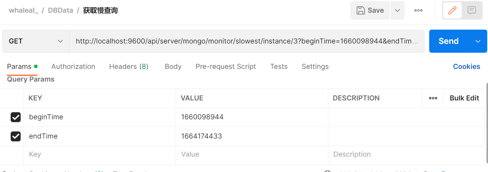
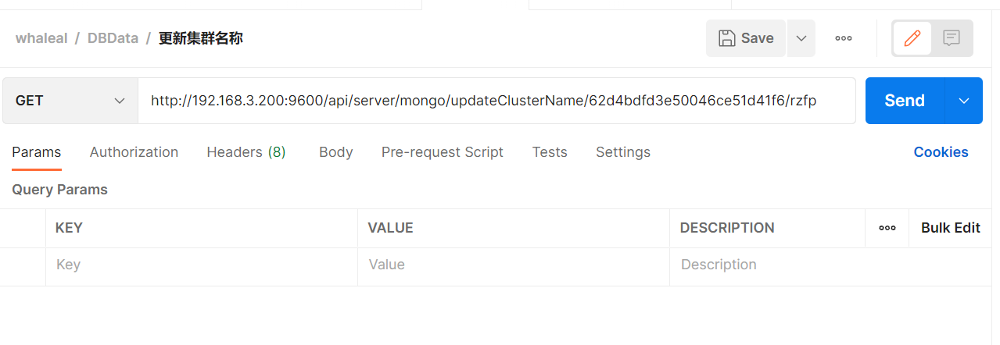
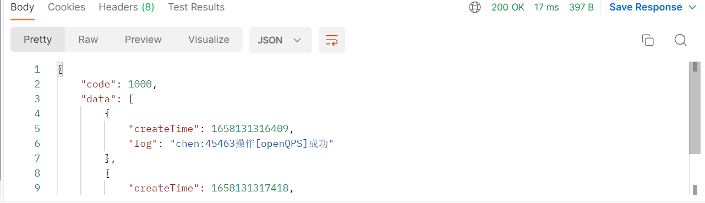
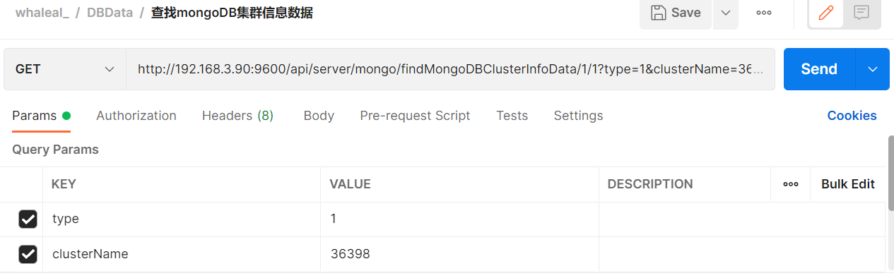
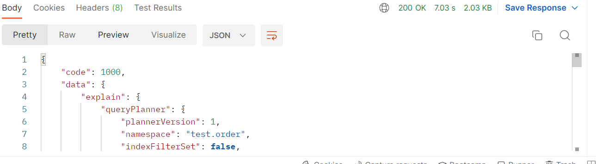

# MongoDBData接口
此接口调用时须在请求头中设置OPS-Token ，填写参数发起请求，返回内容为 JSON 格式的信息。

### 请求头默认格式，特殊情况特殊声明

| KEY                |     VALUE      |
| -------------------|----------------------|
| Accept-Encoding        |         gzip, deflate, br |
| Connection          |         keep-alive           |
| Content-Type          |         application/json |
| OPS-Token          |         "token"           |
---
---

####  1 获取mongodb集群信息
##Deprecated

1.1 请求路径：

GET http://192.168.3.200:9600/api/server/mongo/monitor/project/data/{{clusterName}}/{{projectType}}

---

1.2 请求参数：

| Name                |     Located in     |           Description         |     Required    |        Schema   |
| -------------------|----------------------|-------------------------------|-----------------|-----------   |
| clusterName          |         path           |            集群名称            |        Yes       |String
| projectType          |         path           |            类型            |        Yes       |String

~~~

~~~

----

1.3 返回结果

|               |     Description    |           Schema              |  
| --------------|----------------------|---------------------------|
|               |                      |                             |

---
---

####  2 获取群集大小前五名

2.1 请求路径：

GET http://192.168.3.200:9600/api/server/mongo/monitor/cluster/size/top/five

---

2.2 请求参数：

| Name                |     Located in     |           Description         |     Required    |        Schema   |
| -------------------|----------------------|-------------------------------|-----------------|-----------   |
| beginTime          |         path           |            开始时间            |        Yes       |long
| endTime          |         path           |            结束时间            |        Yes       |long

----

2.3 返回结果

|               |     Description    |           Schema              |  
| --------------|----------------------|---------------------------
| code        |   状态符:1000成功,其余异常 |                       |    
| data       |         返回数据         |                         |        

~~~
{
    "code": 1000,
    "data": [
        {
            "_id": "62d666c50f57845ee4c76090",
            "clusterSize": 0,
            "size": "0.00KB",
            "clusterName": "test_repl"
        },
        {
            "_id": "62d65068561b4a25b8339740",
            "clusterSize": 0,
            "size": "0.00KB",
            "clusterName": "shard"
        }
    ]
}

~~~

---
---

####  3 获取集合大小前五名

3.1 请求路径：

GET http://192.168.3.200:9600/api/server/mongo/monitor/collection/size/top/five

---

3.2 请求参数：

| Name                |     Located in     |           Description         |     Required    |        Schema   |
| -------------------|----------------------|-------------------------------|-----------------|-----------   |
| beginTime          |         path           |            开始时间            |        Yes       |long
| endTime          |         path           |            结束时间            |        Yes       |long

----

3.3 返回结果

|               |     Description    |           Schema              |  
| --------------|----------------------|---------------------------
| code        |   状态符:1000成功,其余异常 |                       |    
| data       |         返回数据         |                        |        

~~~
{
    "code": 1000,
    "data": [
        {
            "_id": "62d65068561b4a25b8339740",
            "clusterId": "62d65068561b4a25b8339740",
            "createTime": 1658220941683,
            "dbTables": {
                "name": "testColl",
                "type": "collection",
                "options": {},
                "info": {
                    "readOnly": false,
                    "uuid": {
                        "type": 4,
                        "data": "Ap8Rf9Q1SqyZ3+V3BjmvDg=="
                    }
                },
                "idIndex": {
                    "v": 2,
                    "key": {
                        "_id": 1
                    },
                    "name": "_id_",
                    "ns": "test.testColl"
                },
                "storageSize": 20,
                "size": 0,
                "ns": "test.testColl"
            },
            "fromServerExe": false,
            "updateTime": 0,
            "clusterName": "shard",
            "dbName": "test",
            "collectionName": "testColl",
            "size": "0.00KB"
        }
    ]
}
~~~

---
---

####  4 获取QPS大小前五

4.1 请求路径：

GET http://192.168.3.200:9600/api/server/mongo/monitor/QPS/size/top/five

---

4.2 请求参数：

| Name                |     Located in     |           Description         |     Required    |        Schema   |
| -------------------|----------------------|-------------------------------|-----------------|-----------   |
| beginTime          |         path           |            开始时间            |        Yes       |long
| endTime          |         path           |            结束时间            |        Yes       |long

----

4.3 返回结果

|               |     Description    |           Schema              |  
| --------------|----------------------|---------------------------
| code        |   状态符:1000成功,其余异常 |                       |    
| data       |         返回数据         |                        |        

~~~
{
    "code": 1000,
    "data": [
        {
            "_id": {
                "hostId": "62cbbd7607bebb71b8429e5e",
                "port": "47018"
            },
            "host": "server200",
            "port": "47018",
            "QPS": 5520,
            "instance": "server200:47018"
        }
    ]
}
~~~

---
---

####  5 获取连接实例前五

5.1 请求路径：

GET http://192.168.3.200:9600/api/server/mongo/monitor/connection/instance/top/five

---

5.2 请求参数：

| Name                |     Located in     |           Description         |     Required    |        Schema   |
| -------------------|----------------------|-------------------------------|-----------------|-----------   |
| beginTime          |         path           |            开始时间            |        Yes       |long
| endTime          |         path           |            结束时间            |        Yes       |long

----

5.3 返回结果

|               |     Description    |           Schema              |  
| --------------|----------------------|---------------------------
| code        |   状态符:1000成功,其余异常 |                       |    
| data       |         返回数据         |                        |        

~~~
{
    "code": 1000,
    "data": [
        {
            "_id": {
                "hostId": "62cbbd7607bebb71b8429e5e",
                "port": "47018"
            },
            "host": "server200",
            "port": "47018",
            "Conn": 76,
            "instance": "server200:47018"
        }
    ]
}
~~~

---
---

####  6 获取慢查询前五

6.1 请求路径：

GET http://192.168.3.200:9600/api/server/mongo/monitor/slowest/instance/top/five

---

6.2 请求参数：

| Name                |     Located in     |           Description         |     Required    |        Schema   |
| -------------------|----------------------|-------------------------------|-----------------|-----------   |
| beginTime          |         path           |            开始时间            |        Yes       |long
| endTime          |         path           |            结束时间            |        Yes       |long

----

6.3 返回结果

|               |     Description    |           Schema              |  
| --------------|----------------------|---------------------------
| code        |   状态符:1000成功,其余异常 |                       |    
| data       |         返回数据         |                        |        

~~~
{
    "code": 1000,
    "data": [
        {
            "_id": "62d66d3cc5b6206027b993b0",
            "slow count": 8,
            "instance": "server200:47018"
        }
    ]
}
~~~

---
---

####  7 节点实时监控信息

            
7.1 请求路径：

GET http://192.168.3.200:9600/api/server/mongo/monitor/data/{{nodeId}}/{{type}}

---

7.2 请求参数：

| Name                |     Located in     |           Description         |     Required    |        Schema   |
| -------------------|----------------------|-------------------------------|-----------------|-----------   |
| nodeId          |         path           |            节点id            |        Yes       |String
| type          |         path           |            查询类型            |        Yes       |String
| timeGranularity          |         params           |            时间粒度            |        Yes       |long
| startTimeForTimeInterval          |         params           |            开始时间间隔            |        Yes       |long
| endTimeForTimeInterval          |         params           |            结束时间间隔            |        Yes       |long

----

7.3 返回结果

|               |     Description    |           Schema              |  
| --------------|----------------------|---------------------------
| code        |   状态符:1000成功,其余异常 |                       |    
| data       |         返回数据         |                        |        

~~~
 {
    "code": 1000,
    "data": {
        "createTimeList": [],
        "size": 0,
        "metrics": [
            {
                "qps": {
                    "query": [],
                    "getMore": [],
                    "insert": [],
                    "update": [],
                    "message": {
                        "insert": "The average rate of inserts performed per second over the selected sample period",
                        "delete": "The average rate of deletes performed per second over the selected sample period",
                        "update": "The average rate of updates performed per second over the selected sample period",
                        "query": "The average rate of queries performed per second over the selected sample period",
                        "command": "The average rate of commands performed per second over the selected sample period",
                    },
                    "delete": [],
                    "command": []
                }
            }
            ...
        ]
    }
}
~~~

---
---

####  8 根据id查询集群信息

8.1 请求路径：

GET http://192.168.3.200:9600/api/server/mongo/getMongoCluster/{{clusterId}}

---

8.2 请求参数：

| Name                |     Located in     |           Description         |     Required    |        Schema   |
| -------------------|----------------------|-------------------------------|-----------------|-----------   |
| clusterId          |         path           |            集群id            |        Yes       |String

----

8.3 返回结果

|               |     Description    |           Schema              |  
| --------------|----------------------|---------------------------
| code        |   状态符:1000成功,其余异常 |                       |    
| data       |         返回数据         |                        |        

~~~
{
    "code": 1000,
    "data": {
        "id": "62d4bdfd3e50046ce51d41f6",
        "createTime": 1658109593628,
        "updateTime": 1658109593628,
        "clusterName": "rz",
        "type": 3,
        "mongoMember": null,
        "mongoReplica": null,
        "mongoShard": {
            "id": "62d4bdfd3e50046ce51d41f6",
            "createTime": 1658109593628,
            "updateTime": 1658109593628,
            "clusterName": "rz",
            "clusterId": "62d4bdfd3e50046ce51d41f6",
            ...
                "replicationOtherSettings": {
                },
                "authAble": true,
                "userName": "123",
                "password": "123",
                "authDbName": "admin",
                "protocolVersion": 1,
                "writeConcernMajorityJournalDefault": true
            },
                    "operateVersion": 840
                }
            ]
            ...
            "operaLog": [],
            "deleteDataAndLogAble": false,
            "authAble": true,
            "userName": "123",
            "password": "123",
            "authDbName": "admin",
            "status": null
        },
        "status": "异常",
        "fcv": "4.2",
        "tag": "1",
        "create": true
    }
}
~~~

---
---

####  9 获取集群日志信息

9.1 请求路径：

GET http://192.168.3.200:9600/api/server/mongo/getMongoClusterLogData/{{clusterId}}/{{pageIndex}}/{{pageSize}}

---

9.2 请求参数：

| Name                |     Located in     |           Description         |     Required    |        Schema   |
| -------------------|----------------------|-------------------------------|-----------------|-----------   |
| clusterId          |         path           |            集群id            |        Yes       |Integer
| pageIndex          |         path           |            第几页            |        Yes       |Integer
| pageSize          |         path           |            每页大小            |        Yes       |String
| memberName          |         params           |            节点名称            |        No       |String
| logContent          |         params           |            日志内容            |        No       |String
| startTime         |         params           |            开始时间            |        No       |long
| endTime         |         params           |            结束时间            |        No       |long

----

9.3 返回结果

|               |     Description    |           Schema              |  
| --------------|----------------------|---------------------------
| code        |   状态符:1000成功,其余异常 |                       |    
| data       |         返回数据         |                        |        

~~~
{
    "code": 1000,
    "data": [
        {
            "id": "62d4f0363e50046ce51d44f3",
            "createTime": 1658122294338,
            "updateTime": 1658122294338,
            "memberName": "cluster",
            "clusterId": "62d4bdfd3e50046ce51d41f6",
            "eventId": null,
            "logInfoList": [
                {
                    "createTime": 1658122294338,
                    "log": "rz集群操作[updateMongoMemberInfo]成功"
                }
            ]
        }
    ]
}
~~~
 

---

####  10 获取mongo集群日志数

10.1 请求路径：

GET http://192.168.3.200:9600/api/server/mongo/getMongoClusterLogCount/{{clusterId}}

---

10.2 请求参数：

| Name                |     Located in     |           Description         |     Required    |        Schema   |
| -------------------|----------------------|-------------------------------|-----------------|-----------   |
| clusterId          |         path           |            集群id            |        Yes       |String
| memberName          |         params           |            节点名称            |        Yes       |String
| logContent          |         params           |            日志内容            |        Yes       |String
| startTime          |         params           |            开始时间            |        Yes       |long
| endTime          |         params           |            结束时间            |        Yes       |long

----

10.3 返回结果

|               |     Description    |           Schema              |  
| --------------|----------------------|---------------------------
| code        |   状态符:1000成功,其余异常 |                       |    
| data       |         返回数量         |                        |        

---
---
####  11 查询mongoD的日志信息.

11.1 请求路径：

GET http://192.168.3.200:9600/api/server/mongo/getMongoDLogData/{{mongoMemberId}}/{{pageIndex}}/{{pageSize}}

---

11.2 请求参数：

| Name                |     Located in     |           Description         |     Required    |        Schema   |
| -------------------|----------------------|-------------------------------|-----------------|-----------   |
| mongoMemberId          |         path           |            mongo服务id            |        Yes       |String
| pageIndex          |         path           |            第几页            |        Yes       |Integer
| pageSize          |         path           |            每页大小            |        Yes       |Integer
| type          |         params           |            类型            |        No       |String
| startTime          |         params           |            开始时间            |        No       |long
| endTime          |         params           |            结束时间            |        No       |long
| content          |         params           |            内容            |        No       |String

----

11.3 返回结果

|               |     Description    |           Schema              |  
| --------------|----------------------|---------------------------
| code        |   状态符:1000成功,其余异常 |                       |    
| data       |         返回数据         |          MongoMember              |        

~~~
{
    "code": 1000,
    "data": [
        {
            "id": "62d5037fbb551e67507f9a32",
            "createTime": 0,
            "updateTime": 0,
            "log": {
                "t": "2022-07-18T06:53:49.151+00:00",
                "s": "I",
                "c": "NETWORK",
                "id": "[conn3161]",
                "msg": "end connection 192.168.3.80:58778 (5 connections now open)"
            },
            "nodeId": "62d4be9d3e50046ce51d4228",
            "fileOffset": 0
        }
    ]
}
~~~

---
---
####  12 查询mongoD的日志信息数

12.1 请求路径：

GET http://192.168.3.200:9600/api/server/mongo/getMongoDLogCount/{{mongoMemberId}}

---

12.2 请求参数：

| Name                |     Located in     |           Description         |     Required    |        Schema   |
| -------------------|----------------------|-------------------------------|-----------------|-----------   |
| mongoMemberId          |         path           |            mongo节点id            |        Yes       |String
| type          |         params           |            类型            |        Yes       |String
| startTime          |         params           |            开始时间            |        Yes       |String
| endTime          |         params           |            结束时间            |        Yes       |String
| content          |         params           |            内容            |        Yes       |String

----

12.3 返回结果

|               |     Description    |           Schema              |  
| --------------|----------------------|---------------------------
| code        |   状态符:1000成功,其余异常 |                       |    
| msg       |         消息         |                        |        
| data       |         返回数据         |          MongoMember              |        

---
---
####  13 获取mongo的 top与op

13.1 请求路径：

GET http://192.168.3.200:9600/api/server/mongo/getMongoTopAndOp/{{mongoMemberId}}/{{type}}

---

13.2 请求参数：

| Name                |     Located in     |           Description         |     Required    |        Schema   |
| -------------------|----------------------|-------------------------------|-----------------|-----------   |
| mongoMemberId          |         path           |            集群id            |        Yes       |String
| type          |         path           |            类型：1 top，     2 op            |        Yes       |String

----

13.3 返回结果

|               |     Description    |           Schema              |  
| --------------|----------------------|---------------------------
| code        |   状态符:1000成功,其余异常 |                       |    
| data       |         返回数据         |                        |        

---
---

---
---
####  14 更新集群名称

14.1 请求路径：

GET http://192.168.3.200:9600/api/server/mongo/updateClusterName/{{clusterId}}/{{newClusterName}}

---

14.2 请求参数：

| Name                |     Located in     |           Description         |     Required    |        Schema   |
| -------------------|----------------------|-------------------------------|-----------------|-----------   |
| clusterId          |         path           |            集群id            |        Yes       |String
| newClusterName          |         path           |            新名称           |        Yes       |String

----

14.3 返回结果

|               |     Description    |           Schema              |  
| --------------|----------------------|---------------------------
| code        |   状态符:1000成功,其余异常 |                       |    
| msg       |         返回数据         |                        |        

---
---
####  15 获取mongo统计信息

15.1 请求路径：

GET http://192.168.3.200:9600/api/server/mongo/getMongoStatistics

---

15.2 请求参数：

| Name                |     Located in     |           Description         |     Required    |        Schema   |
| -------------------|----------------------|-------------------------------|-----------------|-----------   |
|            |                     |                         |                | 

----

15.3 返回结果

|               |     Description    |           Schema              |  
| --------------|----------------------|---------------------------
| code        |   状态符:1000成功,其余异常 |                       |    
| data       |         返回数据         |                        |      

---
---
####  16 根据事件id查询mongo事件

16.1 请求路径：

GET http://192.168.3.200:9600/api/server/mongo/findMongoEventLogByEventId/{{eventId}}

---

16.2 请求参数：

| Name                |     Located in     |           Description         |     Required    |        Schema   |
| -------------------|----------------------|-------------------------------|-----------------|-----------   |
| eventId          |         path           |            事件id            |        Yes       |String

----

16.3 返回结果

|               |     Description    |           Schema              |  
| --------------|----------------------|---------------------------
| code        |   状态符:1000成功,其余异常 |                       |    
| data       |         返回数据         |                        |       

---
---
####  17 获取mongo事件日志数据

17.1 请求路径：

GET http://192.168.3.200:9600/api/server/mongo/getMongoEventLogData/{{clusterId}}/{{pageIndex}}/{{pageSize}}

---

17.2 请求参数：

| Name                |     Located in     |           Description         |     Required    |        Schema   |
| -------------------|----------------------|-------------------------------|-----------------|-----------   |
| clusterId          |         path           |            集群id            |        Yes       |String
| pageSize          |         path           |           每页大小            |        Yes       |Integer
| pageIndex          |         path           |          第几页             |        Yes       |Integer
| status          |         params           |          状态            |        No       |String
| eventName          |         params           |       事件名称                |        No       |String
| operatorName          |         params           |       操作者                |        No       |String

----

17.3 返回结果

|               |     Description    |           Schema              |  
| --------------|----------------------|---------------------------
| code        |   状态符:1000成功,其余异常 |                       |    
| data       |         返回数据         |                        |      

~~~
{
    "code": 1000,
    "data": [
        {
            "id": "62d5136d02d41247cf3741af",
            "createTime": 1658131309383,
            "updateTime": 1658131317418,
            "clusterId": "62d4bdfd3e50046ce51d41f6",
            "eventName": "chen:45463操作:openQPS",
            "operatorId": "62b2d434e0869c777c439867",
            "operatorName": "lhp1234",
            "status": "结束",
            "logList": null
        }
    ]
}
~~~

---
---
####  18 获取mongo事件日志数据数

18.1 请求路径：

GET http://192.168.3.200:9600/api/server/mongo/getMongoEventLogCount/{{clusterId}}

---

18.2 请求参数：

| Name                |     Located in     |           Description         |     Required    |        Schema   |
| -------------------|----------------------|-------------------------------|-----------------|-----------   |
| clusterId          |         path           |            集群id            |        Yes       |String
| eventName          |         params           |          事件名称             |        No       |String
| status          |         params           |         状态             |        No       |String
| operatorName          |         params           |       操作者                 |        No       |String

----

18.3 返回结果

|               |     Description    |           Schema              |  
| --------------|----------------------|---------------------------
| code        |   状态符:1000成功,其余异常 |                       |    
| data       |         返回数量         |                        |        

---
---
####  19 查找mongoDB集群信息数据

19.1 请求路径：

GET http://192.168.3.200:9600/api/server/mongo/findMongoDBClusterInfoData/{{pageIndex}}/{{pageSize}}

---

19.2 请求参数：

| Name                |     Located in     |           Description         |     Required    |        Schema   |
| -------------------|----------------------|-------------------------------|-----------------|-----------   |
| pageSize          |         path           |            每页大小            |        Yes       |Integer
| pageIndex          |         path           |        第几页               |        Yes       |Integer
| type          |         params           |         集群类型            |        Yes       |int
| clusterName          |         params           |      集群名称           |        No       |String
| mongoMemberName          |         params           |       mongo成员名称          |        No       |String
| fcv          |         params           |       fcv         |        No       |String

----

19.3 返回结果

|               |     Description    |           Schema              |  
| --------------|----------------------|---------------------------
| code        |   状态符:1000成功,其余异常 |                       |    
| data       |         返回数据         |                        |        

~~~
{
    "code": 1000,
    "data": [
        {
            "id": "62d4bdfd3e50046ce51d41f6",
            "createTime": 1658109593628,
            "updateTime": 1658109593628,
            "clusterName": "rzfp",
            "type": 3,
            "mongoMember": null,
            "mongoReplica": null,
            "mongoShard": {
                "id": "62d4bdfd3e50046ce51d41f6",
                "createTime": 1658109593628,
                "updateTime": 1658109593628,
                "clusterName": "rz",
                "clusterId": "62d4bdfd3e50046ce51d41f6",
                "config": {
                    "id": "62d4be9b3e50046ce51d421f",
                    "createTime": 1658109593628,
                    "updateTime": 1658134110513,
                    "replicaName": "rz_config",
                    "memberList": [
                        
                    ]
                    ...
                "operaLog": [],
                "deleteDataAndLogAble": false,
                "authAble": true,
                "userName": "123",
                "password": "123",
                "authDbName": "admin",
                "status": null
            },
            "status": "异常",
            "fcv": "4.2",
            "tag": "1",
            "create": true
        }
    ]
}

~~~

---
---
####  20 查找mongoDB集群信息数据数

20.1 请求路径：

GET http://192.168.3.200:9600/api/server/mongo/findMongoDBClusterInfoCount

---

20.2 请求参数：

| Name                |     Located in     |           Description         |     Required    |        Schema   |
| -------------------|----------------------|-------------------------------|-----------------|-----------   |
| fcv          |         path           |            fcv            |        Yes       |String
| clusterName          |         path           |            集群名称            |        No       |String
| type          |         path           |       集群类型             |        Yes       |int
| mongoMemberName          |         path           |     mongo成员名称                |        No       |String

----

20.3 返回结果

|               |     Description    |           Schema              |  
| --------------|----------------------|---------------------------
| code        |   状态符:1000成功,其余异常 |                       |    
| data       |         返回数量         |                        |        

---
---
####  21 获取mongo db 集合

21.1 请求路径：

GET http://192.168.3.200:9600/api/server/mongo/getMongoDBCollections/{{clusterId}}

---

21.2 请求参数：

| Name                |     Located in     |           Description         |     Required    |        Schema   |
| -------------------|----------------------|-------------------------------|-----------------|-----------   |
| clusterId          |         path           |            集群id            |        Yes       |String

----

21.3 返回结果

|               |     Description    |           Schema              |  
| --------------|----------------------|---------------------------
| code        |   状态符:1000成功,其余异常 |                       |    
| data       |         返回数据         |                        |        

~~~
{
    "code": 1000,
    "data": [
        {
            "name": "coll",
            "type": "collection",
            "options": {},
            "info": {
                "readOnly": false,
                "uuid": {
                    "type": 4,
                    "data": "OSkYm+PbSX6DaTsGUrU4rQ=="
                }
            },
            "idIndex": {
                "v": 2,
                "key": {
                    "_id": 1
                },
                "name": "_id_",
                "ns": "cc.coll"
            },
            "storageSize": 156,
            "size": 335,
            "ns": "cc.coll"
        }
    ]
}
~~~

---
---
####  22 获取用户mongodb集群

22.1 请求路径：

GET http://192.168.3.200:9600/api/server/mongo/getMongoDBClusterUser/{{clusterId}}

---

22.2 请求参数：

| Name                |     Located in     |           Description         |     Required    |        Schema   |
| -------------------|----------------------|-------------------------------|-----------------|-----------   |
| clusterId          |         path           |            集群id            |        Yes       |String

----

22.3 返回结果

|               |     Description    |           Schema              |  
| --------------|----------------------|---------------------------
| code        |   状态符:1000成功,其余异常 |                       |    
| data       |         返回数据         |                        |        

~~~
{
    "code": 1000,
    "data": [
        
        {
            "_id": "admin.16581342589211",
            "userId": {
                "type": 4,
                "data": "LMMiWU2KT5GVoDCbkt3B4g=="
            },
            "user": "16581342589211",
            "db": "admin",
            "credentials": {
                "SCRAM-SHA-1": {
                    "iterationCount": 10000,
                    "salt": "EtUoKxhxaN78GCaQVKduRg==",
                    "storedKey": "pZma/HuyZVNFzSB1PU9ROxMvblc=",
                    "serverKey": "av4+YbsNnwRnb1RKeFewS5ocHIo="
                }
            },
            "authenticationRestrictions": [
                {
                    "clientSource": [
                        "192.168.3.200"
                    ]
                }
            ],
            "roles": [
                {
                    "role": "root",
                    "db": "admin"
                }
            ]
        }
        ...
    ]
}
~~~

---
---
####  23 获取mongodb角色数据

23.1 请求路径：

GET http://192.168.3.200:9600/api/server/mongo/getMongoDBClusterRole/{{clusterId}}

---

23.2 请求参数：

| Name                |     Located in     |           Description         |     Required    |        Schema   |
| -------------------|----------------------|-------------------------------|-----------------|-----------   |
| clusterId          |         path           |            集群id            |        Yes       |String

----

23.3 返回结果

|               |     Description    |           Schema              |  
| --------------|----------------------|---------------------------
| code        |   状态符:1000成功,其余异常 |                       |    
| data       |         返回数据         |                        |        

~~~
{
    "code": 1000,
    "data": [
        {
            "role": "__queryableBackup",
            "db": "admin",
            "isBuiltin": true,
            "roles": [],
            "inheritedRoles": [],
            "privileges": [
                {
                    "resource": {
                        "db": "config",
                        "collection": "settings"
                    },
                    "actions": [
                        "find"
                    ]
                }
            ]
        }
    }
~~~
---
---
####  24 执行一个计划

24.1 请求路径：

POST http://192.168.3.200:9600/api/server/mongo/exeExplainPlan/{{clusterId}}/{{mongoMemberId}}

---

24.2 请求参数：

| Name                |     Located in     |           Description         |     Required    |        Schema   |
| -------------------|----------------------|-------------------------------|-----------------|-----------   |
| mongoMemberId          |         path           |            集群id            |        Yes       |String
| document          |         body           |       请求参数               |        Yes       |Document

----

24.3 返回结果

|               |     Description    |           Schema              |  
| --------------|----------------------|---------------------------
| code        |   状态符:1000成功,其余异常 |                       |    
| data       |         返回数据         |                        |        

---
---
####  25 获取所有mongo配置参数.

25.1 请求路径：

GET http://192.168.3.200:9600/api/server/mongo/getMongoDBProcessArgument

---

25.2 请求参数：

| Name                |     Located in     |           Description         |     Required    |        Schema   |
| -------------------|----------------------|-------------------------------|-----------------|-----------   |

----

25.3 返回结果

|               |     Description    |           Schema              |  
| --------------|----------------------|---------------------------
| code        |   状态符:1000成功,其余异常 |                       |    
| data       |         返回数据         |                        |        

~~~
{
    "code": 1000,
    "data": [
        {
            "id": "62d511f4defb5d5af4a04045",
            "createTime": 0,
            "updateTime": 0,
            "maxVersion": null,
            "minVersion": null,
            "name": "SYSTEM_LOG_VERBOSITY",
            "options": [
                {
                    "label": "1 (v)",
                    "value": "1"
                }
            ],
            "path": "systemLog.verbosity",
            "processTypes": "ALL",
            "shortName": "verbosity",
            "type": "INTEGER",
            "credential": false
        },
        {
            "id": "62d511f4defb5d5af4a04046",
            "createTime": 0,
            "updateTime": 0,
            "maxVersion": null,
            "minVersion": null,
            "name": "SYSTEM_LOG_QUIET",
            "options": [
                {
                    "label": "TRUE",
                    "value": "true"
                }
            ],
            "path": "systemLog.quiet",
            "processTypes": "ALL",
            "shortName": "quiet",
            "type": "BOOLEAN",
            "credential": false
        }

    ]
}
~~~

