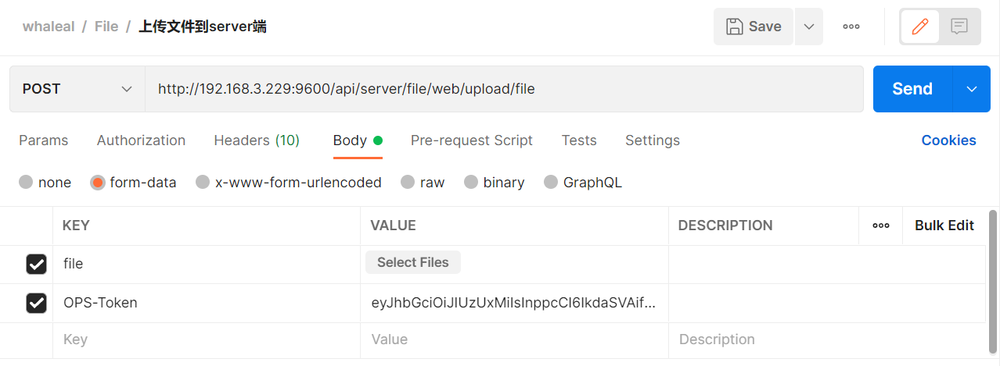
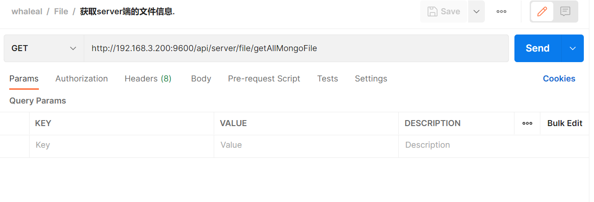
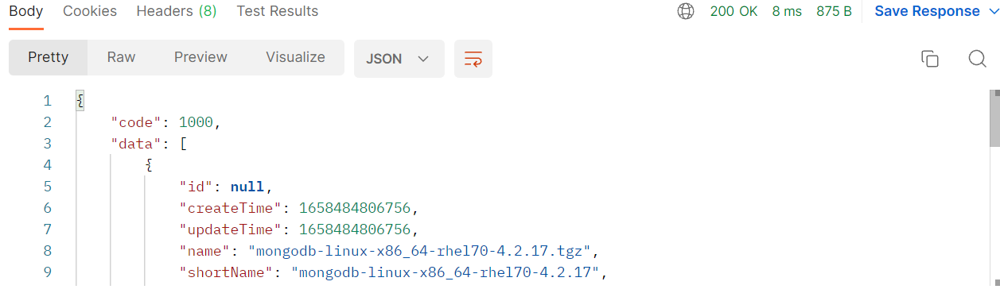

# File接口
此接口调用时须在请求头中设置OPS-Token ，填写参数发起请求，返回内容为 JSON 格式的信息，返回特殊实体类将在最后提供实体类表格。

### 请求头默认格式，特殊情况特殊声明

    OPS-Token在调用登录接口时返回，在之后调用接口时将token放置请求头中。
[登录接口调用获取OPS-Token](Member.md)

| KEY                |     VALUE      |     
| -------------------|----------------------|
| Accept-Encoding        |         gzip, deflate, br |     
| Connection          |         keep-alive           |          
| Content-Type          |multipart/form-data; boundary=\<calculated when request is sent> |    
| OPS-Token          |         "token"           |     
---

 

###  1 上传文件到Server端

1.1 请求路径：

POST http://{Server-Host}:{端口}/api/server/file/web/upload/file

---

1.2 请求参数：

| Name                |     Located in     |           Description         |     Required    |        Schema   |
| -------------------|----------------------|-------------------------------|-----------------|-----------   |
| File          |         Body           |            上传的文件            |        Yes       |MultipartFile

 

----

1.3 返回结果

|               |     Description    |           Schema              |  
| --------------|----------------------|---------------------------
| code        |   状态符:1000成功,其余异常 |        int               |    
| msg       |         返回消息         |             String           |        

 

---

 

###  2 删除server端文件

2.1 请求路径：

GET http://{Server-Host}:{端口}/api/server/file/deleteFile/{{filename}}

---

2.2 请求参数：

| Name                |     Located in     |           Description         |     Required    |        Schema   |
| -------------------|----------------------|-------------------------------|-----------------|-----------   |
| filename          |         Path           |            文件名称            |        Yes       |String        |

 

----

2.3 返回结果

|               |     Description    |           Schema              |  
| --------------|----------------------|---------------------------
| code        |   状态符:1000成功,其余异常 |         int              |    
| msg       |         返回消息         |            String            |        

 

---

 

### 3 获取server端的文件信息.

3.1 请求路径：

GET http://{Server-Host}:{端口}/api/server/file/getAllMongoFile

---

3.2 请求：

----

3.3 返回结果

|               |     Description    |           Schema              |  
| --------------|----------------------|---------------------------
| code        |   状态符:1000成功,其余异常 |        int               |    
| data       |         返回数据         |        JSON                |      

 

~~~
{
    "code": 1000,
    "data": [
        {
            "createTime": 1658484806756,
            "updateTime": 1658484806756,
            "name": "mongodb-linux-x86_64-rhel70-4.2.17.tgz",
            "shortName": "mongodb-linux-x86_64-rhel70-4.2.17",
            "size": 133396543,
            "md5": "1",
            "version": null,
            "path": "/home/whaleal/server/mongodb-linux-x86_64-rhel70-4.2.17.tgz",
            "hostId": "",
            "server": true
        }
    ]
}
~~~

---

[comment]: <> (## MongoFile)

[comment]: <> (|       Name         |     Type             |    Description      |   )

[comment]: <> (| ------------       |----------            |---------------------|)

[comment]: <> (| shortName                 |   String             |         姓          |   )

[comment]: <> (| Name             |   String             |         名     |   )

[comment]: <> (| Size              |   Long |         大小     |   )

[comment]: <> (| Md5               |   String             |         文件校验     |   )

[comment]: <> (| version         |   String             |         版本     |   )

[comment]: <> (| Path           |   String             |         路径     |   )

[comment]: <> (| hostId             |   String             |         主机id     |   )

[comment]: <> (---)

[comment]: <> (---)

