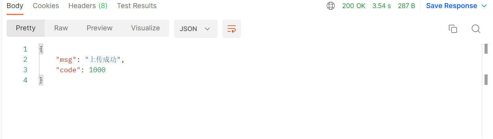

# File接口
此接口调用时须在请求头中设置OPS-Token ，填写参数发起请求，返回内容为 JSON 格式的信息。

### 请求头默认格式，特殊情况特殊声明

| KEY                |     VALUE      |     
| -------------------|----------------------|
| Accept-Encoding        |         gzip, deflate, br |     
| Connection          |         keep-alive           |          
| Content-Type          |multipart/form-data; boundary=\<calculated when request is sent> |    
| OPS-Token          |         "token"           |     
---

---

####  1 上传文件到Server端

1.1 请求路径：

POST http://192.168.3.200:9600/api/server/file/web/upload/file

---

1.2 请求参数：

| Name                |     Located in     |           Description         |     Required    |        Schema   |
| -------------------|----------------------|-------------------------------|-----------------|-----------   |
| File          |         body           |            上传的文件            |        Yes       |MultipartFile

----

1.3 返回结果

|               |     Description    |           Schema              |  
| --------------|----------------------|---------------------------
| code        |   状态符:1000成功,其余异常 |                       |    
| msg       |         消息         |                        |        

---
---

####  2 删除server端文件

2.1 请求路径：

GET http://192.168.3.200:9600/api/server/file/deleteFile/{{filename}}

---

2.2 请求参数：

| Name                |     Located in     |           Description         |     Required    |        Schema   |
| -------------------|----------------------|-------------------------------|-----------------|-----------   |
| filename          |         Path           |            文件名称            |        Yes       |String        |

----

2.3 返回结果

|               |     Description    |           Schema              |  
| --------------|----------------------|---------------------------
| code        |   状态符:1000成功,其余异常 |                       |    
| msg       |         返回消息         |                        |        

---

#### 3 获取server端的文件信息.

3.1 请求路径：

GET http://192.168.3.200:9600/api/server/file/getAllMongoFile

---

3.2 请求参数：

| Name                |     Located in     |           Description         |     Required    |        Schema   |
| -------------------|----------------------|-------------------------------|-----------------|-----------   |
|            |                     |                         |                |         |

----

3.3 返回结果

|               |     Description    |           Schema              |  
| --------------|----------------------|---------------------------
| code        |   状态符:1000成功,其余异常 |                       |    
| data       |         返回数据         |        MongoFile                |        

---

---
---

## MongoFile

|       Name         |     Type             |    Description      |   
| ------------       |----------            |---------------------|
| shortName                 |   string             |         姓          |   
| Name             |   string             |         名     |   
| Size              |   Long |         大小     |   
| Md5               |   string             |         文件校验     |   
| version         |   string             |         版本     |   
| path           |   string             |         路径     |   
| hostId             |   string             |         主机id     |   

---
---

