#Member接口
接口调用时须在请求头中设置OPS-Token ，填写参数发起请求，返回内容为 JSON 格式的信息，返回特殊实体类将在最后提供实体类表格。

有些接口调用时需用到ID、memberId、messageId
~~~
Id为用户ID，在“保存新用户信息”接口处返回data里的id为用户ID。

memberId为用户ID，在“保存新用户信息”接口处返回data里的id为用户ID。

messageId为消息id，在“获取信息数据”接口处返回的实体类中的id。
~~~

### 请求头默认格式，特殊情况特殊声明
    
    OPS-Token在调用登录接口时返回，在之后调用接口时将OPS-Token放置请求头中。

| KEY                |     VALUE      |     
| -------------------|----------------------|
| Accept-Encoding        |         gzip, deflate, br |     
| Connection          |         keep-alive           |          
| Content-Type          |         application/json |    
| OPS-Token          |         "token"           |     

---

 

####  1 登录

1.1 请求路径：

POST http://192.168.3.200:9600/api/server/member/login

---

1.2 请求参数：

| Name                |     Located in     |           Description         |     Required    |        Schema   |
| -------------------|----------------------|-------------------------------|-----------------|-----------   |
| account          |         Body           |            账户名            |        Yes       |String        |
| password          |         Body           |            密码            |        Yes       |String        |

 

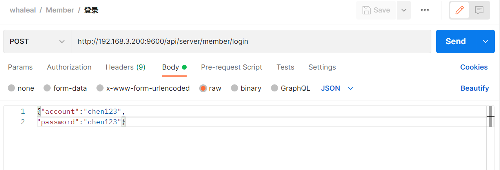

----

1.3 返回结果

|               |     Description    |           Schema              |  
| --------------|----------------------|---------------------------
| code        |   状态符:1000成功,其余异常 |         int              |    
| data       |         返回数据|       JSON                 |        
| generateAgentIdAble       |         是否有权限生成agentId         |         boolean               |        
| token       |         Token令牌         |         String               |   

 

~~~
{
    "code": 1000,
    "data": {
        "id": "62be61c7cbeff906da28f6ff",
        "createTime": 1656644040004,
        "updateTime": 1657690356662,
        "account": "chen123",
        "password": "",
        "email": "1q@q.com",
        "areaCode": "86",
        "phone": "17698999999",
        "role": "admin",
        "timezone": "Asia/Shanghai",
        "receiveAlert": true,
        "dingDingList": []
    },
    "createMongoDBAble": true,
    "generateAgentIdAble": true,
    "token": "eyJhbGciOiJIUzUxMiIsInppcCI6IkdaSVAifQ.H4sIAAAAAAAAAB2MQQqDMBBF7zJrW0yKk8RVEVxKpT1BMs6gUBOlFQrSuzf2797j8Xd4bQFquPWPU9d2TXuHAvizQK2wspUpnTUFeKK0xXfuaOSo9CVH05ARdWBUZCiwiCtx8NoKihwns5-eOVHrdT1TmrNaxhT5UAaddf_B9weqek8KggAAAA.cxpWZuLwKvWj3o2H7Ya7XuI9lRrRX_mY4-T7u-FJExO6mt7KRdmckY_sUwIz9al9oZwl37XvQ5ChTsUx_6YvxQ"
}
~~~

---

 

#### 2 保存新用户信息.

2.1 请求路径：

POST http://192.168.3.200:9600/api/server/member/register

---

2.2 请求参数：

| Name                |     Located in     |           Description         |     Required    |        Schema   |
| -------------------|----------------------|-------------------------------|-----------------|-----------   |
| memberMongoEntity          |         Body           |            用户实体对象            |        Yes       |MemberMongoEntity        |

 

~~~
Ex. 保存新用户信息;其中 MemberMongoEntity 如下所示:
{
    "account": "chen123556",
    "password": "123456",
    "email": "123356789@qq.com",
    "phone": "17699969999"
}
~~~

----

2.3 返回结果

|               |     Description    |           Schema              |  
| --------------|----------------------|---------------------------
| code        |   状态符:1000成功,其余异常 |         int              |    
| data       |         返回数据|       JSON                 |        

 

~~~
{
    "code": 1000,
    "data": {
        "id": "62da7bd6239d00094230b525",
        "createTime": 1658485718459,
        "updateTime": 1658485718459,
        "account": "chen123556",
        "password": "",
        "email": "123356789@qq.com",
        "areaCode": "86",
        "phone": "17699969999",
        "role": "admin",
        "timezone": "Asia/Shanghai",
        "receiveAlert": true,
        "dingDingList": []
    }
}
~~~

---

 

####  3 更新用户信息

3.1 请求路径：

POST http://192.168.3.200:9600/api/server/member/update

---

3.2 请求参数：

     

| Name                |     Located in     |           Description         |     Required    |        Schema   |
| -------------------|----------------------|-------------------------------|-----------------|-----------   |
| memberMongoEntity          |         Body           |            用户实体对象            |        Yes       |MemberMongoEntity        |

 

~~~
Ex. 更新用户信息;其中 MemberMongoEntity 如下所示:
{
    "id": "62c5669d006b7955deacf8d8",
    "account": "chen123456",
    "password": "654321",
    "email": "987654321@qq.com",
    "phone": "17699999999"
}
~~~

----

3.3 返回结果

|               |     Description    |           Schema              |  
| --------------|----------------------|---------------------------
| code        |   状态符:1000成功,其余异常 |         int              |    
| data       |         返回数据|       JSON                 |        

 

~~~
{
    "code": 1000,
    "data": {
        "id": "62da7bd6239d00094230b525",
        "createTime": 1658485718459,
        "updateTime": 1658486089634,
        "account": "chen123556",
        "password": "",
        "email": "98765221@qq.com",
        "areaCode": "86",
        "phone": "17699954999",
        "role": "admin",
        "timezone": "Asia/Shanghai",
        "receiveAlert": true,
        "dingDingList": []
    }
}
~~~

---

 

#### 4 搜索用户

4.1 请求路径：

POST http://192.168.3.200:9600/api/server/member/findMemberData/{{pageSize}}/{{pageIndex}}

---

4.2 请求参数：

| Name                |     Located in     |           Description         |     Required    |        Schema   |
| -------------------|----------------------|-------------------------------|-----------------|-----------   |
| pageSize          |         Path           |            每页大小            |        Yes       |int        |
| pageIndex          |         Path           |            第几页            |        Yes       |int        |
| map          |         Body           |            用户信息            |       No     |Map        |

 

~~~
Ex. 搜索用户;其中 Map 如下所示:
{
    "account": "chen123456",
    "phone": "",
    "email": ""
}
~~~

----

4.3 返回结果

|               |     Description    |           Schema              |  
| --------------|----------------------|---------------------------
| code        |   状态符:1000成功,其余异常 |         int              |    
| data       |         返回数据|       JSON                 |        

 

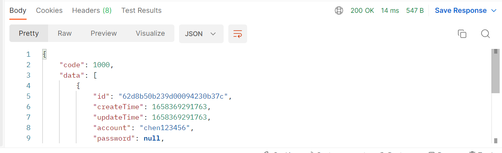

~~~
{
    "code": 1000,
    "data": [
        {
            "id": "62d8b50b239d00094230b37c",
            "createTime": 1658369291763,
            "updateTime": 1658369291763,
            "account": "chen123456",
            "password": null,
            "email": "123456789@qq.com",
            "areaCode": "86",
            "phone": "17699999999",
            "role": "admin",
            "timezone": "Asia/Shanghai",
            "receiveAlert": true,
            "dingDingList": []
        }
    ]
}
~~~

---

 

#### 5 查询用户数量

5.1 请求路径：

POST http://192.168.3.200:9600/api/server/member/findMemberCount

---

5.2 请求参数：

| Name                |     Located in     |           Description         |     Required    |        Schema   |
| -------------------|----------------------|-------------------------------|-----------------|-----------   |
| map          |         Body           |            用户信息            |       No     |Map        |

 

~~~
Ex. 搜索用户;其中 Map 如下所示:
{
    "account": "chen",
    "phone": "",
    "email": ""
}
~~~

----

5.3 返回结果

|               |     Description    |           Schema              |  
| --------------|----------------------|---------------------------
| code        |   状态符:1000成功,其余异常 |         int              |    
| data       |         返回数量         |       int                 |        

 

---

 

#### 6 更新接收警报

6.1 请求路径：

GET http://192.168.3.200:9600/api/server/member/update/receiveAlert/{{memberId}}/{{value}}

---

6.2 请求参数：

| Name                |     Located in     |           Description         |     Required    |        Schema   |
| -------------------|----------------------|-------------------------------|-----------------|-----------   |
| memberId          |         Path           |            用户id            |        Yes       |String        |
| value          |         Path           |            是否开启            |        Yes       |boolean        |

 

----

6.3 返回结果

|               |     Description    |           Schema              |  
| --------------|----------------------|---------------------------
| code        |   状态符:1000成功,其余异常 |       int                |    
| msg       |         返回消息|           String             |        

 

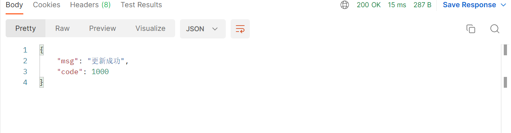

---

 

#### 7 更新时区

7.1 请求路径：

GET http://192.168.3.200:9600/api/server/member/update/timezone/{{memberId}}

---

7.2 请求参数：

| Name                |     Located in     |           Description         |     Required    |        Schema   |
| -------------------|----------------------|-------------------------------|-----------------|-----------   |
| memberId          |         Path           |            用户id            |        Yes       |String        |
| timezone          |         Params           |            时区            |        Yes       |String        |

 

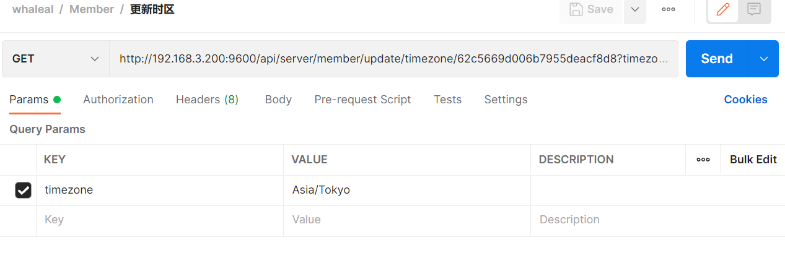

----

7.3 返回结果

|               |     Description    |           Schema              |  
| --------------|----------------------|---------------------------
| code        |   状态符:1000成功,其余异常 |       int                |    
| msg       |         返回消息|          String              |        

 

---

 

#### 8 更新角色

8.1 请求路径：

GET http://192.168.3.200:9600/api/server/member/update/role/{{memberId}}/{{value}}

---

8.2 请求参数：

| Name                |     Located in     |           Description         |     Required    |        Schema   |
| -------------------|----------------------|-------------------------------|-----------------|-----------   |
| memberId          |         Path           |            用户id            |        Yes       |String        |
| value          |         Path           |            角色:user,admin            |        Yes       |String        |

 

----

8.3 返回结果

|               |     Description    |           Schema              |  
| --------------|----------------------|---------------------------
| code        |   状态符:1000成功,其余异常 |            int           |    
| msg       |         返回消息|           String             |    

 

---

 

#### 9 更新是否可以创建mongodb

9.1 请求路径：

GET http://192.168.3.200:9600/api/server/member/update/createMongoDBAble/{{memberId}}/{{value}}

---

9.2 请求参数：

| Name                |     Located in     |           Description         |     Required    |        Schema   |
| -------------------|----------------------|-------------------------------|-----------------|-----------   |
| memberId          |         Path           |            用户id            |        Yes       |String        |
| value          |         Path           |            是否开启            |        Yes       |boolean        |

 

----

9.3 返回结果

|               |     Description    |           Schema              |  
| --------------|----------------------|---------------------------
| code        |   状态符:1000成功,其余异常 |        int               |    
| msg       |         返回消息|            String            |    

 

---

 

#### 10 更新是否可以创建agenid

10.1 请求路径：

GET http://192.168.3.200:9600/api/server/member/update/generateAgentIdAble/{{memberId}}/{{value}}

---

10.2 请求参数：

| Name                |     Located in     |           Description         |     Required    |        Schema   |
| -------------------|----------------------|-------------------------------|-----------------|-----------   |
| memberId          |         Path           |            用户id            |        Yes       |String        |
| value          |         Path           |            是否开启            |        Yes       |boolean        |

 

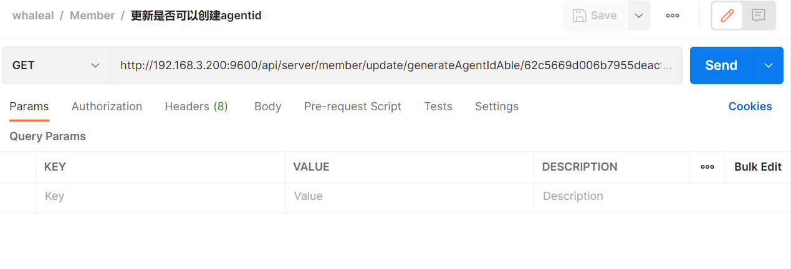

----

10.3 返回结果

|               |     Description    |           Schema              |  
| --------------|----------------------|---------------------------
| code        |   状态符:1000成功,其余异常 |          int             |    
| msg       |         返回消息|         String               |    

 

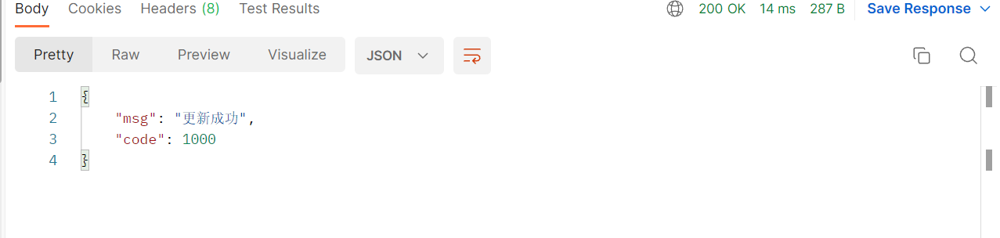

---

 

#### 11 更新用户资源信息

11.1 请求路径：

GET http://192.168.3.200:9600/api/server/member/update/userResourceInfo/{{memberId}}/{{objectId}}/{{type}}/{{value}}

---

11.2 请求参数：

| Name                |     Located in     |           Description         |     Required    |        Schema   |
| -------------------|----------------------|-------------------------------|-----------------|-----------   |
| memberId          |         Path           |            用户id            |        Yes       |String        |
| objectId          |         Path           |            根据type类型提供id            |        Yes       |String        |
| type          |         Path           |            类型：mongo,host            |        Yes       |String        |
| value          |         Path           |            值：read，write，nul            |        Yes       |String        |

 

----

11.3 返回结果

|               |     Description    |           Schema              |
| --------------|----------------------|---------------------------
| code        |   状态符:1000成功,其余异常 |         int              |
| msg       |         返回消息|           String             |

 

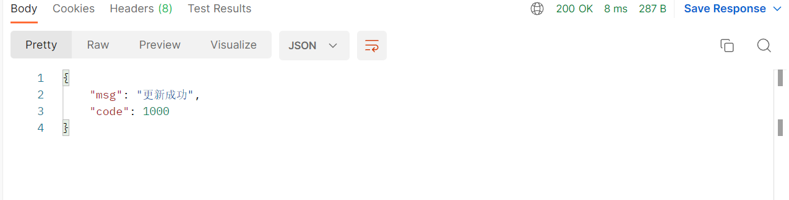

---

 

#### 12 删除用户

12.1 请求路径：

GET http://170.187.230.78:9602/api/server/member/delete/user/{{memberId}}

---

12.2 请求参数：

| Name                |     Located in     |           Description         |     Required    |        Schema   |
| -------------------|----------------------|-------------------------------|-----------------|-----------   |
| memberId          |         Path           |            用户id            |        Yes       |String        |

 

----

12.3 返回结果

|               |     Description    |           Schema              |
| --------------|----------------------|---------------------------
| code        |   状态符:1000成功,其余异常 |         int              |
| msg       |         返回消息|             String           |

 

---

 

#### 13 获取用户资源

13.1 请求路径：

GET http://{Server-Host}:{端口}/api/server/member/getUserResource/{{memberId}}

---

13.2 请求参数：

| Name                |     Located in     |           Description         |     Required    |        Schema   |
| -------------------|----------------------|-------------------------------|-----------------|-----------   |
| memberId          |         Path           |            用户id            |        Yes       |String        |

 

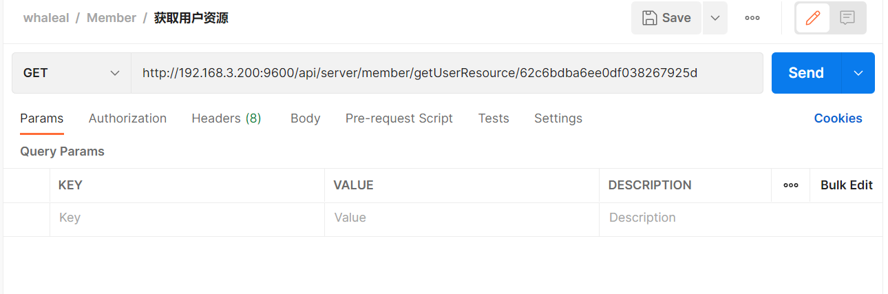

----

13.3 返回结果

|               |     Description    |           Schema              |
| --------------|----------------------|---------------------------
| code        |   状态符:1000成功,其余异常 |        int               |
| data       |         返回数据|                   JSON     |

 

---

 

#### 14 获取用户服务数据

14.1 请求路径：

GET https://{Server-Host}:{端口}/api/server/member/getUserServerResourceData/{{memberId}}/{{competence}}/{{pageSize}}/{{pageIndex}}

---

14.2 请求参数：

| Name                |     Located in     |           Description         |     Required    |        Schema   |
| -------------------|----------------------|-------------------------------|-----------------|-----------   |
| memberId          |         Path           |            用户id            |        Yes       |String        |
| competence          |         Path           |            权限:write,read,null            |        Yes       |String        |
| pageSize          |         Path           |            每页大小            |        Yes       |int        |
| pageIndex          |         Path           |            第几页            |        Yes       |int        |

 

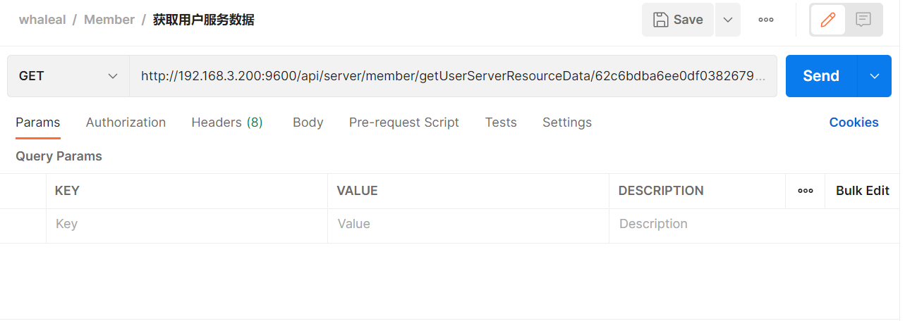

----

14.3 返回结果

|               |     Description    |           Schema              |
| --------------|----------------------|---------------------------
| code        |   状态符:1000成功,其余异常 |          int             |
| data.hostName       |         主机名称|            String            |
| data.osVersion       |         系统版本|         String               |

 

---

 

#### 15 获取用户服务数

15.1 请求路径：

GET http://{Server-Host}:{端口}/api/server/member/getUserServerResourceCount/{{memberId}}/{{competence}}

---

15.2 请求参数：

| Name                |     Located in     |           Description         |     Required    |        Schema   |
| -------------------|----------------------|-------------------------------|-----------------|-----------   |
| memberId          |         Path           |            用户id            |        Yes       |String        |
| competence          |         Path           |            权限:write,read,null            |        Yes       |String        |

 

----

15.3 返回结果

|               |     Description    |           Schema              |
| --------------|----------------------|---------------------------
| code        |   状态符:1000成功,其余异常 |         int              |
| data       |         返回数量|           int             |

 

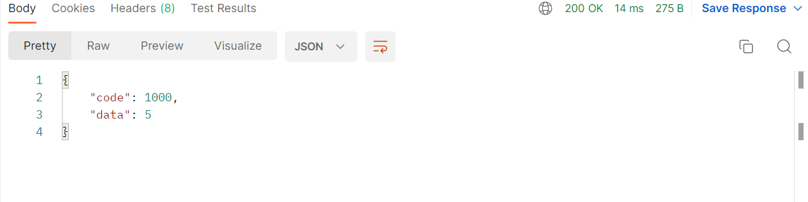

---

 

#### 16 获取用户mongo db集群资源数据

16.1 请求路径：

GET http://{Server-Host}:{端口}/api/server/member/getUserMongoDBClusterResourceData/{{memberId}}/{{competence}}/{{pageSize}}/{{pageIndex}}

---

16.2 请求参数：

| Name                |     Located in     |           Description         |     Required    |        Schema   |
| -------------------|----------------------|-------------------------------|-----------------|-----------   |
| memberId          |         Path           |            用户id            |        Yes       |String        |
| competence          |         Path           |            权限:write,read,null            |        Yes       |String        |
| pageSize          |         Path           |            每页大小            |        Yes       |int        |
| pageIndex          |         Path           |            第几页            |        Yes       |int        |

 

----

16.3 返回结果

|               |     Description    |           Schema              |
| --------------|----------------------|---------------------------
| code        |   状态符:1000成功,其余异常 |          int             |
| data.clusterName       |         集群名称|           String             |
| data.type       |         类型:单节点,复制集,分片，纳管|       String                 |

 

---

 

#### 17 获取用户mongo db集群数

17.1 请求路径：

GET http://{Server-Host}:{端口}/api/server/member/getUserMongoDBClusterResourceCount/{{memberId}}/{{competence}}

---

17.2 请求参数：

| Name                |     Located in     |           Description         |     Required    |        Schema   |
| -------------------|----------------------|-------------------------------|-----------------|-----------   |
| memberId          |         Path           |            用户id            |        Yes       |String        |
| competence          |         Path           |            权限:write,read,null            |        Yes       |String        |

 

----

17.3 返回结果

|               |     Description    |           Schema              |
| --------------|----------------------|---------------------------
| code        |   状态符:1000成功,其余异常 |          int             |
| data       |         返回数量|            int            |

 

---

 

#### 18 获取信息数据

18.1 请求路径：

GET http://{Server-Host}:{端口}/api/server/member/getMessageData/{{memberId}}/{{pageSize}}/{{pageIndex}}

---

18.2 请求参数：

| Name                |     Located in     |           Description         |     Required    |        Schema   |
| -------------------|----------------------|-------------------------------|-----------------|-----------   |
| memberId          |         Path           |            用户id            |        Yes       |String        |
| pageSize          |         Path           |            每页大小            |        Yes       |int        |
| pageIndex          |         Path           |            第几页            |        Yes       |int        |
| operatorName          |         Params           |            操作者名称            |        No       |String        |
| objectName          |         Params           |            被操作的对象名称            |        No       |String        |
| type          |         Params           |            主机 mongodb 用户 告警            |        No       |String        |
| status          |         Params           |            状态            |        Yes       |boolean        |
| message          |         Params           |            消息            |        No       |String        |
| startTime          |         Params           |            开始时间            |        Yes       |long        |
| endTime          |         Params           |            结束时间            |        Yes       |long        |

 

----

18.3 返回结果

|               |     Description    |           Schema              |
| --------------|----------------------|---------------------------
| code        |   状态符:1000成功,其余异常 |       int                |
| data       |         返回数据|            JSON            |

 

---

 

#### 19 获取消息数量

19.1 请求路径：

GET http://{Server-Host}:{端口}/api/server/member/getMessageCount/{{memberId}}

---

19.2 请求参数：

| Name                |     Located in     |           Description         |     Required    |        Schema   |
| -------------------|----------------------|-------------------------------|-----------------|-----------   |
| memberId          |         Path           |            用户id            |        Yes       |String        |
| operatorName          |         Params           |            操作者名称            |        No       |String        |
| objectName          |         Params           |            被操作的对象名称            |        No       |String        |
| type          |         Params           |            主机 mongodb 用户 告警            |        No       |String        |
| status          |         Params           |            状态            |        Yes       |boolean        |
| message          |         Params           |            消息            |        No       |String        |
| startTime          |         Params           |            开始时间            |        Yes       |long        |
| endTime          |         Params           |            结束时间            |        Yes       |long        |

 

----

19.3 返回结果

|               |     Description    |           Schema              |
| --------------|----------------------|---------------------------
| code        |   状态符:1000成功,其余异常 |         int              |
| data     |         返回数量|             int           |

 

---

 

#### 20 更新消息状态

20.1 请求路径：

GET http://{Server-Host}:{端口}/api/server/member/update/messageStatus/{{memberId}}/{{messageId}}

---

20.2 请求参数：

| Name                |     Located in     |           Description         |     Required    |        Schema   |
| -------------------|----------------------|-------------------------------|-----------------|-----------   |
| memberId          |         Path           |            用户id            |        Yes       |String        |
| messageId          |         Path           |            消息id            |        Yes       |String        |

 

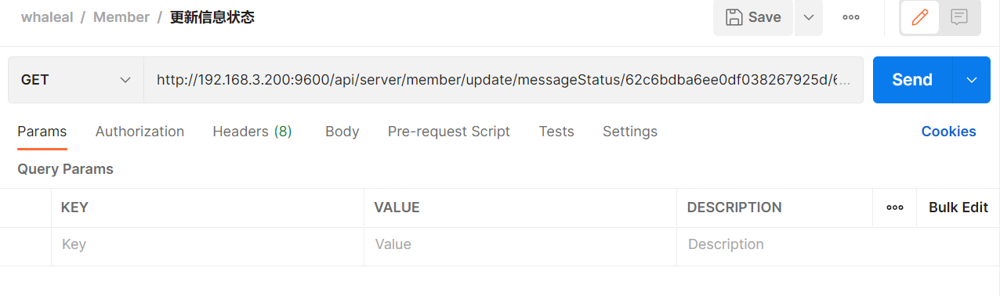

----

20.3 返回结果

|               |     Description    |           Schema              |
| --------------|----------------------|---------------------------
| code        |   状态符:1000成功,其余异常 |         int              |
| msg       |         返回消息|           String             |

 

---

 

#### 21 更新所有消息状态

21.1 请求路径：

GET http://{Server-Host}:{端口}/api/server/member/update/allMessageStatus/{{memberId}}

---

21.2 请求参数：

| Name                |     Located in     |           Description         |     Required    |        Schema   |
| -------------------|----------------------|-------------------------------|-----------------|-----------   |
| memberId          |         Path           |            用户id            |        Yes       |String        |

 

----

7.3 返回结果

|               |     Description    |           Schema              |
| --------------|----------------------|---------------------------
| code        |   状态符:1000成功,其余异常 |        int               |
| msg       |         返回消息|         String               |

 

[comment]: <> (---)

[comment]: <> (---)

[comment]: <> (## MemberMongoEntity)

[comment]: <> (|       Name         |     Type             |    Description      |)

[comment]: <> (| ------------       |----------            |---------------------|)

[comment]: <> (| account                 |   String             |         用户名          |)

[comment]: <> (| password             |   String             |         密码     |)

[comment]: <> (| email              |   String |         邮箱     |)

[comment]: <> (| areaCode               |   String             |         区号     |)

[comment]: <> (| phone         |   String             |         手机号     |)

[comment]: <> (| role           |   String             |         角色     |)

[comment]: <> (| timezone             |   String             |         时区     |)

[comment]: <> (| receiveAlert             |   boolean             |         是否接受警告     |)

[comment]: <> (| dingDingList             |   List\<String>             |         钉钉机器人列表     |)

[comment]: <> (---)

[comment]: <> (## MessageEntity)

[comment]: <> (|       Name         |     Type             |    Description      |)

[comment]: <> (| ------------       |----------            |---------------------|)

[comment]: <> (| Type                 |   String             |         消息类型          |)

[comment]: <> (| objectId             |   String             |         被操作的对象id     |)

[comment]: <> (| objectName              |   String |         被操作的对象名称     |)

[comment]: <> (| operatorId               |   String             |         操作者id     |)

[comment]: <> (| operatorName         |   String             |         操作者名称     |)

[comment]: <> (| eventId           |   String             |         所属事件组     |)

[comment]: <> (| List\<MessageStatus>             |   List             |         接受告警信息的人     |)

[comment]: <> (---)

[comment]: <> (---)
