#Member接口
此接口调用时须在请求头中设置OPS-Token ，填写参数发起请求，返回内容为 JSON 格式的信息。

### 请求头默认格式，特殊情况特殊声明

| KEY                |     VALUE      |     
| -------------------|----------------------|
| Accept-Encoding        |         gzip, deflate, br |     
| Connection          |         keep-alive           |          
| Content-Type          |         application/json |    
| OPS-Token          |         "token"           |     
---
---

####  1 登录

1.1 请求路径：

POST http://192.168.3.200:9600/api/server/member/login

---

1.2 请求参数：

| Name                |     Located in     |           Description         |     Required    |        Schema   |
| -------------------|----------------------|-------------------------------|-----------------|-----------   |
| account          |         body           |            账户名            |        Yes       |String        |
| password          |         body           |            密码            |        Yes       |String        |

----

2.3 返回结果

|               |     Description    |           Schema              |  
| --------------|----------------------|---------------------------
| code        |   状态符:1000成功,其余异常 |                       |    
| data       |         返回数据|       MemberMongoEntity                 |        
| generateAgentIdAble       |         是否有权限生成agentid         |         Boolean               |        
| token       |         Token令牌         |                        |        String

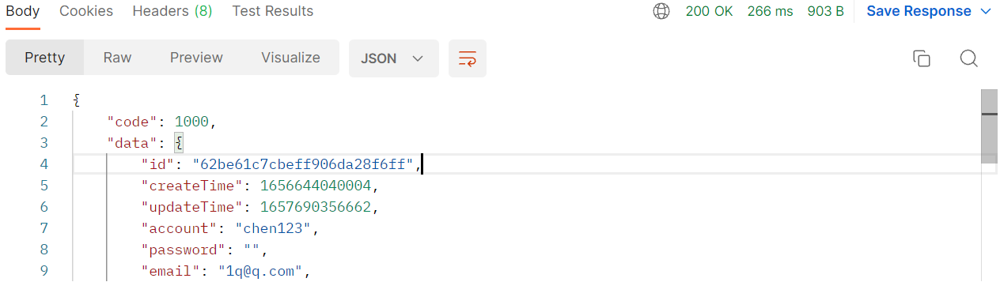

---

#### 2 保存新用户信息.

2.1 请求路径：

POST http://192.168.3.200:9600/api/server/member/register

---

2.2 请求参数：

| Name                |     Located in     |           Description         |     Required    |        Schema   |
| -------------------|----------------------|-------------------------------|-----------------|-----------   |
| account          |         body           |            账户名            |        Yes       |String        |
| password          |         body           |            密码            |        Yes       |String        |
| email          |         body           |            邮箱            |        Yes       |String        |
| phone          |         body           |            手机号            |        Yes       |String        |

----

2.3 返回结果

|               |     Description    |           Schema              |  
| --------------|----------------------|---------------------------
| code        |   状态符:1000成功,其余异常 |                       |    
| data       |         返回数据|       MemberMongoEntity                 |        

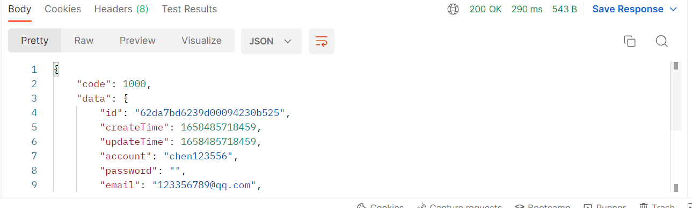

---

####  3 更新用户信息

3.1 请求路径：

POST http://192.168.3.200:9600/api/server/member/update

---

3.2 请求参数：

| Name                |     Located in     |           Description         |     Required    |        Schema   |
| -------------------|----------------------|-------------------------------|-----------------|-----------   |
| account          |         body           |            账户名            |        Yes       |String        |
| password          |         body           |            密码            |        Yes       |String        |
| email          |         body           |            邮箱            |        Yes       |String        |
| phone          |         body           |            手机号            |        Yes       |String        |
| Id          |         body           |            Id            |        Yes       |String        |

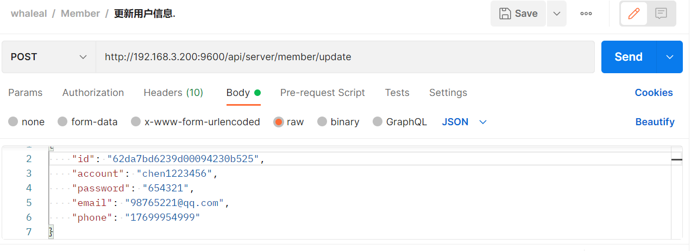

----

3.3 返回结果

|               |     Description    |           Schema              |  
| --------------|----------------------|---------------------------
| code        |   状态符:1000成功,其余异常 |                       |    
| data       |         返回数据|       MemberMongoEntity                 |        

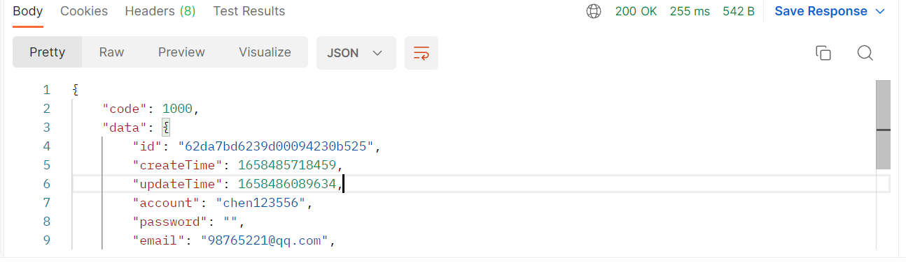

---

#### 4 搜索用户

4.1 请求路径：

POST http://192.168.3.200:9600/api/server/member/findMemberData/{{pageSize}}/{{pageIndex}}

---

4.2 请求参数：

| Name                |     Located in     |           Description         |     Required    |        Schema   |
| -------------------|----------------------|-------------------------------|-----------------|-----------   |
| pageSize          |         path           |            每页大小            |        Yes       |int        |
| pageIndex          |         path           |            第几页            |        Yes       |int        |
| account          |         body           |            账户名            |        Yes       |String        |
| password          |         body           |            密码            |        Yes       |String        |
| email          |         body           |            邮箱            |        Yes       |String        |
| phone          |         body           |            手机号            |        Yes       |String        |

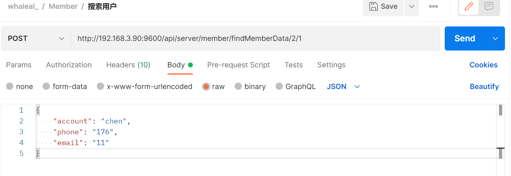

----

4.3 返回结果

|               |     Description    |           Schema              |  
| --------------|----------------------|---------------------------
| code        |   状态符:1000成功,其余异常 |                       |    
| data       |         返回数据|       MemberMongoEntity                 |        

---

#### 5 查询用户数量

5.1 请求路径：

POST http://192.168.3.200:9600/api/server/member/findMemberCount

---

5.2 请求参数：

| Name                |     Located in     |           Description         |     Required    |        Schema   |
| -------------------|----------------------|-------------------------------|-----------------|-----------   |
| account          |         body           |            账户名            |        Yes       |String        |
| password          |         body           |            密码            |        Yes       |String        |
| email          |         body           |            邮箱            |        Yes       |String        |
| phone          |         body           |            手机号            |        Yes       |String        |

----

5.3 返回结果

|               |     Description    |           Schema              |  
| --------------|----------------------|---------------------------
| code        |   状态符:1000成功,其余异常 |                       |    
| data       |         返回数量         |                        |        

---

#### 6 更新接收警报

6.1 请求路径：

GET http://192.168.3.200:9600/api/server/member/update/receiveAlert/{{memberId}}/{{value}}

---

6.2 请求参数：

| Name                |     Located in     |           Description         |     Required    |        Schema   |
| -------------------|----------------------|-------------------------------|-----------------|-----------   |
| memberId          |         Path           |            用户id            |        Yes       |String        |
| value          |         Path           |            是否开启            |        Yes       |Boolean        |

----

6.3 返回结果

|               |     Description    |           Schema              |  
| --------------|----------------------|---------------------------
| code        |   状态符:1000成功,其余异常 |                       |    
| msg       |         返回消息|                        |        

---

#### 7 更新时区

7.1 请求路径：

GET http://192.168.3.200:9600/api/server/member/update/timezone/{{memberId}}

---

7.2 请求params：

| Name                |     Located in     |           Description         |     Required    |        Schema   |
| -------------------|----------------------|-------------------------------|-----------------|-----------   |
| memberId          |         Path           |            用户id            |        Yes       |String        |
| timezone          |         params           |            时区            |        Yes       |String        |

----

7.3 返回结果

|               |     Description    |           Schema              |  
| --------------|----------------------|---------------------------
| code        |   状态符:1000成功,其余异常 |                       |    
| msg       |         返回消息|                        |        

---

#### 8 更新角色

8.1 请求路径：

GET http://192.168.3.200:9600/api/server/member/update/role/{{memberId}}/{{value}}

---

8.2 请求参数：

| Name                |     Located in     |           Description         |     Required    |        Schema   |
| -------------------|----------------------|-------------------------------|-----------------|-----------   |
| memberId          |         Path           |            用户id            |        Yes       |String        |
| value          |         Path           |            角色:user,admin            |        Yes       |String        |

----

8.3 返回结果

|               |     Description    |           Schema              |  
| --------------|----------------------|---------------------------
| code        |   状态符:1000成功,其余异常 |                       |    
| msg       |         返回消息|                        |    

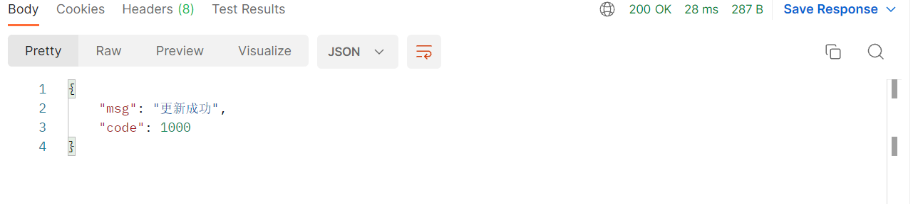

---

#### 9 更新是否可以创建mongodb

9.1 请求路径：

GET http://192.168.3.200:9600/api/server/member/update/createMongoDBAble/{{memberId}}/{{value}}

---

9.2 请求参数：

| Name                |     Located in     |           Description         |     Required    |        Schema   |
| -------------------|----------------------|-------------------------------|-----------------|-----------   |
| memberId          |         Path           |            用户id            |        Yes       |String        |
| value          |         Path           |            是否开启            |        Yes       |Boolean        |

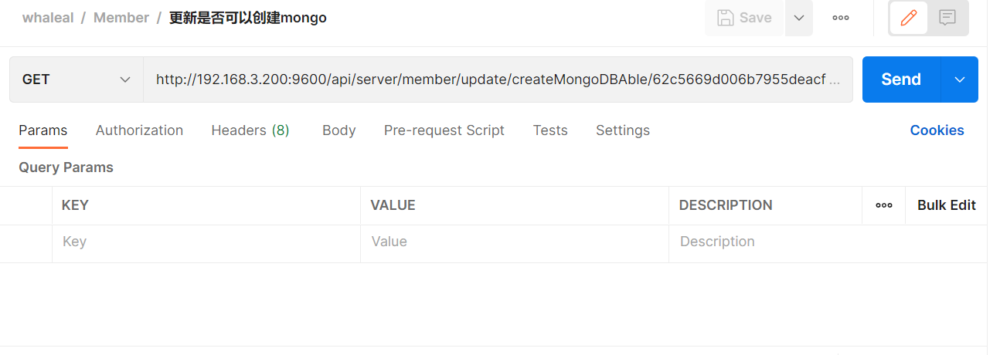

----

9.3 返回结果

|               |     Description    |           Schema              |  
| --------------|----------------------|---------------------------
| code        |   状态符:1000成功,其余异常 |                       |    
| msg       |         返回消息|                        |    

---

#### 10 更新是否可以创建agenid

10.1 请求路径：

GET http://192.168.3.200:9600/api/server/member/update/generateAgentIdAble/{{memberId}}/{{value}}

---

10.2 请求参数：

| Name                |     Located in     |           Description         |     Required    |        Schema   |
| -------------------|----------------------|-------------------------------|-----------------|-----------   |
| memberId          |         Path           |            用户id            |        Yes       |String        |
| value          |         Path           |            是否开启            |        Yes       |Boolean        |

----

10.3 返回结果

|               |     Description    |           Schema              |  
| --------------|----------------------|---------------------------
| code        |   状态符:1000成功,其余异常 |                       |    
| msg       |         返回消息|                        |    

---

#### 11 更新用户资源信息

11.1 请求路径：

GET http://192.168.3.200:9600/api/server/member/update/userResourceInfo/{{memberId}}/{{objectId}}/{{type}}/{{value}}

---

11.2 请求参数：

| Name                |     Located in     |           Description         |     Required    |        Schema   |
| -------------------|----------------------|-------------------------------|-----------------|-----------   |
| memberId          |         Path           |            用户id            |        Yes       |String        |
| value          |         Path           |            值：read，write，nul            |        Yes       |String        |
| objectId          |         Path           |            根据type类型提供id            |        Yes       |String        |
| type          |         Path           |            类型：mongo,host            |        Yes       |String        |

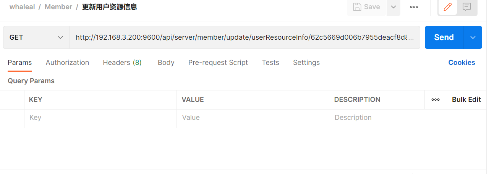

----

11.3 返回结果

|               |     Description    |           Schema              |
| --------------|----------------------|---------------------------
| code        |   状态符:1000成功,其余异常 |                       |
| msg       |         返回消息|                        |

---

#### 12 删除用户

12.1 请求路径：

GET http://170.187.230.78:9602/api/server/member/delete/user/{{memberId}}

---

12.2 请求参数：

| Name                |     Located in     |           Description         |     Required    |        Schema   |
| -------------------|----------------------|-------------------------------|-----------------|-----------   |
| memberId          |         Path           |            用户id            |        Yes       |String        |

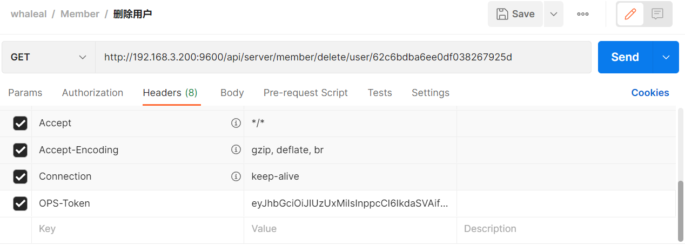

----

12.3 返回结果

|               |     Description    |           Schema              |
| --------------|----------------------|---------------------------
| code        |   状态符:1000成功,其余异常 |                       |
| msg       |         返回消息|                        |

---

#### 13 获取用户资源

13.1 请求路径：

GET http://170.187.230.78:9600/api/server/member/getUserResource/{{memberId}}

---

13.2 请求参数：

| Name                |     Located in     |           Description         |     Required    |        Schema   |
| -------------------|----------------------|-------------------------------|-----------------|-----------   |
| memberId          |         Path           |            用户id            |        Yes       |String        |

----

13.3 返回结果

|               |     Description    |           Schema              |
| --------------|----------------------|---------------------------
| code        |   状态符:1000成功,其余异常 |                       |
| data       |         返回数据|                   MemberMongoEntity     |

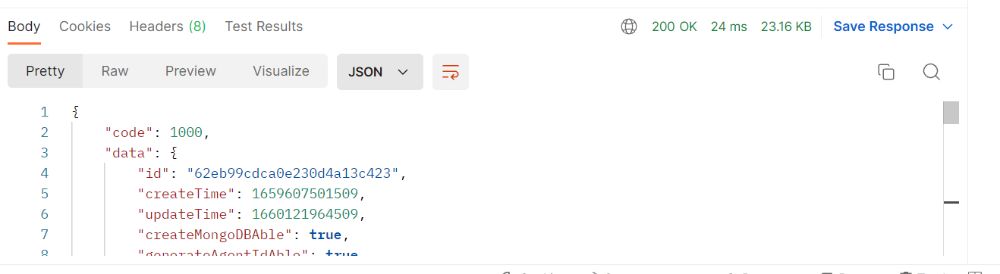

---

#### 14 获取用户服务数据

14.1 请求路径：

GET https://170.187.230.78:9600/api/server/member/getUserServerResourceData/{{memberId}}/{{competence}}/{{pageSize}}/{{pageIndex}}

---

14.2 请求参数：

| Name                |     Located in     |           Description         |     Required    |        Schema   |
| -------------------|----------------------|-------------------------------|-----------------|-----------   |
| memberId          |         Path           |            用户id            |        Yes       |String        |
| competence          |         Path           |            权限:write,read,null            |        Yes       |String        |
| pageSize          |         Path           |            每页大小            |        Yes       |Int        |
| pageIndex          |         Path           |            第几页            |        Yes       |Int        |

----

14.3 返回结果

|               |     Description    |           Schema              |
| --------------|----------------------|---------------------------
| code        |   状态符:1000成功,其余异常 |                       |
| data.hostName       |         主机名称|            String            |
| data.osVersion       |         系统版本|         String               |

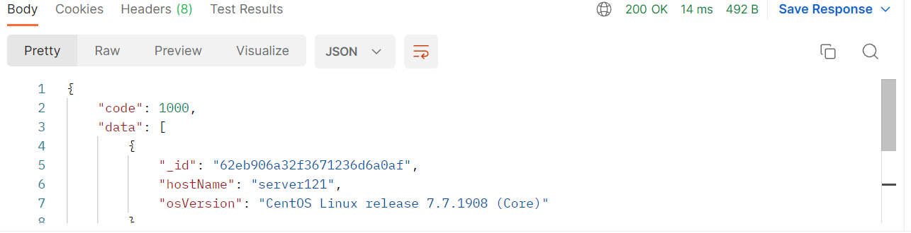

---

#### 15 获取用户服务数

15.1 请求路径：

GET http://170.187.230.78:9600/api/server/member/getUserServerResourceCount/{{memberId}}/{{competence}}

---

15.2 请求参数：

| Name                |     Located in     |           Description         |     Required    |        Schema   |
| -------------------|----------------------|-------------------------------|-----------------|-----------   |
| memberId          |         Path           |            用户id            |        Yes       |String        |
| competence          |         Path           |            权限:write,read,null            |        Yes       |String        |

----

15.3 返回结果

|               |     Description    |           Schema              |
| --------------|----------------------|---------------------------
| code        |   状态符:1000成功,其余异常 |                       |
| data       |         返回数量|                        |

---

#### 16 获取用户mongo db集群资源数据

16.1 请求路径：

GET http://170.187.230.78:9600/api/server/member/getUserMongoDBClusterResourceData/{{memberId}}/{{competence}}/{{pageSize}}/{{pageIndex}}

---

16.2 请求参数：

| Name                |     Located in     |           Description         |     Required    |        Schema   |
| -------------------|----------------------|-------------------------------|-----------------|-----------   |
| memberId          |         Path           |            用户id            |        Yes       |String        |
| competence          |         Path           |            权限:write,read,null            |        Yes       |String        |
| pageSize          |         Path           |            每页大小            |        Yes       |Int        |
| pageIndex          |         Path           |            第几页            |        Yes       |Int        |

----

16.3 返回结果

|               |     Description    |           Schema              |
| --------------|----------------------|---------------------------
| code        |   状态符:1000成功,其余异常 |                       |
| data.clusterName       |         集群名称|                        |
| data.type       |         类型:单节点,复制集,分片，纳管|                        |

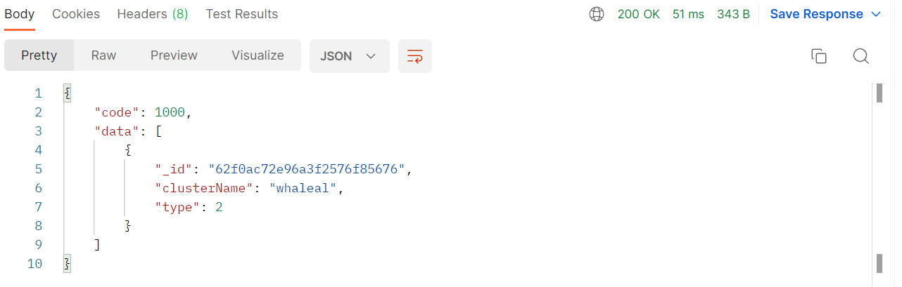

---

#### 17 获取用户mongo db集群数

17.1 请求路径：

GET http://170.187.230.78:9600/api/server/member/getUserMongoDBClusterResourceCount/{{memberId}}/{{competence}}

---

17.2 请求参数：

| Name                |     Located in     |           Description         |     Required    |        Schema   |
| -------------------|----------------------|-------------------------------|-----------------|-----------   |
| memberId          |         Path           |            用户id            |        Yes       |String        |
| competence          |         Path           |            权限:write,read,null            |        Yes       |String        |

----

17.3 返回结果

|               |     Description    |           Schema              |
| --------------|----------------------|---------------------------
| code        |   状态符:1000成功,其余异常 |                       |
| data       |         返回数量|                        |

---

#### 18 获取信息数据

18.1 请求路径：

GET http://170.187.230.78:9600/api/server/member/getMessageData/{{memberId}}/{{pageSize}}/{{pageIndex}}

---

18.2 请求参数：

| Name                |     Located in     |           Description         |     Required    |        Schema   |
| -------------------|----------------------|-------------------------------|-----------------|-----------   |
| memberId          |         Path           |            用户id            |        Yes       |String        |
| pageSize          |         Path           |            每页大小            |        Yes       |Int        |
| pageIndex          |         Path           |            第几页            |        Yes       |Int        |
| operatorName          |         params           |            操作者名称            |        No       |String        |
| objectName          |         params           |            被操作的对象名称            |        No       |String        |
| type          |         params           |            主机 mongodb 用户 告警            |        No       |String        |
| status          |         params           |            状态            |        Yes       |Boolean        |
| message          |         params           |            消息            |        No       |String        |
| startTime          |         params           |            开始时间            |        Yes       |Long        |
| endTime          |         params           |            结束时间            |        Yes       |Long        |

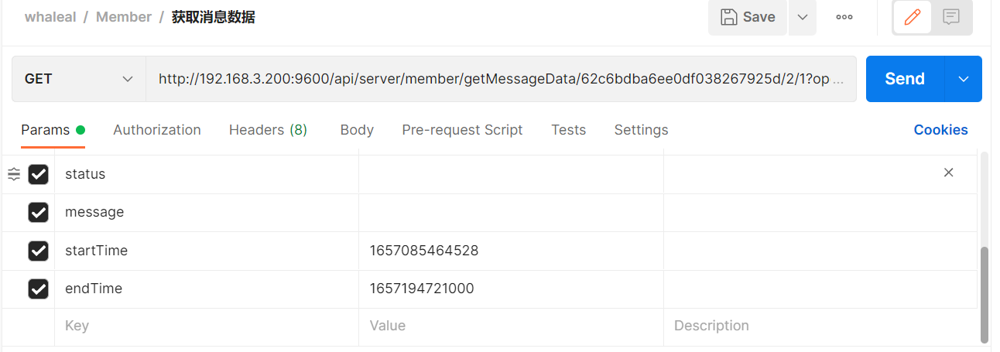

----

18.3 返回结果

|               |     Description    |           Schema              |
| --------------|----------------------|---------------------------
| code        |   状态符:1000成功,其余异常 |                       |
| data       |         返回数据|            MessageEntity            |

---

#### 19 获取消息数量

19.1 请求路径：

GET http://170.187.230.78:9600/api/server/member/getMessageCount/{{memberId}}

---

19.2 请求参数：

| Name                |     Located in     |           Description         |     Required    |        Schema   |
| -------------------|----------------------|-------------------------------|-----------------|-----------   |
| memberId          |         Path           |            用户id            |        Yes       |String        |
| pageSize          |         Path           |            每页大小            |        Yes       |Int        |
| pageIndex          |         Path           |            第几页            |        Yes       |Int        |
| operatorName          |         params           |            操作者名称            |        No       |String        |
| objectName          |         params           |            被操作的对象名称            |        No       |String        |
| type          |         params           |            主机 mongodb 用户 告警            |        No       |String        |
| status          |         params           |            状态            |        Yes       |Boolean        |
| message          |         params           |            消息            |        No       |String        |
| startTime          |         params           |            开始时间            |        Yes       |Long        |
| endTime          |         params           |            结束时间            |        Yes       |Long        |

----

19.3 返回结果

|               |     Description    |           Schema              |
| --------------|----------------------|---------------------------
| code        |   状态符:1000成功,其余异常 |                       |
| data     |         返回数量|                        |

---

#### 20 更新消息状态

20.1 请求路径：

GET http://170.187.230.78:9600/api/server/member/update/messageStatus/{{memberId}}/{{messageId}}

---

20.2 请求参数：

| Name                |     Located in     |           Description         |     Required    |        Schema   |
| -------------------|----------------------|-------------------------------|-----------------|-----------   |
| memberId          |         Path           |            用户id            |        Yes       |String        |
| messageId          |         Path           |            消息id            |        Yes       |String        |

----

20.3 返回结果

|               |     Description    |           Schema              |
| --------------|----------------------|---------------------------
| code        |   状态符:1000成功,其余异常 |                       |
| msg       |         返回消息|                        |

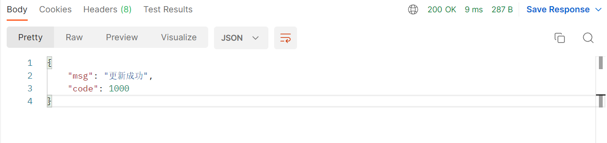

---

#### 21 更新所有消息状态

21.1 请求路径：

GET http://170.187.230.78:9600/api/server/member/update/allMessageStatus/{{memberId}}

---

21.2 请求参数：

| Name                |     Located in     |           Description         |     Required    |        Schema   |
| -------------------|----------------------|-------------------------------|-----------------|-----------   |
| memberId          |         Path           |            用户id            |        Yes       |String        |

----

7.3 返回结果

|               |     Description    |           Schema              |
| --------------|----------------------|---------------------------
| code        |   状态符:1000成功,其余异常 |                       |
| msg       |         返回消息|                        |

---
---

## MemberMongoEntity

|       Name         |     Type             |    Description      |
| ------------       |----------            |---------------------|
| account                 |   string             |         用户名          |
| password             |   string             |         密码     |
| email              |   string |         邮箱     |
| areaCode               |   string             |         区号     |
| phone         |   string             |         手机号     |
| role           |   string             |         角色     |
| timezone             |   string             |         时区     |
| receiveAlert             |   boolean             |         是否接受警告     |
| dingDingList             |   List\<string>             |         钉钉机器人列表     |

---

## MessageEntity

|       Name         |     Type             |    Description      |
| ------------       |----------            |---------------------|
| Type                 |   string             |         消息类型          |
| objectId             |   string             |         被操作的对象id     |
| objectName              |   string |         被操作的对象名称     |
| operatorId               |   string             |         操作者id     |
| operatorName         |   string             |         操作者名称     |
| eventId           |   string             |         所属事件组     |
| List\<MessageStatus>             |   List             |         接受告警信息的人     |

---
---
