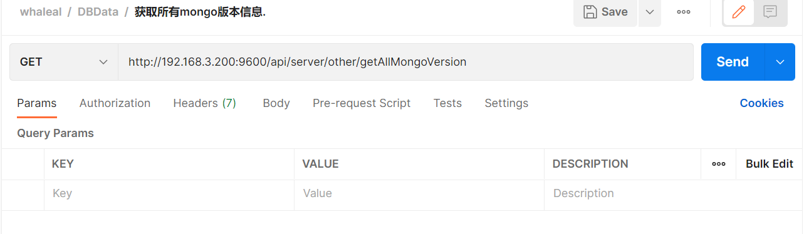
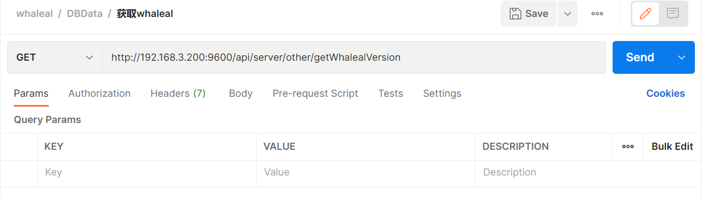

# Other接口
此接口调用时须在请求头中设置OPS-Token ，填写参数发起请求，返回内容为 JSON 格式的信息。

### 请求头默认格式，特殊情况特殊声明

| KEY                |     VALUE      |     
| -------------------|----------------------|
| Accept-Encoding        |         gzip, deflate, br |     
| Connection          |         keep-alive           |          
| Content-Type          |         application/json |    
| OPS-Token          |         "token"           |     
---

####  1 获取所有mongo版本信息.

1.1 请求路径：

GET http://192.168.3.200:9600/api/server/other/getAllMongoVersion

---

1.2 请求参数：

| Name                |     Located in     |           Description         |     Required    |        Schema   |
| -------------------|----------------------|-------------------------------|-----------------|-----------   |
|            |                     |                         |                | 

----

1.3 返回结果

|               |     Description    |           Schema              |  
| --------------|----------------------|---------------------------
| code        |   状态符:1000成功,其余异常 |                       |    
| data       |         返回数据         |                         | 

---

####  2 获取所有whaleal版本信息.

2.1 请求路径：

GET http://192.168.3.200:9600/api/server/other/getWhalealVersion

---

2.2 请求参数：

| Name                |     Located in     |           Description         |     Required    |        Schema   |
| -------------------|----------------------|-------------------------------|-----------------|-----------   |
|            |                     |                         |                |

----

2.3 返回结果

|               |     Description    |           Schema              |  
| --------------|----------------------|---------------------------
| code        |   状态符:1000成功,其余异常 |                       |    
| data       |         返回消息        |                         | 

