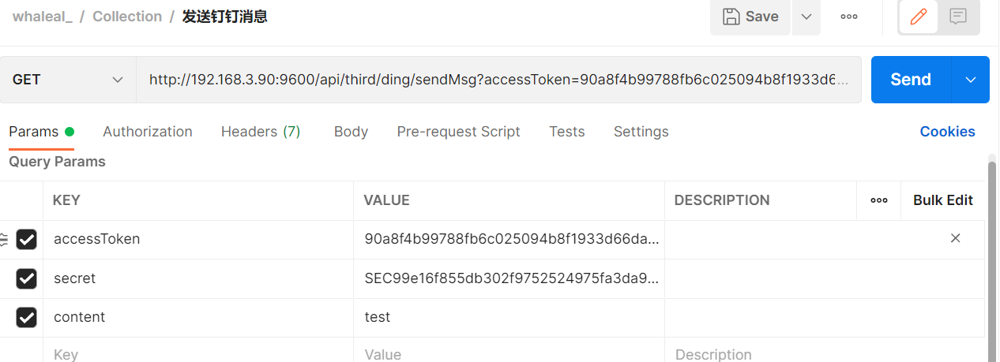
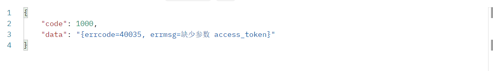
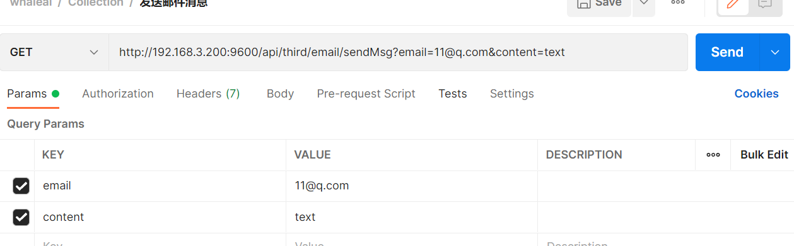
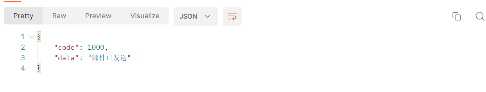
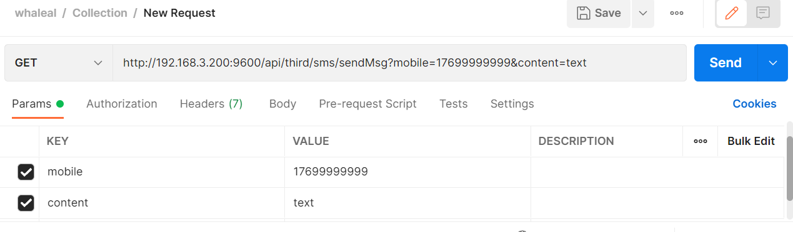

# Third_party接口
此接口调用时须在请求头中设置OPS-Token ，填写参数发起请求，返回内容为 JSON 格式的信息，返回特殊实体类将在最后提供实体类表格。

### 请求头默认格式，特殊情况特殊声明

| KEY                |     VALUE      |     
| -------------------|----------------------|
| Accept-Encoding        |         gzip, deflate, br |     
| Connection          |         keep-alive           |          
| Content-Type          |         application/json |    
---

####  1 发送钉钉消息

1.1 请求路径：

GET http://{Server-Host}:{端口}/api/third/ding/sendMsg

---

1.2 请求参数：

| Name                |     Located in     |           Description         |     Required    |        Schema   |
| -------------------|----------------------|-------------------------------|-----------------|-----------   |
|    accessToken   |      params  |       钉钉机器人token      |      yes            |    string
|    secret   |      params  |       钉钉机器人secret      |      yes            |    string
|    content   |      params  |       消息类型     |      yes            |    string

----

1.3 返回结果

|               |     Description    |           Schema              |  
| --------------|----------------------|---------------------------
| code        |   状态符:1000成功,其余异常 |         int              |    
| data       |         返回信息        |           string              | 

---
---

####  2 发送邮件消息

2.1 请求路径：

GET http://{Server-Host}:{端口}/api/third/email/sendMsg

---

2.2 请求参数：

| Name                |     Located in     |           Description         |     Required    |        Schema   |
| -------------------|----------------------|-------------------------------|-----------------|-----------   |
|    email   |      params      |       邮箱账号      |      yes            |    string
|    content   |      params      |       消息类型      |      yes            |    string

----

2.3 返回结果

|               |     Description    |           Schema              |  
| --------------|----------------------|---------------------------
| code        |   状态符:1000成功,其余异常 |           int            |    
| data       |         返回信息        |             string            | 

---
---

####  3 发送短信验证码 

3.1 请求路径：

GET http://{Server-Host}:{端口}/api/third/sms/sendMsg

---

3.2 请求参数：

| Name                |     Located in     |           Description         |     Required    |        Schema   |
| -------------------|----------------------|-------------------------------|-----------------|-----------   |
|    mobile   |      params      |       手机号      |      yes            |    string
|    content   |      params      |       消息类型      |      yes            |    string

----

3.3 返回结果

|               |     Description    |           Schema              |  
| --------------|----------------------|---------------------------
| code        |   状态符:1000成功,其余异常 |        int               |    
| data       |         返回信息        |           string              | 

---
---