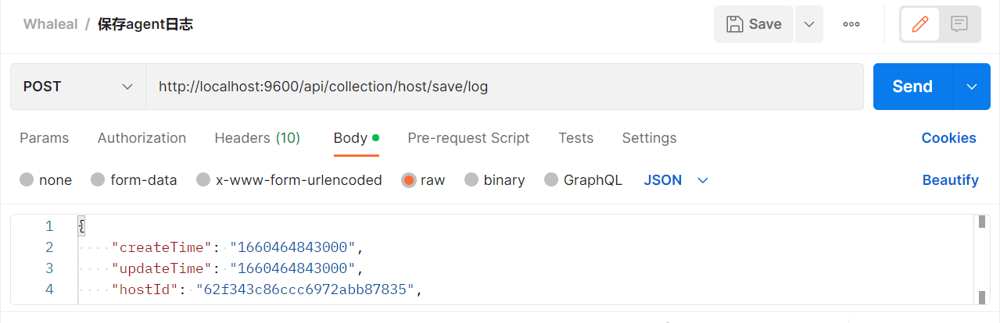
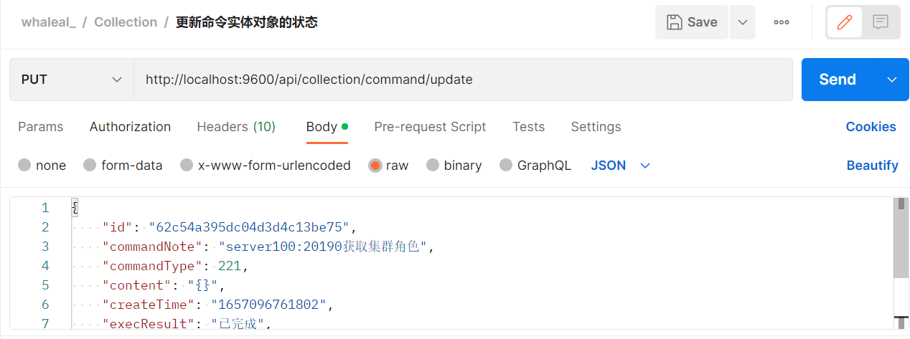
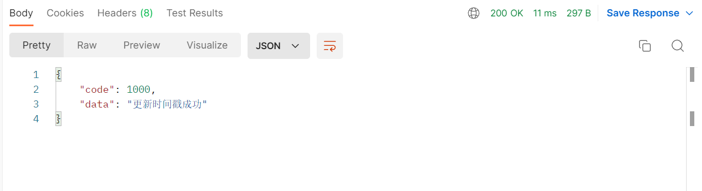
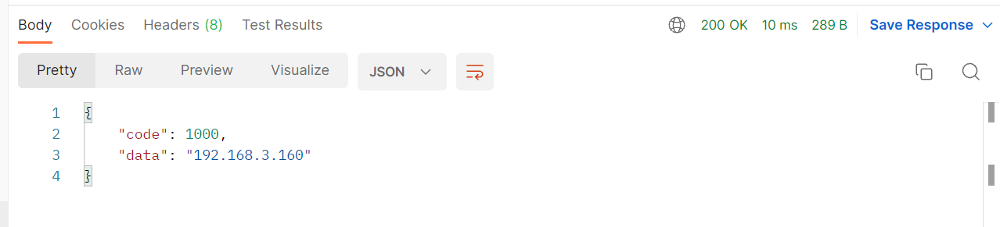

# Collection接口
此接口调用时须在请求头中设置OPS-Token ，填写参数发起请求，返回内容为 JSON 格式的信息。

### 请求头默认格式，特殊情况特殊声明

| KEY                |     VALUE      |     
| -------------------|----------------------|
| Accept-Encoding        |         gzip, deflate, br |     
| Connection          |         keep-alive           |          
| Content-Type          |         application/json |    
| agentId          |         "agentId"           |     
---

####  1 保存agent端的日志记录.

1.1 请求路径：

POST http://192.168.3.200:9600/api/collection/agent/save/log

---

1.2 请求参数：

| Name                |     Located in     |           Description         |     Required    |        Schema   |
| -------------------|----------------------|-------------------------------|-----------------|-----------   |
|      agentLogEntity      |    body       |  日志信息实体对象       |       yes         |AgentLogEntity

----

1.3 返回结果

|               |     Description    |           Schema              |  
| --------------|----------------------|---------------------------
| code        |   状态符:1000成功,其余异常 |                       |    
| msg       |         返回消息         |                         | 

---
---

####  2 更新agent的mongo文件信息.

2.1 请求路径：

POST http://192.168.3.200:9600/api/collection/agent/updateAgentMongoFile/{{agentId}}

---

2.2 请求参数：

| Name                |     Located in     |           Description         |     Required    |        Schema   |
| -------------------|----------------------|-------------------------------|-----------------|-----------   |
|       agentId     |      path               |           agentId              |   string             |
|       mongoFileList     |      body               |           命令实体类              |   List<MongoFile>             |

----

2.3 返回结果

|               |     Description    |           Schema              |  
| --------------|----------------------|---------------------------
| code        |   状态符:1000成功,其余异常 |                       |    
| msg       |         返回消息         |                         | 

---
---

####  3 根据agentId查询该agent待执行的命令.

3.1 请求路径：

GET http://192.168.3.200:9600/api/collection/command/agent/get/{{hostId}}

---

3.2 请求参数：

| Name                |     Located in     |           Description         |     Required    |        Schema   |
| -------------------|----------------------|-------------------------------|-----------------|-----------   |
|      hostId      |       path              |              主机id           |      yes          |  string

----

3.3 返回结果

|               |     Description    |           Schema              |  
| --------------|----------------------|---------------------------
| code        |   状态符:1000成功,其余异常 |                       |    
| data       |         返回数据         |                         | 

---
---

#### 4 更新命令实体对象的状态.

4.1 请求路径：

PUT http://192.168.3.200:9600/api/collection/command/agent/update

---

4.2 请求参数：

| Name                |     Located in     |           Description         |     Required    |        Schema   |
| -------------------|----------------------|-------------------------------|-----------------|-----------   |
|     commandEntity       |        body             |         命令实体类  |    yes            |   commandEntity

----

4.3 返回结果

|               |     Description    |           Schema              |  
| --------------|----------------------|---------------------------
| code        |   状态符:1000成功,其余异常 |                       |    
| data       |         返回消息         |                         | 

---
---

####  5 更新时间戳

5.1 请求路径：

GET http://192.168.3.200:9600/api/collection/hostInfo/updateRunTime/{{hostId}}/{{timeStamp}}

---

5.2 请求参数：

| Name                |     Located in     |           Description         |     Required    |        Schema   |
| -------------------|----------------------|-------------------------------|-----------------|-----------   |
|      hostId      |         path            |        主机id                 |       yes          | string
|      timeStamp      |         path            |        时间戳                 |       yes          | string

----

5.3 返回结果

|               |     Description    |           Schema              |  
| --------------|----------------------|---------------------------
| code        |   状态符:1000成功,其余异常 |                       |    
| data       |         返回消息        |                         | 

---
---

####  6 保存主机信息

6.1 请求路径：

POST http://192.168.3.200:9600/api/collection/hostInfo

---

6.2 请求参数：

| Name                |     Located in     |           Description         |     Required    |        Schema   |
| -------------------|----------------------|-------------------------------|-----------------|-----------   |
|      hostInfoMongoEntity      |         body            |        主机信息实体类                 |       yes          | hostInfoMongoEntity

----

6.3 返回结果

|               |     Description    |           Schema              |  
| --------------|----------------------|---------------------------
| code        |   状态符:1000成功,其余异常 |                       |    
| data       |         返回消息        |                         | 

---
---

####  7 保存主机实时信息

7.1 请求路径：

POST http://192.168.3.200:9600/api/collection/hostRealTime/addHostRealTimeData

---

7.2 请求参数：

| Name                |     Located in     |           Description         |     Required    |        Schema   |
| -------------------|----------------------|-------------------------------|-----------------|-----------   |
|      HostRealTimeDataMongoEntity      |         body            |        主机实时信息实体类                 |       yes          | HostRealTimeDataMongoEntity

----

7.3 返回结果

|               |     Description    |           Schema              |  
| --------------|----------------------|---------------------------
| code        |   状态符:1000成功,其余异常 |                       |    
| data       |         返回消息        |                         | 

---
---

####  8 agent调用此接口来获取server端的时间

8.1 请求路径：

GET http://192.168.3.200:9600/api/collection/util/get/server/date

---

8.2 请求参数：

| Name                |     Located in     |           Description         |     Required    |        Schema   |
| -------------------|----------------------|-------------------------------|-----------------|-----------   |
|             |                      |                          |                  |  

----

8.3 返回结果

|               |     Description    |           Schema              |  
| --------------|----------------------|---------------------------
| code        |   状态符:1000成功,其余异常 |                       |    
| data       |         时间戳        |                         | 

---
---

####  9 agent通过调用此接口来获取请求agent的ip

9.1 请求路径：

GET http://192.168.3.200:9600/api/collection/util/get/agent/ip

---

9.2 请求参数：

| Name                |     Located in     |           Description         |     Required    |        Schema   |
| -------------------|----------------------|-------------------------------|-----------------|-----------   |
|             |                      |                          |                  |   

----

9.3 返回结果

|               |     Description    |           Schema              |  
| --------------|----------------------|---------------------------
| code        |   状态符:1000成功,其余异常 |                       |    
| data       |         返回ip        |                         | 

---
---

## AgentLogEntity

|       Name         |     Type             |    Description      |   
| ------------       |----------            |---------------------|
| hostId                 |   string             |         主机id          |   
| type             |   string             |         日志类型     |   
| content              |   string |         内容     |   

---
---

## MongoFile

|       Name         |     Type             |    Description      |   
| ------------       |----------            |---------------------|
| shortName                 |   string             |         姓          |   
| Name             |   string             |         名     |   
| Size              |   Long |         大小     |   
| Md5               |   string             |         文件校验     |   
| version         |   string             |         版本     |   
| path           |   string             |         路径     |   
| hostId             |   string             |         主机id     |   

---
---

## commandEntity

|       Name         |     Type             |    Description      |   
| ------------       |----------            |---------------------|
| hostId                 |   string             |         主机id          |   
| commandType             |   string             |         命令类型     |   
| status              |   Integer |    当前状态:1 下发,2 正在执行,3 正常已完成,4 异常完成,5 异常完成但是不影响后续执行     |   
| eventId               |   string             |         所属事件组     |   
| commandNote         |   string             |         具体命令操作注释     |   
| content           |   string             |         命令内容     |   
| execResult             |   string             |         执行结果     |   

---
---

___

## ipInfo

|       Name        |     Type    |           Description       |   
| --------------|----------------------|--------------------|
| id        |   string |         Id              |   
| Type        |   string |         主机名称              |   

---  

## HostInfoMongoEntity

|       Name         |     Type             |    Description      |   
| ------------       |----------            |---------------------|
| id                 |   string             |         Id          |   
| ipInfo             |   List<ipInfo>             |         Ip信息     |   
| systemPropertyInfo |   systemPropertyInfo |         系统参数信息     |   
| createTime         |   时间戳             |         创建时间     |   
| updateTime         |   时间戳             |         更新时间     |   
| hostName           |   string             |         主机名称     |   
| hostId             |   string             |         主机id     |   
| hostNameLong       |   string             |         主机长名称     |   
| Memory             |   int             |         内存     |   
| osVersion          |   string             |         系统版本     |   
| cpuNum             |   int             |         Cpu数     |   
| swap               |   int             |         交换内存     |   
| kernelInfo         |   string             |         内核信息     |   
| totalDiskSize      |   Int             |         总磁盘大小     |   
| run                |   Boolean             |         是否正在运行     |   

---
---

## HostRealTimeDataMongoEntity

|       Name         |     Type             |    Description      |   
| ------------       |----------            |---------------------|
| hostId                 |   string             |         主机id          |   
| hostName             |   string             |         主机名称     |   
| timeGranularity              |   int |         颗粒度值     |   
| cpuInfo               |   CpuInfo             |         cpu使用信息     |   
| memoryInfo         |   MemoryInfo             |         内存使用信息     |   
| diskInfoList           |   List<DiskInfo>             |         磁盘使用信息     |   
| diskInAndOutInfoList             |   List<DiskInAndOutInfo>             |         磁盘io信息     |   
| netInAndOutInfoList             |   List<NetInAndOutInfo>             |         网络带宽io信息     |   

---
---

## CpuInfo

|       Name         |     Type             |    Description      |   
| ------------       |----------            |---------------------|
| us                 |   double             |         用户空间占用CPU百分比          |   
| sy             |   double             |         内核空间占用CPU百分比     |   
| ni              |   double |         用户进程空间内改变过优先级的进程占用CPU百分比     |   
| id               |   double             |         空闲CPU百分比     |   
| wa         |   double             |         等待输入输出的CPU时间百分比     |   
| hi           |   double            |         硬中断占用CPU的百分比     |   
| si             |   double             |         软中断占用CPU的百分比     |   
| st             |   double            |         虚拟CPU等待实际CPU的时间的百分比     |   

---
---

## DiskInAndOutInfo

|       Name         |     Type             |    Description      |   
| ------------       |----------            |---------------------|
| memTotal                 |   long             |         物理内存总量          |   
| memFree             |   long             |         空闲内存总量     |   
| memUsed              |   long |         使用的物理内存总量     |   
| memBuffCache               |   long             |         用作内核缓存的内存量     |   
| memAvail         |   long             |         代表可用于进程下一次分配的物理内存数量     |   
| swapTotal           |   long           |         交换区总量     |   
| swapFree             |  long            |         空闲交换区总量     |   
| swapUsed             |   long       |         使用的交换区总量     |   

---
---

## NetInAndOutInfo

|       Name         |     Type             |    Description      |   
| ------------       |----------            |---------------------|
| networkCardName                 |   string             |         网卡名          |   
| io             |   double             |         流入流量     |   
| out              |   double |         流出流量     |   

---
---

## HostRealTimeDataMongoEntity

|       Name         |     Type             |    Description      |   
| ------------       |----------            |---------------------|
| hostId                 |   string             |         主机id          |   
| hostName             |   string             |         主机名称     |   
| timeGranularity              |   int |         颗粒度值     |   
| cpuInfo               |   CpuInfo             |         cpu使用信息     |   
| memoryInfo         |   MemoryInfo             |         内存使用信息     |   
| diskInfoList           |   List<DiskInfo>             |         磁盘使用信息     |   
| diskInAndOutInfoList             |   List<DiskInAndOutInfo>             |         磁盘io信息     |   
| netInAndOutInfoList             |   List<NetInAndOutInfo>             |         网络带宽io信息     |   

---
---

## DiskInfo

|       Name         |     Type             |    Description      |   
| ------------       |----------            |---------------------|
| fileSystem                 |   string             |         分区名          |   
| type             |   string             |         分区类型     |   
| size              |   long |         总大小     |   
| used               |   long             |         使用大小     |   
| utilization         |   double             |         使用率     |   
| mountedOn           |   string            |         挂载位置     |   

---
---