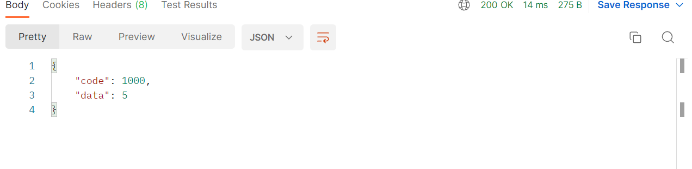

# Agent接口 

接口调用时须在请求头中设置whaleal-Token,返回内容为 JSON 格式的信息.
其参数为时间类型都以时间戳形式传递。

接口调用时需若用到hostId、agentId、eventId通过以下方式获取。

~~~
hostId 在“根据主机名模糊查询主机基本信息”接口处获取。

agentId 在"生成agentId"接口处获取。

eventId 在"获取集群日志信息"接口处找到所需事件的id
~~~

 **请求头默认格式,特殊情况特殊声明**

    whaleal-Token在调用"登录"接口时返回，在之后调用接口时将token放置请求头中。
[登录接口调用获取whaleal-Token](Member.md)

| KEY                |     VALUE      |     
| -------------------|----------------------|
| Accept-Encoding        |         gzip,deflate,br |     
| Connection          |         keep-alive           |          
| Content-Type          |         application/json |    
| whaleal-token          |         "token"           |     
---

 

### 1  根据主机名模糊查询主机基本信息（主机名和主机ID）

1.1 请求路径

GET: http://{Server-Host}:{端口}/api/server/agent/getAllAgentHostNameAndHostId

---
1.2 请求参数

| Name                |     Located in     |           Description         |     Required    |        Schema   |
| -------------------|----------------------|-------------------------------|-----------------|-----------   |
| hostName          |         Params           |            主机名称            |        No       |String        |

 

----

1.3 返回结果

|               |     Description    |           Schema              |  
| --------------|----------------------|---------------------------
| code        |   状态符:1000成功,其余异常 |         int              |    
| id       |         主机id         |          String|        
| name      |         主机名称         |          String|    

 

[comment]: <> (![img_1.png]&#40;../Images/getAllAgentHostNameAndHostId_r.png&#41;)

~~~
{
    "code": 1000,
    "data": [
        {
            "id": "62b153a344ba1b7771c42df7",
            "name": "server100"
        },
        {
            "id": "62bbfbe9a46517610435d615",
            "name": "chen"
        },
        {
            "id": "62cbbd7607bebb71b8429e5e",
            "name": "server200"
        },
        {
            "id": "62d626969026c712d786e707",
            "name": "usdp"
        }
    ]
}

~~~

---

 

### 2 获取Agent的统计信息

2.1 请求路径

GET: http://{Server-Host}:{端口}/api/server/agent/getAgentStatistics

---
2.2 请求

---

2.3 返回结果

|               |     Description    |           Schema              |  
| -------------------|----------------------|---------------------------
| code        |   状态符:1000成功,其余异常 |            long           |    
| activeAgentNum    |         Agent存活数         |            long            |    
| activeAgentCpuNum     |         Agent CPU存活数         |            long            |    
| activeAgentDiskNum     |         Agent 磁盘存活数         |            long            |    
| deadAgentMemoryNum     |         Agent 内存死亡数         |            long            |    
| deadAgentCpuNum     |         Agent CPU死亡数         |            long            |    
| activeAgentMemoryNum    |         Agent 内存存活数         |            long            |    
| deadAgentNum     |         Agent 死亡数         |            long            |    
| deadAgentDiskNum    |         Agent 磁盘死亡数         |            long            |    

 

[comment]: <> (![img_3.png]&#40;../Images/getAgentStatistics_r.png&#41;)

~~~
{
    "code": 1000,
    "data": {
        "activeAgentNum": 4,
        "activeAgentCpuNum": 88,
        "activeAgentDiskNum": 23647738,
        "deadAgentMemoryNum": 0,
        "deadAgentCpuNum": 0,
        "activeAgentMemoryNum": 273086,
        "deadAgentNum": 0,
        "deadAgentDiskNum": 0
    }
}

~~~

---
 

### 3 获取所有主机信息

3.1 请求路径

GET: http://{Server-Host}:{端口}/api/server/agent/getAllAgentData/{{pageIndex}}/{{pageSize}}

---

3.2 请求参数

    status:true 正常,false 宕机

| Name                |     Located in     |           Description         |     Required    |        Schema   |
| -------------------|----------------------|-------------------------------|-----------------|-----------   |
| pageIndex          |         Path           |            第几页           |        Yes       |int       |
| pageSize          |         Path         |            每页大小            |        Yes      |int        |
| hostName          |         Params           |            主机名称            |        No       |String        |
| ip          |         Params           |            主机ip            |        No       |String        |
| status          |         Params           |            主机状态            |        No       |boolean        |

 

----

3.3 返回结果

|               |     Description    |           Schema              |  
| --------------|----------------------|---------------------------
| code        |   状态符:1000成功,其余异常 |         int|    
| data       |         返回数据         |            List           |        

 

[comment]: <> (![img_5.png]&#40;../Images/getAllAgentData_r.png&#41;)
 

~~~
{
    "code": 1000,
    "data": [
        {
            "id": "62b153a344ba1b7771c42df7",                               
            "createTime": 1658212423773,
            "updateTime": 1658459349919,
            "hostId": "62b153a344ba1b7771c42df7",
            "hostName": "server100",
            "hostNameLong": "server100",
            //主机基本信息
            "ipInfo": [
                {
                    "ip": "192.168.3.100",
                    "type": "ipv4"
                }
            ],
            "memory": 128722,
            "osVersion": "CentOS Linux release 7.9.2009 (Core)",
            "cpuInfo": " Intel(R) Xeon(R) CPU E5-2670 v2 @ 2.50GHz",
            "cpuNum": 40,
            "swap": 4095,
            //内核信息
            "kernelInfo": "3.10.0-1160.24.1.el7.x86_64",
            "totalDiskSize": 7893956,
            "run": true,
            
            //系统属性信息
            "systemPropertyInfo": {
                "javaVersion": "11.0.9",
                "javaVendor": "Oracle Corporation",
                "javaVendorUrl": null,
                "javaHome": "/root/jdk-11.0.9",
                "javaVmSpecificationVersion": "11",
                "javaVmSpecificationVendor": null,
                "javaVmSpecificationName": "Java Virtual Machine Specification",
                "javaVmVersion": "11.0.9+7-LTS",
                "javaVmVendor": "Oracle Corporation",
                "javaVmName": "Java HotSpot(TM) 64-Bit Server VM",
                "javaSpecificationVersion": null,
                "javaSpecificationVendor": "Oracle Corporation",
                "javaSpecificationName": "Java Platform API Specification",
                "javaClassVersion": "55.0",
                "javaClassPath": "agent-collection-1.0.0.jar",
                "javaLibraryPath": "/usr/java/packages/lib:/usr/lib64:/lib64:/lib:/usr/lib",
                "javaIoTmpdir": "/tmp",
                "javaCompiler": null,
                "javaExtDirs": null,
                "fileSeparator": "/",
                "pathSeparator": ":",
                "lineSeparator": "\n",
                "userName": "root",
                "userHome": "/root",
                "userDir": "/home/jmops",
                "osname": "Linux",
                "osarch": "amd64",
                "osversion": "3.10.0-1160.24.1.el7.x86_64"
            }
        }
    ]
}
~~~
---

 

### 4  获取所有主机count

4.1 请求路径

GET: http://{Server-Host}:{端口}/api/server/agent/getAllAgentCount

---

4.2 请求参数

    status:true 正常,false 宕机

| Name                |     Located in     |           Description         |     Required    |        Schema   |
| -------------------|----------------------|-------------------------------|-----------------|-----------   |
| hostName          |         Params           |            主机名称            |        No       |String        |
| ip          |         Params           |            主机ip            |        No       |String        |
| status          |         Params           |  主机状态           |        No       |boolean        |

 

----

4.3 返回结果

|               |     Description    |           Schema              |  
| --------------|----------------------|---------------------------
| code        |   状态符:1000成功,其余异常 |        int|    
| data       |         返回数量         |         long              |        

 

[comment]: <> (![img_6.png]&#40;../Images/getAllAgentCount_r.png&#41;)

~~~
{
    "code": 1000,
    "data": 1
}
~~~
---

 

### 5  获取某主机静态信息

5.1 请求路径

GET: http://{Server-Host}:{端口}/api/server/agent/getAgentInfo/{{hostId}}

---
5.2 请求参数

| Name                |     Located in     |           Description         |     Required    |        Schema   |
| -------------------|----------------------|-------------------------------|-----------------|-----------   |
| hostId         |         Path           |            主机id           |        Yes       |String        |

 

----

5.3 返回结果

|               |     Description    |           Schema              |  
| --------------|----------------------|---------------------------
| code        |   状态符:1000成功,其余异常 |          int               |    
| data       |         返回数据         |            JSON            | 

 

[comment]: <> (![img_9.png]&#40;../Images/getAgentInfo_r.png&#41;)

~~~
{
    "code": 1000,
    "data": {
        "id": "62bbfbe9a46517610435d615",
        "createTime": 1658286068557,
        "updateTime": 1658459546253,
        "hostId": "62bbfbe9a46517610435d615",
        "hostName": "chen",
        "hostNameLong": "chen",
        "ipInfo": [
            {
                "ip": "192.168.3.80",
                "type": "ipv4"
            }
        ],
        "memory": 7821,
        "osVersion": "CentOS Linux release 7.7.1908 (Core)",
        "cpuInfo": " Intel(R) Xeon(R) CPU L5640 @ 2.27GHz",
        "cpuNum": 4,
        "swap": 8063,
        "kernelInfo": "3.10.0-1062.el7.x86_64",
        "totalDiskSize": 213035,
        "run": true,
        "systemPropertyInfo": {
            "javaVersion": "1.8.0_172",
            "javaVendor": "Oracle Corporation",
            "javaVendorUrl": null,
            "javaHome": "/home/docker20220629BAK/java/jre",
            "javaVmSpecificationVersion": "1.8",
            "javaVmSpecificationVendor": null,
            "javaVmSpecificationName": "Java Virtual Machine Specification",
            "javaVmVersion": "25.172-b11",
            "javaVmVendor": "Oracle Corporation",
            "javaVmName": "Java HotSpot(TM) 64-Bit Server VM",
            "javaSpecificationVersion": null,
            "javaSpecificationVendor": "Oracle Corporation",
            "javaSpecificationName": "Java Platform API Specification",
            "javaClassVersion": "52.0",
            "javaClassPath": "agent-collection-1.0.0.jar",
            "javaLibraryPath": "/usr/java/packages/lib/amd64:/usr/lib64:/lib64:/lib:/usr/lib",
            "javaIoTmpdir": "/tmp",
            "javaCompiler": null,
            "javaExtDirs": "/home/docker20220629BAK/java/jre/lib/ext:/usr/java/packages/lib/ext",
            "fileSeparator": "/",
            "pathSeparator": ":",
            "lineSeparator": "\n",
            "userName": "root",
            "userHome": "/root",
            "userDir": "/root",
            "osname": "Linux",
            "osarch": "amd64",
            "osversion": "3.10.0-1062.el7.x86_64"
        }
    }
}

~~~

---

 

### 6  获取agent的监控信息

6.1 请求路径

GET: http://{Server-Host}:{端口}/api/server/agent/getAgentMonitor/{{hostId}}/{{timeType}}

---

6.2 请求参数
    
    timeType:REAL_TIME,ONE_DAY,ONE_WEEK
    dataType:netInAndOut,memory,diskInAndOut,cpu

| Name                |     Located in     |           Description         |     Required    |        Schema   |
| -------------------|----------------------|-------------------------------|-----------------|-----------   |
| hostId         |         Path           |            主机id            |        Yes       |String        |
| timeType         |         Path           |            监控类型            |        Yes       |String        |
| startTimeForTimeInterval         |         Params           |      某时间段的开始时间            |        Yes       |long        |
| endTimeForTimeInterval         |         Params           |            某时间段的结束时间    |        Yes       |long        |
| timeGranularity         |         Params           |            时间粒度            |        Yes       |long        |
| dataType         |         Params           |            数据类型            |        Yes       |String        |

 

----

6.3 返回结果

|               |     Description    |           Schema              |  
| --------------|----------------------|---------------------------
| code        |   状态符:1000成功,其余异常 |           int           |    
| data       |         返回数据         |        JSON           | 

 

[comment]: <> (![img_11.png]&#40;../Images/getAgentMonitor_r.png&#41;)

~~~
{
    "code": 1000,
    "data": {
        "us": [
            2.51,
            2.29,
            2.72,
        ],
        "sy": [
            0.89,
            0.84,
            1.89,
        ],
        "id": [
            96.57,
            96.83,
            94.97,
        ]
    },
    "createTime": [
        1659512400000,
        1659512460000,
        1659512520000
    ],
    "name": "cpu",
    "message": {
        "id": "cpu空闲率 单位百分比%",
        "us": "cpu用户使用率 单位百分比%",
        "sy": "cpu系统使用率 单位百分比%"
    },
    "info": {
        "id": {
            "max": "96.83",
            "min": "86.81",
            "avg": "94.29"
        },
        "us": {
            "max": "9.58",
            "min": "1.72",
            "avg": "3.00"
        },
        "sy": {
            "max": "3.25",
            "min": "0.84",
            "avg": "2.08"
        }
    }
}

~~~

---

 

### 7 获取agent的日志信息，结果分页展示

7.1 请求路径

GET: http://{Server-Host}:{端口}/api/server/agent/logData/{{hostId}}/{{pageIndex}}/{{pageSize}}

---

7.2 请求参数

    type类型:info,warn,trace,error,mongodb

| Name                |     Located in     |           Description         |     Required    |        Schema   |
| -------------------|----------------------|-------------------------------|-----------------|-----------   |
| hostId         |         Path           |            主机id           |        Yes       |String        |
| pageIndex          |         Path           |            第几页            |        Yes       |int        |
| pageSize          |         Path           |            每页大小            |        Yes       |int        |
| type          |         Params           |            日志类别            |        No       |String        |
| startTime          |         Params           |            开始时间            |        No       |long        |
| endTime          |         Params           |            结束时间            |        No       |long        |
| content          |         Params           |            内容            |        No       |String        |

 

----

7.3 返回结果

|               |     Description    |           Schema              |  
| --------------|----------------------|---------------------------
| code        |   状态符:1000成功,其余异常 |       int       |    
| data       |         返回数据         |     List         |       

 

[comment]: <> (![img_10.png]&#40;../Images/logData_r.png&#41;)

~~~
{
    "code": 1000,
    "data": [
        {
            "id": "62c418a8e945184b27fae4c6",
            "createTime": 1657018536725,
            "updateTime": 0,
            "hostId": "62b153a344ba1b7771c42df7",
            "type": "info",
            "content": " [MongodbRealTimeData.run-94] server100:20190开启监控"
        }
    ]
}
~~~

---

 

### 8 获取agent的日志信息数量

8.1 请求路径

GET: http://{Server-Host}:{端口}/api/server/agent/logCount/{{hostId}}

---

8.2 请求参数

    type类型:info,warn,trace,error,mongodb

| Name                |     Located in     |           Description         |     Required    |        Schema   |
| -------------------|----------------------|-------------------------------|-----------------|-----------   |
| hostId          |         Path           |            主机id           |        Yes       |String        |
| type          |         Params           |            日志类别            |        No       |String        |
| startTime          |         Params           |            开始时间            |        No       |long        |
| endTime          |         Params           |            结束时间            |        No       |long        |
| content          |         Params           |            关键字            |        No       |String        |

 

----

8.3 返回结果

|               |     Description    |           Schema              |  
| --------------|----------------------|---------------------------
| code        |   状态符:1000成功,其余异常 |        int               |    
| data       |         返回数量        |          long              |       

 

[comment]: <> (~~~)

[comment]: <> ({)

[comment]: <> (    "code": 1000,)

[comment]: <> (    "data": 2542)

[comment]: <> (})

[comment]: <> (~~~)

---

 

### 9 操作agent的命令

9.1 请求路径

GET: http://{Server-Host}:{端口}/api/server/agent/operate/{{hostId}}/{{operateType}}

---

9.2 请求参数

    operateType:delete,updateAgentInfo

| Name                |     Located in     |           Description         |     Required    |        Schema   |
| -------------------|----------------------|-------------------------------|-----------------|-----------   |
| hostId          |         Path           |            主机id            |        Yes       |String        |
| operateType          |         Path           |   操作类别      |        Yes       |String        |

 

----

9.3 返回结果

|               |     Description    |           Schema              |  
| --------------|----------------------|---------------------------
| code        |   状态符:1000成功,其余异常 |           int            |    
| msg       |         返回消息         |            String            |       

 

---

 

### 10 生成agentId

10.1 请求路径

GET: http://{Server-Host}:{端口}/api/server/agent/generateAgentId

---

10.2 请求

----

10.3 返回结果

|               |     Description    |           Schema              |  
| --------------|----------------------|---------------------------
| code        |   状态符:1000成功,其余异常 |         int              |    
| data       |         返回数据:agentId         |       String                 |        

 

[comment]: <> (~~~)

[comment]: <> ({)

[comment]: <> (    "code": 1000,)

[comment]: <> (    "data": "62da1860239d00094230b40c")

[comment]: <> (})

[comment]: <> (~~~)

---

 

### 11 下载agentFile

11.1 请求路径

GET: http://{Server-Host}:{端口}/api/server/agent/downAgentFile/{{agentId}}/agent-collection-1.0.0.jar

---

11.2 请求参数

 

| Name                |     Located in     |           Description         |     Required    |        Schema   |
| -------------------|----------------------|-------------------------------|-----------------|-----------   |
| agentId          |         Path           |            agentId            |        Yes       |String        |

 

----

11.3 返回结果

|               |     Description    |           Schema              |  
| --------------|----------------------|---------------------------
| File       |         二进制流形式返回文件         |       File                 |        

---

 

### 12 获取agent执行命令记录

12.1 请求路径

GET: http://{Server-Host}:{端口}/api/server/agent/getExecCommandDataList/{{hostId}}/{{pageIndex}}/{{pageSize}}

---

12.2 请求参数

    Status类型:-1为全部,1为已下发,2正在执行,3成功完成,4异常执行,5异常完成

| Name                |     Located in     |           Description         |     Required    |        Schema   |
| -------------------|----------------------|-------------------------------|-----------------|-----------   |
| hostId          |         Path           |            主机名称            |        Yes       |String        |
| pageIndex          |         Path           |            第几页            |        Yes       |int        |
| pageSize          |         Path           |            每页大小            |        Yes       |int        |
| status          |         Params           |            状态            |        No       |Int        |
| startTime          |         Params           |            开始时间            |        No       |long        |
| endTime          |         Params           |            结束时间            |        No       |long        |
| content          |         Params           |            内容            |        No       |String        |
| result          |         Params           |            结果            |        No       |String        |
| eventId          |         Params           |            事件id            |        No       |String        |

 

----

12.3 返回结果

|               |     Description    |           Schema              |  
| --------------|----------------------|---------------------------
| code        |   状态符:1000成功,其余异常 |        int               |    
| data       |         返回数据         |             List            |        

 

[comment]: <> (![img_19.png]&#40;../Images/getExecCommandDataList_r.png&#41;)

~~~
{
    "code": 1000,
    "data": [
        {
            "id": "62c51e6ad6ea982573f41e4d",
            "createTime": 1657085546634,
            "updateTime": 1657085549086,
            "hostId": "62b153a344ba1b7771c42df7",
            "commandType": 221,
            "status": 3,
            "eventId": "62c51e6ad6ea982573f41e4c",
            "commandNote": "server100:20190获取集群角色",
            "content": "{}",
            "execResult": "已完成"
        }
    ]
}
~~~

---

 

### 13 获取agent执行命令记录数

13.1 请求路径

GET: http://{Server-Host}:{端口}/api/server/agent/getExecCommandDataCount/{{hostId}}

---

13.2 请求参数

    Status类型:-1为全部,1为已下发,2正在执行,3成功完成,4异常执行,5异常完成

| Name                |     Located in     |           Description         |     Required    |        Schema   |
| -------------------|----------------------|-------------------------------|-----------------|-----------   |
| hostId          |         Path           |            主机名称            |        Yes       |String        |
| Status          |         Params           |            状态            |        No       |int|
| startTime          |         Params           |            开始时间            |        No       |long        |
| endTime          |         Params           |            结束时间            |        No       |long        |
| content          |         Params           |            命令类型            |        No       |String        |
| result          |         Params           |            结果            |        No       |String        |
| eventId          |         Params           |            事件id            |        No       |String        |

 

----

13.3 返回结果

|               |     Description    |           Schema              |  
| --------------|----------------------|---------------------------
| code        |   状态符:1000成功,其余异常 |            int           |    
| data       |         返回数量         |            long            |        

 

[comment]: <> (~~~)

[comment]: <> ({)

[comment]: <> (    "code": 1000,)

[comment]: <> (    "data": 5)

[comment]: <> (})

[comment]: <> (~~~)

---

 

###  14 获取主机cpu使用率

14.1 请求路径

GET: http://{Server-Host}:{端口}/api/server/agent/getHost/CpuUsage/{{count}}

---

14.2 请求参数

| Name                |     Located in     |           Description         |     Required    |        Schema   |
| -------------------|----------------------|-------------------------------|-----------------|-----------   |
| count          |         Path           |            获取个数           |        Yes       |int        |
| beginTime          |         Params           |            开始时间            |        Yes       |long        |
| endTime          |         Params           |            结束时间            |        Yes       |long        |

 

----

14.3 返回结果

|               |     Description    |           Schema              |  
| --------------|----------------------|---------------------------
| code        |   状态符:1000成功,其余异常 |           int            |    
| data       |         返回数据         |         List               |        

 

[comment]: <> (![img_26.png]&#40;../Images/CpuUsage_r.png&#41;)

~~~

{
    "code": 1000,
    "data": [
        {
            "_id": "630ddf510901ea6464159609",
            "hostId": "630ddf510901ea6464159609",
            "hostName": "server190",
            "usage": 100.0
        },
        {
            "_id": "6305fa4491c2f64abf18c581",
            "hostId": "6305fa4491c2f64abf18c581",
            "hostName": "server100",
            "usage": 100.0
        },
        {
            "_id": "631837b0e8f4ff5c079e9c55",
            "hostId": "631837b0e8f4ff5c079e9c55",
            "hostName": "server14",
            "usage": 100.0
        },
        {
            "_id": "6316dbf322197b14b79a4793",
            "hostId": "6316dbf322197b14b79a4793",
            "hostName": "server84",
            "usage": 100.0
        },
        {
            "_id": "630eddeff3d9e72e3695ea48",
            "hostId": "630eddeff3d9e72e3695ea48",
            "hostName": "chen",
            "usage": 100.0
        }
    ]
}
~~~

---

 

###  15.获取主机内存使用率

15.1 请求路径

GET: http://{Server-Host}:{端口}/api/server/agent/getHost/MemUsage/{{count}}

---

15.2 请求参数

| Name                |     Located in     |           Description         |     Required    |        Schema   |
| -------------------|----------------------|-------------------------------|-----------------|-----------   |
| count          |         Path           |            获取个数           |        Yes       |int        |
| beginTime          |         Params           |            开始时间            |        Yes       |long        |
| endTime          |         Params           |            结束时间            |        Yes       |long        |

 

----

15.3 返回结果

|               |     Description    |           Schema              |  
| --------------|----------------------|---------------------------
| code        |   状态符:1000成功,其余异常 |       int                |    
| data      |         返回数据         |         List               |        

 

[comment]: <> (![img_25.png]&#40;../Images/MemUsage_r.png&#41;)

~~~

{
    "code": 1000,
    "data": [
        {
            "_id": "63031ffab652427a5bb8a667",
            "hostId": "63031ffab652427a5bb8a667",
            "usage": "58.68GB",
            "hostName": "server200"
        },
        {
            "_id": "6305fa4491c2f64abf18c581",
            "hostId": "6305fa4491c2f64abf18c581",
            "usage": "44.73GB",
            "hostName": "server100"
        },
        {
            "_id": "630eddeff3d9e72e3695ea48",
            "hostId": "630eddeff3d9e72e3695ea48",
            "usage": "32.17GB",
            "hostName": "chen"
        }
    ]
}
~~~

---

 

### 16 获取主机磁盘使用率

16.1 请求路径

GET: http://{Server-Host}:{端口}/api/server/agent/getHost/DiskUsage/{{count}}

---

16.2 请求参数

| Name                |     Located in     |           Description         |     Required    |        Schema   |
| -------------------|----------------------|-------------------------------|-----------------|-----------   |
| count          |         Path           |            获取个数           |        Yes       |int        |
| beginTime          |         Params           |            开始时间            |        Yes       |long        |
| endTime          |         Params           |            结束时间            |        Yes       |long        |

 

----

16.3 返回结果

|               |     Description    |           Schema              |  
| --------------|----------------------|---------------------------
| code        |   状态符:1000成功,其余异常 |         int              |    
| data      |         返回数据         |         List               |        

 

[comment]: <> (![img_27.png]&#40;../Images/DiskUsage_r.png&#41;)

~~~
{
    "code": 1000,
    "data": [
        {
            "_id": "631837b0e8f4ff5c079e9c55",
            "hostId": "631837b0e8f4ff5c079e9c55",
            "hostName": "server14",
            "usage": 22.81
        },
        {
            "_id": "63031ffab652427a5bb8a667",
            "hostId": "63031ffab652427a5bb8a667",
            "hostName": "server200",
            "usage": 10.01
        },
        {
            "_id": "6305fa4491c2f64abf18c581",
            "hostId": "6305fa4491c2f64abf18c581",
            "hostName": "server100",
            "usage": 9.49
        }
    ]
}
~~~

---

 

###  17 获取网卡输入使用率

17.1 请求路径

GET: http://{Server-Host}:{端口}/api/server/agent/getHost/NetIn/{{count}}

---

17.2 请求参数

| Name                |     Located in     |           Description         |     Required    |        Schema   |
| -------------------|----------------------|-------------------------------|-----------------|-----------   |
| count          |         Path           |            获取个数           |        Yes       |int        |
| beginTime          |         Params           |            开始时间            |        Yes       |long        |
| endTime          |         Params           |            结束时间            |        Yes       |long        |

 

----

17.3 返回结果

|               |     Description    |           Schema              |  
| --------------|----------------------|---------------------------
| code        |   状态符:1000成功,其余异常 |         int              |    
| data     |         返回数据         |         List               |        

[comment]: <> (| data.\[index].hostName       |         主机名称         |         String               |        )

[comment]: <> (| data.\[index].usage       |         使用率         |         double               |  )

 

[comment]: <> (![img_29.png]&#40;../Images/NetIn_r.png&#41;)
~~~

{
    "code": 1000,
    "data": [
        {
            "_id": "63031ffab652427a5bb8a667",
            "usage": "121.42MB/s",
            "hostName": "server200"
        },
        {
            "_id": "630eddeff3d9e72e3695ea48",
            "usage": "81.28MB/s",
            "hostName": "chen"
        },
        {
            "_id": "6316dbf322197b14b79a4793",
            "usage": "78.8MB/s",
            "hostName": "server84"
        }
    ]
}
~~~

---

 

###  18 获取网卡输出使用率

18.1 请求路径

GET: http://{Server-Host}:{端口}/api/server/agent/getHost/NetOut/{{count}}

---

18.2 请求参数

| Name                |     Located in     |           Description         |     Required    |        Schema   |
| -------------------|----------------------|-------------------------------|-----------------|-----------   |
| count          |         Path           |            获取个数           |        Yes       |int        |
| beginTime          |         Params           |            开始时间            |        Yes       |long        |
| endTime          |        Params           |            结束时间            |        Yes       |long        |

 

----

18.3 返回结果

|               |     Description    |           Schema              |  
| --------------|----------------------|---------------------------
| code        |   状态符:1000成功,其余异常 |        int               |    
| data     |         返回数据         |         List               |        

 

[comment]: <> (![img_31.png]&#40;../Images/NetOut_r.png&#41;)

~~~
{
    "code": 1000,
    "data": [
        {
            "_id": "63031ffab652427a5bb8a667",
            "usage": "121.42MB/s",
            "hostName": "server200"
        },
        {
            "_id": "6322b50f0b810f7b5109403c",
            "usage": "6.39MB/s",
            "hostName": "server202"
        },
        {
            "_id": "630eddeff3d9e72e3695ea48",
            "usage": "2.61MB/s",
            "hostName": "chen"
        }
    ]
}
~~~

 

[comment]: <> (---)

[comment]: <> (---)

[comment]: <> (## Info)

[comment]: <> (|       Name        |     Type    |           Description       |   )

[comment]: <> (| --------------|----------------------|--------------------|)

[comment]: <> (| id        |   String |         Id              |   )

[comment]: <> (| name        |   String |         主机名称              |   )

[comment]: <> (___)

[comment]: <> (## ipInfo)

[comment]: <> (|       Name        |     Type    |           Description       |   )

[comment]: <> (| --------------|----------------------|--------------------|)

[comment]: <> (| id        |   String |         Id              |   )

[comment]: <> (| Type        |   String |         主机名称              |   )

[comment]: <> (---  )

[comment]: <> (## HostInfoMongoEntity)

[comment]: <> (|       Name         |     Type             |    Description      |   )

[comment]: <> (| ------------       |----------            |---------------------|)

[comment]: <> (| id                 |   String             |         Id          |   )

[comment]: <> (| ipInfo             |   List<ipInfo>             |         Ip信息     |   )

[comment]: <> (| systemPropertyInfo |   systemPropertyInfo |         系统参数信息     |   )

[comment]: <> (| createTime         |   时间戳             |         创建时间     |   )

[comment]: <> (| updateTime         |   时间戳             |         更新时间     |   )

[comment]: <> (| hostName           |   String             |         主机名称     |   )

[comment]: <> (| hostId             |   String             |         主机id     |   )

[comment]: <> (| hostNameLong       |   String             |         主机长名称     |   )

[comment]: <> (| Memory             |   int             |         内存     |   )

[comment]: <> (| osVersion          |   String             |         系统版本     |   )

[comment]: <> (| cpuNum             |   int             |         Cpu数     |   )

[comment]: <> (| swap               |   int             |         交换内存     |   )

[comment]: <> (| kernelInfo         |   String             |         内核信息     |   )

[comment]: <> (| totalDiskSize      |   Int             |         总磁盘大小     |   )

[comment]: <> (| run                |   boolean             |         是否正在运行     |   )

---
---
