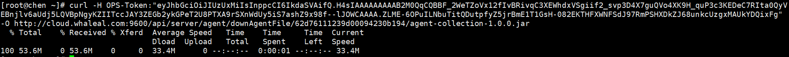
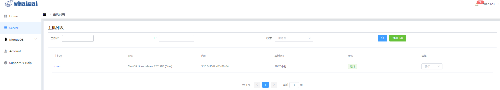
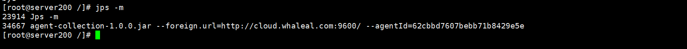

## Add Host


```
Add Host 分为以下两部分操作内容：
 - Prerequisites
 - Procedure
```

在whaleal平台添加主机，可以在平台上进行mongo集群的创建于纳管。


### Prerequisites

在添加主机前确保已安装JAVA环境，若没有请先[安装](../../01-Intstall/01-Installation.md)

若页面拒绝访问请确保已配置域名解析，若没有请配置。

确保主机已安装ioStat插件，若没有请安装。

<br>

##### Prerequisites 参考
1.安装java环境 

- 进入 Oracle 官方网站 下载合适的 JDK 版本。（以 jdk-8u151-linux-x64.tar.gz 为例，如果您下载的是其他版本，请注意文件后缀为 .tar.gz 即可。）


- 创建目录解压JDK
~~~
创建目录：
  mkdir /usr/java
  cd /usr/java
~~~   
~~~
解压JDK：
    tar -zxvf jdk-8u151-linux-x64.tar.gz
~~~  


- 编辑 /etc/profile 文件，在 profile 文件中添加如下内容并保存：

~~~
设置环境变量
    set java environment
    JAVA_HOME={jdk路径}       
    JRE_HOME={jre路径}     
    CLASS_PATH=.:$JAVA_HOME/lib/dt.jar:$JAVA_HOME/lib/tools.jar:$JRE_HOME/lib
    PATH=$PATH:$JAVA_HOME/bin:$JRE_HOME/bin
    export JAVA_HOME JRE_HOME CLASS_PATH PATH
~~~
~~~
使之修改生效
    source /etc/profile
~~~


<br>

2.配置域名解析 
~~~
Linux主机

域名：cloud.whaleal.com

域名对应IP：192.168.3.200

执行命令

  echo "192.168.3.200 cloud.whaleal.com" >> /etc/hosts
  
  
也可把cloud.whaleal.com直接替换为Server服务器IP地址
~~~

    
    
    


3.安装ioStat插件

    yum install sysstat


<br>

<br>


### Procedure


Step-1. 进入导航目录

a. 点击Server导航栏进入主机页面,右侧添加主机按钮点击后弹出提示页面。

    前三步为 Prerequisites 内容，第四步为生成的agentId(作为主机的唯一标识符)，之后的步骤复制命令在主机命令行进行执行。
    


<br>

Step-2. 主机下载Agent

b.预准备完成后在提示页面点击生成agent按钮，之后操作在主机命令行执行。

·复制下载AGENT_JAR命令并执行。

    curl -H OPS-Token:"eyJhbGciOiJIUzUxMiIsInppcCI6IkdaSVAifQ.H4sIAAAAAAAAAB2MQQrCMBBF7zLrKiba6aQrEbosip4gmc7QQpu0aEEQ727q373H43_guQao4Xp77NqmvTR3KEDeM9QGSzqVZJEK8Mxpja_ccS_R2GOOhi4j2iBouOIgqu6AnbekqLqdTH4Yc2KW87LnNGU19ynKpip05P6D7w8MgJynggAAAA.tzBGp7n5fUCSZ69QK8yeDX4HQqNoV89_7AxoRotHbBmz_U_SXqQp0l1GbComVZzGK8015CzKdi74QWIRsuoTDw" -O http://cloud.whaleal.com:9600/api/server/agent/downAgentFile/62d8e617239d00094230b3b2/agent-collection-1.0.0.jar


·复制启动AGENT命令并执行。

    nohup java -jar agent-collection-1.0.0.jar --foreign.url=http://cloud.whaleal.com:9600/ --agentId=62d8e617239d00094230b3b2 &


<br>


执行完毕后在Server主机列表页面将会显示添加的主机,命令行查询java进程可以找到agent进程。






