# Collection接口
接口调用时须在请求头中设置agentId,返回内容为 JSON 格式的信息.
其参数为时间类型都以时间戳形式传递。

有些接口调用时需用到hostId、agentId、clusterId、eventId
~~~
hostId 在“根据主机名模糊查询主机基本信息”接口处获取。

agentId 在"生成agentId"接口处获取。

eventId 在"获取集群日志信息"接口处找到所需事件的id

clusterId 在“查找mongoDB集群信息数据”接口返回结果集中。
~~~

### 请求头默认格式，特殊情况特殊声明

agentId在"生成agentId"接口处获取。

| KEY                |     VALUE      |     
| -------------------|----------------------|
| Accept-Encoding        |         gzip,deflate,br |     
| Connection          |         keep-alive           |          
| Content-Type          |         application/json |    
| agentId          |         "agentId"           |     
---

 

###  1 保存agent端的日志记录.

1.1 请求路径

POST: http://{Server-Host}:{端口}/api/collection/host/save/log

---

1.2 请求参数

| Name                |     Located in     |           Description         |     Required    |        Schema   |
| -------------------|----------------------|-------------------------------|-----------------|-----------   |
|      agentLogEntity      |    Body       |  日志信息实体对象       |       Yes         |AgentLogEntity

 

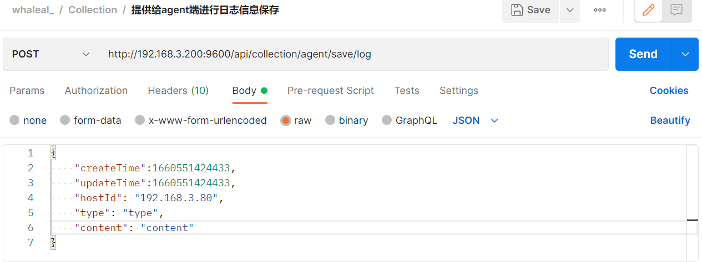

----

1.3 返回结果

|               |     Description    |           Schema              |  
| --------------|----------------------|---------------------------
| code        |   状态符:1000成功,其余异常 |        int               |    
| msg       |         返回消息         |         String                | 

 

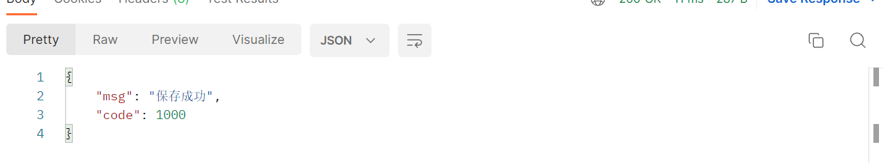

---

 

###  2 更新agent的mongo文件信息.

2.1 请求路径

POST: http://{Server-Host}:{端口}/api/collection/host/updateAgentMongoFile/{{agentId}}

---

2.2 请求参数

| Name                |     Located in     |           Description         |     Required    |        Schema   |
| -------------------|----------------------|-------------------------------|-----------------|-----------   |
|       agentId     |      Path    |           agentId     |        Yes        |String
|       mongoFileList     |      Body   |           mongo文件集合      |       Yes         |List

 

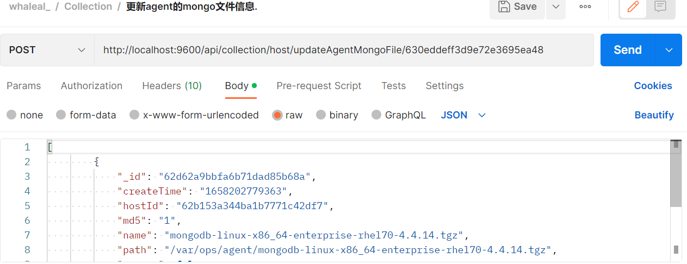

~~~
Ex. 更新agent的mongo文件信息;其中MongoFileList 如下所示：
 [
        {
            "_id": "62d62a9bbfa6b71dad85b68a",M
            "createTime": "1658202779363",
            "hostId": "62b153a344ba1b7771c42df7",
            "md5": "1",
            "name": "mongodb-linux-x86_64-enterprise-rhel70-4.4.14.tgz",
            "path": "/var/ops/agent/mongodb-linux-x86_64-enterprise-rhel70-4.4.14.tgz",
            "server": false,
            "shortName": "mongodb-linux-x86_64-enterprise-rhel70-4.4.14",
            "size": 133646249,
            "updateTime": "1658202779363"
        }
    ]

~~~

----

2.3 返回结果

|               |     Description    |           Schema              |  
| --------------|----------------------|---------------------------
| code        |   状态符:1000成功,其余异常 |       int                |    
| msg       |         返回消息         |          String               | 

 

---

 

###  3 根据agentId查询该agent待执行的命令.

3.1 请求路径

GET: http://{Server-Host}:{端口}/api/collection/command/getCommand/{{hostId}}

---

3.2 请求参数

| Name                |     Located in     |           Description         |     Required    |        Schema   |
| -------------------|----------------------|-------------------------------|-----------------|-----------   |
|      hostId      |       Path              |              主机id           |      Yes          |  String

 

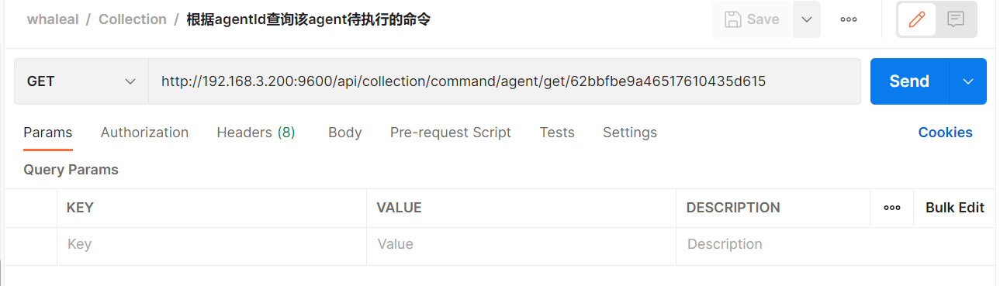

----

3.3 返回结果

|               |     Description    |           Schema              |  
| --------------|----------------------|---------------------------
| code        |   状态符:1000成功,其余异常 |       int                |    
| data       |         返回数据         |         List                | 

 

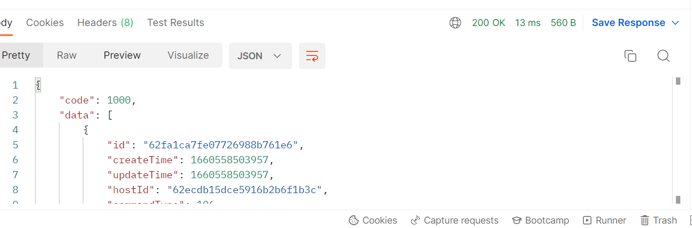

~~~
{
    "code": 1000,
    "data": [
        {
            "id": "632bfca83b74be1d9fe7ddb7",
            "createTime": 1663827112988,
            "updateTime": 1663827112988,
            "hostId": "630eddeff3d9e72e3695ea48",
            "commandType": 101,
            "status": 0,
            "eventId": null,
            "commandNote": "updateHostInfo",
            "content": "\"updateHostInfo\"",
            "execResult": null
        }
    ]
}
~~~

---

 

### 4 更新命令实体对象的状态.

4.1 请求路径

PUT: http://{Server-Host}:{端口}/api/collection/command/update

---

4.2 请求参数

| Name                |     Located in     |           Description         |     Required    |        Schema   |
| -------------------|----------------------|-------------------------------|-----------------|-----------   |
|     commandEntity       |        Body             |         命令实体对象  |    Yes            |   CommandEntity

 

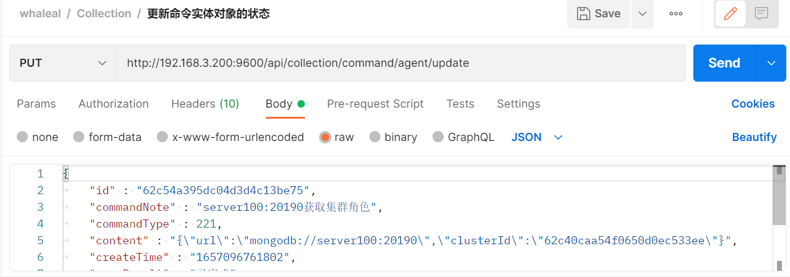

~~~
Ex. 更新命令实体对象的状态;其中 CommandEntity 如下所示：

{
	"id" : "62c54a395dc04d3d4c13be75",
	"commandNote" : "server100:20190获取集群角色",
	"commandType" : 221,
	"content" : "{}",
	"createTime" : "1657096761802",
	"execResult" : "已完成",
	"hostId" : "62b153a344ba1b7771c42df7",
	"status" : 3,
	"updateTime" :"1657096769089"
}
~~~

----

4.3 返回结果

|               |     Description    |           Schema              |  
| --------------|----------------------|---------------------------
| code        |   状态符:1000成功,其余异常 |         int              |    
| data       |         返回消息         |            String             | 

 

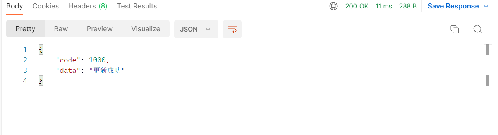

---

 

###  5 更新agent心跳信息.

5.1 请求路径

GET: http://{Server-Host}:{端口}/api/collection/host/updateRunTime/{{hostId}}/{{timeStamp}}

---

5.2 请求参数

| Name                |     Located in     |           Description         |     Required    |        Schema   |
| -------------------|----------------------|-------------------------------|-----------------|-----------   |
|      hostId      |         Path            |        主机id                 |       Yes          | String
|      timeStamp      |         Path            |        时间戳                 |       Yes          | String

 

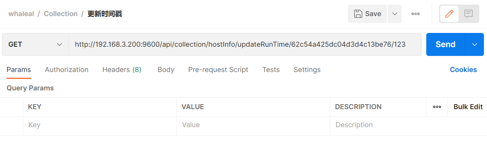

----

5.3 返回结果

|               |     Description    |           Schema              |  
| --------------|----------------------|---------------------------
| code        |   状态符:1000成功,其余异常 |         int              |    
| msg       |         返回消息        |           String              | 

 

---

 

###  6 保存主机信息

6.1 请求路径

POST: http://{Server-Host}:{端口}/api/collection/hostInfo

---

6.2 请求参数

| Name                |     Located in     |           Description         |     Required    |        Schema   |
| -------------------|----------------------|-------------------------------|-----------------|-----------   |
|      hostInfoMongoEntity      |         Body            |        主机信息实体对象                 |       Yes          | HostInfoMongoEntity

 

~~~
Ex. 保存主机信息;其中 HostInfoMongoEntity 如下所示：
{
	"_id" : "62cbbd7607bebb71b8429e5e",
	"cpuInfo" : " Intel(R) Xeon(R) CPU E5-2670 v2 @ 2.50GHz",
	"cpuNum" : 40,
	"hostId" : "62cbbd7607bebb71b8429e5e",
	"hostName" : "server200",
	"hostNameLong" : "server200",
	"ipInfo" : [
		{
			"ip" : "172.17.0.1",
			"type" : "ipv4"
		}
	],
	"kernelInfo" : "3.10.0-1062.el7.x86_64",
	"osVersion" : "CentOS Linux release 7.7.1908 (Core)",
	"run" : true,
	"systemPropertyInfo" : {
		"fileSeparator" : "/",
		"javaClassPath" : "agent-collection-1.0.0.jar",
		"javaClassVersion" : "55.0",
		"javaHome" : "/root/jdk-11.0.9",
		"javaIoTmpdir" : "/tmp",
		"javaLibraryPath" : "/usr/java/packages/lib:/usr/lib64:/lib64:/lib:/usr/lib",
		"javaSpecificationName" : "Java Platform API Specification",
		"javaSpecificationVendor" : "Oracle Corporation",
		"javaVendor" : "Oracle Corporation",
		"javaVersion" : "11.0.9",
		"javaVmName" : "Java HotSpot(TM) 64-Bit Server VM",
		"javaVmSpecificationName" : "Java Virtual Machine Specification",
		"javaVmSpecificationVersion" : "11",
		"javaVmVendor" : "Oracle Corporation",
		"javaVmVersion" : "11.0.9+7-LTS",
		"lineSeparator" : "\n",
		"oSArch" : "amd64",
		"oSName" : "Linux",
		"oSVersion" : "3.10.0-1062.el7.x86_64",
		"pathSeparator" : ":",
		"userDir" : "/home/jmops",
		"userHome" : "/root",
		"userName" : "root"
	}
}
~~~

----

6.3 返回结果

|               |     Description    |           Schema              |  
| --------------|----------------------|---------------------------
| code        |   状态符:1000成功,其余异常 |        int               |    
| msg       |         返回消息        |           String              | 

 

---

 

###  7 保存主机实时信息

7.1 请求路径

POST: http://{Server-Host}:{端口}/api/collection/host/addHostRealTimeData

---

7.2 请求参数

| Name                |     Located in     |           Description         |     Required    |        Schema   |
| -------------------|----------------------|-------------------------------|-----------------|-----------   |
|      hostRealTimeDataMongoEntity      |         Body            |        主机实时信息实体对象                 |       Yes          | HostRealTimeDataMongoEntity

 

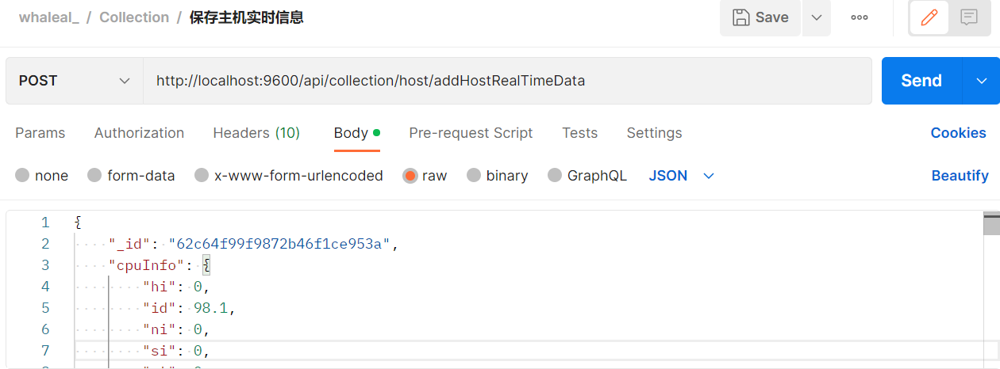

~~~
Ex. 保存主机信息;其中 hostRealTimeDataMongoEntity 如下所示：

{
    "_id": "62c64f99f9872b46f1ce953a",
    "cpuInfo": {
        "hi": 0,
        "id": 98.1,
        "ni": 0,
        "si": 0,
        "st": 0,
        "sy": 0.9,
        "us": 1,
        "wa": 0
    },
    "createTime": "1657163672000",
    "diskInAndOutInfoList": [
        {
            "avgqu_sz": 0.05,
            "avgrq_sz": 18.89,
            "await": 0.34,
            "device": "sda",
            "r_await": 13.32,
            "r_s": 0.17,
            "rkB_s": 10.82,
            "rrqm_s": 0.06,
            "svctm": 0.05,
            "util": 0.75,
            "w_await": 0.32,
            "w_s": 144.65,
            "wkB_s": 1357.06,
            "wrqm_s": 2.03
        }
    ],
    "diskInfoList": [
        {
            "fileSystem": "devtmpfs",
            "mountedOn": "/dev",
            "size": 64349,
            "type": "devtmpfs",
            "used": 0,
            "utilization": 0
        }
    ],
    "hostId": "62b153a344ba1b7771c42df7",
    "hostName": "server100",
    "memoryInfo": {
        "memAvail": 95150,
        "memBuffCache": 26138,
        "memFree": 69641,
        "memTotal": 128722,
        "memUsed": 32942,
        "swapFree": 1958,
        "swapTotal": 4095,
        "swapUsed": 2137
    },
    "netInAndOutInfoList": [
        {
            "io": 0,
            "networkCardName": "em3:",
            "out": 0
        }
    ],
    "timeGranularity": 1,
    "updateTime": "1657163672000"
}
~~~

----

7.3 返回结果

|               |     Description    |           Schema              |  
| --------------|----------------------|---------------------------
| code        |   状态符:1000成功,其余异常 |          int             |    
| data       |         返回消息        |            String             | 

 

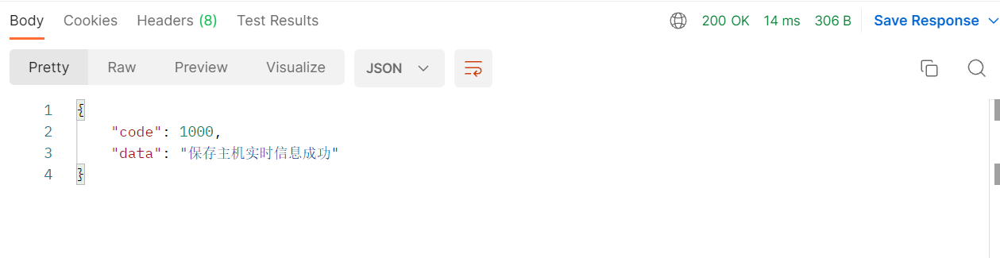

---

 

###  8 agent调用此接口来获取server端的时间

8.1 请求路径

GET: http://{Server-Host}:{端口}/api/collection/util/get/server/date

---

8.2 请求

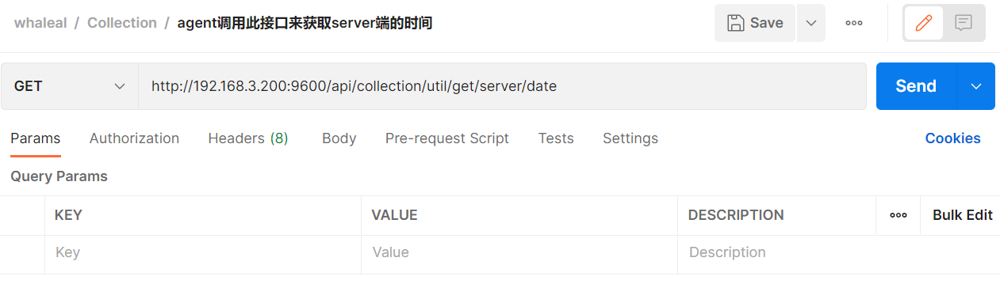

----

8.3 返回结果

|               |     Description    |           Schema              |  
| --------------|----------------------|---------------------------
| code        |   状态符:1000成功,其余异常 |          int             |    
| data       |         时间戳        |             long           | 

 

---

 

###  9 agent通过调用此接口来获取请求agent的ip

9.1 请求路径

GET: http://{Server-Host}:{端口}/api/collection/util/get/agent/ip

---

9.2 请求

----

9.3 返回结果

|               |     Description    |           Schema              |  
| --------------|----------------------|---------------------------
| code        |   状态符:1000成功,其余异常 |       int                |    
| data       |         返回数据:ip        |           String              | 

 

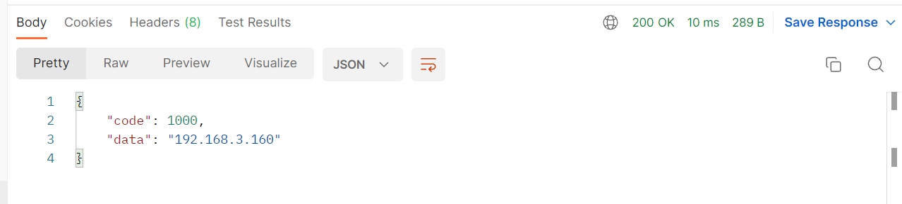

---

 

###  10 mongo进行日志记录

10.1 请求路径

POST: http://{Server-Host}:{端口}/api/collection/mongodb/insertMongoClusterLog/{{clusterId}}/{{eventId}}

---

10.2 请求参数

| Name                |     Located in     |           Description         |     Required    |        Schema   |
| -------------------|----------------------|-------------------------------|-----------------|-----------   |
|     clusterId        |      Path                |           集群id               |      Yes            | String
|     eventId        |         Path             |           事件id               |           Yes       |String
|     logList        |         Body             |         日志列表                 |             Yes     |List

 

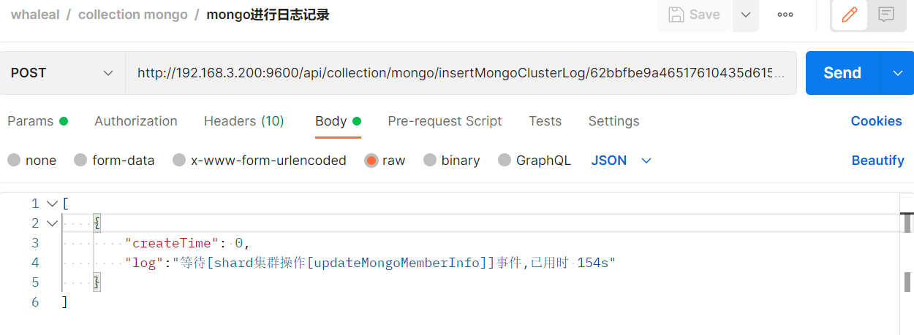

----

10.3 返回结果

|               |     Description    |           Schema              |  
| --------------|----------------------|---------------------------
| code        |   状态符:1000成功,其余异常 |         int              |    
| data       |         返回消息        |          String              | 

 

---

 

###  11 插入mongo成员日志

11.1 请求路径

POST: http://{Server-Host}:{端口}/api/collection/mongodb/insertMongoMemberLog/{{clusterId}}/{{memberInfo}}/{{eventId}}

---

11.2 请求参数

| Name                |     Located in     |           Description         |     Required    |        Schema   |
| -------------------|----------------------|-------------------------------|-----------------|-----------   |
|       clusterId      |       Path               |        集群id                  |       Yes           |String
|       memberInfo      |         Path             |       成员信息                   |      Yes            |String
|       eventId      |       Path               |          事件id                |       Yes           |String
|       logList      |       Body               |          日志列表                |      Yes            |List

 

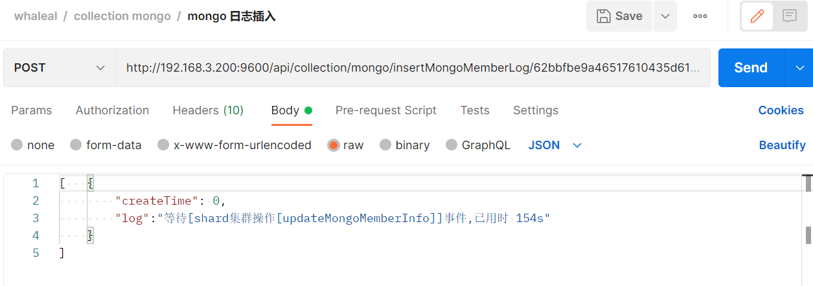

----

11.3 返回结果

|               |     Description    |           Schema              |  
| --------------|----------------------|---------------------------
| code        |   状态符:1000成功,其余异常 |       int                |    
| data       |         返回消息        |         String                | 

 

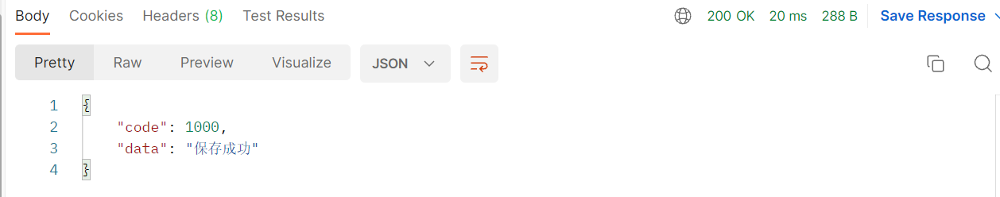

---

 

###  12 更新mongo节点信息

12.1 请求路径

POST: http://{Server-Host}:{端口}/api/collection/mongodb/updateMongoMember

---

12.2 请求参数

| Name                |     Located in     |           Description         |     Required    |        Schema   |
| -------------------|----------------------|-------------------------------|-----------------|-----------   |
|       mongoMember      |       Body               |        mongo集群成员     |       Yes           |MongoMember

 

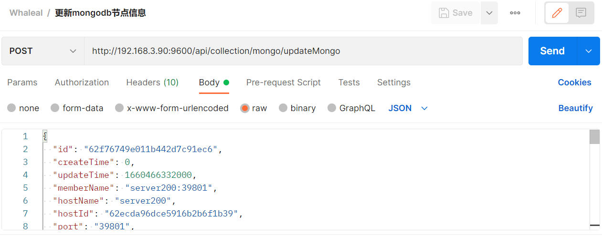

~~~

Ex. 更新mongo节点信息;其中 MongoMember 如下所示：
{
  "id": "62f76749e011b442d7c91ec6",
  "createTime": 0,
  "updateTime": 1660466332000,
  "memberName": "server200:39801",
  "hostName": "server200",
  "hostId": "62ecda96dce5916b2b6f1b39",
  "port": "39801",
  "version": "6.0.1",
  "upgradeVersion": null,
  "userName": "root",
  "password": "123456",
  "authDbName": "admin",
  "currentTimeMillis": 1660381001974,
  "dataDirectory": "/var/ops/mongodb1660381001974/data/",
  "logFile": "/home/guanfei/data2/sharding8/data/mongos/data1/mongos.log",
  "confPath": "/home/guanfei/data2/sharding8/config/mongos/mongos1.conf",
  "authAble": true,
  "runShCmd": "/home/guanfei/data2/server/mongodb-linux-x86_64-enterprise-rhel70-6.0.0/bin/mongos -f /home/guanfei/data2/sharding8/config/mongos/mongos1.conf",
  "type": 61,
  "status": "正在运行",
  "monitorServerStatus": false,
  "monitorTopAndOp": false,
  "collectMongoLog": false,
  "mongoLogFileOffset": 0,
  "operaLogTemp": [],
  "votes": 1,
  "priority": 1,
  "delay": 0,
  "buildIndexes": true,
  "procId": "46797",
  "clusterId": "62f76747fe07726988b75f6b",
  "replId": null,
  "clusterName": null,
  "tags": {},
  "configurationOptions": {
    "systemLog_destination": "file",
    "systemLog_path": "/home/guanfei/data2/sharding8/data/mongos/data1/mongos.log",
    "processManagement_fork": "true",
    "systemLog_logAppend": "true",
    "security_keyFile": "/home/guanfei/data2/sharding8/keyfile",
    "net_bindIp": "0.0.0.0",
    "net_port": "39801",
    "securityKeyFileValue": "BeP6Mbxj23i1jaGsGiRwKmHed2mCqDhlH4ZudHjiftZBoh26OQrCOaX+cAe/28Op\r\n5Uwk57104dUFM1nZUuKmC0kPaGzgbIzSyYnam0ypUZn/jP+v7Nf0sd8ZFGxS0FbX\r\n5HnYXoZtWYZV5tizC6TlyJCnPqW5TnFQZKSV//Nlm2mcaDI2FciX0XP2hHyv3TVJ\r\nwbQgZUMn8JMxgeif+Q0YEiKO+oJSnP1N7gmxlQAZni+6MyphY4e7rjYleNN5JzGr\r\nn6Xfy3Fjt5ZmARkw0GhI/Gm1aDCdiuhE+bgNCdRLEfy8USOyTh39aj25jj8YcW0E\r\nRHeqKB/emqvi0zeKEu7dr4pxUEttjWWstJv+ZepdUpg0pyTSLw+E23CrQ0AhWbTu\r\njx+i36J3CuRiM5Lb2m89/H8lo5NDzbzcd34ENjAhzunGSO4g+owG2+iD7SJIt6A3\r\noFU+ONPWuTcAGOOrRsCvinelr+R1K522HjopNzQQHicoMo8CQcU2KLbyud2V2N0/\r\n7N46ZwfeCQ27vp9hZn6VpUFAQyUd+9hWcE1VxyMPsVHmoMh+gn1OrPWZiXI/3ejR\r\nuasEy+N8dsCNe15nxUFk0Y6Q7hSj26dcxcZzDwNunhLnPALSxiZkzgOPY2l5XT6d\r\nbS62uUN2zt4aRxHNSh/e0O7ygz5BF3UDUElJ7610Exg88DOZ2K3MXiBHTH7yl+QV\r\nGDjF8h0oO/hHRtXYr0UdVIA5cLwk3Ya6ImNQY3ZK241JCheoLgfOqpi3mJi12q2t\r\nBeoqZyUZk6rCaJi79oG1elOTZPEXunipfNvgwysa4jVzTPngSH7qqcMGGSu4lro7\r\nnMiHyxc9iyV9d3K4KXoz0pNLFVSi0v3ToteiKtCVxxuIW0Gco9LdS9RRkXJb23/p\r\nnGLfrhyT13GhUmm1zF7wdEMTVQ6Ktzu6pccRY7ZnMUFnT5XzlcexZzdEJe2Q6K4e\r\n/Dtbr6jjFNL+8iXp0m6k/52IHYYqAMPMk8Z+FzuExSpA+A9o",
    "sharding_configDB": "mongo-cfg/192.168.3.190:36821,192.168.3.200:36821"
  },
  "operateVersion": 5723
}
~~~

----

12.3 返回结果

|               |     Description    |           Schema              |  
| --------------|----------------------|---------------------------
| code        |   状态符:1000成功,其余异常 |        int               |    
| data       |         返回消息        |          String               | 

 

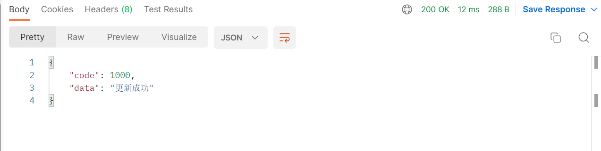

---

 

###  13 更新复制集信息

13.1 请求路径

POST: http://{Server-Host}:{端口}/api/collection/mongodb/updateMongoRepl/{{isUpdateMemberList}}

---

13.2 请求参数

| Name                |     Located in     |           Description         |     Required    |        Schema   |
| -------------------|----------------------|-------------------------------|-----------------|-----------   |
|       isUpdateMemberList      |       Path               |        是否更新成员列表  |       Yes           |boolean
|       mongoReplica      |         Body             |       mongo复制集|      Yes            |MongoReplica

 

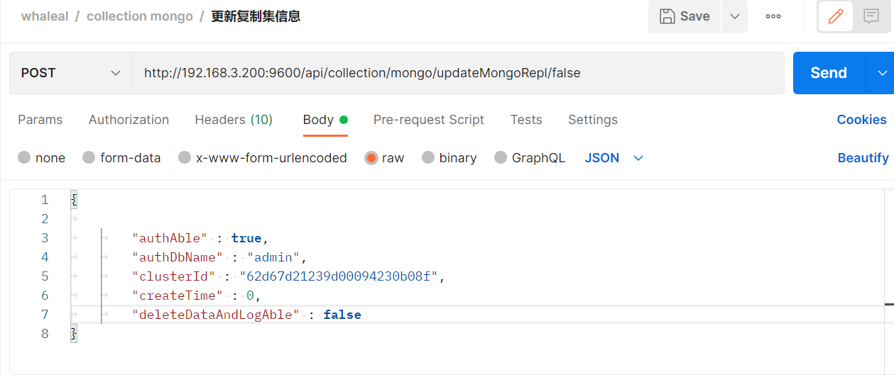

----

13.3 返回结果

|               |     Description    |           Schema              |  
| --------------|----------------------|---------------------------
| code        |   状态符:1000成功,其余异常 |         int              |    
| data       |         返回消息        |           String              | 

 

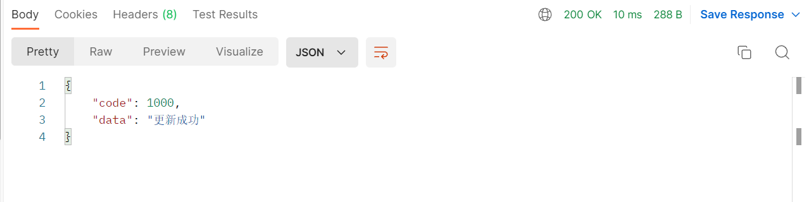

---

 

###  14 更新集群信息

14.1 请求路径

POST: http://{Server-Host}:{端口}/api/collection/mongodb/updateCluster

---

14.2 请求参数

| Name                |     Located in     |           Description         |     Required    |        Schema   |
| -------------------|----------------------|-------------------------------|-----------------|-----------   |
|       mongoClusterInformation      |       Body  |        mongo集群信息实体对象      |       Yes           |MongoClusterInformation

 

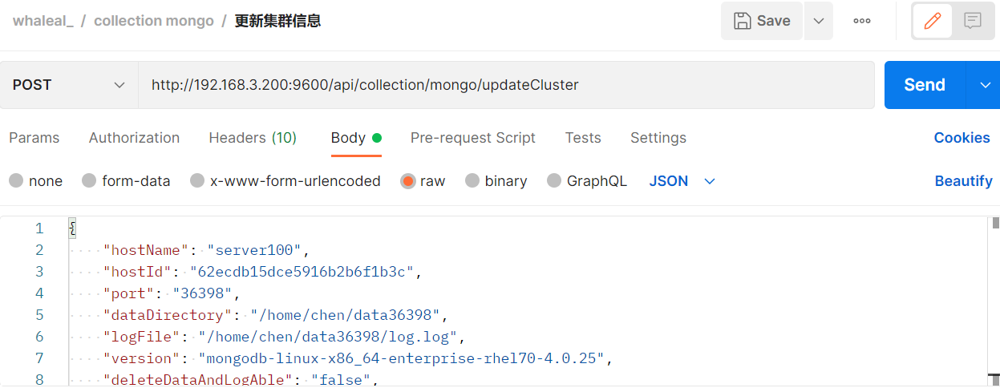

----

14.3 返回结果

|               |     Description    |           Schema              |  
| --------------|----------------------|---------------------------
| code        |   状态符:1000成功,其余异常 |          int             |    
| data       |         返回消息        |            String             | 

 

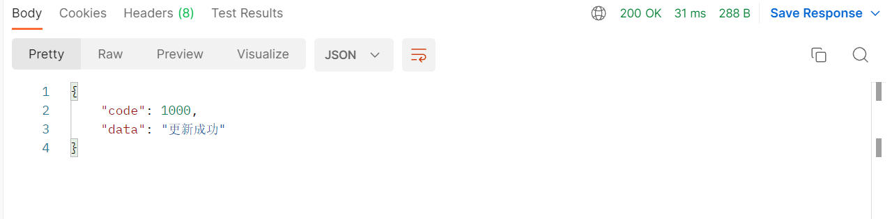

---

 

###  15 保存mongo成员的实时信息

    
15.1 请求路径

POST: http://{Server-Host}:{端口}/api/collection/mongodb/realtime

---

15.2 请求参数

| Name                |     Located in     |           Description         |     Required    |        Schema   |
| -------------------|----------------------|-------------------------------|-----------------|-----------   |
|       tableName      |       Path               |        表名                  |       Yes           |String
|       mongodbNodeMetrics      |         Body             |       mongo实时数据对象     |      Yes            |MongodbNodeMetrics

 

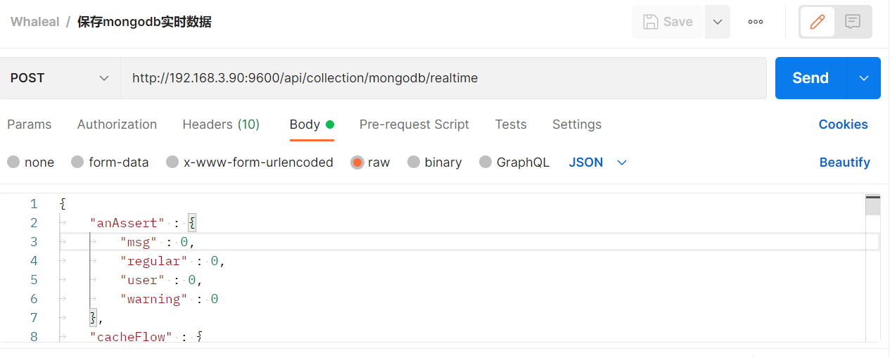

~~~
Ex. 保存mongo成员的实时信息;MongodbNodeMetrics 如下所示：
{
	"anAssert" : {
		"msg" : 0,
		"regular" : 0,
		"user" : 0,
		"warning" : 0
	},
	"cacheFlow" : {
		"brin" : 8717624,
		"bwfr" : 6421369
	}
	"createTime" : "1660469450000",
	"databaseLock" : {
		"r" : 0.00,
		"r_i" : 0.00,
		"w" : 0.00,
		"w_i" : 0.00
	},
	"deletedDocument" : {
		"deleted" : 103,
		"deletedByTTL" : 35
	},
	"documentOp" : {
		"inserted" : 26,
		"returned" : 0,
		"updated" : 0
	},
	"hostId" : "62cbbd7607bebb71b8429e5e",
	"hostName" : "server200",
	"latency" : {
		"r" : 717.90,
		"w" : 3252.41
	}
	"timeGranularity" : 0,
	"transactionCondition" : {
		"currActive" : 0,
		"currInactive" : 0,
		"totalAborted" : 0,
		"totalCommitted" : 0
	},
	"updateTime" : "1660469450000"
}
~~~

----

15.3 返回结果

|               |     Description    |           Schema              |  
| --------------|----------------------|---------------------------
| code        |   状态符:1000成功,其余异常 |       int                |    
| data       |         返回消息        |         String                | 

 

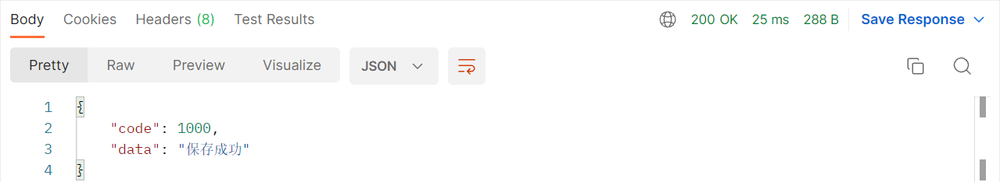

---

 

## Deprecated 已弃用
###  16 保存一批监控数据到数据库中

16.1 请求路径

POST: http://{Server-Host}:{端口}/api/collection/mongodb/realtime/save/many

---

16.2 请求参数

| Name                |     Located in     |           Description         |     Required    |        Schema   |
| -------------------|----------------------|-------------------------------|-----------------|-----------   |
|       mongoDBRealtimeDataEntityList      |       Body               |        保存mongo成员的实时信息集合 |       Yes           |List

 

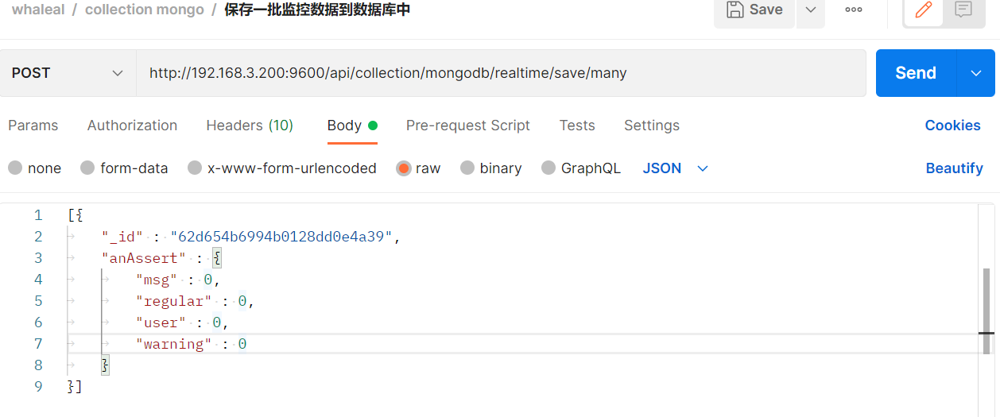

----

16.3 返回结果

|               |     Description    |           Schema              |  
| --------------|----------------------|---------------------------
| code        |   状态符:1000成功,其余异常 |         int              |    
| data       |         返回消息        |           String              | 

 

---

 

### 17 获取agent实例上的mongo节点信息

17.1 请求路径

POST http://{Server-Host}:{端口}/api/collection/mongodb/getAgentMongoMember/{{agentId}}

---

17.2 请求参数

| Name                |     Located in     |           Description         |     Required    |        Schema   |
| -------------------|----------------------|-------------------------------|-----------------|-----------   |
|       agentId      |       Path               |        agentId                  |       Yes           |String

 

----

17.3 返回结果

|               |     Description    |           Schema              |  
| --------------|----------------------|---------------------------
| code        |   状态符:1000成功,其余异常 |         int              |    
| data       |         返回数据        |            List             | 

 

[comment]: <> (![img_12.png]&#40;../Images/agent_mongoMember_r.png&#41;)

~~~
{
    "code": 1000,
    "data": [
        {
            "id": "62d6506ec5b6206027b99052",
            "createTime": 1658212462005,
            "updateTime": 1658302192001,
            "memberName": "chen:56902",
            "hostName": "chen",
            "hostId": "62bbfbe9a46517610435d615",
            "port": "56902",
            "version": "4.2.21",
            "upgradeVersion": null,
            "userName": "lhp1234",
            "password": "123456",
            "authDbName": "admin",
            "currentTimeMillis": 1658212462005,
            "dataDirectory": "/home/chen/data56902/data/",
            "logFile": "/home/chen/data56902/data/log.log",
            "confPath": "/home/chen/data56902/data/chen_56902.conf",
            "deleteDataAndLogAble": false,
            "authAble": true,
            "runShCmd": "",
            "type": 45,
            "status": "正在运行",
            "monitorServerStatus": true,
            "monitorTopAndOp": true,
            "collectMongoLog": true,
            "mongoLogFileOffset": 0,
            "operaLogTemp": [],
            "votes": 1,
            "priority": 1.0,
            "delay": 0,
            "buildIndexes": true,
            "procId": "5599",
            "clusterId": "62d65068561b4a25b8339740",
            "replId": "62d6506dc5b6206027b99050",
            "clusterName": null,
            "tags": {},
            "configurationOptions": {
                "sharding_clusterRole": "configsvr",
                "security_keyFile": "",
                "security_authorization": "enabled",
                "systemLog_destination": "file",
                "storage_wiredTiger_engineConfig_cacheSizeGB": "0.3",
                "systemLog_Path": "/home/chen/data56902/data/log.log",
                "processManagement_fork": "true",
                "storage_dbPath": "/home/chen/data56902/data/",
                "systemLog_logAppend": "true",
                "net_bindIp": "0.0.0.0",
                "net_port": "56902",
                "replication_replSetName": "test_lhp_shard_config",
                "securityKeyFileValue":""
            },
            "operateVersion": 8168
        }
    ]
}
~~~

---

 

###  18 保存mongo.log日志

18.1 请求路径

POST: http://{Server-Host}:{端口}/api/collection/mongodb/save/mongoLog/{{mongoMemberId}}/{{fileOffset}}

---

18.2 请求参数

| Name                |     Located in     |           Description         |     Required    |        Schema   |
| -------------------|----------------------|-------------------------------|-----------------|-----------   |
|       mongoMemberId      |       Path               |        mongo成员id                  |       Yes           |String
|       fileOffset      |         Path             |       文件偏移     |      Yes            |long
|       logList      |         Body             |       日志列表     |      Yes            |List

 

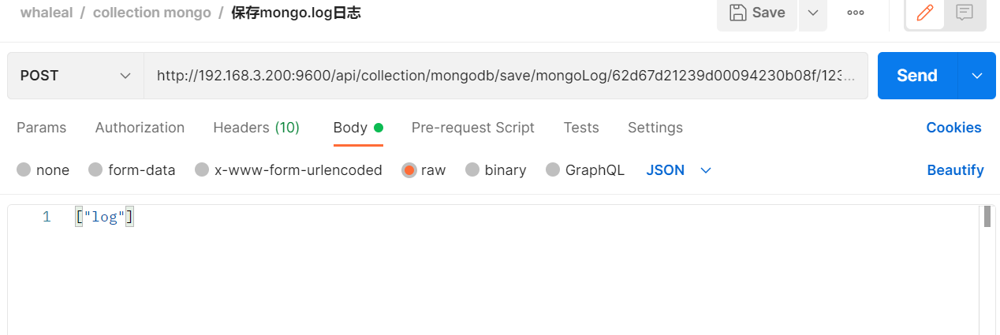

----

18.3 返回结果

|               |     Description    |           Schema              |  
| --------------|----------------------|---------------------------
| code        |   状态符:1000成功,其余异常 |        int               |    
| data       |         文件偏移量        |         long                | 

 

---

 

###  19 保存 mongo top and op

19.1 请求路径

POST: http://{Server-Host}:{端口}/api/collection/mongodb/save/mongoTopAndOp

---

19.2 请求参数

| Name                |     Located in     |           Description         |     Required    |        Schema   |
| -------------------|----------------------|-------------------------------|-----------------|-----------   |
|       documentList      |       Body               |     Document列表 |       Yes           |List

 

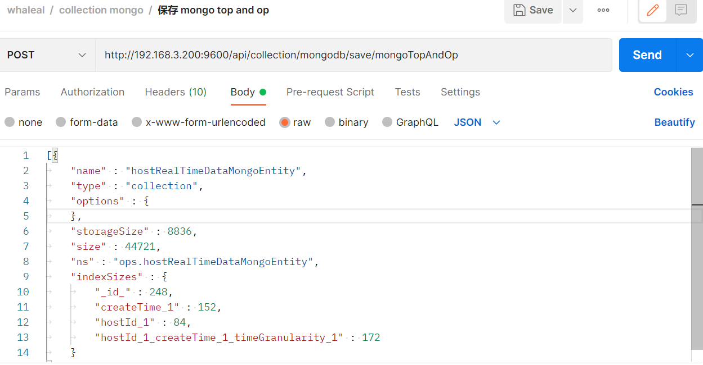

[comment]: <> (~~~)

[comment]: <> ([{)

[comment]: <> (	"name" : "hostRealTimeDataMongoEntity",)

[comment]: <> (	"type" : "collection",)

[comment]: <> (	"options" : {)

[comment]: <> (	},)

[comment]: <> (	"storageSize" : 8836,)

[comment]: <> (	"size" : 44721,)

[comment]: <> (	"ns" : "ops.hostRealTimeDataMongoEntity",)

[comment]: <> (	"indexSizes" : {)

[comment]: <> (		"_id_" : 248,)

[comment]: <> (		"createTime_1" : 152,)

[comment]: <> (		"hostId_1" : 84,)

[comment]: <> (		"hostId_1_createTime_1_timeGranularity_1" : 172)

[comment]: <> (	})

[comment]: <> (}])

[comment]: <> (~~~)

----

19.3 返回结果

|               |     Description    |           Schema              |  
| --------------|----------------------|---------------------------
| code        |   状态符:1000成功,其余异常 |        int               |    
| data       |         返回消息        |          String               | 

 

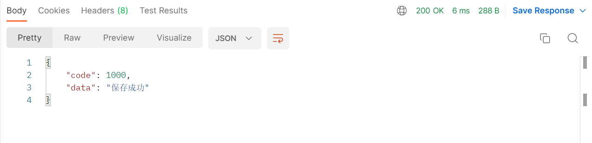

---

 

###  20 更新fcv

20.1 请求路径

GET: http://{Server-Host}:{端口}/api/collection/mongodb/updateFCV/{{clusterId}}/{{fcv}}

---

20.2 请求参数

| Name                |     Located in     |           Description         |     Required    |        Schema   |
| -------------------|----------------------|-------------------------------|-----------------|-----------   |
|       clusterId      |       Path               |        集群id                  |       Yes           |String
|       fcv      |         Path             |       fcv     |      Yes            |String

 

----

20.3 返回结果

|               |     Description    |           Schema              |  
| --------------|----------------------|---------------------------
| code        |   状态符:1000成功,其余异常 |         int              |    
| data       |         返回消息        |           String              | 

 

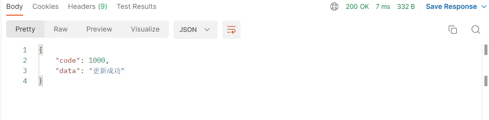

---

 

###  21 保存mongodb集合

21.1 请求路径

POST: http://{Server-Host}:{端口}/api/collection/mongodb/saveMongoDBCollections

---

21.2 请求参数

| Name                |     Located in     |           Description         |     Required    |        Schema   |
| -------------------|----------------------|-------------------------------|-----------------|-----------   |
|       mongoDBCollections      |         Body             |       mongo实集合     |      Yes            |MongoDBCollections

 

~~~
Ex. 保存mongodb集合;其中 MongoDBCollections 如下所示：
{
	"_id" : "62ea1db298c0825187aee96e",
	"clusterId" : "62ea1db298c0825187aee96e",
	"createTime" : "1659686288006",
	"dbTables" : [
		{
			"name" : "fs.files",
			"type" : "collection",
			"options" : {
				
			},
			"info" : {
				"readOnly" : false,
				"uuid" : {
					"type" : 4,
					"data" : "q/X3q+2aQVC9dGCnS4wKZA=="
				}
			},
			"idIndex" : {
				"v" : 2,
				"key" : {
					"_id" : 1
				},
				"name" : "_id_",
				"ns" : "record.fs.files"
			},
			"storageSize" : 20,
			"size" : 16,
			"ns" : "record.fs.files"
		}
	],
	"fromServerExe" : false,
	"updateTime" : 0
}

~~~

----

21.3 返回结果

|               |     Description    |           Schema              |  
| --------------|----------------------|---------------------------
| code        |   状态符:1000成功,其余异常 |       int                |    
| data       |         返回消息        |          String               | 

 

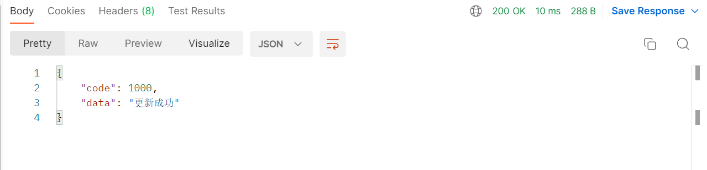

---

 

###  22 保存mongo成员用户

22.1 请求路径

POST: http://{Server-Host}:{端口}/api/collection/mongodb/saveMongoDBClusterUser/{{clusterId}}

---

22.2 请求参数

| Name                |     Located in     |           Description         |     Required    |        Schema   |
| -------------------|----------------------|-------------------------------|-----------------|-----------   |
|       clusterId      |       Path               |        集群id                  |       Yes           |String
|       list      |         Body             |       document列表     |      Yes            |List

 

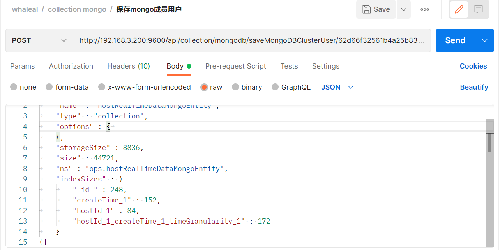

~~~
Ex. 保存mongo成员用户;其中 List 如下所示：
[{
	"name" : "hostRealTimeDataMongoEntity",
	"type" : "collection",
	"options" : {	
	},
	"storageSize" : 8836,
	"size" : 44721,
	"ns" : "ops.hostRealTimeDataMongoEntity",
	"indexSizes" : {
		"_id_" : 248,
		"createTime_1" : 152,
		"hostId_1" : 84,
		"hostId_1_createTime_1_timeGranularity_1" : 172
	}
}]
~~~

----

22.3 返回结果

|               |     Description    |           Schema              |  
| --------------|----------------------|---------------------------
| code        |   状态符:1000成功,其余异常 |        int               |    
| data       |         返回消息        |             String            | 

 

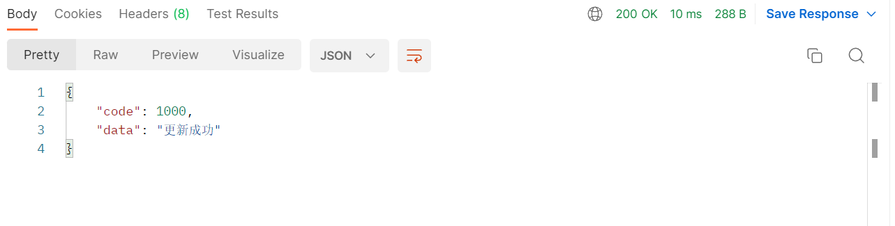

---

 

###  23 保存mongo成员角色

23.1 请求路径

POST: http://{Server-Host}:{端口}/api/collection/mongodb/saveMongoDBClusterRole/{{clusterId}}

---

23.2 请求参数

| Name                |     Located in     |           Description         |     Required    |        Schema   |
| -------------------|----------------------|-------------------------------|-----------------|-----------   |
|       clusterId      |       Path               |        集群id                  |       Yes           |String
|      list      |         Body             |       document列表     |      Yes            |List

 

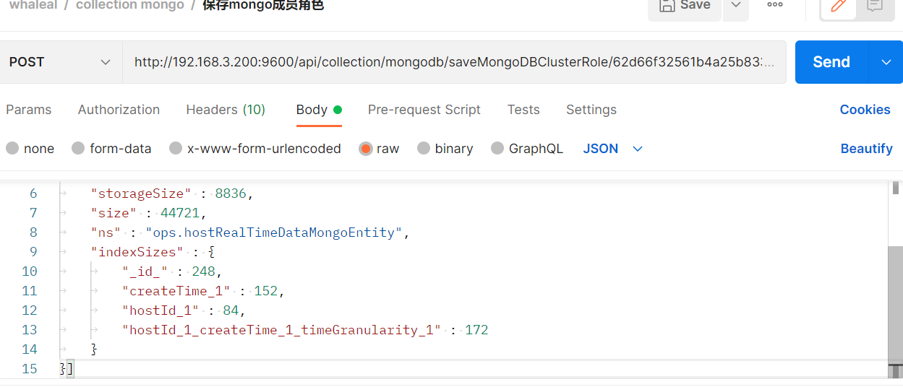

----

23.3 返回结果

|               |     Description    |           Schema              |  
| --------------|----------------------|---------------------------
| code        |   状态符:1000成功,其余异常 |         int              |    
| data       |         返回消息        |              String           | 

 

 

###  24 保存诊断数据.

24.1 请求路径

POST: http://{Server-Host}:9601/api/collection/mdiag/saveMdiagLog

---

24.2 请求参数

| Name                |     Located in     |           Description         |     Required    |        Schema   |
| -------------------|----------------------|-------------------------------|-----------------|-----------   |
|      document      |       Body  |        巡检日志      |       Yes           |Document

 

----

24.3 返回结果

|               |     Description    |           Schema              |  
| --------------|----------------------|---------------------------
| code        |   状态符:1000成功,其余异常 |          int             |    
| data       |         返回消息        |            String             | 

 

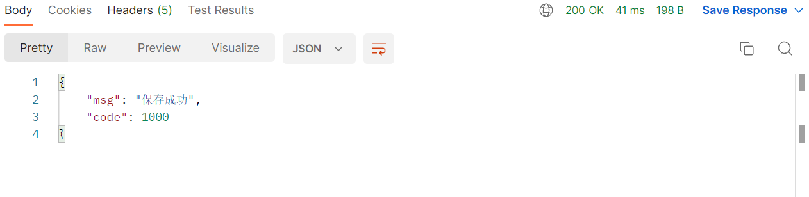

---

 

###  24 获取config信息.

24.1 请求路径

GET http://{Server-Host}:9601/api/collection/config/getConfig

---

24.2 请求参

 

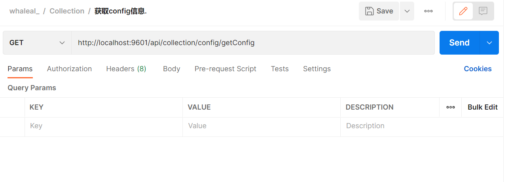

----

24.3 返回结果

|               |     Description    |           Schema              |  
| --------------|----------------------|---------------------------
| code        |   状态符:1000成功,其余异常 |          int             |    
| data       |         返回数据       |            ConfigEntity             | 

 

---
---

[comment]: <> (## AgentLogEntity)

[comment]: <> (|       Name         |     Type             |    Description      |   )

[comment]: <> (| ------------       |----------            |---------------------|)

[comment]: <> (| hostId                 |   String             |         主机id          |   )

[comment]: <> (| type             |   String             |         日志类型     |   )

[comment]: <> (| content              |   String |         内容     |   )

[comment]: <> (---)

[comment]: <> (---)

[comment]: <> (## MongoFile)

[comment]: <> (|       Name         |     Type             |    Description      |   )

[comment]: <> (| ------------       |----------            |---------------------|)

[comment]: <> (| shortName                 |   String             |         姓          |   )

[comment]: <> (| Name             |   String             |         名     |   )

[comment]: <> (| Size              |   Long |         大小     |   )

[comment]: <> (| Md5               |   String             |         文件校验     |   )

[comment]: <> (| version         |   String             |         版本     |   )

[comment]: <> (| Path           |   String             |         路径     |   )

[comment]: <> (| hostId             |   String             |         主机id     |   )

[comment]: <> (---)

[comment]: <> (---)

[comment]: <> (## commandEntity)

[comment]: <> (|       Name         |     Type             |    Description      |   )

[comment]: <> (| ------------       |----------            |---------------------|)

[comment]: <> (| hostId                 |   String             |         主机id          |   )

[comment]: <> (| commandType             |   String             |         命令类型     |   )

[comment]: <> (| status              |   Integer |    当前状态:1 下发,2 正在执行,3 正常已完成,4 异常完成,5 异常完成但是不影响后续执行     |   )

[comment]: <> (| eventId               |   String             |         所属事件组     |   )

[comment]: <> (| commandNote         |   String             |         具体命令操作注释     |   )

[comment]: <> (| content           |   String             |         命令内容     |   )

[comment]: <> (| execResult             |   String             |         执行结果     |   )

[comment]: <> (---)

[comment]: <> (---)

[comment]: <> (___)

[comment]: <> (## ipInfo)

[comment]: <> (|       Name        |     Type    |           Description       |   )

[comment]: <> (| --------------|----------------------|--------------------|)

[comment]: <> (| id        |   String |         Id              |   )

[comment]: <> (| Type        |   String |         主机名称              |   )

[comment]: <> (---  )

[comment]: <> (## HostInfoMongoEntity)

[comment]: <> (|       Name         |     Type             |    Description      |   )

[comment]: <> (| ------------       |----------            |---------------------|)

[comment]: <> (| id                 |   String             |         Id          |   )

[comment]: <> (| ipInfo             |   List<ipInfo>             |         Ip信息     |   )

[comment]: <> (| systemPropertyInfo |   systemPropertyInfo |         系统参数信息     |   )

[comment]: <> (| createTime         |   时间戳             |         创建时间     |   )

[comment]: <> (| updateTime         |   时间戳             |         更新时间     |   )

[comment]: <> (| hostName           |   String             |         主机名称     |   )

[comment]: <> (| hostId             |   String             |         主机id     |   )

[comment]: <> (| hostNameLong       |   String             |         主机长名称     |   )

[comment]: <> (| Memory             |   int             |         内存     |   )

[comment]: <> (| osVersion          |   String             |         系统版本     |   )

[comment]: <> (| cpuNum             |   int             |         Cpu数     |   )

[comment]: <> (| swap               |   int             |         交换内存     |   )

[comment]: <> (| kernelInfo         |   String             |         内核信息     |   )

[comment]: <> (| totalDiskSize      |   Int             |         总磁盘大小     |   )

[comment]: <> (| run                |   boolean             |         是否正在运行     |   )

[comment]: <> (---)

[comment]: <> (---)

[comment]: <> (## HostRealTimeDataMongoEntity)

[comment]: <> (|       Name         |     Type             |    Description      |   )

[comment]: <> (| ------------       |----------            |---------------------|)

[comment]: <> (| hostId                 |   String             |         主机id          |   )

[comment]: <> (| hostName             |   String             |         主机名称     |   )

[comment]: <> (| timeGranularity              |   int |         颗粒度值     |   )

[comment]: <> (| cpuInfo               |   CpuInfo             |         cpu使用信息     |   )

[comment]: <> (| memoryInfo         |   MemoryInfo             |         内存使用信息     |   )

[comment]: <> (| diskInfoList           |   List<DiskInfo>             |         磁盘使用信息     |   )

[comment]: <> (| diskInAndOutInfoList             |   List<DiskInAndOutInfo>             |         磁盘io信息     |   )

[comment]: <> (| netInAndOutInfoList             |   List<NetInAndOutInfo>             |         网络带宽io信息     |   )

[comment]: <> (---)

[comment]: <> (---)

[comment]: <> (## CpuInfo)

[comment]: <> (|       Name         |     Type             |    Description      |   )

[comment]: <> (| ------------       |----------            |---------------------|)

[comment]: <> (| us                 |   double             |         用户空间占用CPU百分比          |   )

[comment]: <> (| sy             |   double             |         内核空间占用CPU百分比     |   )

[comment]: <> (| ni              |   double |         用户进程空间内改变过优先级的进程占用CPU百分比     |   )

[comment]: <> (| id               |   double             |         空闲CPU百分比     |   )

[comment]: <> (| wa         |   double             |         等待输入输出的CPU时间百分比     |   )

[comment]: <> (| hi           |   double            |         硬中断占用CPU的百分比     |   )

[comment]: <> (| si             |   double             |         软中断占用CPU的百分比     |   )

[comment]: <> (| st             |   double            |         虚拟CPU等待实际CPU的时间的百分比     |   )

[comment]: <> (---)

[comment]: <> (---)

[comment]: <> (## DiskInAndOutInfo)

[comment]: <> (|       Name         |     Type             |    Description      |   )

[comment]: <> (| ------------       |----------            |---------------------|)

[comment]: <> (| memTotal                 |   long             |         物理内存总量          |   )

[comment]: <> (| memFree             |   long             |         空闲内存总量     |   )

[comment]: <> (| memUsed              |   long |         使用的物理内存总量     |   )

[comment]: <> (| memBuffCache               |   long             |         用作内核缓存的内存量     |   )

[comment]: <> (| memAvail         |   long             |         代表可用于进程下一次分配的物理内存数量     |   )

[comment]: <> (| swapTotal           |   long           |         交换区总量     |   )

[comment]: <> (| swapFree             |  long            |         空闲交换区总量     |   )

[comment]: <> (| swapUsed             |   long       |         使用的交换区总量     |   )

[comment]: <> (---)

[comment]: <> (---)

[comment]: <> (## NetInAndOutInfo)

[comment]: <> (|       Name         |     Type             |    Description      |   )

[comment]: <> (| ------------       |----------            |---------------------|)

[comment]: <> (| networkCardName                 |   String             |         网卡名          |   )

[comment]: <> (| io             |   double             |         流入流量     |   )

[comment]: <> (| out              |   double |         流出流量     |   )

[comment]: <> (---)

[comment]: <> (---)

[comment]: <> (## HostRealTimeDataMongoEntity)

[comment]: <> (|       Name         |     Type             |    Description      |   )

[comment]: <> (| ------------       |----------            |---------------------|)

[comment]: <> (| hostId                 |   String             |         主机id          |   )

[comment]: <> (| hostName             |   String             |         主机名称     |   )

[comment]: <> (| timeGranularity              |   int |         颗粒度值     |   )

[comment]: <> (| cpuInfo               |   CpuInfo             |         cpu使用信息     |   )

[comment]: <> (| memoryInfo         |   MemoryInfo             |         内存使用信息     |   )

[comment]: <> (| diskInfoList           |   List<DiskInfo>             |         磁盘使用信息     |   )

[comment]: <> (| diskInAndOutInfoList             |   List<DiskInAndOutInfo>             |         磁盘io信息     |   )

[comment]: <> (| netInAndOutInfoList             |   List<NetInAndOutInfo>             |         网络带宽io信息     |   )

[comment]: <> (---)

[comment]: <> (---)

[comment]: <> (## DiskInfo)

[comment]: <> (|       Name         |     Type             |    Description      |   )

[comment]: <> (| ------------       |----------            |---------------------|)

[comment]: <> (| fileSystem                 |   String             |         分区名          |   )

[comment]: <> (| type             |   String             |         分区类型     |   )

[comment]: <> (| size              |   long |         总大小     |   )

[comment]: <> (| used               |   long             |         使用大小     |   )

[comment]: <> (| utilization         |   double             |         使用率     |   )

[comment]: <> (| mountedOn           |   String            |         挂载位置     |   )

[comment]: <> (---)

[comment]: <> (---)

[comment]: <> (## LogInfo)

[comment]: <> (|       Name         |     Type             |    Description      |   )

[comment]: <> (| ------------       |----------            |---------------------|)

[comment]: <> (| createTime                 |   String             |         创建时间          |   )

[comment]: <> (| log             |   String             |         日志     |   )

[comment]: <> (---)

[comment]: <> (---)

[comment]: <> (## MongoMember)

[comment]: <> (|       Name         |     Type             |    Description      |   )

[comment]: <> (| ------------       |----------            |---------------------|)

[comment]: <> (| memberName                 |   String             |         主机名:端口          |   )

[comment]: <> (| hostName             |   String             |         主机名     |   )

[comment]: <> (| hostId              |   Long |         主机id     |   )

[comment]: <> (| port               |   String             |         端口     |   )

[comment]: <> (| version         |   String             |         版本     |   )

[comment]: <> (| upgradeVersion           |   String             |         升降级版本     |   )

[comment]: <> (| password           |   String             |         节点密码     |   )

[comment]: <> (| authDbName           |   String             |         认证库     |   )

[comment]: <> (| currentTimeMillis           |   long             |         当前时间戳     |   )

[comment]: <> (| dataDirectory           |   String             |         数据目录     |   )

[comment]: <> (| userName             |   String             |         节点用户名     |   )

[comment]: <> (| logFile             |   String             |         日志文件     |   )

[comment]: <> (| confPath             |   String             |         配置文件路径     |   )

[comment]: <> (| deleteDataAndLogAble             |   String             |         是否强制删除     |   )

[comment]: <> (| authAble             |   String             |         是否开启认证     |   )

[comment]: <> (| runShCmd             |   String             |         执行启动命令     |   )

[comment]: <> (| type             |   enum             |         节点类型     |   )

[comment]: <> (注 type:11 单例)

[comment]: <> (*)

[comment]: <> (* 
 普通复制集)

[comment]: <> (* 31 普通成员节点)

[comment]: <> (* 32 隐藏节点)

[comment]: <> (* 33 仲裁节点)

[comment]: <> (* 34 隐藏延迟节点)

[comment]: <> (* 35 主节点)

[comment]: <> (* 
 config复制集)

[comment]: <> (* 41 config普通成员节点)

[comment]: <> (* 42 config隐藏节点)

[comment]: <> (* 43 config仲裁节点)

[comment]: <> (* 44 config隐藏延迟节点)

[comment]: <> (* 45 config主节点)

[comment]: <> (* 
 shard复制集)

[comment]: <> (* 51 shard普通成员节点)

[comment]: <> (* 52 shard隐藏节点)

[comment]: <> (* 53 shard仲裁节点)

[comment]: <> (* 54 shard隐藏延迟节点)

[comment]: <> (* 55 shard主节点)

[comment]: <> (* 
 mongoS)

[comment]: <> (* 61 mongoS)

[comment]: <> (---)

[comment]: <> (---)

[comment]: <> (## MongoReplica)

[comment]: <> (|       Name         |     Type             |    Description      |   )

[comment]: <> (| ------------       |----------            |---------------------|)

[comment]: <> (| replicaName                 |   String             |         集群名          |   )

[comment]: <> (| memberList             |   List<MongoMember>             |         成员列表     |   )

[comment]: <> (| type              |   enum |         大小     |   )

[comment]: <> (| clusterId               |   String             |         所属集群id     |   )

[comment]: <> (| deleteDataAndLogAble         |   boolean             |         是否强制删除已经存在的数据目录和日志文件     |   )

[comment]: <> (| status           |   String             |         状态     |   )

[comment]: <> (| operaLog             |   List<String             |         复制集操作日志     |   )

[comment]: <> (| replicationSettings             |   Map<String, Object>             |         复制集高级配置     |   )

[comment]: <> (| replicatioNotherSettings             |   Map<String, Object>             |         其他附加配置信息     |   )

[comment]: <> (| authAble             |   boolean             |         是否开启认证     |   )

[comment]: <> (| userName             |   String             |         节点用户名     |   )

[comment]: <> (| password             |   String             |         节点密码     |   )

[comment]: <> (| authDbName             |   String             |         认证库     |   )

[comment]: <> (| protocolVersion             |   long             |         协议版本     |   )

[comment]: <> (| writeConcernMajorityJournalDefault             |   boolean             |         是否默认投票     |   )

[comment]: <> (type:)

[comment]: <> (* 普通复制集 1)

[comment]: <> (* config 2)

[comment]: <> (* shard 3)

[comment]: <> (---)

[comment]: <> (---)

[comment]: <> (## MongoClusterInformation)

[comment]: <> (|       Name         |     Type             |    Description      |   )

[comment]: <> (| ------------       |----------            |---------------------|)

[comment]: <> (| clusterName                 |   String             |         集群名          |   )

[comment]: <> (| type             |   int             |         类型     |   )

[comment]: <> (| mongoMember              |   MongoMember |         单例     |   )

[comment]: <> (| mongoReplica               |   MongoReplica             |         复制集     |   )

[comment]: <> (| mongoShard         |   MongoShard             |         分片     |   )

[comment]: <> (| isCreate           |   boolean             |         默认新建的集群信息     |   )

[comment]: <> (| status             |   String             |         集群状态     |   )

[comment]: <> (| fcv             |   String             |         fcv     |   )

[comment]: <> (| tag             |   String             |         标签     |   )

[comment]: <> (status：)

[comment]: <> (* 集群状态)

[comment]: <> (* 正常)

[comment]: <> (* 异常)

[comment]: <> (* 关机)

[comment]: <> (* 脱离纳管)

[comment]: <> (type:)

[comment]: <> (* 1 单例)

[comment]: <> (* 2 复制集)

[comment]: <> (* 3 分片)

[comment]: <> (## MongoDBCollections)

[comment]: <> (|       Name         |     Type             |    Description      |   )

[comment]: <> (| ------------       |----------            |---------------------|)

[comment]: <> (| isFromServerExe                 |   boolean             |         是否来自服务端exe          |   )

[comment]: <> (| dbTables             |   List\<MongoMember>             |         document集合     |   )

[comment]: <> (| clusterId               |   String             |         所属集群id     |   )

[comment]: <> (---)

[comment]: <> (---)

[comment]: <> (## MongodbNodeMetrics)

[comment]: <> (|       Name         |     Type             |    Description      |   )

[comment]: <> (| ------------       |----------            |---------------------|)

[comment]: <> (| hostId                 |   String             |         主机id          |   )

[comment]: <> (| hostName             |   String             |         主机名称     |   )

[comment]: <> (| port              |   String |         端口号     |   )

[comment]: <> (| nodeId               |   String             |         节点id     |   )

[comment]: <> (| timeGranularity         |   int             |         颗粒度     |   )
