# MongoDBData接口

接口调用时须在请求头中设置whaleal-Token ，填写参数发起请求，返回内容为 JSON 格式的信息，返回特殊实体类将在最后提供实体类表格。
其参数为时间的都以时间戳形式传递。

有些接口调用时需用到nodeId、mongoMemberId、clusterId、eventId
~~~
nodeId即mongoMemberId 在“查找mongoDB集群信息数据”接口返回结果集中data集合的中mongo集合的“id”

eventId在"获取集群日志信息"接口处找到所需事件的id

clusterId在“查找mongoDB集群信息数据”接口返回结果集中。
~~~

### 请求头默认格式，特殊情况特殊声明

    whaleal-Token在调用登录接口时返回，在之后调用接口时将token放置请求头中。
[登录接口调用获取whaleal-Token](Member.md)

| KEY                |     VALUE      |
| -------------------|----------------------|
| Accept-Encoding        |         gzip, deflate, br |
| Connection          |         keep-alive           |
| Content-Type          |         application/json |
| whaleal-token          |         "token"           |
---
---

###  1 获取mongodb集群信息

## Deprecated 已弃用

1.1 请求路径

GET: http://{Server-Host}:{端口}/api/server/mongo/monitor/project/data/{{clusterName}}/{{projectType}}

---

1.2 请求参数

| Name                |     Located in     |           Description         |     Required    |        Schema   |
| -------------------|----------------------|-------------------------------|-----------------|-----------   |
| clusterName          |         Path           |            集群名称            |        Yes       |String
| projectType          |         Path           |            类型            |        Yes       |String

----

 

###  2 获取群集大小前五名

2.1 请求路径

GET: http://{Server-Host}:{端口}/api/server/mongo/monitor/cluster/size/top/five

---

2.2 请求参数

| Name                |     Located in     |           Description         |     Required    |        Schema   |
| -------------------|----------------------|-------------------------------|-----------------|-----------   |
| beginTime          |         Params           |            开始时间            |        Yes       |long
| endTime          |         Params           |            结束时间            |        Yes       |long

 

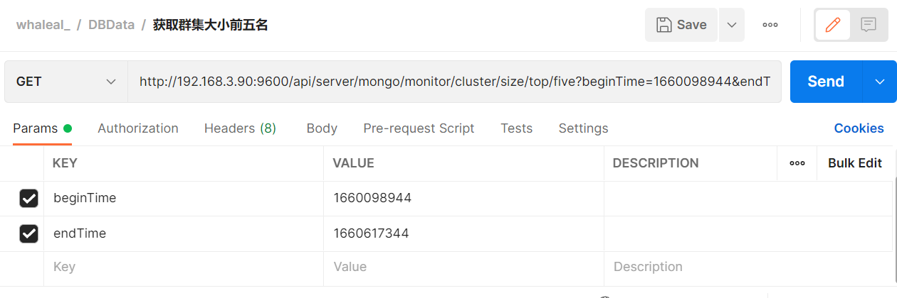

----

2.3 返回结果

|               |     Description    |           Schema              |  
| --------------|----------------------|---------------------------
| code        |   状态符:1000成功,其余异常 |             int          |    
| data       |         返回数据         |         List                |        

 

[comment]: <> (![img.png]&#40;../Images/cluster_size_top_five_r.png&#41;)

~~~
{
    "code": 1000,
    "data": [
        {
            "_id": "62d666c50f57845ee4c76090",
            "clusterSize": 0,
            "size": "0.00KB",
            "clusterName": "test_repl"
        },
        {
            "_id": "62d65068561b4a25b8339740",
            "clusterSize": 0,
            "size": "0.00KB",
            "clusterName": "shard"
        }
    ]
}

~~~

---

 

###  3 获取集合大小前五名

3.1 请求路径

GET: http://{Server-Host}:{端口}/api/server/mongo/monitor/collection/size/top/five

---

3.2 请求参数

| Name                |     Located in     |           Description         |     Required    |        Schema   |
| -------------------|----------------------|-------------------------------|-----------------|-----------   |
| beginTime          |         Params           |            开始时间            |        Yes       |long
| endTime          |         Params           |            结束时间            |        Yes       |long

 

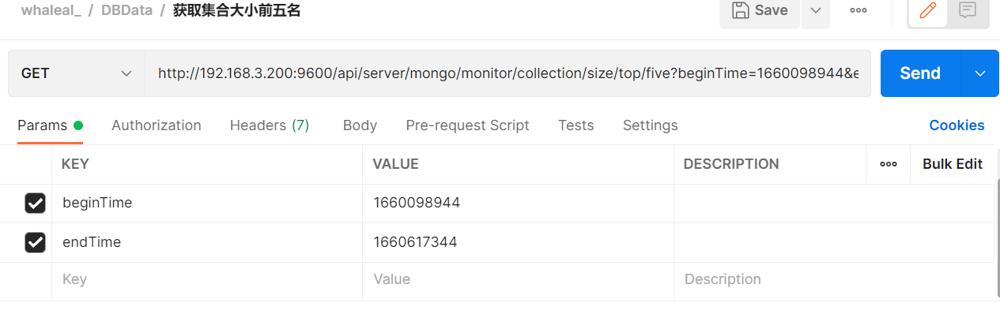

----

3.3 返回结果

|               |     Description    |           Schema              |  
| --------------|----------------------|---------------------------
| code        |   状态符:1000成功,其余异常 |         int              |    
| data       |         返回数据         |        List                |        

 

[comment]: <> (![img_1.png]&#40;../Images/collection_size_top_five_r.png&#41;)

~~~
{
    "code": 1000,
    "data": [
        {
            "_id": "62d67d21239d00094230b08f",
            "clusterId": "62d67d21239d00094230b08f",
            "createTime": 1658394516783,
            "dbTables": {
                "name": "fs.chunks",
                "type": "collection",
                "options": {},
                "info": {
                    "readOnly": false,
                    "uuid": {
                        "type": 4,
                        "data": "8MfjmDBFR5q9BYztGFDJQQ=="
                    }
                },
                "idIndex": {
                    "v": 2,
                    "key": {
                        "_id": 1
                    },
                    "name": "_id_",
                    "ns": "test.testColl"
                },
                "storageSize": 20,
                "size": 0,
                "ns": "test.testColl"
            },
            "fromServerExe": false,
            "updateTime": 0,
            "clusterName": "shard",
            "dbName": "test",
            "collectionName": "testColl",
            "size": "0.00KB"
        }
    ]
}
~~~

---

 

###  4 获取QPS大小前五

4.1 请求路径

GET: http://{Server-Host}:{端口}/api/server/mongo/monitor/QPS/size/top/five

---

4.2 请求参数

| Name                |     Located in     |           Description         |     Required    |        Schema   |
| -------------------|----------------------|-------------------------------|-----------------|-----------   |
| beginTime          |         Params           |            开始时间            |        Yes       |long
| endTime          |         Params           |            结束时间            |        Yes       |long

 

----

4.3 返回结果

|               |     Description    |           Schema              |  
| --------------|----------------------|---------------------------
| code        |   状态符:1000成功,其余异常 |            int           |    
| data       |         返回数据         |          List              |        

 

[comment]: <> (![img_2.png]&#40;../Images/QPS_size_top_five_r.png&#41;)

~~~
{
    "code": 1000,
    "data": [
        {
            "_id": {
                "hostId": "62cbbd7607bebb71b8429e5e",
                "port": "47018"
            },
            "host": "server200",
            "port": "47018",
            "QPS": 5520,
            "instance": "server200:47018"
        }
    ]
}
~~~

---

 

###  5 获取连接实例前五

5.1 请求路径

GET: http://{Server-Host}:{端口}/api/server/mongo/monitor/connection/instance/top/five

---

5.2 请求参数

| Name                |     Located in     |           Description         |     Required    |        Schema   |
| -------------------|----------------------|-------------------------------|-----------------|-----------   |
| beginTime          |         Params           |            开始时间            |        Yes       |long
| endTime          |         Params           |            结束时间            |        Yes       |long

 

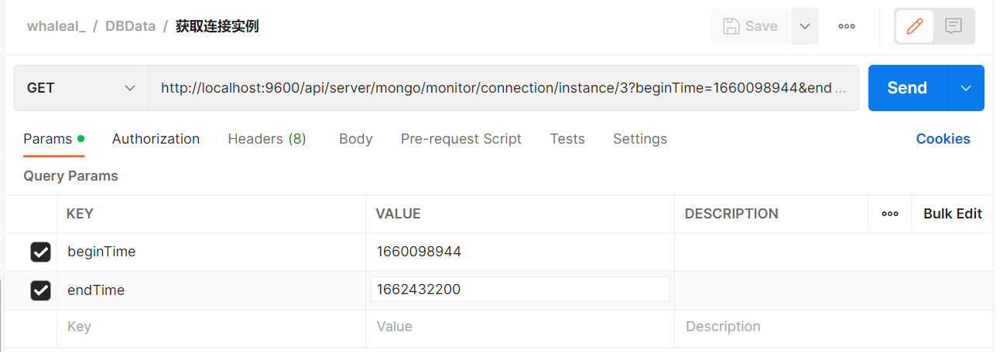

----

5.3 返回结果

|               |     Description    |           Schema              |  
| --------------|----------------------|---------------------------
| code        |   状态符:1000成功,其余异常 |      int                 |    
| data       |         返回数据         |        List                |        

 

[comment]: <> (![img_3.png]&#40;../Images/connection_size_top_five_r.png&#41;)

~~~
{
    "code": 1000,
    "data": [
        {
            "_id": {
                "hostId": "62cbbd7607bebb71b8429e5e",
                "port": "47018"
            },
            "host": "server200",
            "port": "47018",
            "Conn": 76,
            "instance": "server200:47018"
        }
    ]
}
~~~

---

 

###  6 获取慢查询前五

6.1 请求路径

GET: http://{Server-Host}:{端口}/api/server/mongo/monitor/slowest/instance/top/five

---

6.2 请求参数

| Name                |     Located in     |           Description         |     Required    |        Schema   |
| -------------------|----------------------|-------------------------------|-----------------|-----------   |
| beginTime          |         Params           |            开始时间            |        Yes       |long
| endTime          |         Params           |            结束时间            |        Yes       |long

 

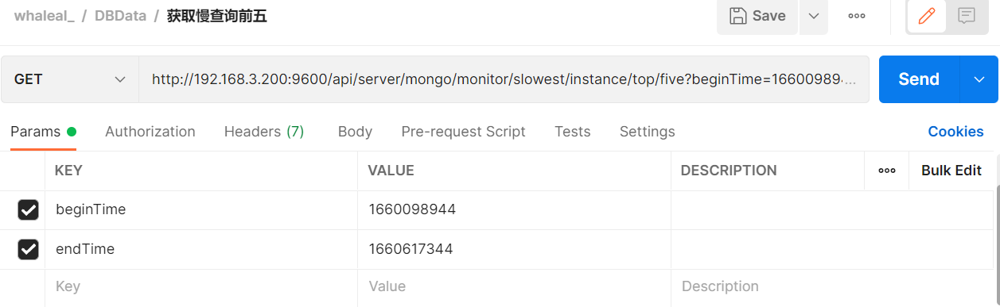

----

6.3 返回结果

|               |     Description    |           Schema              |  
| --------------|----------------------|---------------------------
| code        |   状态符:1000成功,其余异常 |          int             |    
| data       |         返回数据         |           List             |        

 

[comment]: <> (![img_4.png]&#40;../Images/slowest_size_top_five_r.png&#41;)

~~~
{
    "code": 1000,
    "data": [
        {
            "_id": "62d66d3cc5b6206027b993b0",
            "slow count": 8,
            "instance": "server200:47018"
        }
    ]
}
~~~

---

 

###  7 节点实时监控信息

7.1 请求路径

GET: http://{Server-Host}:{端口}/api/server/mongo/monitor/data/{{nodeId}}/{{timeType}}

---

7.2 请求参数

    timeType:REAL_TIME,ONE_DAY,ONE_WEEK
    dataType:qps,conn,pageFaults,memory,net,anAssert,cacheFlow,cacheUsage,latency,tickets,targetQ,scanAndOrder,collectionScan
	    documentOp,lockCondition,databaseLock,collectionLock,transactionCondition,deletedDocument

| Name                |     Located in     |           Description         |     Required    |        Schema   |
| -------------------|----------------------|-------------------------------|-----------------|-----------   |
| nodeId          |         Path           |            节点id            |        Yes       |String
| timeType          |         Path           |            查询时间类型            |        Yes       |String
| timeGranularity          |         Params           |            时间粒度            |        No       |long
| startTimeForTimeInterval          |         Params           |            开始时间间隔            |        No       |long
| endTimeForTimeInterval          |         Params           |            结束时间间隔            |        No       |long
| dataType          |         Params           |            数据类型            |        Yes       |long

 

----

7.3 返回结果

|               |     Description    |           Schema              |  
| --------------|----------------------|---------------------------
| code        |   状态符:1000成功,其余异常 |            int           |    
| data       |         返回数据         |            List            |        

 

[comment]: <> (![img_5.png]&#40;../Images/monitor_data_r.png&#41;)

~~~
 {
    "code": 1000,
    "data": {
        "delete": [
            0.0,
            0.0,
            0.0
        ],
        "insert": [
            8.0,
            15.0,
            2.0
        ],
        "query": [
            0.0,
            0.0,
            0.0
        ],
        "cmd": [
            6.0,
            5.0,
            3.0
        ],
        "getMore": [
            1.0,
            2.0,
            2.0
        ],
        "update": [
            0.0,
            0.0,
            0.0
        ]
    },
    "createTime": [
        1659511920000,
        1659511980000,
        1659512040000
    ],
    "name": "qps",
    "message": {
        "insert": "The average rate of inserts performed per second over the selected sample period",
        "delete": "The average rate of deletes performed per second over the selected sample period",
        "update": "The average rate of updates performed per second over the selected sample period",
        "query": "The average rate of queries performed per second over the selected sample period",
        "command": "The average rate of commands performed per second over the selected sample period",
        "getMore": "The average rate of getMores performed per second on any cursor over the selected sample period. On a primary, this number can be high even if the query count is low as the secondaries \"getMore\" from the primary often as part of replication."
    },
    "info": {
        "delete": {
            "max": 10,
            "min": 0,
            "avg": "0.35"
        },
        "insert": {
            "max": 32,
            "min": 0,
            "avg": "8.75"
        },
        "query": {
            "max": 0,
            "min": 0,
            "avg": "0.01"
        },
        "cmd": {
            "max": 10,
            "min": 1,
            "avg": "4.42"
        },
        "getMore": {
            "max": 2,
            "min": 0,
            "avg": "0.93"
        },
        "update": {
            "max": 0,
            "min": 0,
            "avg": "0.05"
        }
    }
}
~~~

---

 

###  8 根据id查询集群信息

8.1 请求路径

GET: http://{Server-Host}:{端口}/api/server/mongo/getMongoCluster/{{clusterId}}

---

8.2 请求参数

| Name                |     Located in     |           Description         |     Required    |        Schema   |
| -------------------|----------------------|-------------------------------|-----------------|-----------   |
| clusterId          |         Path           |            集群id            |        Yes       |String

 

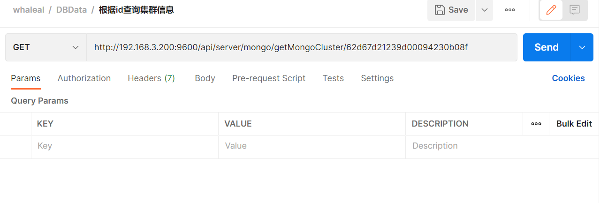

----

8.3 返回结果

|               |     Description    |           Schema              |  
| --------------|----------------------|---------------------------
| code        |   状态符:1000成功,其余异常 |           int            |    
| data       |         返回数据         |          JSON              |        

 

[comment]: <> (![img_6.png]&#40;../Images/getMongoCluster_r.png&#41;)

~~~
{
    "code": 1000,
    "data": {
        "id": "62d67d21239d00094230b08f",
        "createTime": 1658223967052,
        "updateTime": 1658223967052,
        "clusterName": "test",
        "type": 2,
        "mongoMember": null,
        "mongoReplica": {
            "id": "62d67d21239d00094230b08f",
            "createTime": 0,
            "updateTime": 0,
            "replicaName": "test",
            "memberList": [
              //节点信息
              ...
            ],
            "type": 1,     //1:单节点,2:复制集,3:分片
            "clusterId": "62d67d21239d00094230b08f",
            "deleteDataAndLogAble": false,
            "status": "正在运行",
            "operaLog": [],
            "replicationSettings": {},
            "replicationOtherSettings": {
                "securityKeyFileValue":
            },
            "authAble": true,
            "userName": "root",
            "password": "123456",
            "authDbName": "admin",
            "protocolVersion": 1,
            "writeConcernMajorityJournalDefault": false
        },
        "mongoShard": null,
        "status": "正常",
        "fcv": "4.2",
        "tag": "ys",
        "create": true
    }
}
~~~

---

 

###  9 获取集群日志信息

9.1 请求路径

GET: http://{Server-Host}:{端口}/api/server/mongo/getMongoClusterLogData/{{clusterId}}/{{pageIndex}}/{{pageSize}}

---

9.2 请求参数

| Name                |     Located in     |           Description         |     Required    |        Schema   |
| -------------------|----------------------|-------------------------------|-----------------|-----------   |
| clusterId          |         Path           |            集群id            |        Yes       |int
| pageIndex          |         Path           |            第几页            |        Yes       |int
| pageSize          |         Path           |            每页大小            |        Yes       |String
| memberName          |         Params           |            节点名称            |        Yes       |String
| logContent          |         Params           |            日志内容            |        Yes       |String
| startTime         |         Params           |            开始时间            |        No       |long
| endTime         |         Params           |            结束时间            |        No       |long

 

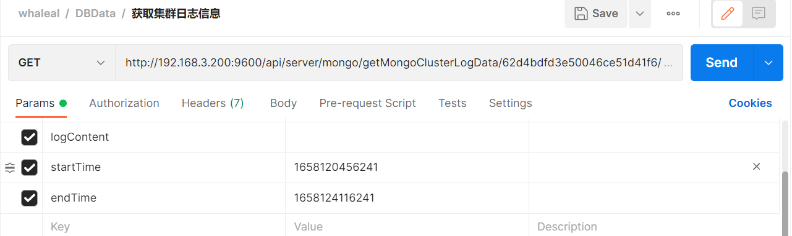

----

9.3 返回结果

|               |     Description    |           Schema              |  
| --------------|----------------------|---------------------------
| code        |   状态符:1000成功,其余异常 |           int            |    
| data       |         返回数据         |             List           |        

 

[comment]: <> (![img_8.png]&#40;../Images/getMongoClusterLogData_r.png&#41;)

~~~
{
    "code": 1000,
    "data": [
        {
            "id": "62d4f0363e50046ce51d44f3",
            "createTime": 1658122294338,
            "updateTime": 1658122294338,
            "memberName": "cluster",
            "clusterId": "62d4bdfd3e50046ce51d41f6",
            "eventId": null,
            "logInfoList": [
                {
                    "createTime": 1658122294338,
                    "log": "rz集群操作[updateMongoMemberInfo]成功"
                }
            ]
        }
    ]
}
~~~

---

 

###  10 获取mongo集群日志数

10.1 请求路径

GET: http://{Server-Host}:{端口}/api/server/mongo/getMongoClusterLogCount/{{clusterId}}

---

10.2 请求参数

| Name                |     Located in     |           Description         |     Required    |        Schema   |
| -------------------|----------------------|-------------------------------|-----------------|-----------   |
| clusterId          |         Path           |            集群id            |        Yes       |String
| memberName          |         Params           |            节点名称            |        Yes       |String
| logContent          |         Params           |            日志内容            |        Yes       |String
| startTime          |         Params           |            开始时间            |        No       |long
| endTime          |         Params           |            结束时间            |        No       |long

 

----

10.3 返回结果

|               |     Description    |           Schema              |  
| --------------|----------------------|---------------------------
| code        |   状态符:1000成功,其余异常 |            int|    
| data       |         返回数量         |           long             |        

 

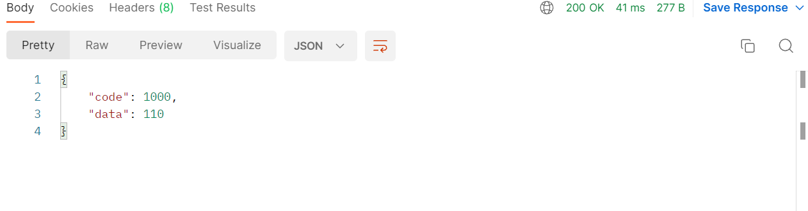

---

 

###  11 查询mongoD的日志信息.

11.1 请求路径

GET: http://{Server-Host}:{端口}/api/server/mongo/getMongoDLogData/{{mongoMemberId}}/{{pageIndex}}/{{pageSize}}

---

11.2 请求参数

    type类型:为空时查询全部,SHARDING,STORAGE,RECOVERY,CONTROL

| Name                |     Located in     |           Description         |     Required    |        Schema   |
| -------------------|----------------------|-------------------------------|-----------------|-----------   |
| mongoMemberId          |         Path           |            mongo节点id            |        Yes       |String
| pageIndex          |         Path           |            第几页            |        Yes       |int
| pageSize          |         Path           |            每页大小            |        Yes       |int
| type          |         Params           |            类型            |        No       |String
| startTime          |         Params           |            开始时间            |        No       |long
| endTime          |         Params           |            结束时间            |        No       |long
| content          |         Params           |            内容            |        No       |String

 

----

11.3 返回结果

|               |     Description    |           Schema              |  
| --------------|----------------------|---------------------------
| code        |   状态符:1000成功,其余异常 |         int              |    
| data       |         返回数据         |          MongoMember              |        

~~~
{
    "code": 1000,
    "data": [
        {
            "id": "62d5037fbb551e67507f9a32",
            "createTime": 0,
            "updateTime": 0,
            "log": {
                "t": "2022-07-18T06:53:49.151+00:00",
                "s": "I",
                "c": "NETWORK",
                "id": "[conn3161]",
                "msg": "end connection 192.168.3.80:58778 (5 connections now open)"
            },
            "nodeId": "62d4be9d3e50046ce51d4228",
            "fileOffset": 0
        }
    ]
}
~~~

---

 

###  12 查询mongoD的日志信息数

12.1 请求路径

GET: http://{Server-Host}:{端口}/api/server/mongo/getMongoDLogCount/{{mongoMemberId}}

---

12.2 请求参数

    type类型:为空时查询全部,STORAGE,RECOVERY,CONTROL

| Name                |     Located in     |           Description         |     Required    |        Schema   |
| -------------------|----------------------|-------------------------------|-----------------|-----------   |
| mongoMemberId          |         Path           |            mongo节点id            |        Yes       |String
| type          |         Params           |            类型            |        Yes       |String
| startTime          |         Params           |            开始时间            |        Yes       |String
| endTime          |         Params           |            结束时间            |        No       |String
| content          |         Params           |            搜索内容            |        No       |String

 

----

12.3 返回结果

|               |     Description    |           Schema              |  
| --------------|----------------------|---------------------------
| code        |   状态符:1000成功,其余异常 |        int               |    
| data       |         返回数量         |          long              |        

 

---

 

###  13 获取mongo的 top与op

13.1 请求路径

GET: http://{Server-Host}:{端口}/api/server/mongo/getMongoTopAndOp/{{mongoMemberId}}/{{type}}

---

13.2 请求参数

    type:1 top,2 op

| Name                |     Located in     |           Description         |     Required    |        Schema   |
| -------------------|----------------------|-------------------------------|-----------------|-----------   |
| mongoMemberId          |         Path           |            mongo节点id            |        Yes       |String
| type          |         Path           |            类型            |        Yes       |int

 

----

13.3 返回结果

|               |     Description    |           Schema              |  
| --------------|----------------------|---------------------------
| code        |   状态符:1000成功,其余异常 |        int|    
| data       |         返回数据         |           List             |        

 

---

 

###  14 更新集群名称

14.1 请求路径

GET: http://{Server-Host}:{端口}/api/server/mongo/updateClusterName/{{clusterId}}/{{newClusterName}}

---

14.2 请求参数

| Name                |     Located in     |           Description         |     Required    |        Schema   |
| -------------------|----------------------|-------------------------------|-----------------|-----------   |
| clusterId          |         Path           |            集群id            |        Yes       |String
| newClusterName          |         Path           |            新名称           |        Yes       |String

 

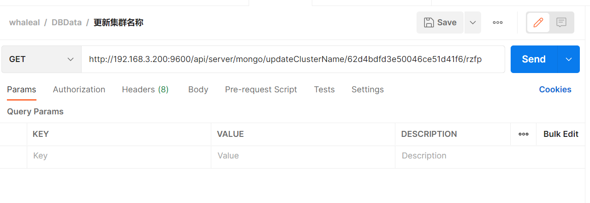

----

14.3 返回结果

|               |     Description    |           Schema              |  
| --------------|----------------------|---------------------------
| code        |   状态符:1000成功,其余异常 |        int               |    
| msg       |         返回消息         |            String            |        

 

---

 

###  15 获取mongo统计信息

15.1 请求路径

GET: http://{Server-Host}:{端口}/api/server/mongo/getMongoStatistics

---

15.2 请求

----

15.3 返回结果

|               |     Description    |           Schema              |  
| --------------|----------------------|---------------------------
| code        |   状态符:1000成功,其余异常 |         int              |    
| data       |         返回数据         |          JSON              |      

 

---

 

###  16 根据事件id查询mongo事件

16.1 请求路径

Get: http://{Server-Host}:{端口}/api/server/mongo/findMongoEventLogByEventId/{{eventId}}

---

16.2 请求参数

| Name                |     Located in     |           Description         |     Required    |        Schema   |
| -------------------|----------------------|-------------------------------|-----------------|-----------   |
| eventId          |         Path           |            事件id            |        Yes       |String

 

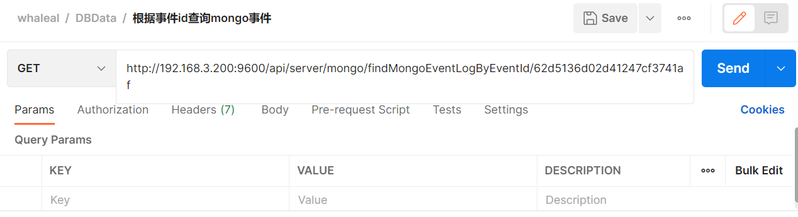

----

16.3 返回结果

|               |     Description    |           Schema              |  
| --------------|----------------------|---------------------------
| code        |   状态符:1000成功,其余异常 |         int              |    
| data       |         返回数据         |          List              |       

 

[comment]: <> (![img_15.png]&#40;../Images/findMongoEventLogByEventId_r.png&#41;)

~~~
{
    "code": 1000,
    "data": [
        {
            "createTime": 1658131316409,
            "log": "chen:45463操作[openQPS]成功"
        },
        {
            "createTime": 1658131317418,
            "log": "事件组结束"
        }
    ]
}
~~~

---

 

###  17 获取mongo事件日志数据

17.1 请求路径

GET: http://{Server-Host}:{端口}/api/server/mongo/getMongoEventLogData/{{clusterId}}/{{pageIndex}}/{{pageSize}}

---

17.2 请求参数

    status:'初始化','正在运行','暂停','结束','异常结束' '中止'

| Name                |     Located in     |           Description         |     Required    |        Schema   |
| -------------------|----------------------|-------------------------------|-----------------|-----------   |
| clusterId          |         Path           |            集群id            |        Yes       |String
| pageSize          |         Path           |           每页大小            |        Yes       |int
| pageIndex          |         Path           |          第几页             |        Yes       |int
| status          |         Params           |          状态            |        No       |String
| eventName          |         Params           |       事件名称                |        No       |String
| operatorName          |         Params           |       操作者                |        No       |String

 

----

17.3 返回结果

|               |     Description    |           Schema              |  
| --------------|----------------------|---------------------------
| code        |   状态符:1000成功,其余异常 |        int               |    
| data       |         返回数据         |      List                  |      

 

[comment]: <> (![img_14.png]&#40;../Images/getMongoEventLogData_r.png&#41;)

~~~
{
    "code": 1000,
    "data": [
        {
            "id": "62d5281602d41247cf3741d0",
            "createTime": 1658136598663,
            "updateTime": 1658136704891,
            "clusterId": "62d4bdfd3e50046ce51d41f6",
            "eventName": "集群进行操作:delete",
            "operatorId": "62b2d434e0869c777c439867",
            "operatorName": "lhp1234",
            "status": "结束",
            "logList": null
        }
    ]
}
~~~

---

 

###  18 获取mongo事件日志数据数

18.1 请求路径

GET: http://{Server-Host}:{端口}/api/server/mongo/getMongoEventLogCount/{{clusterId}}

---

18.2 请求参数

    status:'初始化','正在运行','暂停','结束','异常结束' '中止'

| Name                |     Located in     |           Description         |     Required    |        Schema   |
| -------------------|----------------------|-------------------------------|-----------------|-----------   |
| clusterId          |         Path           |            集群id            |        Yes       |String
| eventName          |         Params           |          事件名称             |        No       |String
| status          |         Params           |         状态             |        No       |String
| operatorName          |         params           |       操作者                 |        No       |String

 

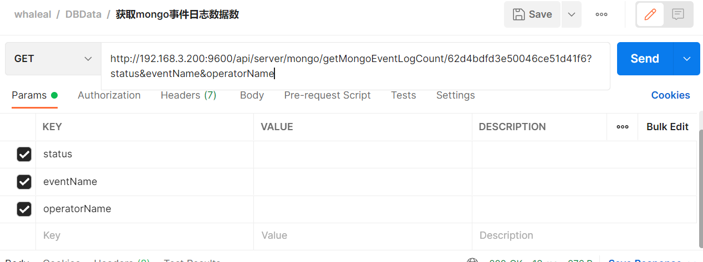

----

18.3 返回结果

|               |     Description    |           Schema              |  
| --------------|----------------------|---------------------------
| code        |   状态符:1000成功,其余异常 |         int              |    
| data       |         返回数量         |           long             |        

 

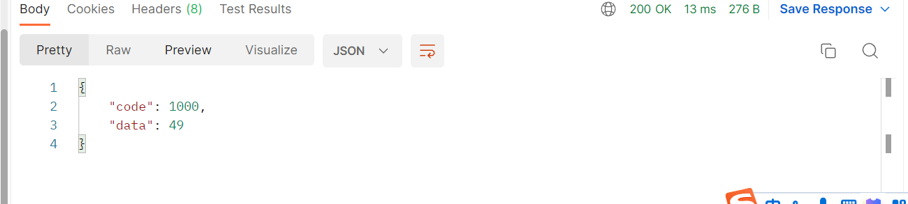

---

 

###  19 查找mongoDB集群信息数据

19.1 请求路径

GET: http://{Server-Host}:{端口}/api/server/mongo/findMongoDBClusterInfoData/{{pageIndex}}/{{pageSize}}

---

19.2 请求参数

    type:1 单节点,2 复制集,3 分片

| Name                |     Located in     |           Description         |     Required    |        Schema   |
| -------------------|----------------------|-------------------------------|-----------------|-----------   |
| pageIndex          |         Path           |        第几页               |        Yes       |int
| pageSize          |         Path           |            每页大小            |        Yes       |int
| type          |         params           |         集群类型            |        No       |int
| clusterName          |         params           |      集群名称           |        No       |String
| mongoMemberName          |         params           |       mongo成员名称          |        No       |String
| fcv          |         params           |       fcv         |        No       |String

 

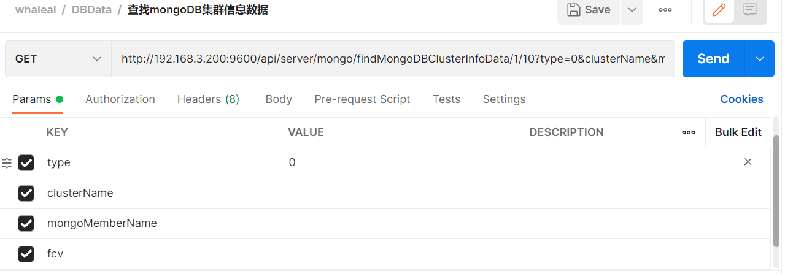

----

19.3 返回结果

|               |     Description    |           Schema              |  
| --------------|----------------------|---------------------------
| code        |   状态符:1000成功,其余异常 |           int            |    
| data       |         返回数据         |            List            |        

 

[comment]: <> (![img_15.png]&#40;../Images/findMongoDBClusterInfoData_r.png&#41;)

~~~
{
    "code": 1000,
    "data": [
        {
            "id": "62fa2017fe07726988b761fa",
            "createTime": 1660559406829,
            "updateTime": 1660559406829,
            "clusterName": "server100:36398",
            "type": 1,
            "mongoMember": {
                "id": "62fa2017fe07726988b761fa",
                "createTime": 0,
                "updateTime": 1660618121809,
                "memberName": "server100:36398",
                "hostName": "server100",
                "hostId": "62ecdb15dce5916b2b6f1b3c",
                "port": "36398",
                "version": "4.0.25",
                "upgradeVersion": null,
                "userName": "",
                "password": "",
                "authDbName": "admin",
                "currentTimeMillis": 1660559383622,
                "dataDirectory": "/home/chen/data36398",
                "logFile": "/home/chen/data36398/log.log",
                "confPath": "/home/chen/data36398/server100_36398.conf",
                "authAble": false,
                "runShCmd": "/var/whaleal/agent//mongodb-linux-x86_64-enterprise-rhel70-4.0.25/bin/mongod -f /home/chen/data36398/server100_36398.conf",
                "type": 11,
                "status": "正在运行",
                "monitorServerStatus": false,
                "monitorTopAndOp": false,
                "collectMongoLog": false,
                "mongoLogFileOffset": 0,
                "operaLogTemp": [],
                "votes": 1,
                "priority": 1.0,
                "delay": 0,
                "buildIndexes": true,
                "procId": "46031",
                "clusterId": "62fa2017fe07726988b761fa",
                "replId": null,
                "clusterName": null,
                "tags": {},
                "configurationOptions": {
                    "systemLog_destination": "file",
                    "storage_wiredTiger_engineConfig_cacheSizeGB": "0.3",
                    "systemLog_path": "/home/chen/data36398/log.log",
                    "processManagement_fork": "true",
                    "storage_dbPath": "/home/chen/data36398",
                    "systemLog_logAppend": "true",
                    "net_bindIp": "0.0.0.0",
                    "net_port": "36398"
                },
                "operateVersion": 3916
            },
            "mongoReplica": null,
            "mongoShard": null,
            "status": "正常",
            "fcv": "4.0",
            "tag": "",
            "create": true
        }
    ]
}

~~~

---

 

###  20 查找mongoDB集群信息数据数

20.1 请求路径

GET: http://{Server-Host}:{端口}/api/server/mongo/findMongoDBClusterInfoCount

---

20.2 请求参数

    type:1 单节点,2 复制集,3 分片

| Name                |     Located in     |           Description         |     Required    |        Schema   |
| -------------------|----------------------|-------------------------------|-----------------|-----------   |
| fcv          |         Params           |            fcv            |        Yes       |String
| clusterName          |         Params           |            集群名称            |        No       |String
| type          |         Params           |       集群类型             |        No       |int
| mongoMemberName          |         Params           |     mongo成员名称                |        No       |String

 

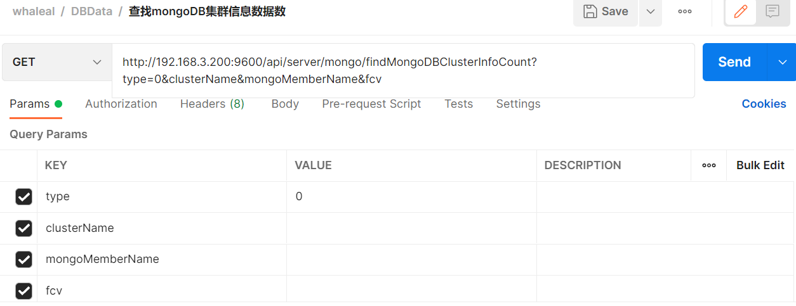

----

20.3 返回结果

|               |     Description    |           Schema              |  
| --------------|----------------------|---------------------------
| code        |   状态符:1000成功,其余异常 |           int            |    
| data       |         返回数量         |          long              |        

 

---

 

###  21 获取mongo db 集合

21.1 请求路径

GET: http://{Server-Host}:{端口}/api/server/mongo/getMongoDBCollections/{{clusterId}}/{{eventId}}

---

21.2 请求参数

| Name                |     Located in     |           Description         |     Required    |        Schema   |
| -------------------|----------------------|-------------------------------|-----------------|-----------   |
| clusterId          |         Path           |            集群id            |        Yes       |String
| eventId          |         Path           |            事件id            |        Yes       |String

 

----

21.3 返回结果

|               |     Description    |           Schema              |  
| --------------|----------------------|---------------------------
| code        |   状态符:1000成功,其余异常 |           int            |    
| data       |         返回数据         |             List           |        

 

~~~
{
    "code": 1000,
    "data": [
        {
            "name": "coll",
            "type": "collection",
            "options": {},
            "info": {
                "readOnly": false,
                "uuid": {
                    "type": 4,
                    "data": "OSkYm+PbSX6DaTsGUrU4rQ=="
                }
            },
            "idIndex": {
                "v": 2,
                "key": {
                    "_id": 1
                },
                "name": "_id_",
                "ns": "cc.coll"
            },
            "storageSize": 156,
            "size": 335,
            "ns": "cc.coll"
        }
    ]
}
~~~

---

 

###  22 获取用户mongodb集群

22.1 请求路径

GET: http://{Server-Host}:{端口}/api/server/mongo/getMongoDBClusterUser/{{clusterId}}

---

22.2 请求参数

| Name                |     Located in     |           Description         |     Required    |        Schema   |
| -------------------|----------------------|-------------------------------|-----------------|-----------   |
| clusterId          |         Path           |            集群id            |        Yes       |String

 

----

22.3 返回结果

|               |     Description    |           Schema              |  
| --------------|----------------------|---------------------------
| code        |   状态符:1000成功,其余异常 |         int              |    
| data       |         返回数据         |            List            |        

 

~~~
{
    "code": 1000,
    "data": [
        
        {
            "_id": "admin.16581342589211",
            "userId": {
                "type": 4,
                "data": "LMMiWU2KT5GVoDCbkt3B4g=="
            },
            "user": "16581342589211",
            "db": "admin",
            "credentials": {
                "SCRAM-SHA-1": {
                    "iterationCount": 10000,
                    "salt": "EtUoKxhxaN78GCaQVKduRg==",
                    "storedKey": "pZma/HuyZVNFzSB1PU9ROxMvblc=",
                    "serverKey": "av4+YbsNnwRnb1RKeFewS5ocHIo="
                }
            },
            "authenticationRestrictions": [
                {
                    "clientSource": [
                        "192.168.3.200"
                    ]
                }
            ],
            "roles": [
                {
                    "role": "root",
                    "db": "admin"
                }
            ]
        }
    ]
}
~~~

---

 

###  23 获取mongodb角色数据

23.1 请求路径

GET: http://{Server-Host}:{端口}/api/server/mongo/getMongoDBClusterRole/{{clusterId}}

---

23.2 请求参数

| Name                |     Located in     |           Description         |     Required    |        Schema   |
| -------------------|----------------------|-------------------------------|-----------------|-----------   |
| clusterId          |         Path           |            集群id            |        Yes       |String

 

----

23.3 返回结果

|               |     Description    |           Schema              |  
| --------------|----------------------|---------------------------
| code        |   状态符:1000成功,其余异常 |         int              |    
| data       |         返回数据         |          List              |        

 

~~~
{
    "code": 1000,
    "data": [
        {
            "role": "__queryableBackup",
            "db": "admin",
            "isBuiltin": true,
            "roles": [],
            "inheritedRoles": [],
            "privileges": [
                {
                    "resource": {
                        "db": "config",
                        "collection": "settings"
                    },
                    "actions": [
                        "find"
                    ]
                }
            ]
        }
    }
~~~
---

 

###  24 执行一个计划

24.1 请求路径

POST: http://{Server-Host}:{端口}/api/server/mongo/exeExplainPlan/{{clusterId}}/{{mongoMemberId}}

---

24.2 请求参数

| Name                |     Located in     |           Description         |     Required    |        Schema   |
| -------------------|----------------------|-------------------------------|-----------------|-----------   |
| clusterId          |         Path           |            集群id            |        Yes       |String
| mongoMemberId          |         Path           |            mongo成员id            |        Yes       |String
| document          |         Body           |       请求参数               |        Yes       |Map

 

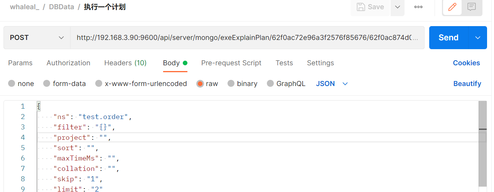

----

24.3 返回结果

|               |     Description    |           Schema              |  
| --------------|----------------------|---------------------------
| code        |   状态符:1000成功,其余异常 |          int             |    
| data       |         返回数据         |            JSON            |        

 

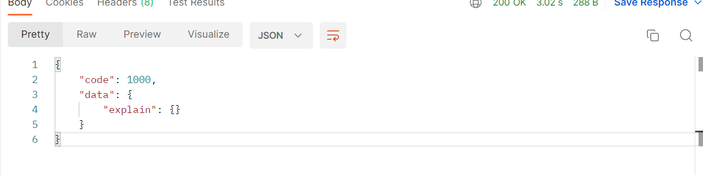

~~~
{
    "code": 1000,
    "data": {
        "explain": {
            "queryPlanner": {
                "plannerVersion": 1,
                "namespace": "test.order",
                "indexFilterSet": false,
                "parsedQuery": {},
                "winningPlan": {
                    "stage": "EOF"
                },
                "rejectedPlans": []
            },
            "executionStats": {
                "executionSuccess": true,
                "nReturned": 0,
                "executionTimeMillis": 0,
                "totalKeysExamined": 0,
                "totalDocsExamined": 0,
                "executionStages": {
                    "stage": "EOF",
                    "nReturned": 0,
                    "executionTimeMillisEstimate": 0,
                    "works": 1,
                    "advanced": 0,
                    "needTime": 0,
                    "needYield": 0,
                    "saveState": 0,
                    "restoreState": 0,
                    "isEOF": 1
                },
                "allPlansExecution": []
            },
            "serverInfo": {
                "host": "server121",
                "port": 47018,
                "version": "4.4.12",
                "gitVersion": "51475a8c4d9856eb1461137e7539a0a763cc85dc"
            },
            "ok": 1.0,
            "$clusterTime": {
                "clusterTime": {
                    "array": false,
                    "binary": false,
                    "boolean": false,
                    "bsonType": "TIMESTAMP",
                    "dBPointer": false,
                    "dateTime": false,
                    "decimal128": false,
                    "document": false,
                    "double": false,
                    "inc": 85,
                    "int32": false,
                    "int64": false,
                    "javaScript": false,
                    "javaScriptWithScope": false,
                    "null": false,
                    "number": false,
                    "objectId": false,
                    "regularExpression": false,
                    "string": false,
                    "symbol": false,
                    "time": 1660618654,
                    "timestamp": true,
                    "value": 7132302810057539669
                },
                "signature": {
                    "hash": {
                        "data": "AAAAAAAAAAAAAAAAAAAAAAAAAAA=",
                        "type": 0
                    },
                    "keyId": 0
                }
            },
            "operationTime": {
                "array": false,
                "binary": false,
                "boolean": false,
                "bsonType": "TIMESTAMP",
                "dBPointer": false,
                "dateTime": false,
                "decimal128": false,
                "document": false,
                "double": false,
                "inc": 85,
                "int32": false,
                "int64": false,
                "javaScript": false,
                "javaScriptWithScope": false,
                "null": false,
                "number": false,
                "objectId": false,
                "regularExpression": false,
                "string": false,
                "symbol": false,
                "time": 1660618654,
                "timestamp": true,
                "value": 7132302810057539669
            }
        },
        "documentsReturned": 0,
        "queryExecutionTime": 0,
        "indexKeysExamined": 0,
        "documentsExamined": 0,
        "stagList": [
            {
                "stage": "EOF",
                "nReturned": 0,
                "executionTimeMillisEstimate": 0,
                "works": 1,
                "advanced": 0,
                "needTime": 0,
                "needYield": 0,
                "saveState": 0,
                "restoreState": 0,
                "isEOF": 1
            }
        ]
    }
}

~~~

---

 

###  25 获取所有mongo配置参数.

25.1 请求路径

GET: http://{Server-Host}:{端口}/api/server/mongo/getMongoDBProcessArgument

---

25.2 请求

----

25.3 返回结果

|               |     Description    |           Schema              |  
| --------------|----------------------|---------------------------
| code        |   状态符:1000成功,其余异常 |          int             |    
| data       |         返回数据         |         List               |        

 

~~~
{
    "code": 1000,
    "data": [
        {
            "id": "62faf2bcd0810e3aeace6dae",
            "createTime": 0,
            "updateTime": 0,
            "maxVersion": null,
            "minVersion": null,
            "name": "SYSTEM_LOG_VERBOSITY",
            "options": [
                {
                    "label": "1 (v)",
                    "value": "1"
                },
                {
                    "label": "2 (vv)",
                    "value": "2"
                },
                {
                    "label": "3 (vvv)",
                    "value": "3"
                },
                {
                    "label": "4 (vvvv)",
                    "value": "4"
                },
                {
                    "label": "5 (vvvvv)",
                    "value": "5"
                }
            ],
            "path": "systemLog.verbosity",
            "processTypes": "ALL",
            "shortName": "verbosity",
            "type": "INTEGER",
            "credential": false
        },
        {
            "id": "62faf2bcd0810e3aeace6daf",
            "createTime": 0,
            "updateTime": 0,
            "maxVersion": null,
            "minVersion": null,
            "name": "SYSTEM_LOG_QUIET",
            "options": [
                {
                    "label": "TRUE",
                    "value": "true"
                },
                {
                    "label": "FALSE",
                    "value": "false"
                }
            ],
            "path": "systemLog.quiet",
            "processTypes": "ALL",
            "shortName": "quiet",
            "type": "BOOLEAN",
            "credential": false
        }
    ]
}
~~~

 

###  26 获取mongodb集合

26.1 请求路径

GET: http://{Server-Host}:{端口}/api/server/mongo/getMongoDBCollections/{{clusterId}}/{{eventId}}

---

26.2 请求参数

| Name                |     Located in     |           Description         |     Required    |        Schema   |
| -------------------|----------------------|-------------------------------|-----------------|-----------   |
| clusterId          |         Path           |            集群id            |        Yes       |String
| eventId          |         Path           |            事件id            |        Yes       |String

----

26.3 返回结果

|               |     Description    |           Schema              |  
| --------------|----------------------|---------------------------
| code        |   状态符:1000成功,其余异常 |          int             |    
| data       |         返回数据         |         List               |        

 

~~~
{
    "code": 1000,
    "data": [
        {
            "name": "test",
            "sub": [
                {
                    "name": "a",
                    "type": "collection",
                    "options": {},
                    "info": {
                        "readOnly": false,
                        "uuid": {
                            "type": 4,
                            "data": "g6tXU8InRwCFt85bofFJHQ=="
                        }
                    },
                    "idIndex": {
                        "v": 2,
                        "key": {
                            "_id": 1
                        },
                        "name": "_id_",
                        "ns": "test.a"
                    },
                    "storageSize": 1444,
                    "size": 3222,
                    "ns": "test.a"
                }
            ]
        }
    ]
}
~~~

 

###  27 查询集群库数据

27.1 请求路径

POST: http://{Server-Host}:{端口}/api/server/mongo/queryClusterDbData/{{clusterId}}/{{eventId}}

---

27.2 请求参数

| Name                |     Located in     |           Description         |     Required    |        Schema   |
| -------------------|----------------------|-------------------------------|-----------------|-----------   |
| clusterId          |         Path           |            集群id            |        Yes       |String
| eventId          |         Path           |            事件id            |        Yes       |String
| map          |         Body           |            查询条件              |        Yes       |Map

~~~
Ex. 查询集群库数据;其中 Map 如下所示:
{
    "ns": "test.a",
    "query": "{}",
    "pageSize": 10,
    "pageIndex": 1
}
~~~

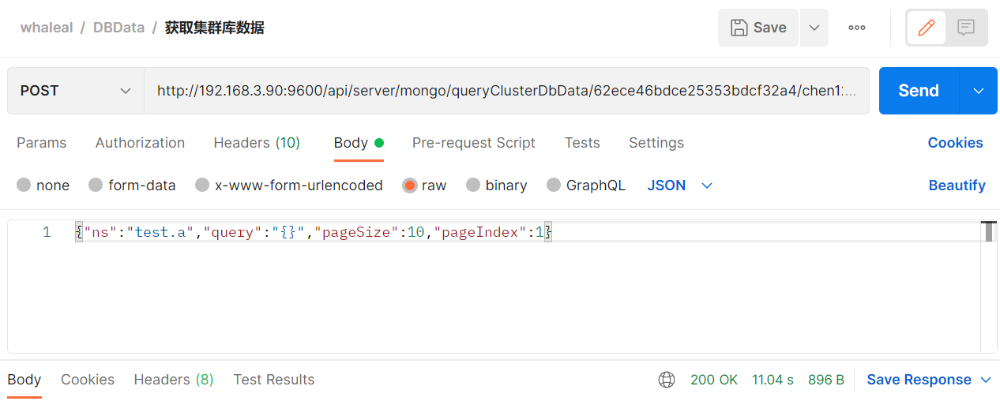

----

27.3 返回结果

|               |     Description    |           Schema              |  
| --------------|----------------------|---------------------------
| code        |   状态符:1000成功,其余异常 |          int             |    
| data       |         返回数据         |         List               |        

 

~~~
{
    "code": 1000,
    "data": [
        {
            "_id": {
                "date": 1659684764000,
                "timestamp": 1659684764
            },
            "a": 1.0
        },
        {
            "_id": {
                "date": 1659684764000,
                "timestamp": 1659684764
            },
            "a": 2.0
        },
        {
            "_id": {
                "date": 1659684764000,
                "timestamp": 1659684764
            },
            "a": 3.0
        }
    ]
}
~~~

 

###  28 创建索引

28.1 请求路径

POST: http://{Server-Host}:{端口}/api/server/mongo/createIndex/{{clusterId}}/{{eventId}}

---

28.2 请求参数

| Name                |     Located in     |           Description         |     Required    |        Schema   |
| -------------------|----------------------|-------------------------------|-----------------|-----------   |
| clusterId          |         Path           |            集群id            |        Yes       |String
| eventId          |         Path           |            事件id            |        Yes       |String
| map          |         Body           |            索引配置            |        Yes       |Map

~~~
Ex. 创建索引;其中 Map 如下所示:
{
    "indexName": "chen",
    "ns": "test.coll",
    "index": "{a:1}",                     //前三项配置即可添加，其余为选项内容
    "buildIndexInTheBackground": false,
    "createUniqueIndex": false,
    "createTTL": "",
    "partialFilterExpression": "",
    "wildcardProjection": "",
    "useCustomCollationLocale": "",
    "useCustomCollationStrength": "",
    "useCustomCollationCaseLevel": "",
    "useCustomCollationCaseFirst": "",
    "useCustomCollationNumericOrdering": "",
    "useCustomCollationAlternate": "",
    "useCustomCollationMaxVariable": "",
    "useCustomCollationBackwards": "",
    "useCustomCollationNormalization": ""
}
~~~

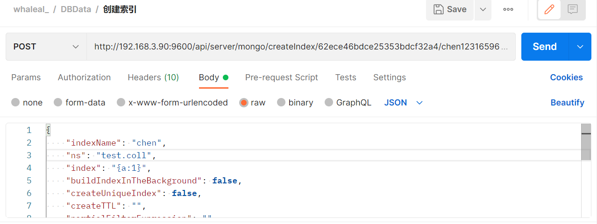

----

28.3 返回结果

|               |     Description    |           Schema              |  
| --------------|----------------------|---------------------------
| code        |   状态符:1000成功,其余异常 |          int             |    
| msg       |         返回消息       |         String               |        

 

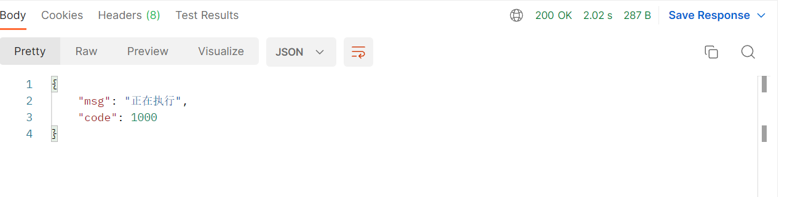

 

###  29 诊断数据

29.1 请求路径

GET: http://{Server-Host}:{端口}/api/server/mongo/mdiagData/{{clusterId}}/{{pageIndex}}/{{pageSize}}

---

29.2 请求参数

| Name                |     Located in     |           Description         |     Required    |        Schema   |
| -------------------|----------------------|-------------------------------|-----------------|-----------   |
| clusterId          |         Path           |            集群id            |        Yes       |String
| pageIndex          |         Path           |            第几页            |        Yes       |int
| pageSize          |         Path           |            每页大小            |        Yes       |int

 

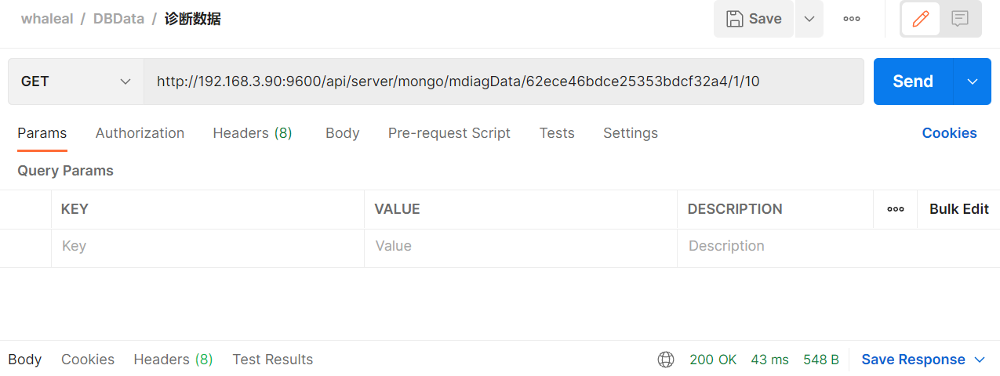

----

29.3 返回结果

|               |     Description    |           Schema              |  
| --------------|----------------------|---------------------------
| code        |   状态符:1000成功,其余异常 |          int             |    
| data       |         返回数据         |         List               |        

~~~

{
    "code": 1000,
    "data": [
        {
            "_id": "62ecf7a2a3a6e138ea1f00b0",
            "filename": "mdiag_server100_1659696513419.gz",
            "length": 1733449,
            "chunkSize": 261120,
            "uploadDate": "2022-08-05T10:57:38.925+00:00",
            "metadata": {
                "clusterId": "62ece46bdce25353bdcf32a4",
                "createTime": 1659697058890
            },
            "id": "62ecf7a2a3a6e138ea1f00b0"
        }
    ]
}

~~~

 

###  30 获取诊断数

30.1 请求路径

GET: http://{Server-Host}:{端口}/api/server/mongo/mdiagCount/{{clusterId}}

---

30.2 请求参数

| Name                |     Located in     |           Description         |     Required    |        Schema   |
| -------------------|----------------------|-------------------------------|-----------------|-----------   |
| clusterId          |         Path           |            集群id            |        Yes       |String

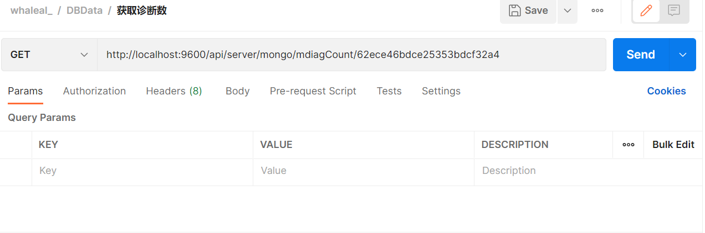

----

30.3 返回结果

|               |     Description    |           Schema              |  
| --------------|----------------------|---------------------------
| code        |   状态符:1000成功,其余异常 |          int             |    
| data       |         返回数量         |         long    |        

 

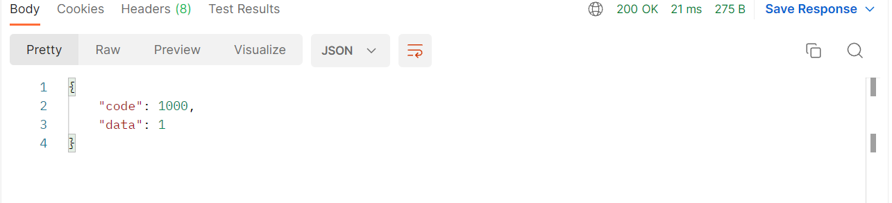

 

###  31 更新事件状态

31.1 请求路径

GET: http://{Server-Host}:{端口}/api/server/mongo/updateEventStatus/{{eventId}}/{{status}}

---

31.2 请求参数

| Name                |     Located in     |           Description         |     Required    |        Schema   |
| -------------------|----------------------|-------------------------------|-----------------|-----------   |
| eventId          |         Path           |            事件id            |        Yes       |String
| clusterId          |         Path           |            状态|        Yes       |String

----

31.3 返回结果

|               |     Description    |           Schema              |  
| --------------|----------------------|---------------------------
| code        |   状态符:1000成功,其余异常 |          int             |    
| msg       |         返回消息       |         String    |        

 

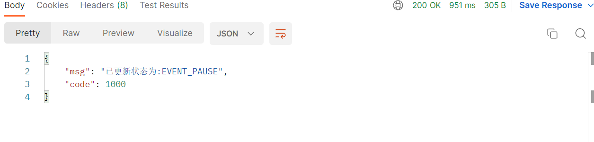

 

###  32 获巡检日志

32.1 请求路径

GET: http://{Server-Host}:{端口}/api/server/mongo/getMdiagLog/{{clusterId}}/{{eventId}}

---

32.2 请求参数

| Name                |     Located in     |           Description         |     Required    |        Schema   |
| -------------------|----------------------|-------------------------------|-----------------|-----------   |
| eventId          |         Path           |            事件id            |        Yes       |String
| clusterId          |         Path           |            状态|        Yes       |String

----

32.3 返回结果

|               |     Description    |           Schema              |  
| --------------|----------------------|---------------------------
| code        |   状态符:1000成功,其余异常 |          int             |    
| data       |         返回数据        |         List    |        

 

###  33 获取所有集群id与名称

33.1 请求路径

GET: http://{Server-Host}:{端口}/api/server/mongo/getAllClusterIdAndName

---

33.2 请求参数

| Name                |     Located in     |           Description         |     Required    |        Schema   |
| -------------------|----------------------|-------------------------------|-----------------|-----------   |
| clusterName          |         Params           |            集群名称            |        false       |String

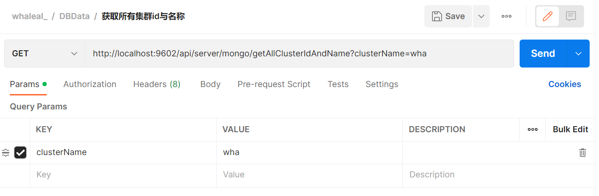

----

33.3 返回结果

|               |     Description    |           Schema              |  
| --------------|----------------------|---------------------------
| code        |   状态符:1000成功,其余异常 |          int             |    
| data       |         返回数量         |         long    |        

 

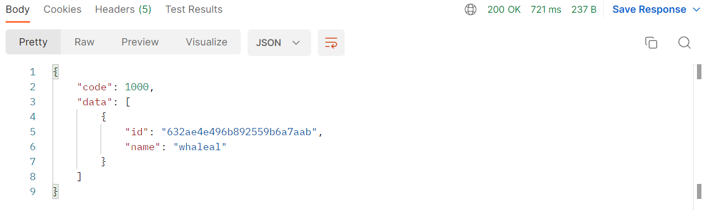

--- 
---

 

[comment]: <> (31更改事件状态)

[comment]: <> (GET: http://localhost:9602/api/server/mongo/updateEventStatus/{{eventId}}/{{status}})

[comment]: <> (## MongoMember)

[comment]: <> (|       Name         |     Type             |    Description      |   )

[comment]: <> (| ------------       |----------            |---------------------|)

[comment]: <> (| memberName                 |   String             |         主机名:端口          |   )

[comment]: <> (| hostName             |   String             |         主机名     |   )

[comment]: <> (| hostId              |   Long |         主机id     |   )

[comment]: <> (| port               |   String             |         端口     |   )

[comment]: <> (| version         |   String             |         版本     |   )

[comment]: <> (| upgradeVersion           |   String             |         升降级版本     |   )

[comment]: <> (| password           |   String             |         节点密码     |   )

[comment]: <> (| authDbName           |   String             |         认证库     |   )

[comment]: <> (| currentTimeMillis           |   long             |         当前时间戳     |   )

[comment]: <> (| dataDirectory           |   String             |         数据目录     |   )

[comment]: <> (| userName             |   String             |         节点用户名     |   )

[comment]: <> (| logFile             |   String             |         日志文件     |   )

[comment]: <> (| confPath             |   String             |         配置文件路径     |   )

[comment]: <> (| deleteDataAndLogAble             |   String             |         是否强制删除     |   )

[comment]: <> (| authAble             |   String             |         是否开启认证     |   )

[comment]: <> (| runShCmd             |   String             |         执行启动命令     |   )

[comment]: <> (| type             |   enum             |         节点类型     |   )

[comment]: <> (注 type:11 单例)

[comment]: <> (*)

[comment]: <> (* 
 普通复制集)

[comment]: <> (* 31 普通成员节点)

[comment]: <> (* 32 隐藏节点)

[comment]: <> (* 33 仲裁节点)

[comment]: <> (* 34 隐藏延迟节点)

[comment]: <> (* 35 主节点)

[comment]: <> (* 
 config复制集)

[comment]: <> (* 41 config普通成员节点)

[comment]: <> (* 42 config隐藏节点)

[comment]: <> (* 43 config仲裁节点)

[comment]: <> (* 44 config隐藏延迟节点)

[comment]: <> (* 45 config主节点)

[comment]: <> (* 
 shard复制集)

[comment]: <> (* 51 shard普通成员节点)

[comment]: <> (* 52 shard隐藏节点)

[comment]: <> (* 53 shard仲裁节点)

[comment]: <> (* 54 shard隐藏延迟节点)

[comment]: <> (* 55 shard主节点)

[comment]: <> (* 
 mongoS)

[comment]: <> (* 61 mongoS)

[comment]: <> (---)

[comment]: <> (---)