# MongoOperate接口
接口调用时须在请求头中设置whaleal-Token ，填写参数发起请求，返回内容为 JSON 格式的信息，返回特殊实体类将在最后提供实体类表格。
其参数为时间的都以时间戳形式传递。

有些接口调用时需用到clusterId、replicateId、eventId、mongoMemberId
~~~
eventId在"获取集群日志信息"接口处找到所需事件的id

mongoMemberId在“查找mongoDB集群信息数据”接口返回结果集中mongoMember集合中。

replicateId在“查找mongoDB集群信息数据”接口返回结果集中replicate集合中。

clusterId在“查找mongoDB集群信息数据”接口返回结果集中。
~~~

 

### 请求头默认格式，特殊情况特殊声明

    whaleal-Token在调用登录接口时返回，在之后调用接口时将token放置请求头中。
[登录接口调用获取whaleal-Token](Member.md)

| KEY                |     VALUE      |     
| -------------------|----------------------|
| Accept-Encoding        |         gzip,deflate,br |     
| Connection          |         keep-alive           |          
| Content-Type          |         application/json |    
| whaleal-token          |         "token"           |     
---

 

## Deprecated 已弃用
###  1 创建mongodb单例

1.1 请求路径

POST: http://{Server-Host}:{端口}/api/server/mongo/createMongoStandalone/{{isNewCluster}}/{{clusterId}}/{{replicateId}}

---

1.2 请求参数

| Name                |     Located in     |           Description         |     Required    |        Schema   |
| -------------------|----------------------|-------------------------------|-----------------|-----------   |
| isNewCluster          |         Path           |            是否时新集群            |        Yes       |boolean
| clusterId          |         Path           |            集群id            |        Yes       |String
| replicateId          |         Path           |            复制集id            |        Yes       |String
| mongoMember          |         Body           |            实体对象            |        Yes       | MongoMember
| tag          |         Params           |            标签            |        No       | String

 

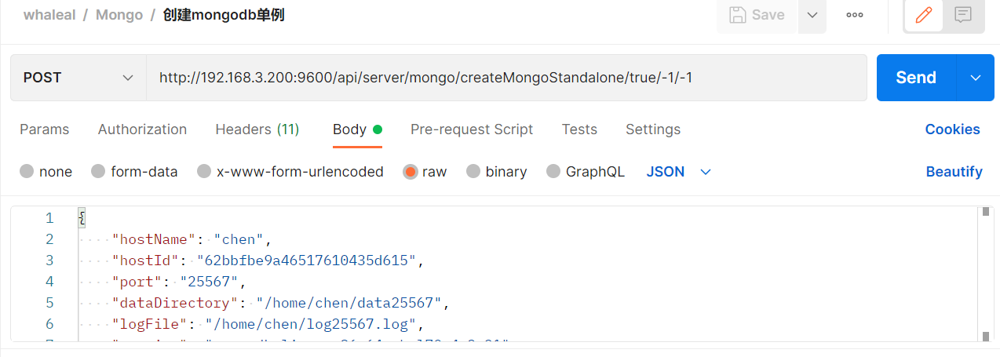

 

~~~
Ex. 创建mongodb单例;其中 MongoMember 如下所示:
{
"hostName": "chen",
"hostId": "62bbfbe9a46517610435d615",
"port": "25567",
"dataDirectory": "/home/chen/data25567",
"logFile": "/home/chen/log25567.log",
"version": "mongodb-linux-x86_64-rhel70-4.2.21",
"deleteDataAndLogAble": "false",
"authAble": "false",
"userName": "",
"password": "",
"configurationOptions": {
    "storage.wiredTiger.engineConfig.cacheSizeGB": "0.3"
    }
}
~~~

----

1.3 返回结果

|               |     Description    |           Schema              |  
| --------------|----------------------|---------------------------
| code        |   状态符:1000成功,其余异常 |       int                |    
| msg       |         返回消息         |             String           |        
| eventId       |         事件id         |         String               |        
| data       |         返回数据         |          JSON              |        

 

[comment]: <> (![img_1.png]&#40;../Images/createMongoStandalone_r.png&#41;)

~~~
{
    "msg": "正在执行",
    "eventId": "62ce9a7ded494511782ff392",
    "code": 1000,
    "data": {
        "id": null,
        "createTime": 0,
        "updateTime": 0,
        "memberName": "null:27017",
        "hostName": null,
        "hostId": null,
        "port": "27017",
        "version": null,
        "upgradeVersion": null,
        "userName": null,
        "password": null,
        "authDbName": "admin",
        "currentTimeMillis": 1657707133455,
        "dataDirectory": "/var/ops/mongodb1657707133455/data/",
        "logFile": "/var/ops/mongodb1657707133455/log/log.log",
        "confPath": "/var/ops/mongodb1657707133455/mongo.conf",
        "deleteDataAndLogAble": false,
        "authAble": false,
        "runShCmd": null,
        "type": 11,
        "status": "无状态",
        "monitorServerStatus": false,
        "monitorTopAndOp": false,
        "collectMongoLog": false,
        "mongoLogFileOffset": 0,
        "operaLogTemp": [],
        "votes": 1,
        "priority": 1.0,
        "delay": 0,
        "buildIndexes": true,
        "procId": "",
        "clusterId": "62ce9a7ded494511782ff393",
        "replId": null,
        "clusterName": null,
        "tags": {},
        "configurationOptions": {},
        "operateVersion": 0
    }
}
~~~
---

 

###  2 单节点转为复制集.

2.1 请求路径

GET: http://{Server-Host}:{端口}/api/server/mongo/standaloneToReplicate/{{clusterId}}/{{replName}}

---

2.2 请求参数

| Name                |     Located in     |           Description         |     Required    |        Schema   |
| -------------------|----------------------|-------------------------------|-----------------|-----------   |
| clusterId          |         Path           |            集群id            |        Yes       |String        |
| replName          |         Path           |            复制集名称            |        Yes       |String        |

 

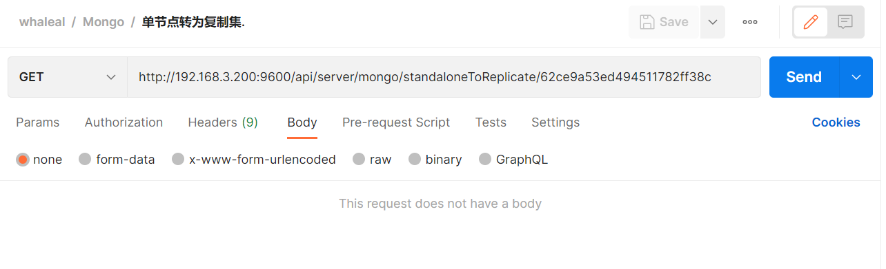

----

2.3 返回结果

|               |     Description    |           Schema              |  
| --------------|----------------------|---------------------------
| code        |   状态符:1000成功,其余异常 |            int           |    
| msg       |         返回消息         |           String             |        

 

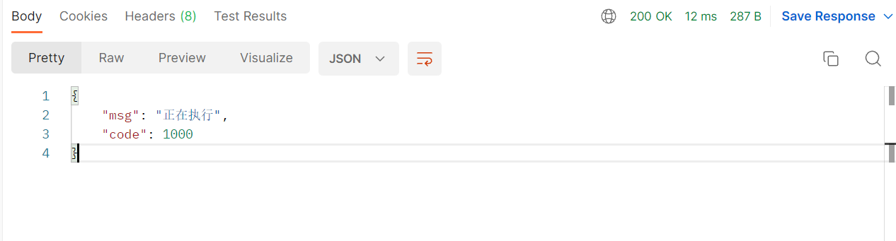

---

 

###  3 创建mongodb复制集

3.1 请求路径

POST: http://{Server-Host}:{端口}/api/server/mongo/createMongoReplica

---

3.2 请求参数

| Name                |     Located in     |           Description         |     Required    |        Schema   |
| -------------------|----------------------|-------------------------------|-----------------|-----------   |
| mongoReplica          |         Body           |           mongo复制集实体对象           |        Yes       |  MongoReplica      |
| tag          |         Params           |            标签            |        No       |String        |

 

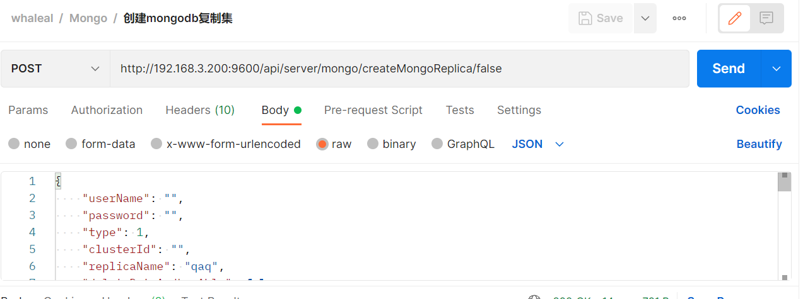

~~~
Ex. 创建mongodb复制集;MongoReplica 如下所示：
{
    "userName": "",
    "password": "",
    "type": 1,
    "clusterId": "",
    "replicaName": "qaq",
    "deleteDataAndLogAble": false,
    "status": "",
    "authAble": "false",
    "operaLog": [],
    "memberList": [
        {
            "type": 31,
            "hostName": "chen",
            "hostId": "62bbfbe9a46517610435d615",
            "port": "25025",
            "version": "mongodb-linux-x86_64-rhel70-4.2.21",
            "votes": "1",
            "priority": "1",
            "delay": "",
            "buildIndexes": true,
            "dataDirectory": "/home/chen/data25025",
            "logFile": "/home/chen/log25025.log",
            "configurationOptions": {
                "storage.wiredTiger.engineConfig.cacheSizeGB": "0.3"
            }
        }
    ],
    "replicationSettings": {
        "protocolVersion": null,
        "chainingAllowed": null,
        "writeConcernMajorityJournalDefault": null,
        "heartbeatTimeoutSecs": null,
        "electionTimeoutMillis": null,
        "catchUpTimeoutMillis": null,
        "catchUpTakeoverDelayMillis": null,
        "getLastErrorDefaults": null,
        "forceReconfigure": null
    }
}
~~~
----

3.3 返回结果

|               |     Description    |           Schema              |  
| --------------|----------------------|---------------------------
| code        |   状态符:1000成功,其余异常 |           int            |    
| data       |         返回数据         |         JSON               |        
| msg       |         返回消息         |         String               |        
| eventId       |         事件ID         |          String              |        

 

[comment]: <> (![img_4.png]&#40;../Images/createMongoReplica_r.png&#41;)

~~~
{
    "msg": "正在执行",
    "eventId": "62da7357239d00094230b51a",
    "code": 1000,
    "data": {
        "id": null,
        "createTime": 0,
        "updateTime": 0,
        "replicaName": null,
        "memberList": [],
        "type": 1,
        "clusterId": "62cf7903ed494511782ff4f9",
        "deleteDataAndLogAble": false,
        "status": null,
        "operaLog": [],
        "replicationSettings": {},
        "replicationOtherSettings": {},
        "authAble": false,
        "userName": null,
        "password": null,
        "authDbName": "admin",
        "protocolVersion": 1,
        "writeConcernMajorityJournalDefault": false
    }
}
~~~
---

 

###  4 创建mongodb分片

4.1 请求路径

POST: http://{Server-Host}:{端口}/api/server/mongo/createMongoSharded

---

4.2 请求参数

| Name                |     Located in     |           Description         |     Required    |        Schema   |
| -------------------|----------------------|-------------------------------|-----------------|-----------   |
| mongoShard          |         Body           |            实体对象            |        Yes       |MongoShard        |
| tag          |         Params           |            文件名称            |        No       |String        |

 

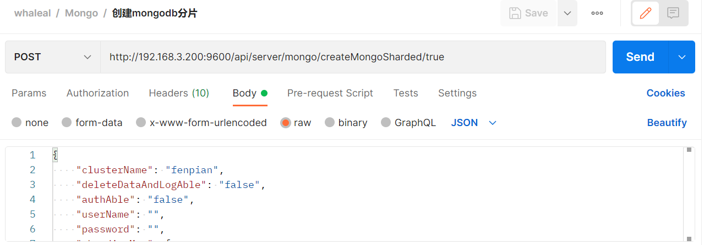

~~~
Ex. 创建mongodb分片;其中 MongoShard 如下所示:

{
    "clusterName": "fenpian",
    "deleteDataAndLogAble": "false",
    "authAble": "false",
    "userName": "",
    "password": "",
    "shardingMap": {
        "shard1": {
            "memberList": [
                {
                    "type": 1,
                    "hostName": "chen",
                    "hostId": "62bbfbe9a46517610435d615",
                    "port": "44567",
                    "version": "mongodb-linux-x86_64-rhel70-4.2.21",
                    "votes": "1",
                    "priority": "1",
                    "delay": "",
                    "buildIndexes": "true",
                    "dataDirectory": "/home/chen/data44567",
                    "logFile": "/home/chen/log44567.log",
                    "configurationOptions": {
                        "storage.wiredTiger.engineConfig.cacheSizeGB": "0.3"
                    }
                }
            ],
            "replicationSettings": {
                "replicaSetId": "shard1",
                "protocolVersion": null,
                "chainingAllowed": null,
                "writeConcernMajorityJournalDefault": null,
                "heartbeatTimeoutSecs": null,
                "electionTimeoutMillis": null,
                "catchUpTimeoutMillis": null,
                "catchUpTakeoverDelayMillis": null,
                "getLastErrorDefaults": null,
                "forceReconfigure": null
            }
        }
    },
    "config": {
        "memberList": [
            {
                "type": 1,
                "hostName": "server100",
                "hostId": "62b153a344ba1b7771c42df7",
                "port": "44567",
                "version": "mongodb-linux-x86_64-rhel70-4.2.21",
                "votes": "1",
                "priority": "1",
                "delay": "",
                "buildIndexes": "true",
                "dataDirectory": "/home/chen/data44567",
                "logFile": "/home/chen/log44567.log",
                "configurationOptions": {
                    "storage.wiredTiger.engineConfig.cacheSizeGB": "0.3"
                }
            }
        ],
        "replicationSettings": {
            "replicaSetId": "config",
            "protocolVersion": "",
            "chainingAllowed": "",
            "writeConcernMajorityJournalDefault": "",
            "heartbeatTimeoutSecs": "",
            "electionTimeoutMillis": "",
            "catchUpTimeoutMillis": "",
            "catchUpTakeoverDelayMillis": "",
            "getLastErrorDefaults": "",
            "forceReconfigure": ""
        }
    },
    "mongoS": [
        {
            "logFile": "/home/chen/log44567.log",
            "dataDirectory": "/home/chen/data44567",
            "hostName": "server200",
            "version": "mongodb-linux-x86_64-rhel70-4.2.21",
            "port": "44567",
            "configurationOptions": {
                "storage.wiredTiger.engineConfig.cacheSizeGB": "0.3"
            },
            "hostId": "62cbbd7607bebb71b8429e5e"
        }
    ]
}
~~~
----

4.3 返回结果

|               |     Description    |           Schema              |  
| --------------|----------------------|---------------------------
| code        |   状态符:1000成功,其余异常 |      int                 |    
| msg       |         返回消息         |         String               |        
| eventId       |         事件id         |      String                  |        
| data       |         返回数据         |      JSON                  |        

 

[comment]: <> (![img_6.png]&#40;../Images/createMongoSharded_r.png&#41;)

~~~
{
    "msg": "正在执行",
    "eventId": "62da73c4239d00094230b51c",
    "code": 1000,
    "data": {
        "id": null,
        "createTime": 0,
        "updateTime": 0,
        "clusterName": null,
        "clusterId": "62cf8e51ed494511782ff6c8",
        "config": null,
        "mongoS": [],
        "shardingMap": {},
        "operaLog": [],
        "deleteDataAndLogAble": false,
        "authAble": false,
        "userName": null,
        "password": null,
        "authDbName": "admin",
        "status": null
    }
}
~~~
---

 

###  5 操作开启认证的集群

5.1 请求路径

POST: http://{Server-Host}:{端口}/api/server/mongo/operateClusterAbleAuth/{{clusterId}}

---

5.2 请求参数

| Name                |     Located in     |           Description         |     Required    |        Schema   |
| -------------------|----------------------|-------------------------------|-----------------|-----------   |
| clusterId          |         Path           |            文件名称            |        Yes       |String        |
| map          |         Body           |           传参            |        Yes       |Map        |

 

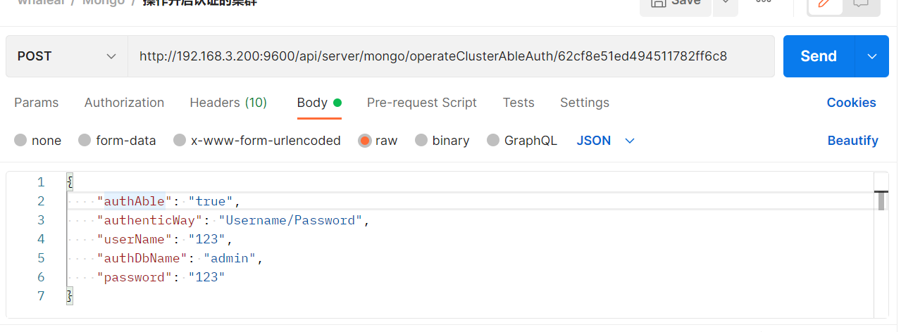

~~~
Ex. 操作开启认证的集群;其中map 如下所示:
{
    "authAble": "true",    //false 时 不需要其余参数
    "userName": "123",
    "password": "123"
}
~~~

----

5.3 返回结果

|               |     Description    |           Schema              |  
| --------------|----------------------|---------------------------
| code        |   状态符:1000成功,其余异常 |          int             |    
| msg       |         返回消息         |            String            |        
| eventId       |         事件id         |        String                |        

 

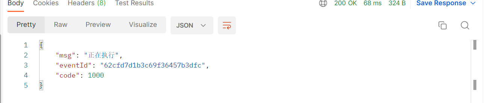

---

 

###  6 添加shard

6.1 请求路径

POST: http://{Server-Host}:{端口}/api/server/mongo/addShard/{{clusterId}}

---

6.2 请求参数

| Name                |     Located in     |           Description         |     Required    |        Schema   |
| -------------------|----------------------|-------------------------------|-----------------|-----------   |
| clusterId          |         Path           |            集群id            |        Yes       |String        |
| mongoReplica          |         Body           |            mongo复制集实体对象           |        Yes       |MongoReplica        |

 

~~~

Ex. 添加shard;其中 MongoReplica 如下所示:

{
    "type": 3,
    "clusterId": "",
    "replicaName": "qwe",
    "authAble": "true",
    "userName": "",
    "password": "",
    "deleteDataAndLogAble": false,
    "status": "",
    "operaLog": [],
    "memberList": [
        {
            "type": 51,
            "hostName": "chen",
            "hostId": "62bbfbe9a46517610435d615",
            "port": "44453",
            "version": "mongodb-linux-x86_64-rhel70-4.2.21",
            "votes": "1",
            "priority": "1",
            "delay": "",
            "buildIndexes": true,
            "dataDirectory": "/home/chen/data44453",
            "logFile": "/home/chen/log44453.log",
            "configurationOptions": {
                "storage.wiredTiger.engineConfig.cacheSizeGB": "0.3"
            }
        }
    ]
}
~~~

----

6.3 返回结果

|               |     Description    |           Schema              |  
| --------------|----------------------|---------------------------
| code        |   状态符:1000成功,其余异常 |        int               |    
| msg       |         返回消息         |          String              |   

 

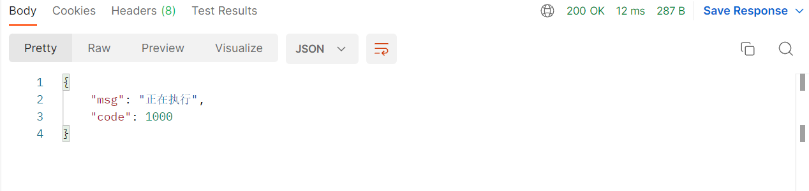

---

 

###  7 纳管集群信息

7.1 请求路径

POST: http://{Server-Host}:{端口}/api/server/mongo/mongoManaged

---

7.2 请求参数

| Name                |     Located in     |           Description         |     Required    |        Schema   |
| -------------------|----------------------|-------------------------------|-----------------|-----------   |
|        mongoMember    |        Body             |     mongo成员实体对象              |     Yes           |   MongoMember      |

 

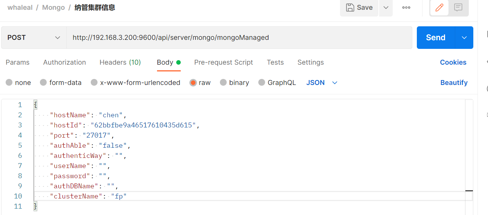

~~~
Ex. 纳管集群信息;其中 MongoMember 如下所示:
{
    "hostName": "chen",
    "hostId": "62bbfbe9a46517610435d615",
    "port": "27017",
    "authAble": "false",
    "userName": "",
    "password": "",
    "authDBName": "",
    "clusterName": "fp"
}
~~~

----

7.3 返回结果

|               |     Description    |           Schema              |  
| --------------|----------------------|---------------------------
| code        |   状态符:1000成功,其余异常 |          int             |    
| msg       |         返回消息         |       String                 |        
| data       |         返回数据         |         JSON               |        

 

~~~
{
    "msg": "正在执行",
    "code": 1000,
    "data": {
        "id": "62cfa41fed494511782ff7a2",
        "createTime": 1657775135326,
        "updateTime": 1657775135326,
        "clusterName": "fp",
        "type": 1,
        "mongoMember": {
            ...
        },
        "mongoReplica": null,
        "mongoShard": null,
        "status": null,
        "fcv": null,
        "tag": null,
        "create": true
    }
}

~~~

 

###  8 升降级

8.1 请求路径

GET: http://{Server-Host}:{端口}/api/server/mongo/upgrade/{{clusterId}}/{{version}}/{{type}}

---

8.2 请求参数

    type: 1 升级,-1 降级

| Name                |     Located in     |           Description         |     Required    |        Schema   |
| -------------------|----------------------|-------------------------------|-----------------|-----------   |
| clusterId          |         Path           |            集群id            |        Yes       |String        |
| version          |         Path           |            版本            |        Yes       |String        |
| type          |         Path           |            集群类型            |        Yes       |String        |

 

----

8.3 返回结果

|               |     Description    |           Schema              |  
| --------------|----------------------|---------------------------
| code        |   状态符:1000成功,其余异常 |         int              |    
| msg       |         返回消息         |         String               |        

 

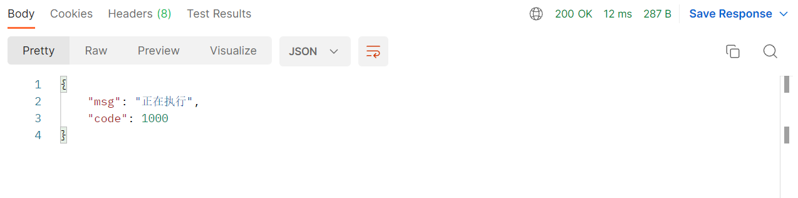

---

 

###  9 针对节点进行操作.

9.1 请求路径

GET: http://{Server-Host}:{端口}/api/server/mongo/operate/{{clusterId}}/{{mongoMemberId}}/{{operateType}}

---

9.2 请求参数

    operateType:updateMongoMemberInfo,startUp,shuntDown,restart,delete,canalQPS,openQPS,canalTopAndOP,openTopAndOP,canalCollectMongoLog,openColletMongoLog ,becomePrimary ,removeMember

| Name                |     Located in     |           Description         |     Required    |        Schema   |
| -------------------|----------------------|-------------------------------|-----------------|-----------   |
| clusterId          |         Path           |            集群id            |        Yes       |String        |
| mongoMemberId          |         Path           |            mongo集群id            |        Yes       |String        |
| operateType          |         Path           |            操作类型            |        Yes       |String        |

 

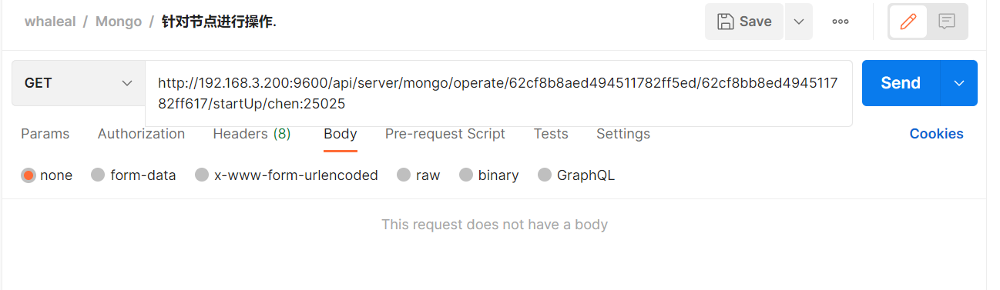

----
9.3 返回结果

|               |     Description    |           Schema              |  
| --------------|----------------------|---------------------------
| code        |   状态符:1000成功,其余异常 |        int               |    
| msg       |         返回消息         |         String               |        

 

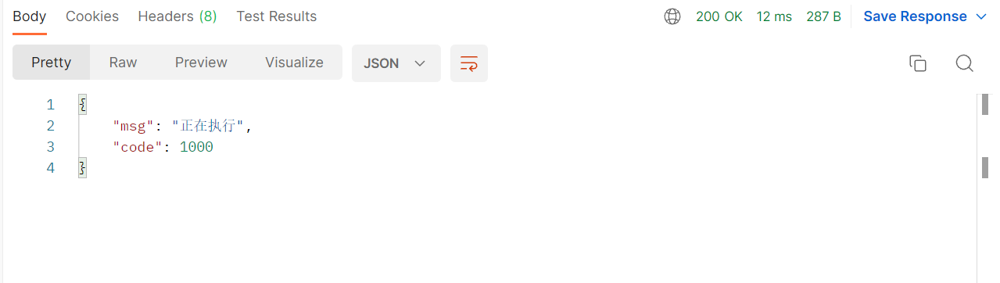

---

 

###  10 针对集群进行操作

10.1 请求路径

GET: http://{Server-Host}:{端口}/api/server/mongo/operate/{{clusterId}}/{{operateType}}

---

10.2 请求参数

    operateType:updateMongoMemberInfo,startUp,shuntDown,restart,delete,mdiag

| Name                |     Located in     |           Description         |     Required    |        Schema   |
| -------------------|----------------------|-------------------------------|-----------------|-----------   |
| clusterId          |         Path           |            集群id            |        Yes       |String        |
| operateType          |         Path           |            操作类型            |        Yes       |String        |

 

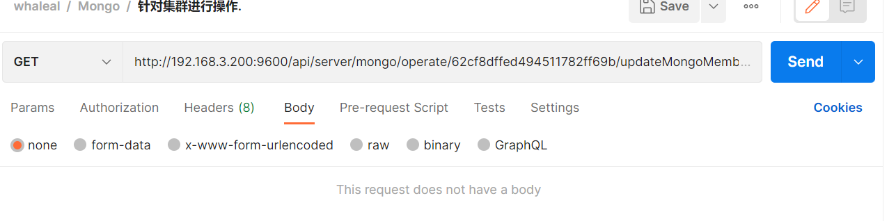

----

10.3 返回结果

|               |     Description    |           Schema              |  
| --------------|----------------------|---------------------------
| code        |   状态符:1000成功,其余异常 |         int              |    
| msg       |         返回消息         |            String            |     

 

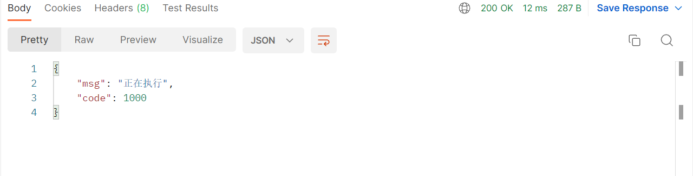

---

 

###  11 更新集群信息

11.1 请求路径

POST: http://{Server-Host}:{端口}/api/server/mongo/updateClusterInfo

---

11.2 请求参数

| Name                |     Located in     |           Description         |     Required    |        Schema   |
| -------------------|----------------------|-------------------------------|-----------------|-----------   |
| mongoClusterInformation   |         Body           |            Mongo集群信息实体对象            |        Yes    | JSON          |  

 

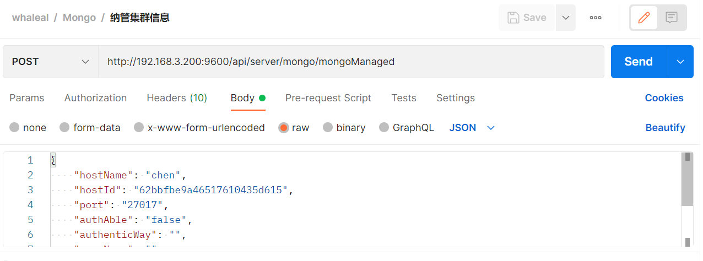

~~~
Ex. 更新集群信息;其中MongoClusterInformation 如下所示:
{
    "id": "62cfa574ed494511782ff7c1",
    "createTime": 1657775520238,
    "updateTime": 1657775520238,
    "clusterName": "chen:63343",
    "type": 1,
    "mongoMember": {
        "id": "62cfa574ed494511782ff7c1",
        "createTime": 1657775520238,
        "updateTime": 1657776654587,
        "memberName": "chen:63343",
        "hostName": "chen",
        "hostId": "62bbfbe9a46517610435d615",
        "port": "63343",
        "version": "4.2.21",
        "upgradeVersion": null,
        "userName": "",
        "password": "",
        "authDbName": "admin",
        "currentTimeMillis": 1657775476157,
        "dataDirectory": "/home/chen/data63343",
        "logFile": "/home/chen/log63343.log",
        "confPath": "/home/chen/data63343/chen_63343.conf",
        "deleteDataAndLogAble": false,
        "authAble": false,
        "runShCmd": "",
        "type": 11,
        "status": "正在运行",
        "monitorServerStatus": false,
        "monitorTopAndOp": false,
        "collectMongoLog": false,
        "mongoLogFileOffset": 0,
        "operaLogTemp": [],
        "votes": 1,
        "priority": 1,
        "delay": 0,
        "buildIndexes": true,
        "procId": "10654",
        "clusterId": "62cfa574ed494511782ff7c1",
        "replId": null,
        "clusterName": null,
        "tags": {},
        "configurationOptions": {
        },
        "operateVersion": 80
    },
    "mongoReplica": null,
    "mongoShard": null,
    "status": "正常",
    "fcv": "4.2",
    "tag": "",
    "create": true
}
~~~

----

11.3 返回结果

|               |     Description    |           Schema              |  
| --------------|----------------------|---------------------------
| code        |   状态符:1000成功,其余异常 |          int             |    
| msg       |         返回消息         |             String           |        

 

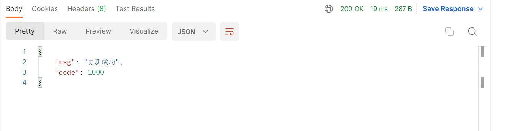

---
---

 

###  12 创建单节点

12.1 请求路径

POST: http://{Server-Host}:{端口}/api/server/mongo/createMongoStandalone

---

12.2 请求参数

| Name                |     Located in     |           Description         |     Required    |        Schema   |
| -------------------|----------------------|-------------------------------|-----------------|-----------   |
| mongoMember   |         Body           |            Mongo对象            |        Yes    | MongoMember          |  
| tag   |         Params           |            标签            |        No    | String          |  

 

~~~
Ex. 创建单节点;mongoMember 如下所示:
{
    "hostName": "chen",
    "hostId": "62bbfbe9a46517610435d615",
    "port": "25567",
    "dataDirectory": "/home/chen/data25567",
    "logFile": "/home/chen/log25567.log",
    "version": "mongodb-linux-x86_64-rhel70-4.2.21",
    "deleteDataAndLogAble": "false",
    "authAble": "false",
    "userName": "",
    "password": "",
    "configurationOptions": {
        "storage.wiredTiger.engineConfig.cacheSizeGB": "0.3"
    }
}
~~~

----

12.3 返回结果

|               |     Description    |           Schema              |  
| --------------|----------------------|---------------------------
| code        |   状态符:1000成功,其余异常 |          int             |    
| msg       |         返回消息         |             String           |        
| eventId       |         事件id         |             String           |        
| data       |         返回数据        |             JSON           |        

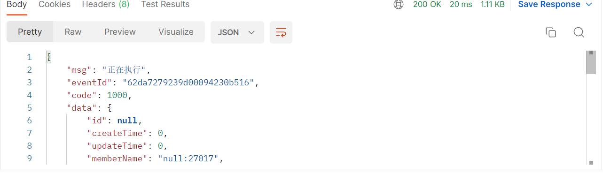

~~~
{
    "msg": "正在执行",
    "eventId": "62fb0d67fe07726988b7621b",
    "code": 1000,
    "data": {
        "id": null,
        "createTime": 0,
        "updateTime": 0,
        "memberName": "null:27017",
        "hostName": null,
        "hostId": null,
        "port": "27017",
        "version": null,
        "upgradeVersion": null,
        "userName": null,
        "password": null,
        "authDbName": "admin",
        "currentTimeMillis": 1660620135962,
        "dataDirectory": "/var/ops/mongodb1660620135962/data/",
        "logFile": "/var/ops/mongodb1660620135962/log/log.log",
        "confPath": "/var/ops/mongodb1660620135962/mongo.conf",
        "authAble": false,
        "runShCmd": null,
        "type": 11,
        "status": "无状态",
        "monitorServerStatus": false,
        "monitorTopAndOp": false,
        "collectMongoLog": false,
        "mongoLogFileOffset": 0,
        "operaLogTemp": [],
        "votes": 1,
        "priority": 1.0,
        "delay": 0,
        "buildIndexes": true,
        "procId": "",
        "clusterId": "62fb0d67fe07726988b7621c",
        "replId": null,
        "clusterName": null,
        "tags": {},
        "configurationOptions": {},
        "operateVersion": 0
    }
}

~~~

 

###  13 复制集添加节点

13.1 请求路径

POST: http://{Server-Host}:{端口}/api/server/mongo/replAddMember/{{clusterId}}/{{replicateId}}

---

13.2 请求参数

| Name                |     Located in     |           Description         |     Required    |        Schema   |
| -------------------|----------------------|-------------------------------|-----------------|-----------   |
| mongoMember   |         Body           |            Mongo对象            |        Yes    | MongoMember          |  
| clusterId   |         Path           |            集群id            |        Yes    | String          |  
| replicateId   |         Path           |            复制集id            |        Yes    | String          |  

 

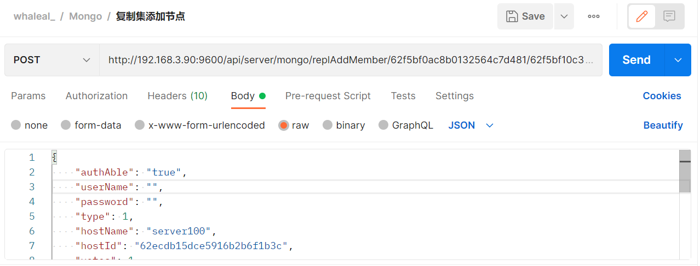

~~~
Ex. 创建单节点;mongoMember 如下所示:
{
    "authAble": "true",
    "userName": "",
    "password": "",
    "type": 1,
    "hostName": "server100",
    "hostId": "62ecdb15dce5916b2b6f1b3c",
    "votes": 1,
    "delay": 10000,
    "priority": 1,
    "port": "34535",
    "dataDirectory": "/home/chen/data34535",
    "logFile": "/home/chen/data34535/log.log",
    "version": "mongodb-linux-x86_64-enterprise-rhel70-4.0.25",
    "deleteDataAndLogAble": "",
    "configurationOptions": {
        "storage.wiredTiger.engineConfig.cacheSizeGB": "0.3"
    }
}
~~~

----

13.3 返回结果

|               |     Description    |           Schema              |  
| --------------|----------------------|---------------------------
| code        |   状态符:1000成功,其余异常 |          int             |    
| msg       |         返回消息         |             String           |        
| eventId       |         事件id         |             String           |        
| data       |         返回数据        |             JSON           |        

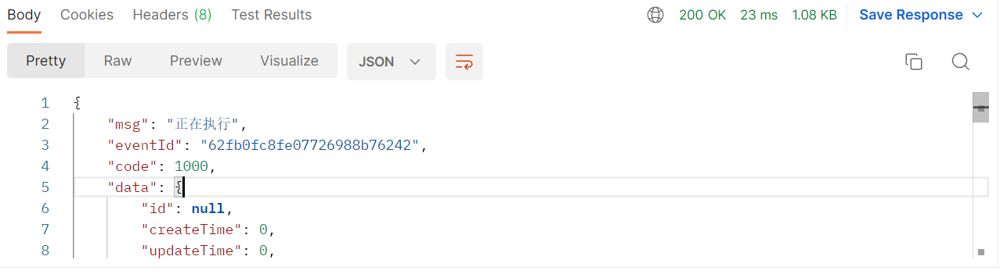

~~~

{
    "msg": "正在执行",
    "eventId": "62fb0fc8fe07726988b76242",
    "code": 1000,
    "data": {
        "id": null,
        "createTime": 0,
        "updateTime": 0,
        "memberName": "null:27017",
        "hostName": null,
        "hostId": null,
        "port": "27017",
        "version": null,
        "upgradeVersion": null,
        "userName": null,
        "password": null,
        "authDbName": "admin",
        "currentTimeMillis": 1660620744008,
        "dataDirectory": "/var/ops/mongodb1660620744008/data/",
        "logFile": "/var/ops/mongodb1660620744008/log/log.log",
        "confPath": "/var/ops/mongodb1660620744008/mongo.conf",
        "authAble": false,
        "runShCmd": null,
        "type": 11,
        "status": "无状态",
        "monitorServerStatus": false,
        "monitorTopAndOp": false,
        "collectMongoLog": false,
        "mongoLogFileOffset": 0,
        "operaLogTemp": [],
        "votes": 1,
        "priority": 1.0,
        "delay": 0,
        "buildIndexes": true,
        "procId": "",
        "clusterId": "62f5bf0ac8b0132564c7d481",
        "replId": null,
        "clusterName": null,
        "tags": {},
        "configurationOptions": {},
        "operateVersion": 0
    }
}
~~~

 

###  14 添加mongos

14.1 请求路径

POST: http://{Server-Host}:{端口}/api/server/mongo/addMongoS/{{clusterId}}

---

14.2 请求参数

| Name                |     Located in     |           Description         |     Required    |        Schema   |
| -------------------|----------------------|-------------------------------|-----------------|-----------   |
| mongoMember   |         Body           |            Mongo对象            |        Yes    | MongoMember          |  
| clusterId   |         Path           |            集群id            |        Yes    | String          |  

 

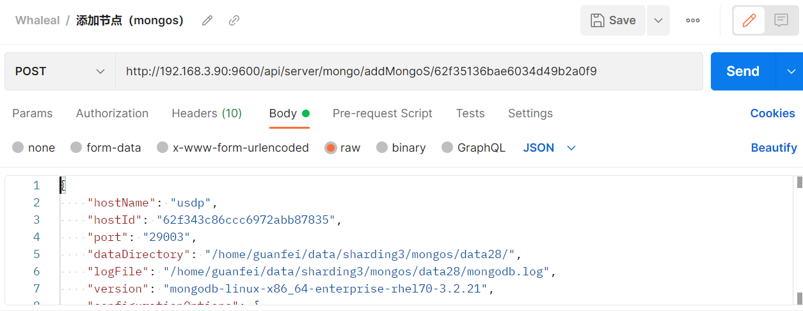

~~~
Ex. 创建单节点;mongoMember 如下所示:
{
    "hostName": "usdp",
    "hostId": "62f343c86ccc6972abb87835",
    "port": "29003",
    "dataDirectory": "/home/guanfei/data/sharding3/mongos/data28/",
    "logFile": "/home/guanfei/data/sharding3/mongos/data28/mongodb.log",
    "version": "mongodb-linux-x86_64-enterprise-rhel70-3.2.21",
    "configurationOptions": {
        "storage.wiredTiger.engineConfig.cacheSizeGB": "1"
    }
}
~~~

----

14.3 返回结果

|               |     Description    |           Schema              |  
| --------------|----------------------|---------------------------
| code        |   状态符:1000成功,其余异常 |          int             |    
| msg       |         返回消息         |             String           |        
| eventId       |         事件id         |             String           |        
| data       |         返回数据        |             JSON           |        

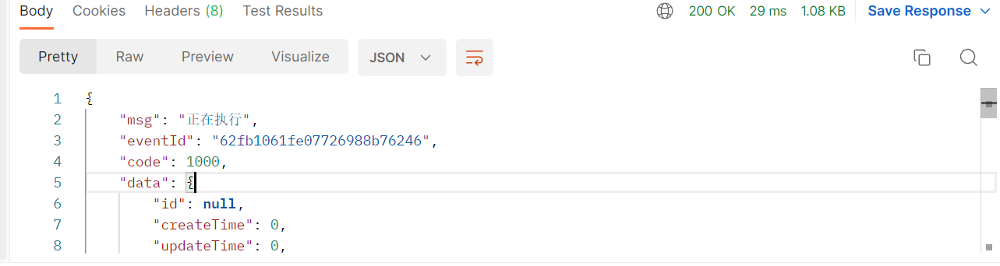

~~~

{
    "msg": "正在执行",
    "eventId": "62fb1061fe07726988b76246",
    "code": 1000,
    "data": {
        "id": null,
        "createTime": 0,
        "updateTime": 0,
        "memberName": "null:27017",
        "hostName": null,
        "hostId": null,
        "port": "27017",
        "version": null,
        "upgradeVersion": null,
        "userName": null,
        "password": null,
        "authDbName": "admin",
        "currentTimeMillis": 1660620897087,
        "dataDirectory": "/var/ops/mongodb1660620897087/data/",
        "logFile": "/var/ops/mongodb1660620897087/log/log.log",
        "confPath": "/var/ops/mongodb1660620897087/mongo.conf",
        "authAble": false,
        "runShCmd": null,
        "type": 11,
        "status": "无状态",
        "monitorServerStatus": false,
        "monitorTopAndOp": false,
        "collectMongoLog": false,
        "mongoLogFileOffset": 0,
        "operaLogTemp": [],
        "votes": 1,
        "priority": 1.0,
        "delay": 0,
        "buildIndexes": true,
        "procId": "",
        "clusterId": "62f35136bae6034d49b2a0f9",
        "replId": null,
        "clusterName": null,
        "tags": {},
        "configurationOptions": {},
        "operateVersion": 0
    }
}
~~~

###  15 更新集群名称
15.1 请求路径

GET: http://{Server-Host}:{端口}/api/server/mongo/updateClusterName/{{clusterId}}/{{newClusterName}}

---

15.2 请求参数

| Name                |     Located in     |           Description         |     Required    |        Schema   |
| -------------------|----------------------|-------------------------------|-----------------|-----------   |
| clusterId          |         Path           |            集群id            |        Yes       |String
| newClusterName          |         Path           |            新名称           |        Yes       |String

 

----

15.3 返回结果

|               |     Description    |           Schema              |  
| --------------|----------------------|---------------------------
| code        |   状态符:1000成功,其余异常 |        int               |    
| msg       |         返回消息         |            String            |        

 

---

 

###  16 执行一个计划

16.1 请求路径

POST: http://{Server-Host}:{端口}/api/server/mongo/exeExplainPlan/{{clusterId}}/{{mongoMemberId}}

---

16.2 请求参数

| Name                |     Located in     |           Description         |     Required    |        Schema   |
| -------------------|----------------------|-------------------------------|-----------------|-----------   |
| clusterId          |         Path           |            集群id            |        Yes       |String
| mongoMemberId          |         Path           |            mongo成员id            |        Yes       |String
| document          |         Body           |       请求参数               |        Yes       |Map

 

----

16.3 返回结果

|               |     Description    |           Schema              |  
| --------------|----------------------|---------------------------
| code        |   状态符:1000成功,其余异常 |          int             |    
| data       |         返回数据         |            JSON            |        

 

~~~
{
    "code": 1000,
    "data": {
        "explain": {
            "queryPlanner": {
                "plannerVersion": 1,
                "namespace": "test.order",
                "indexFilterSet": false,
                "parsedQuery": {},
                "winningPlan": {
                    "stage": "EOF"
                },
                "rejectedPlans": []
            },
            "executionStats": {
                "executionSuccess": true,
                "nReturned": 0,
                "executionTimeMillis": 0,
                "totalKeysExamined": 0,
                "totalDocsExamined": 0,
                "executionStages": {
                    "stage": "EOF",
                    "nReturned": 0,
                    "executionTimeMillisEstimate": 0,
                    "works": 1,
                    "advanced": 0,
                    "needTime": 0,
                    "needYield": 0,
                    "saveState": 0,
                    "restoreState": 0,
                    "isEOF": 1
                },
                "allPlansExecution": []
            },
            "serverInfo": {
                "host": "server121",
                "port": 47018,
                "version": "4.4.12",
                "gitVersion": "51475a8c4d9856eb1461137e7539a0a763cc85dc"
            },
            "ok": 1.0,
            "$clusterTime": {
                "clusterTime": {
                    "array": false,
                    "binary": false,
                    "boolean": false,
                    "bsonType": "TIMESTAMP",
                    "dBPointer": false,
                    "dateTime": false,
                    "decimal128": false,
                    "document": false,
                    "double": false,
                    "inc": 85,
                    "int32": false,
                    "int64": false,
                    "javaScript": false,
                    "javaScriptWithScope": false,
                    "null": false,
                    "number": false,
                    "objectId": false,
                    "regularExpression": false,
                    "string": false,
                    "symbol": false,
                    "time": 1660618654,
                    "timestamp": true,
                    "value": 7132302810057539669
                },
                "signature": {
                    "hash": {
                        "data": "AAAAAAAAAAAAAAAAAAAAAAAAAAA=",
                        "type": 0
                    },
                    "keyId": 0
                }
            },
            "operationTime": {
                "array": false,
                "binary": false,
                "boolean": false,
                "bsonType": "TIMESTAMP",
                "dBPointer": false,
                "dateTime": false,
                "decimal128": false,
                "document": false,
                "double": false,
                "inc": 85,
                "int32": false,
                "int64": false,
                "javaScript": false,
                "javaScriptWithScope": false,
                "null": false,
                "number": false,
                "objectId": false,
                "regularExpression": false,
                "string": false,
                "symbol": false,
                "time": 1660618654,
                "timestamp": true,
                "value": 7132302810057539669
            }
        },
        "documentsReturned": 0,
        "queryExecutionTime": 0,
        "indexKeysExamined": 0,
        "documentsExamined": 0,
        "stagList": [
            {
                "stage": "EOF",
                "nReturned": 0,
                "executionTimeMillisEstimate": 0,
                "works": 1,
                "advanced": 0,
                "needTime": 0,
                "needYield": 0,
                "saveState": 0,
                "restoreState": 0,
                "isEOF": 1
            }
        ]
    }
}

~~~

---

 

###  17 复制集初始化

17.1 请求路径

POST: http://{Server-Host}:{端口}/api/server/mongo/mongoReplicaInit/{{clusterId}}/{{replicateId}}

---

17.2 请求参数

| Name                |     Located in     |           Description         |     Required    |        Schema   |
| -------------------|----------------------|-------------------------------|-----------------|-----------   |
| clusterId          |         Path           |            集群id            |        Yes       |String
| replicateId          |         Path           |            复制集id            |        Yes       |String

 

----

17.3 返回结果

|               |     Description    |           Schema              |  
| --------------|----------------------|---------------------------
| code        |   状态符:1000成功,其余异常 |          int             |    
| data       |         返回数据         |            JSON            |        

 

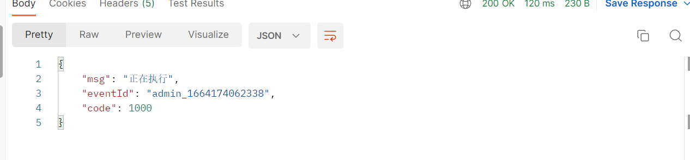

 

###  18 收集mongo集群日志

18.1 请求路径

POST: http://{Server-Host}:{端口}/api/server/mongo/collectMongoDLog/{{clusterId}}

---

18.2 请求参数

| Name                |     Located in     |           Description         |     Required    |        Schema   |
| -------------------|----------------------|-------------------------------|-----------------|-----------   |
| clusterId          |         Path           |            集群id            |        Yes       |String
| startTime          |         Params           |            开始时间            |        Yes       |long
| endTime          |         Params           |            结束时间            |        Yes       |long

 

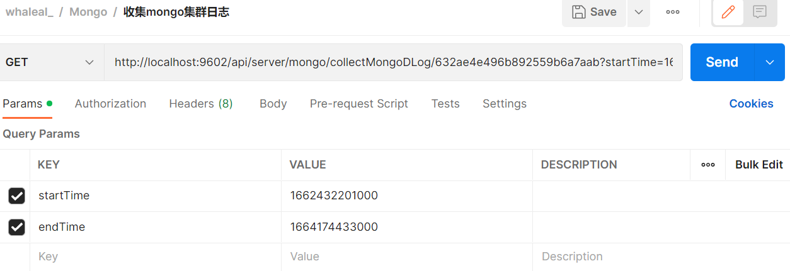

----

18.3 返回结果

|               |     Description    |           Schema              |  
| --------------|----------------------|---------------------------
| code        |   状态符:1000成功,其余异常 |          int             |    
| msg       |         返回消息         |            String            |        

 

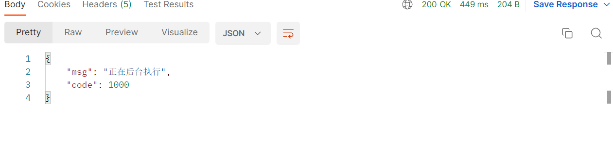

 

###  19 移除节点

19.1 请求路径

POST: http://{Server-Host}:{端口}/api/server/mongo/removeShard/{{clusterId}}/{{shardReplId}}

---

19.2 请求参数

| Name                |     Located in     |           Description         |     Required    |        Schema   |
| -------------------|----------------------|-------------------------------|-----------------|-----------   |
| clusterId          |         Path           |            集群id            |        Yes       |String
| shardReplId          |         Path           |          分片复制集id            |        Yes       |String

 

----

19.3 返回结果

|               |     Description    |           Schema              |  
| --------------|----------------------|---------------------------
| code        |   状态符:1000成功,其余异常 |          int             |    
| msg       |         返回消息      |            String            |        

 

###  19 创建用户

19.1 请求路径

POST: http://{Server-Host}:{端口}/api/server/mongo/createMongoUser/{{clusterId}}

---

19.2 请求参数

| Name                |     Located in     |           Description         |     Required    |        Schema   |
| -------------------|----------------------|-------------------------------|-----------------|-----------   |
| clusterId          |         Path           |            集群id            |        Yes       |String
| map          |         Body           |          用户信息            |        Yes       |Map

 

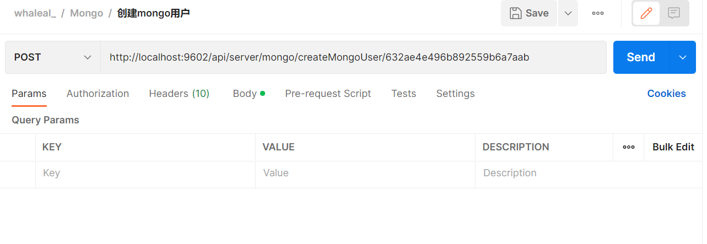

----

19.3 返回结果

|               |     Description    |           Schema              |  
| --------------|----------------------|---------------------------
| code        |   状态符:1000成功,其余异常 |          int             |    
| msg       |         返回消息         |            String            |        

 

 

[comment]: <> (## MongoMember)

[comment]: <> (|       Name         |     Type             |    Description      |   )

[comment]: <> (| ------------       |----------            |---------------------|)

[comment]: <> (| memberName                 |   String             |         主机名:端口          |   )

[comment]: <> (| hostName             |   String             |         主机名     |   )

[comment]: <> (| hostId              |   Long |         主机id     |   )

[comment]: <> (| port               |   String             |         端口     |   )

[comment]: <> (| version         |   String             |         版本     |   )

[comment]: <> (| upgradeVersion           |   String             |         升降级版本     |   )

[comment]: <> (| password           |   String             |         节点密码     |   )

[comment]: <> (| authDbName           |   String             |         认证库     |   )

[comment]: <> (| currentTimeMillis           |   long             |         当前时间戳     |   )

[comment]: <> (| dataDirectory           |   String             |         数据目录     |   )

[comment]: <> (| userName             |   String             |         节点用户名     |   )

[comment]: <> (| logFile             |   String             |         日志文件     |   )

[comment]: <> (| confPath             |   String             |         配置文件路径     |   )

[comment]: <> (| deleteDataAndLogAble             |   String             |         是否强制删除     |   )

[comment]: <> (| authAble             |   String             |         是否开启认证     |   )

[comment]: <> (| runShCmd             |   String             |         执行启动命令     |   )

[comment]: <> (| type             |   int             |         节点类型     |   )

[comment]: <> (注 type:11 单例)

[comment]: <> (* )

[comment]: <> (* 
 普通复制集)

[comment]: <> (* 31 普通成员节点)

[comment]: <> (* 32 隐藏节点)

[comment]: <> (* 33 仲裁节点)

[comment]: <> (* 34 隐藏延迟节点)

[comment]: <> (* 35 主节点)

[comment]: <> (* 
 config复制集)

[comment]: <> (* 41 config普通成员节点)

[comment]: <> (* 42 config隐藏节点)

[comment]: <> (* 43 config仲裁节点)

[comment]: <> (* 44 config隐藏延迟节点)

[comment]: <> (* 45 config主节点)

[comment]: <> (* 
 shard复制集)

[comment]: <> (* 51 shard普通成员节点)

[comment]: <> (* 52 shard隐藏节点)

[comment]: <> (* 53 shard仲裁节点)

[comment]: <> (* 54 shard隐藏延迟节点)

[comment]: <> (* 55 shard主节点)

[comment]: <> (* 
 mongoS)

[comment]: <> (* 61 mongoS)

[comment]: <> (---)

[comment]: <> (---)

[comment]: <> (## MongoReplica)

[comment]: <> (|       Name         |     Type             |    Description      |   )

[comment]: <> (| ------------       |----------            |---------------------|)

[comment]: <> (| replicaName                 |   String             |         集群名          |   )

[comment]: <> (| memberList             |   List<MongoMember>             |         成员列表     |   )

[comment]: <> (| type              |   enum |         大小     |   )

[comment]: <> (| clusterId               |   String             |         所属集群id     |   )

[comment]: <> (| deleteDataAndLogAble         |   boolean             |         是否强制删除已经存在的数据目录和日志文件     |   )

[comment]: <> (| status           |   String             |         状态     |   )

[comment]: <> (| operaLog             |   List<String             |         复制集操作日志     |   )

[comment]: <> (| replicationSettings             |   Map<String, Object>             |         复制集高级配置     |   )

[comment]: <> (| replicationOtherSettings             |   Map<String, Object>             |         其他附加配置信息     |   )

[comment]: <> (| authAble             |   boolean             |         是否开启认证     |   )

[comment]: <> (| userName             |   String             |         节点用户名     |   )

[comment]: <> (| password             |   String             |         节点密码     |   )

[comment]: <> (| authDbName             |   String             |         认证库     |   )

[comment]: <> (| protocolVersion             |   long             |         协议版本     |   )

[comment]: <> (| writeConcernMajorityJournalDefault             |   boolean             |         是否默认投票     |   )

[comment]: <> (type:)

[comment]: <> (* 普通复制集 1)

[comment]: <> (* config 2)

[comment]: <> (* shard 3)

[comment]: <> (---)

[comment]: <> (---)

[comment]: <> (## MongoShard)

[comment]: <> (|       Name         |     Type             |    Description      |   )

[comment]: <> (| ------------       |----------            |---------------------|)

[comment]: <> (| clusterName                 |   String             |         集群名          |   )

[comment]: <> (| clusterId             |   String             |         所属集群id     |   )

[comment]: <> (| config              |   MongoReplica |         config复制集     |   )

[comment]: <> (| mongoS               |   List<MongoMember>             |         mongoS列表     |   )

[comment]: <> (| shardingMap         |   Map<String, MongoReplica>             |         shard集合     |   )

[comment]: <> (| operaLog           |   List<String>             |         分片操作日志     |   )

[comment]: <> (| deleteDataAndLogAble             |   boolean             |         是否强制删除     |   )

[comment]: <> (| authAble             |   boolean             |         是否开启认证     |   )

[comment]: <> (| userName             |   String             |         节点用户名     |   )

[comment]: <> (| password             |   String             |         节点密码     |   )

[comment]: <> (| authDbName             |   String             |         认证库     |   )

[comment]: <> (| status             |   String             |         状态     |   )

[comment]: <> (---)

[comment]: <> (---)

[comment]: <> (## MongoClusterInformation)

[comment]: <> (|       Name         |     Type             |    Description      |   )

[comment]: <> (| ------------       |----------            |---------------------|)

[comment]: <> (| clusterName                 |   String             |         集群名          |   )

[comment]: <> (| type             |   int             |         类型     |   )

[comment]: <> (| mongoMember              |   MongoMember |         单例     |   )

[comment]: <> (| mongoReplica               |   MongoReplica             |         复制集     |   )

[comment]: <> (| mongoShard         |   MongoShard             |         分片     |   )

[comment]: <> (| isCreate           |   boolean             |         默认新建的集群信息     |   )

[comment]: <> (| status             |   String             |         集群状态     |   )

[comment]: <> (| fcv             |   String             |         fcv     |   )

[comment]: <> (| tag             |   String             |         标签     |   )

[comment]: <> ( status：)

[comment]: <> (* 集群状态)

[comment]: <> (* 正常)

[comment]: <> (* 异常)

[comment]: <> (* 关机)

[comment]: <> (* 脱离纳管)

[comment]: <> (type:)

[comment]: <> (* 1 单例)

[comment]: <> (* 2 复制集)

[comment]: <> (* 3 分片)

