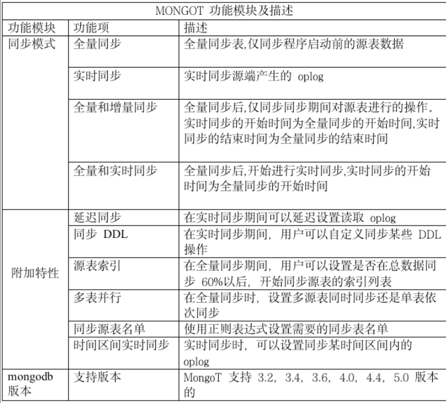

# D2T架构简介

## 背景

    Mongodb数据库的全量迁移和实时同步。我司研究开发新型的数据迁移项目，由此D2T项目诞生。

## 项目介绍

名称：D2T

语言: 纯java开发

定位: Mongodb数据库的全量迁移和实时同步

## 功能介绍

D2T是Mongodb数据同步组件

迁移功能包括：

1.实时迁移 、2.全量迁移 、3.全量实时迁移 、4.全量增量迁移

**架构**

说明:

一个Jvm Container对应多个instance，每个instance对应于一个的迁移程序

instance分为三部分

a. source (从源数据库上提取数据，可分为全量/实时实现)

b. cache (将源库上的数据按照目标库的需求进行缓存)

c. target (将数据更新到目标库，可分为全量/实时/对比的实现)

## D2T流程图

### 实时迁移

注：

使用cas机制确保每个库表在同一时刻仅有一个线程对该库表进行分桶

使用cas机制确保每个库表桶在同一时刻仅有一个线程对该库表桶的数据进行写入

当进行库表分桶时发现DDL操作时，把该DDL之前的数据进行写入，然后再执行DDL操作

### 全量迁移

注：

使用cas机制确保每个区在同一时刻仅有一个线程对该区的桶队列进行写入/读取

一个source表的数据可以放在任意区，一个target可以从任意区取数据。但一个区同时最多有一个线程进行操作

 