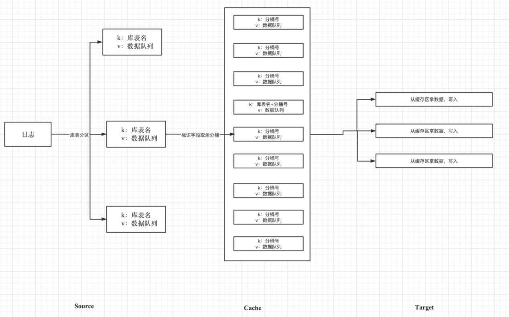

# Introduction to DDT Architecture

## Background

    The need for full migration and real-time synchronization of MongoDB databases led to the development of the new data migration project at our company, resulting in the DDT project.

## Project Overview

- Name: DDT (Document Data Transfer)
- Language: Developed purely in Java
- Purpose: Full migration and real-time synchronization of MongoDB databases

## Functionality Overview

DDT is a MongoDB data synchronization component.

Migration features include:

## Synchronization Modes

- **Full Synchronization:** Syncs all data in tables. Only data from tables existing before the program startup is synchronized.

- **Real-time Synchronization:** Real-time sync of oplogs (operation logs) generated by the source.

- **Full + Incremental Synchronization:** After full synchronization, only operations on source tables during the sync period are synchronized. The start time of real-time sync is the start time of full synchronization, and the end time of real-time sync is the end time of full synchronization.

- **Full + Real-time Synchronization:** After full synchronization, real-time sync begins. The start time of real-time sync is the start time of full synchronization.

## Additional Features

- **Delayed Synchronization:** During real-time sync, the reading of oplogs can be delayed.

- **Syncing DDL Operations:** During real-time sync, users can customize the synchronization of certain DDL operations.

- **Source Table Indexes:** During full synchronization, users can specify whether to sync the source table indexes list after 60% of the total data is synced.

- **Multi-Table Parallelism:** During full synchronization, choose between synchronizing multiple source tables simultaneously or synchronizing them one by one.

- **Sync Source Table List:** Use regular expressions to specify the desired list of tables to sync.

- **Time-Interval Real-time Sync:** During real-time sync, you can set to sync oplogs within a certain time interval.

## MongoDB Versions

- **Supported Versions:** DDT supports MongoDB versions 3.2, 3.4, 3.6, 4.0, 4.4, 5.0, and 6.0.

## Architecture

Explanation:

- A JVM container corresponds to multiple instances, with each instance corresponding to a migration program.
- Each instance comprises three parts:
  a. Source (extracts data from the source database, supports full/real-time implementation)
  b. Cache (caches data from the source according to target requirements)
  c. Target (updates data to the target database, supports full/real-time/comparison implementation)

## DDT Process Diagram

### Real-Time Migration

Note:

- Use CAS mechanism to ensure that only one thread accesses each table's buckets at a time.
- Use CAS mechanism to ensure that only one thread writes data to a bucket of a table at a time.
- When splitting buckets for a table, if a DDL operation is encountered, the data before that DDL is written, followed by executing the DDL.

### Full Migration

Note:

- Use CAS mechanism to ensure that only one thread writes/reads bucket queues in the same partition at the same time.
- Data from a source table can be placed in any partition. A target table can retrieve data from any partition. However, only one thread can operate on a partition at a time.