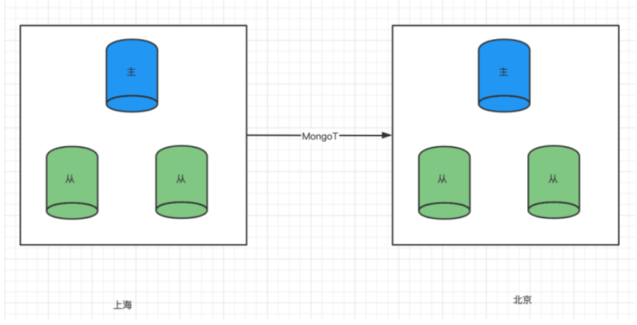

## DDT Application Scenarios

Let's introduce some use cases of users employing DDT, including business scenarios, durations, and performance comparisons.

### Case 1: Securities Company

Benefits of Disaster Recovery: In addition to local backups in the production center, business operations can also be backed up in the disaster recovery center. In a dual-active architecture, support for dual-center mutual backup enhances business resilience, providing a double insurance for the business. By utilizing the DDT synchronization tool, remote data is written to the target center in real time.

### Case 2: Airline Company

There is a need for a cross-major-version upgrade of a MongoDB replica set cluster, upgrading from version 3.2 to 4.4. Due to the need for rapid upgrade changes on the application side, the traditional MongoDB replica set would require step-by-step version upgrades, which is time-consuming. Also, in case of anomalies, the transition back to the correct state might not be timely.

Our solution for the airline company is to set up a new 4.4 version database, using DDT to migrate old data to the new cluster in real time. When both new and old clusters have no delay, the application-side database address is switched.

In this case, the original data size is 700GB, with a real-time data rate of 10,000 records per second, including intermittent DDL operations like table creation and deletion. DDT took a total of 6 hours to complete the transfer, with 5 hours for the full migration and 1 hour for real-time migration.