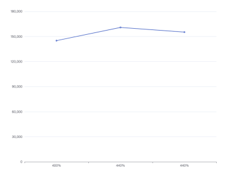
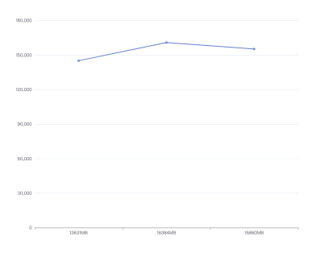
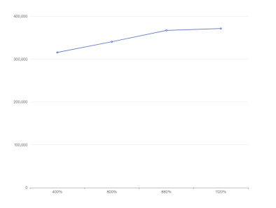
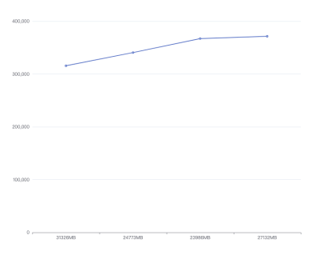
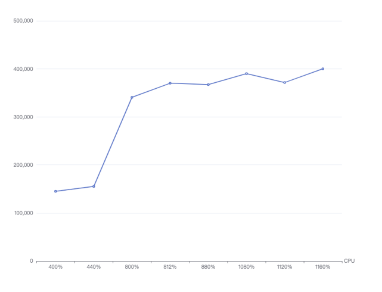
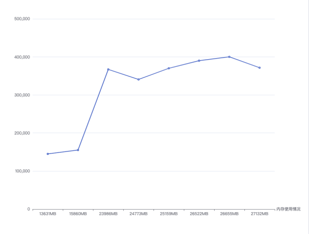

# DDT Full-scale Testing

## Test Environment

**Hardware Resources Configuration:**

* CPU: 40 cores, Intel(R) Xeon(R) CPU E5-2670 v2 @ 2.50GHz
* Memory: 4*32GB
* Network Card: 1Gbps
* Operating System: Linux x86_64
* MongoDB Version: 0.1
* Disk: SSD

**Test Conditions**

The test data covers the following dimensions: Latency, QPS (Queries Per Second), CPU Usage, Memory Usage. All values are provided as the average over 10 seconds.

QPS is derived from log outputs on the data platform, with OPLOG write counts per second recorded. CPU and memory usage information is also provided.

## Test Results

    When cacheBucketSize=32, cacheBucketNum=32, dataBatchSize=128:

### Test One

**Configuration Information**

| Parameter      | Description                               |
|----------------|-------------------------------------------|
| MongoDB Type   | Source MongoDB: Single-node replica set, cacheSize 30GB Target MongoDB: Single-node replica set, cacheSize 30GB |
| Data Volume    | One database with 10 collections, each document has 7 columns, total size of each OPLOG document is around 140 bytes |
| Source Read Threads | 5                                 |
| Target Write Threads | 15                                 |
| Cache Settings | cacheBucketSize=32 cacheBucketNum=32 dataBatchSize=128 |

**Test Results:**

| Measurement | Description |
|----------|------------|
| QPS      | 145062     |
| CPU Usage | 400%       |
| Memory Usage | 13631MB  |

------

### Test Two

**Configuration Information**

| Parameter      | Description                               |
|----------------|-------------------------------------------|
| MongoDB Type   | Source MongoDB: Single-node replica set, cacheSize 30GB Target MongoDB: Single-node replica set, cacheSize 30GB |
| Data Volume    | One database with 10 collections, each document has 7 columns, total size of each document is around 140 bytes |
| Source Read Threads | 6                                 |
| Target Write Threads | 20                                 |
| Cache Settings | cacheBucketSize=32 cacheBucketNum=32 dataBatchSize=128 |

**Test Results**

| Measurement | Description |
|---------|-------------|
| QPS     | 160837      |
| CPU Usage | 440%       |
| Memory Usage | 16384MB   |

----------

### Test Three

**Configuration Information**

| Parameter      | Description                               |
|----------------|-------------------------------------------|
| MongoDB Type   | Source MongoDB: Single-node replica set, cacheSize 30GB Target MongoDB: Single-node replica set, cacheSize 30GB |
| Data Volume    | One database with 10 collections, each document has 7 columns, total size of each document is around 140 bytes |
| Source Read Threads | 6                                 |
| Target Write Threads | 24                                 |
| Cache Settings | cacheBucketSize=32 cacheBucketNum=32 dataBatchSize=128 |

**Test Results**

| Description | Measurement |
|--------------|-----------|
| QPS          | 155232    |
| CPU Usage    | 440%      |
| Memory Usage  | 15860MB   |

### Summary

<table>
  <tr>
    <th>Cache Settings</th>
    <th>cacheSize</th>
    <th>Source Read Threads</th>
    <th>Target Write Threads</th>
    <th>QPS</th>
    <th>Memory Usage</th>
    <th>CPU Usage</th>
  </tr>
  <tr>
    <td rowspan="3">cacheBucketSize=32 cacheBucketNum=32 dataBatchSize=128</td>
    <td rowspan="3">30GB</td>
    <td>5</td>
    <td>15</td>
    <td>145062</td>
    <td>13631MB</td>
    <td>400%</td>
  </tr>
  <tr>
    <td>6</td>
    <td>20</td>
    <td>160837</td>
    <td>16384MB</td>
    <td>440%</td>
  </tr>
  <tr>
    <td>6</td>
    <td>24</td>
    <td>155232</td>
    <td>15860MB</td>
    <td>440%</td>
  </tr>
</table>

 

Summary: When cacheBucketSize=32, cacheBucketNum=32, and dataBatchSize=128, it can be observed that increasing the number of threads:

(1) Does not improve QPS, as the read volume is lower than the write volume;

(2) Does not increase memory usage significantly due to cache size limitations.

-------------

    When cacheBucketSize=48, cacheBucketNum=48, and dataBatchSize=128:

### Test One

**Configuration Information**

| Parameter      | Description                                   |
|----------------|-----------------------------------------------|
| MongoDB Type   | Source MongoDB: Single-node replica set, cacheSize 30GB; Target MongoDB: Single-node replica set, cacheSize 30GB |
| Data Volume    | One database with 10 collections, each document has 7 columns, total size of each document is around 140 bytes |
| Source Read Threads | 5                                    |
| Target Write Threads | 15                                   |
| Cache Settings | cacheBucketSize=48 cacheBucketNum=48 dataBatchSize=128 |

**Test Results**

| Measurement | Description |
|---------|-------------|
| QPS     | 315702      |
| CPU Usage | 400%       |
| Memory Usage | 31326MB  |

--------

### Test Two

**Configuration Information**

| Parameter      | Description                                   |
|----------------|-----------------------------------------------|
| MongoDB Type   | Source MongoDB: Single-node replica set, cacheSize 30GB; Target MongoDB: Single-node replica set, cacheSize 30GB |
| Data Volume    | One database with 10 collections, each document has 7 columns, total size of each document is around 140 bytes |
| Source Read Threads | 6                                    |
| Target Write Threads | 20                                   |
| Cache Settings | cacheBucketSize=48 cacheBucketNum=48 dataBatchSize=128 |

**Test Results**

| Measurement | Description |
|---------|-------------|
| QPS     | 340716      |
| CPU Usage | 800%       |
| Memory Usage | 24773MB   |

--------

### Test Three

**Configuration Information**

| Parameter      | Description                                   |
|----------------|-----------------------------------------------|
| MongoDB Type   | Source MongoDB: Single-node replica set, cacheSize 30GB; Target MongoDB: Single-node replica set, cacheSize 30GB |
| Data Volume    | One database with 10 collections, each document has 7 columns, total size of each document is around 140 bytes |
| Source Read Threads | 6                                    |
| Target Write Threads | 24                                   |
| Cache Settings | cacheBucketSize=48 cacheBucketNum=48 dataBatchSize=128 |

**Test Results**

| Measurement | Description |
|---------|-------------|
| QPS     | 367178      |
| CPU Usage | 880%       |
| Memory Usage | 23986MB   |

--------

### Test Four

**Configuration Information**

| Parameter      | Description                                   |
|----------------|-----------------------------------------------|
| MongoDB Type   | Source MongoDB: Single-node replica set, cacheSize 30GB; Target MongoDB: Single-node replica set, cacheSize 30GB |
| Data Volume    | One database with 10 collections, each document has 7 columns, total size of each document is around 140 bytes |
| Source Read Threads | 8                                    |
| Target Write Threads | 24                                   |
| Cache Settings | cacheBucketSize=48 cacheBucketNum=48 dataBatchSize=128 |

**Test Results**

| Measurement | Description |
|---------|-------------|
| QPS     | 371528      |
| CPU Usage | 1120%       |
| Memory Usage | 27132MB   |

--------

### Summary

<table>
  <tr>
    <th>Cache Settings</th>
    <th>cacheSize</th>
    <th>Source Read Threads</th>
    <th>Target Write Threads</th>
    <th>QPS</th>
    <th>Memory Usage</th>
    <th>CPU Usage</th>
  </tr>
  <tr>
    <td rowspan="4">cacheBucketSize=48 cacheBucketNum=48 dataBatchSize=128</td>
    <td rowspan="4">30GB</td>
    <td>5</td>
    <td>15</td>
    <td>315702</td>
    <td>31326MB</td>
    <td>400%</td>
  </tr>
  <tr>
    <td>6</td>
    <td>20</td>
    <td>340716</td>
    <td>24773MB</td>
    <td>800%</td>
  </tr>
  <tr>
    <td>6</td>
    <td>24</td>
    <td>367178</td>
    <td>23986MB</td>
    <td>880%</td>
  </tr>
  <tr>
    <td>8</td>
    <td>24</td>
    <td>371528</td>
    <td>27132MB</td>
    <td>1120%</td>
  </tr>
</table>

Summary: When cacheBucketSize=48, cacheBucketNum=48, and dataBatchSize=128, it can be observed that increasing the number of threads:

(1) Increases QPS.

--------------

    When cacheBucketSize=64, cacheBucketNum=64, and dataBatchSize=128:

### Test One

**Configuration Information**

| Parameter      | Description                                   |
|----------------|-----------------------------------------------|
| MongoDB Type   | Source MongoDB: Single-node replica set, cacheSize 30GB; Target MongoDB: Single-node replica set, cacheSize 30GB |
| Data Volume    | One database with 10 collections, each document has 7 columns, total size of each document is around 140 bytes |
| Source Read Threads | 5                                    |
| Target Write Threads | 15                                   |
| Cache Settings | cacheBucketSize=64 cacheBucketNum=64 dataBatchSize=128 |

**Test Results**

| Measurement | Description |
|---------|-------------|
| QPS     | 370042      |
| CPU Usage | 812%       |
| Memory Usage | 25159MB   |

--------

### Test Two

**Configuration Information**

| Parameter      | Description                                   |
|----------------|-----------------------------------------------|
| MongoDB Type   | Source MongoDB: Single-node replica set, cacheSize 30GB; Target MongoDB: Single-node replica set, cacheSize 30GB |
| Data Volume    | One database with 10 collections, each document has 7 columns, total size of each document is around 140 bytes |
| Source Read Threads | 6                                    |
| Target Write Threads | 20                                   |
| Cache Settings | cacheBucketSize=64 cacheBucketNum=64 dataBatchSize=128 |

**Test Results**

| Measurement | Description |
|---------|-------------|
| QPS     | 390000      |
| CPU Usage | 1080%       |
| Memory Usage | 26522MB   |

--------

### Test Three

**Configuration Information**

| Parameter      | Description                                   |
|----------------|-----------------------------------------------|
| MongoDB Type   | Source MongoDB: Single-node replica set, cacheSize 30GB; Target MongoDB: Single-node replica set, cacheSize 30GB |
| Data Volume    | One database with 10 collections, each document has 7 columns, total size of each document is around 140 bytes |
| Source Read Threads | 6                                    |
| Target Write Threads | 24                                   |
| Cache Settings | cacheBucketSize=64 cacheBucketNum=64 dataBatchSize=128 |

**Test Results**

| Measurement | Description |
|---------|-------------|
| QPS     | 400138      |
| CPU Usage | 1160%       |
| Memory Usage | 26655MB   |

--------

### Test Four

**Configuration Information**

| Parameter      | Description                                   |
|----------------|-----------------------------------------------|
| MongoDB Type   | Source MongoDB: Single-node replica set, cacheSize 30GB; Target MongoDB: Single-node replica set, cacheSize 30GB |
| Data Volume    | One database with 10 collections, each document has 7 columns, total size of each document is around 140 bytes |
| Source Read Threads | 8                                    |
| Target Write Threads | 24                                   |
| Cache Settings | cacheBucketSize=64 cacheBucketNum=64 dataBatchSize=128 |

**Test Results**

| Measurement | Description |
|---------|-------------|
| QPS     | 360209      |
| CPU Usage | 1120%       |
| Memory Usage | 25252MB   |

### Summary:

<table>
  <tr>
    <th>Cache Settings</th>
    <th>cacheSize</th>
    <th>Source Read Threads</th>
    <th>Target Write Threads</th>
    <th>QPS</th>
    <th>Memory Usage</th>
    <th>CPU Usage</th>
  </tr>
  <tr>
    <td rowspan="4">cacheBucketSize=64 cacheBucketNum=64 dataBatchSize=128</td>
    <td rowspan="4">30GB</td>
    <td>5</td>
    <td>15</td>
    <td>370042</td>
    <td>25159MB</td>
    <td>812%</td>
  </tr>
  <tr>
    <td>6</td>
    <td>20</td>
    <td>390000</td>
    <td>26522MB</td>
    <td>1080%</td>
  </tr>
  <tr>
    <td>6</td>
    <td>24</td>
    <td>400138</td>
    <td>26655MB</td>
    <td>1160%</td>
  </tr>
  <tr>
    <td>8</td>
    <td>24</td>
    <td>360209</td>
    <td>25252MB</td>
    <td>1120%</td>
  </tr>
</table>

Summary:

(1) CPU and QPS:

(2) Memory Usage and QPS:

