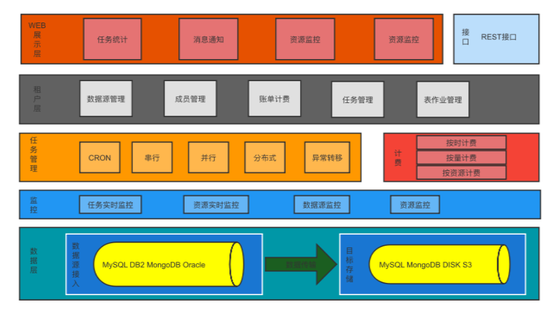
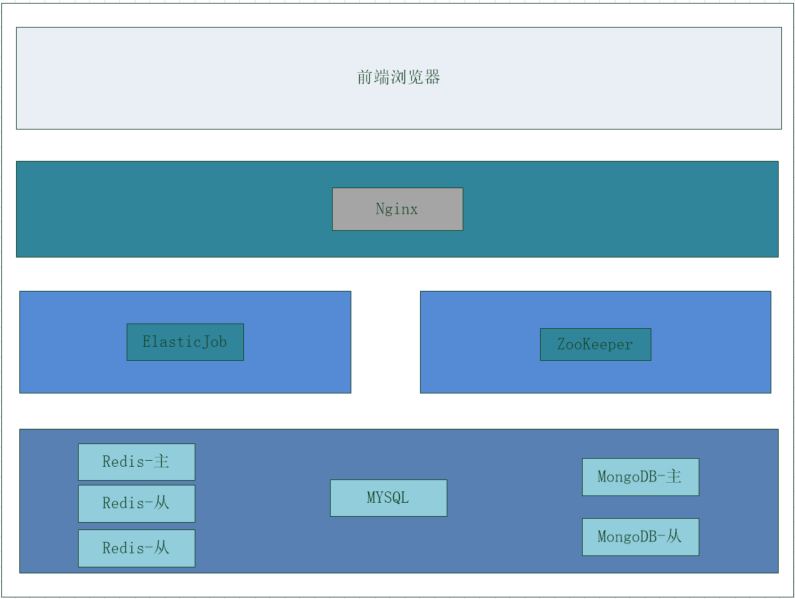

# Whaleal-data Introduction

Whaleal-data is an archiving platform designed for data archiving. It supports three types of archiving: cold, warm, and S3. For warm data archiving, it supports synchronizing data from MYSQL, Oracle, DB2, and MongoDB to MongoDB. It also supports synchronizing data from MYSQL to MYSQL. Cold data archiving allows archiving MongoDB data to disk files. S3 archiving supports uploading MongoDB Gridfs data to target S3 storage. The platform's homepage displays task execution statistics, archive capacity statistics, table job statistics, business connections, total archive capacity, and user operations. The platform enables independent configuration of data sources and target sources. Users can choose a source to sync data from and a target to sync data to within a table job. After configuring table jobs, multiple table jobs can be configured within a single task configuration. Once tasks are created, they can be managed in the task scheduling section by enabling, disabling, immediately executing, or taking tasks offline. After immediate execution, the corresponding task execution details can be viewed in the task monitoring section. Administrator users have access to various operational details.

### Platform Architecture Diagram

### Software Structure Diagram

