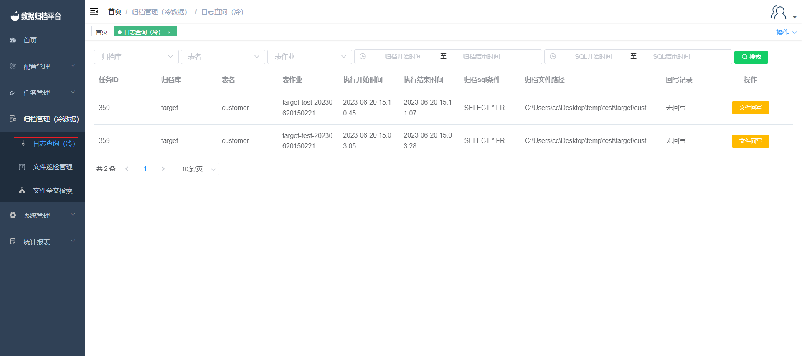

### Log Query (Cold)

Click on "Log Query (Cold)" under the "Archive Management" menu to query all file archiving log information. This page includes a search button, search condition fields, and a "Rewrite" button for each task.

##### Searching

The green button at the top is the search button. The left-hand side condition fields are used for specifying search criteria. After filling in the conditions, click the search button to filter the desired tasks.

##### File Rewriting

Click on the yellow "File Rewrite" button behind a task to initiate a file rewriting operation. This opens a page where you can click "Create Rewrite Task" to create the rewrite task.

**Creating a Rewrite Task**

Clicking the "Create Rewrite Task" button opens the following form. Fill in the required information and click "Confirm."

**Delete Temporary Table**

After creating the rewrite task, you can start the rewriting process. Once it's completed, you can click the "Delete Temporary Table" button. A confirmation prompt will appear. If you want to proceed with deletion, click "Execute." If not, click "Cancel."

