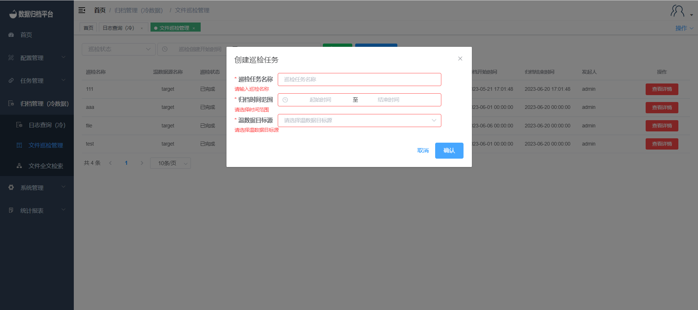

### File Inspection Management

Click on "File Inspection Management" under the "Archive Management" menu to query all file inspection log information. Click the "Create Inspection Task" button to create a file inspection task. The system will perform the necessary file checking and verification logic. For files with exceptions, you can manually update the file path or perform a re-archive operation.

##### Searching

The green button at the top is the search button. The left-hand side has condition fields that you can optionally fill in. After filling in the conditions, click the search button to filter the desired inspection.

##### Creating an Inspection Task

Click the blue "Create Inspection Task" button to open the following form. Fill in the required information and click "Confirm" to generate inspection data for the corresponding target source of warm data. After completing the task, click "View Details" to see the inspection content as shown in the second image.

