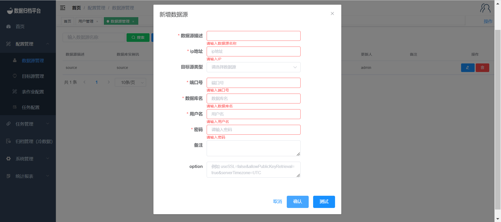

### Data Source Management

#### Adding a Data Source

To add a new data source, navigate to "Data Source Management" under the "Configuration Management" menu. Here, you can view all the information about existing data sources. Click on the "New" button in the first image to bring up the form shown in the second image, where you can input the details of the new data source. Data sources can include MongoDB, MYSQL, Oracle, and DB2. Provide the required username and password for connecting to the database. The "Options" field contains optional settings for configuring specific connection options for the database. Click the "Test" button to verify if the provided user information can connect to the database. Finally, click "Confirm" to save the data source.

#### Modifying a Data Source

Click the blue button in the right-hand side action column to edit a data source. The form for editing a data source is similar to the form for adding a data source. After making the necessary modifications, click "Test." If the test is successful, click "Confirm" to save the changes.

#### Deleting a Data Source

Click the red button in the right-hand side action column to delete a data source. A confirmation prompt will appear. If you intend to delete the data source, click "Confirm." If you clicked by mistake, you can click "Cancel."

#### Binding Data Source to Users

Navigate to "User Management" under "System Management" to display all user information. Click on the user you want to operate on, and then check the data sources you want to bind to this user on the right side. Afterward, click "Save" to bind the selected data sources to the user.

