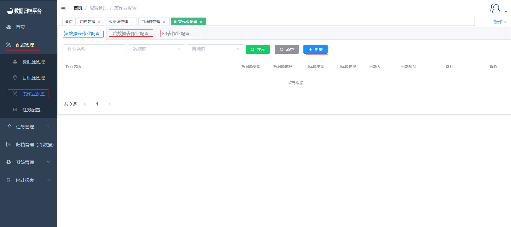
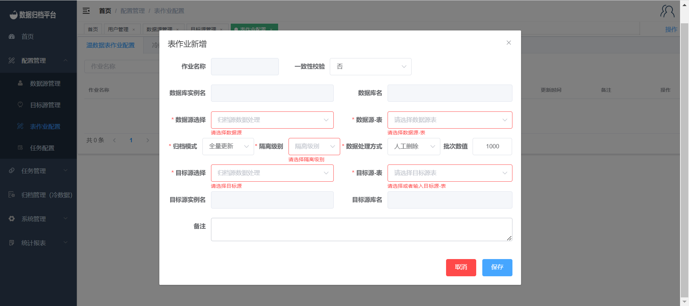
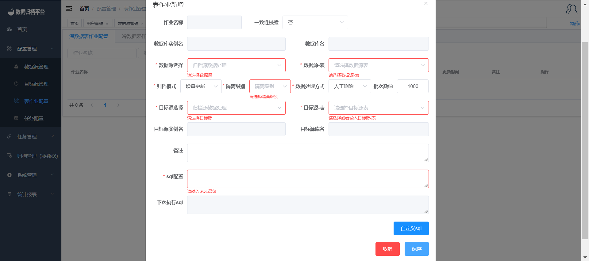
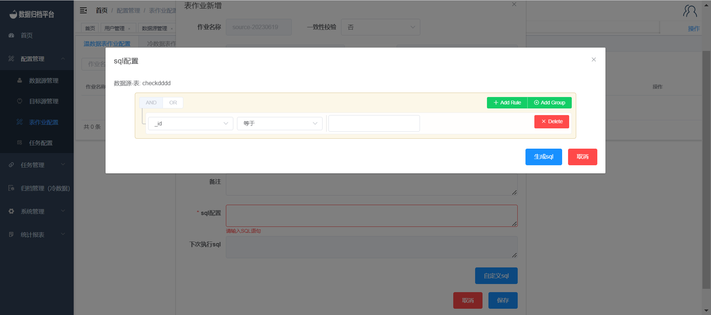
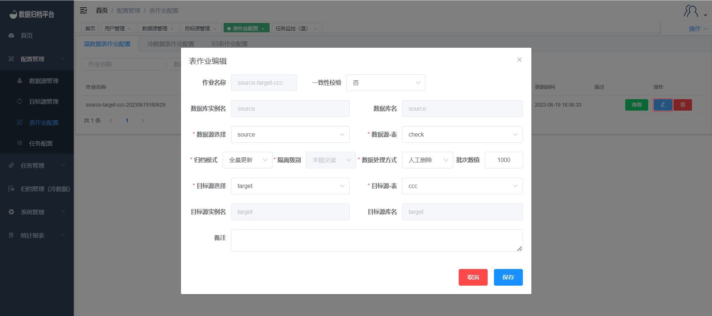
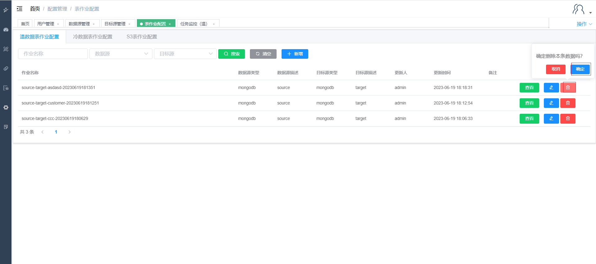
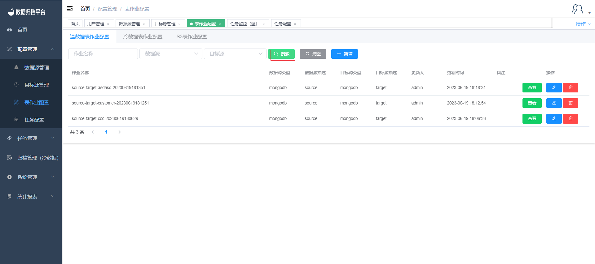
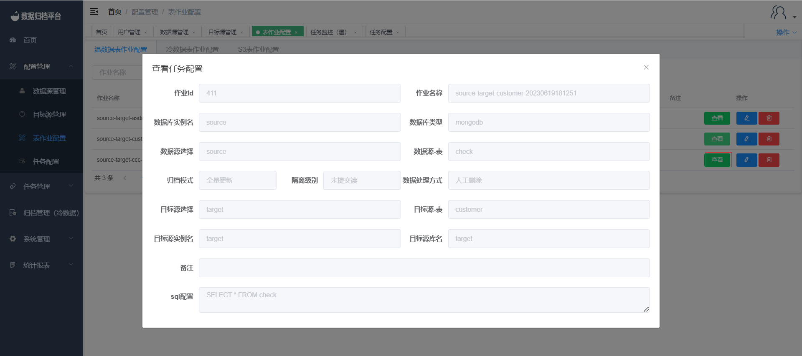

### Table Job Configuration

#### Adding Warm/Cold/S3 Jobs

To configure a new table job, navigate to "Table Job Configuration" under the "Configuration Management" menu. If you want to configure a warm data table job, click on "Warm Data Table Job Configuration." For cold data table job configuration, click on "Cold Data Table Job Configuration." Similarly, for S3 table job configuration, click on "S3 Table Job Configuration." Click the type that you want to add, and then a table will appear displaying the respective job information. The process for adding each type of job is similar.

After selecting the data source and target source, you can choose options such as consistency verification, archiving method, and data processing mode. If you choose consistency verification, you can fill in the verification percentage. When the archiving mode is "Full Update," you don't need to enter SQL conditions, as the platform archives the entire table data directly. When the archiving mode is "Incremental Update," an input field for SQL conditions will appear along with a "Custom SQL Configuration" button, as shown in the third image. If you want to configure custom SQL, you can click the button to enter the visual configuration interface for table fields, as shown in the fourth image. When both the data source and target source are MongoDB, you can choose Gridfs. If Gridfs is enabled, MongoDB's Gridfs data type will be synchronized.

#### Editing Warm/Cold/S3 Jobs

Click the blue button on the right to edit a job. After making the necessary changes to the job, click "Save" to save the modifications.

#### Deleting Warm/Cold/S3 Jobs

Click the red button on the right to delete a job. A confirmation prompt will appear. If you intend to delete the job, click "Confirm." If not, click "Cancel."

#### Searching Warm/Cold/S3 Jobs

Click the search button at the top and fill in the first three condition boxes to filter all table job configurations that meet the specified criteria on the platform.

#### Viewing Warm/Cold/S3 Jobs

Click the "View" button on the right to see the job configuration details. However, you won't be able to perform any actions in this view.

