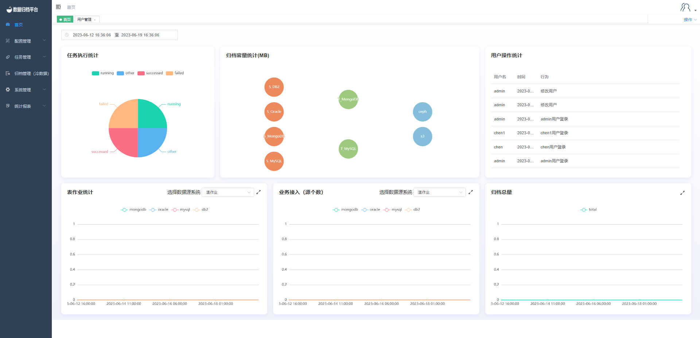

### Homepage Display

The homepage displays various statistics and information related to the system's activities. Users can customize the time range for which they want to see the data. Here's a breakdown of the different sections on the homepage:

#### Task Execution Statistics

The "Task Execution Statistics" pie chart depicts the distribution of task execution results within a specific time range. Task execution statuses include running (in progress), succeeded (successfully completed), failed (execution failed), and other (remaining types).

#### Archiving Capacity Statistics

The "Archiving Capacity Statistics" section displays the total size of data synchronized from different source types to various destination types. The first column represents source types, the second column represents destination types, and the third column represents either cold data destination files or S3. The capacity statistics depend on the source and destination types, and certain combinations are supported based on compatibility.

#### User Activity Statistics

The "User Activity Statistics" section scrolls through and displays the actions taken by a user during a specific time period. It showcases login actions, task executions, and other relevant activities performed by users.

#### Table Job Statistics

The "Table Job Statistics" section presents a line chart depicting the quantity of different types of table jobs executed within the chosen time range. This helps users observe recent trends in task execution. Users can select different job types from the dropdown menu to view the corresponding line chart.

#### Business Access (Number of Sources)

The "Business Access (Number of Sources)" section displays the number of data source accesses made to the platform during the specified time period. It shows the growth trend of data source accesses over time. Similarly, users can choose different data source types from the dropdown menu.

#### Total Archiving Volume

The "Total Archiving Volume" section presents a line chart illustrating the total data volume archived by the platform within the selected time range. This helps users track the growth trend of archiving volume over time.