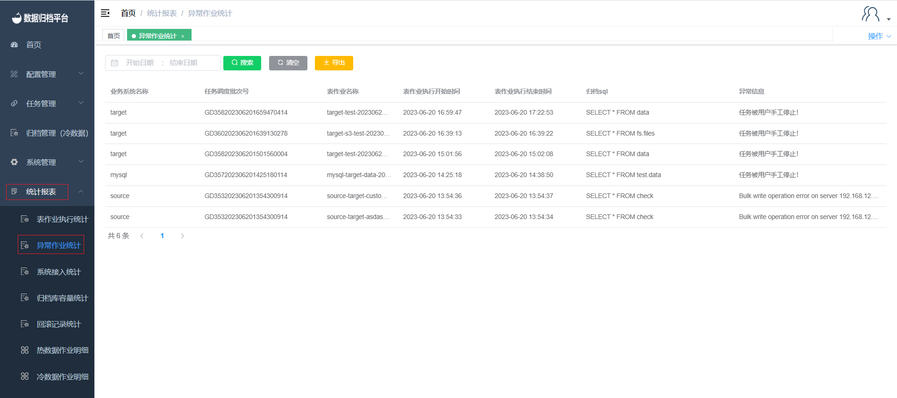

#### Abnormal Job Execution Statistics

Clicking on the "Abnormal Job Execution Statistics" under the "Statistics Report" menu allows you to query the archival information of all abnormal table jobs. This page includes a search button, search criteria fields, a clear criteria button, and an export button.

##### Search

The green button in the image above is the search button. On the left side, there's a criteria field. After filling in the filtering criteria, click "Search" to filter out abnormal table job statistics that match the criteria.

##### Clear

The black button is the clear button, which clears the time criteria fields.

##### Export

The yellow button is the export button, which allows you to export the abnormal table job statistics information as an XLSX file.