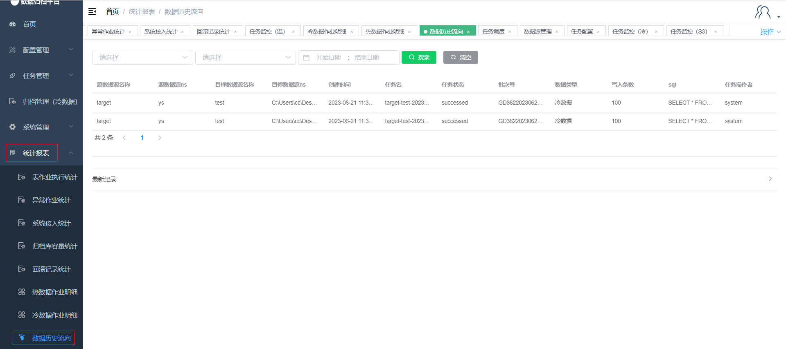

#### Data Historical Flow

Clicking on the "Data Historical Flow" under the "Statistics Report" menu displays the data source flow within the platform. This page includes a search button, search criteria fields, and a clear criteria button.

##### Search

The green button in the image above is the search button. On the left side, there are three criteria fields. After filling in the filtering criteria, click "Search" to filter out data flows that match the criteria.