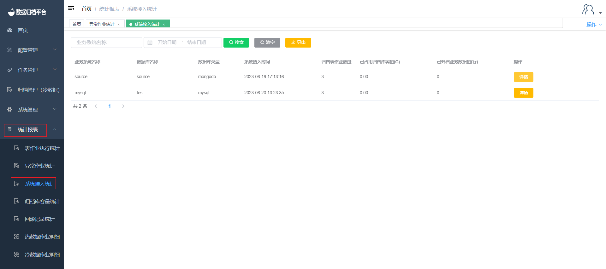
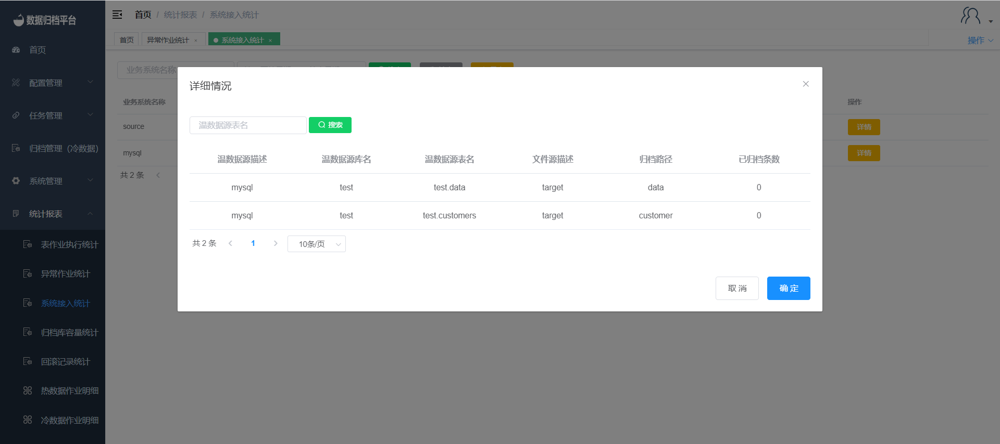

#### System Access Statistics

Clicking on "System Access Statistics" under the "Statistics Report" menu allows you to query all the businesses that have accessed this platform. This page includes a search button, search criteria fields, a clear criteria button, and an export button. Each entry represents a business that has accessed the platform, and it includes information such as business name, data source type, target source type, and access time.

##### Search

The green button in the image above is the search button. On the left side, there are two criteria fields. After filling in the filtering criteria, click "Search" to filter out access information that matches the criteria.

##### Clear

The black button is the clear button, which clears the criteria fields.

##### Export

The yellow button is the export button, allowing you to export the system access statistics information as an xlsx file.

##### Details

Clicking on the "Details" link for each access record provides more detailed information about that access, including the business name, access type, source and target types, and access time.

