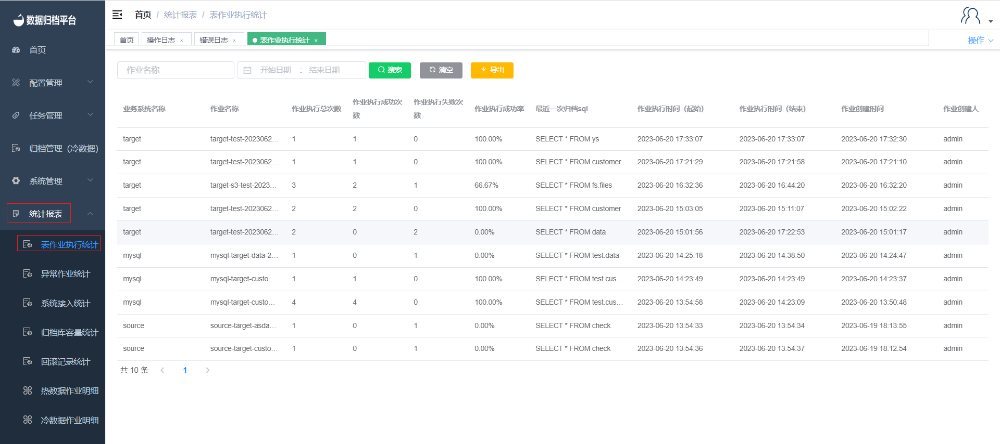

#### Table Job Execution Statistics

Clicking on "Table Job Execution Statistics" under the "Statistics Report" menu allows you to query the archival information for all table jobs. This page includes a search button, search criteria fields, a clear criteria button, and an export button. Each entry represents a table job execution and includes information such as job name, table name, data source type, target source type, execution start and end times, execution status, exception errors, progress percentage, number of archived rows, archival path, executed SQL, and rollback status.

##### Search

The green button in the image above is the search button. On the left side, there are two criteria fields. After filling in the filtering criteria, click "Search" to filter out job executions that match the criteria.

##### Clear

The black button is the clear button, which clears the criteria fields.

##### Export

The yellow button is the export button, allowing you to export the table job execution statistics information as an xlsx file.

These features help you keep track of and analyze the execution status and details of various table jobs in the system.

Please note that due to the screenshot's resolution, some text may be difficult to read.