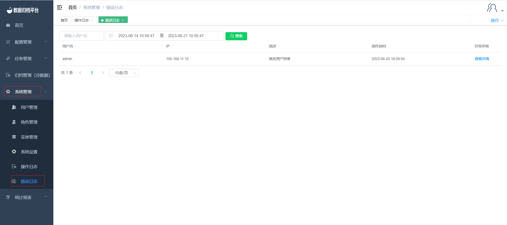

#### Error Logs

##### Search

Clicking on "System Operation Logs" under the "System Management" menu allows administrators to view error logs related to user actions on the platform. The page displays error logs generated from user actions. The green button is the search button. On the left side, there is a criteria field. Fill in the filtering criteria in the field, and then click "Search" to filter out the desired error logs. By clicking the "View Details" button on the right, you can view the details of the error and its causes.

These error logs help administrators identify and address issues or unexpected behaviors in the system, providing insights into the activities that led to errors.