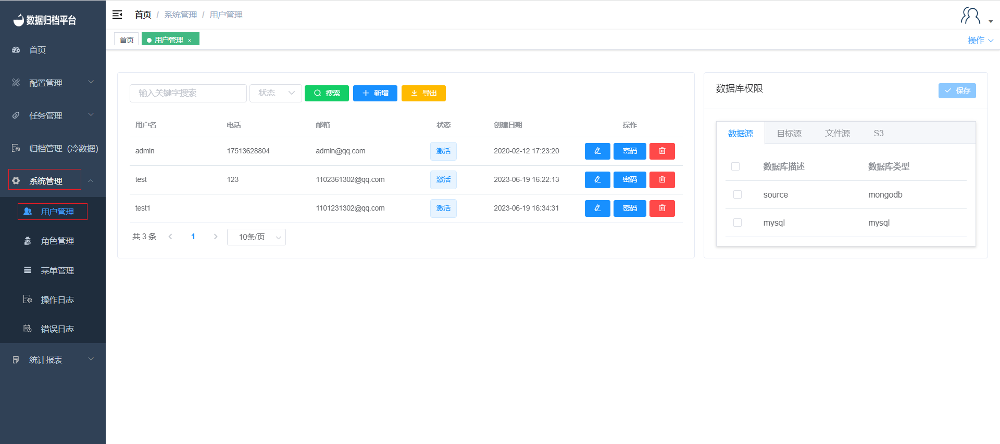
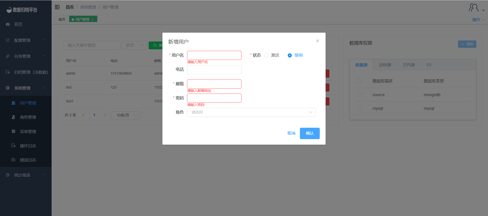
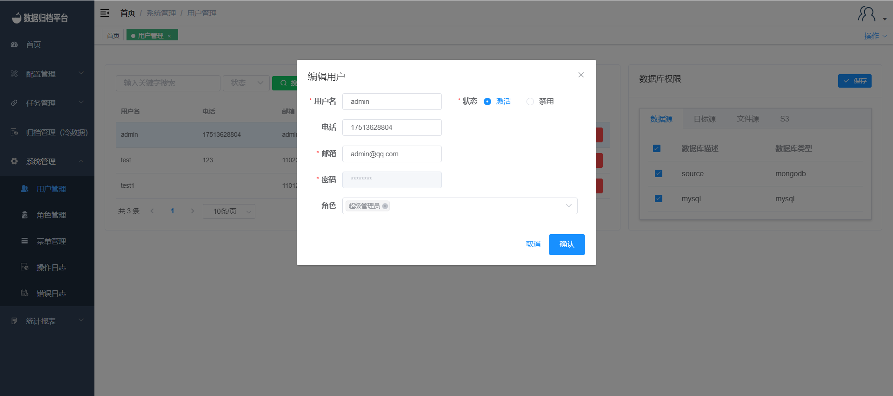

#### User Management

Clicking on "User Management" under the "System Management" menu, visible only to administrator users, will take you to a page displaying all user information on the platform, including database permissions and bindings.

##### Search

The green button is the search button. Fill in the left two search boxes with relevant criteria and click the search button to filter the desired user information.

##### Add User

The second blue button is the "Add" button. Clicking on it will bring up the interface shown in the image above. Fill in the username, email, phone number, and password to add a new user. In the "Role" section, you can select the system permissions for the user, as well as the user's status (enabled or disabled).

##### Export Users

The third yellow button is the "Export Users" button. Clicking on it will generate an xlsx file containing information for all users. You can customize the file name.

##### Modify User Details

Clicking on the pencil icon on the right side of a user's row will allow you to modify user information. An edit page will pop up with editable fields for all user details except for the password. Modify the information as needed and click "Confirm" to save the changes.

##### Change Password

Clicking on the second password icon on the right side of a user's row will allow you to change the user's password. A form will appear where you can enter the new password. After entering the new password, click "Confirm" to save the changes.

##### Delete User

Clicking on the third red button on the right side of a user's row will prompt a confirmation message asking if you want to delete the user. If you confirm deletion, click "Confirm." If you don't want to delete the user, click "Cancel."

##### Database Permissions (Data Sources, Target Sources, File Sources, S3)

Clicking on a user's row will display the database permissions assigned to that user, including data sources, target sources, file sources, and S3. Check the sources that the user should have access to, then click "Save."

