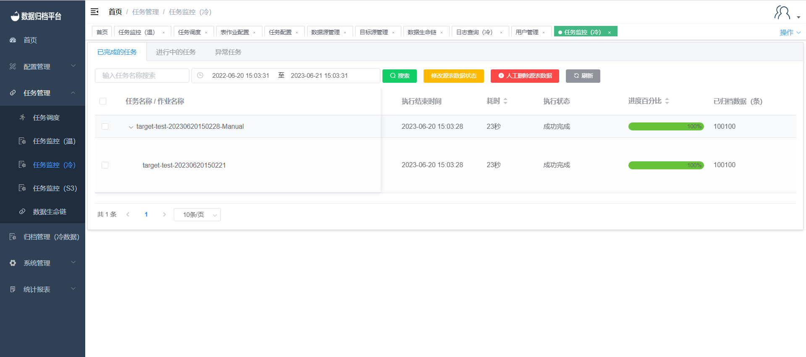
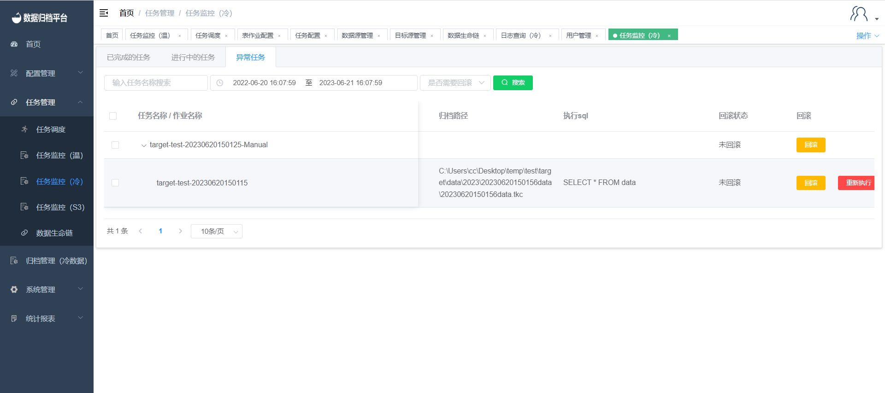

#### Task Monitoring (Cold)

##### Task Status

Clicking on "Task Monitoring (Cold)" under the "Task Management" menu will display information about the execution status of cold tasks. This page includes information about completed tasks, ongoing tasks, and tasks with exceptions. Each search button is associated with a set of search criteria, allowing you to filter and display tasks efficiently.

##### Completed Tasks

Clicking on "Completed Tasks" will display information about tasks that have been successfully completed. This page includes details such as the execution strategy, start and end times, duration, execution status, progress percentage, archived items, archive path, source table data status, and executed SQL statements. The page also features four buttons: search, modify source table data status, manually delete source table data, and refresh.

**Search**

The green button at the top is the search button. Enter criteria in the provided search boxes and click the search button to display filtered completed tasks.

**Modify Source Table Data Status**

After synchronization is completed, if source table data has been manually deleted, you can click the yellow button to mark the source table data as processed.

**Manually Delete Source Table Data**

The red button allows you to manually delete source table data. If the table job configuration does not include automatic deletion and you want to manually delete the source data after synchronization, you can use this button.

**Refresh**

The progress percentage of a task is updated every 3 seconds. Clicking the refresh button will update the progress bar and task status.

##### Ongoing Tasks

Clicking on "Ongoing Tasks" will display information about tasks that are currently in progress. This page includes details such as the execution strategy, start and end times, duration, execution status, progress percentage, archived items, and executed SQL statements. The page features three buttons: search, terminate task, and task status validation.

**Search**

The green button is the search button. Fill in the provided search boxes as needed, and then click the search button to display all ongoing tasks that match the criteria.

**Terminate Task**

The red button allows you to terminate an ongoing task. After clicking this button, the task will be terminated and will appear in the list of tasks with exceptions. If the termination is successful, the task will also be marked as completed.

**Task Status Validation**

Each task can contain multiple table jobs. When one table job is completed, the next one starts. If the task status does not update after a table job has been completed, you can click the "Task Status Validation" button to update the task status.

##### Exception Tasks

Clicking on "Exception Tasks" will display information about tasks that encountered exceptions. This page includes details such as the execution strategy, start and end times, duration, execution status, exception details, progress percentage, archived items, archive path, executed SQL statements, and rollback status. This page features three buttons: search, rollback, and re-execute.

**Search**

The green button at the top is the search button. Fill in the provided search boxes with criteria and click the search button to display filtered exception tasks.

**Rollback**

Each exception task has a rollback button. Clicking on this button will initiate a rollback of the exception data synchronized by the subtask. If the rollback button of the parent task is clicked, all subtasks under that parent task will be rolled back.

**Re-execute**

Each subtask of an exception task has a re-execute button. Clicking this button will generate a new parent task associated with the exception task. The exception task will be linked to the new parent task. After the rollback of the exception data is completed, the task will appear in the ongoing tasks list, and you can re-execute it.