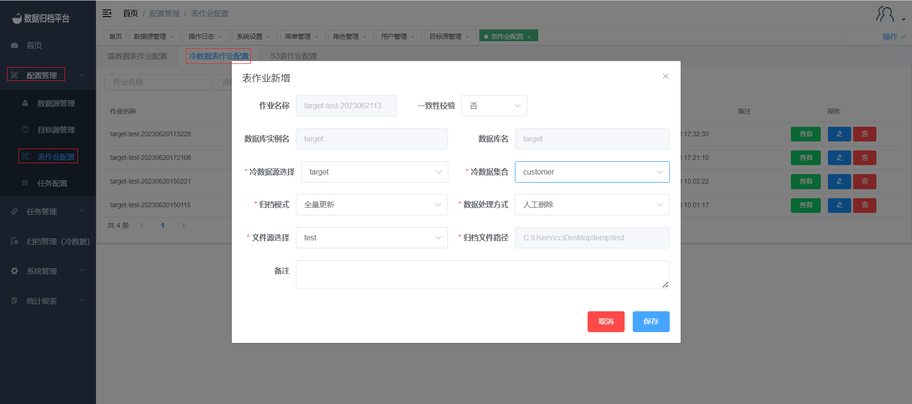

#### Adding a Cold Data Full Job

To set up a full job for cold data archiving, follow these steps:

1. Click on the "Configuration Management" menu and select "Table Job Configuration".
2. In the "Cold Data Table Job" page, click on the blue "Add" button to open the form.
3. Fill out the form by selecting the data source table and file source for synchronization. Choose the archiving mode as "Full Update".
4. Note that cold data archiving is applicable only to MongoDB data.
5. The table job comes with consistency validation. Select "Yes" and specify the required validation percentage. After synchronization, the platform will perform consistency validation on the synchronized data.
6. Choose the data handling method, either manual deletion or system deletion. This feature allows you to delete the source table after synchronization is completed.

Following these steps will enable you to configure a full job for cold data archiving, ensuring efficient and accurate data synchronization and archiving.