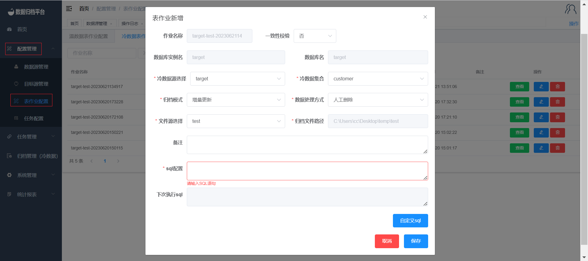
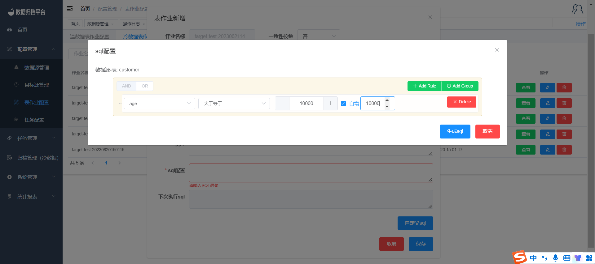

#### Adding a Cold Data Incremental Job

To set up an incremental job for cold data archiving, follow these steps:

1. Click on the "Configuration Management" menu and select "Table Job Configuration".
2. In the "Cold Data Table Job" page, click on the blue "Add" button to open the form.
3. Fill out the form by selecting the data source table and file source for synchronization. Choose the archiving mode as "Incremental Update".
4. Note that cold data archiving is applicable only to MongoDB data.
5. For the incremental update mode, you need to fill in the SQL configuration. Click the blue "Custom SQL" button to open the table shown in the second image. Select the completion conditions and click "Save" to generate the SQL.
6. The table job comes with consistency validation. Select "Yes" and specify the required validation percentage. After synchronization, the platform will perform consistency validation on the synchronized data.
7. Choose the data handling method, either manual deletion or system deletion. This feature deletes the source table based on the configured batch.

By following these steps, you can configure an incremental job for cold data archiving, enabling efficient and accurate synchronization of MongoDB data for archiving purposes.