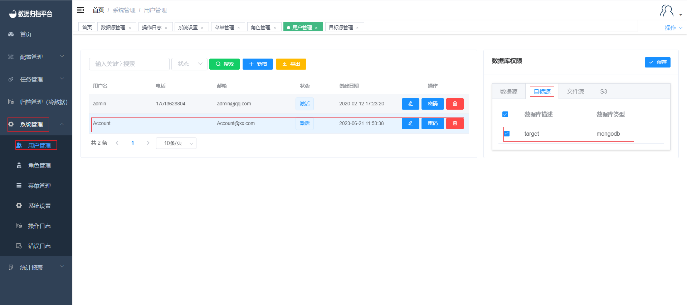

#### Adding a Target Source

To add a new target source to the platform, follow these steps:

1. Click on the "Configuration Management" menu and select "Target Source Management".
2. Click the blue "Add" button to open the form.
3. Fill in the basic information for the new target source and click "Test". If you see a "Test Passed" message above, click "Save" to successfully add the target source. If the test fails, double-check the provided information for accuracy.
4. After adding the target source, go to the "System Management" menu and select "User Management". Click on the user you want to bind the target source to.
5. In the user details, select the added target source from the list and click "Save". This user will now have access to the newly added target source.

By following these steps, you can add and configure new target sources, allowing users to utilize these sources as destinations for data operations within the Whaleal Data platform.