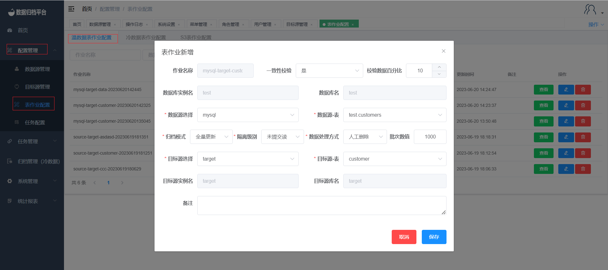

#### Adding a Warm Data Full Load Job

To add a new warm data full load job to the platform, follow these steps:

1. Click on the "Configuration Management" menu and select "Table Job Configuration".
2. In the Warm Data Table Job page, click the blue "Add" button to open the form.
3. Choose the data source database table and the target destination database table that you want to synchronize.
4. Select "Full Load" as the archive mode.
5. The warm data table job also includes data consistency verification. If you choose to enable it, you can set the required verification percentage. After the synchronization, the platform will perform data consistency checks on the synchronized data.
6. For MySQL-related jobs, you can choose the isolation level for synchronization. For MongoDB to MongoDB synchronization, you can choose whether to sync Gridfs. If you choose "No," the platform will only synchronize regular documents.
7. Choose a data processing method, either manual deletion or automatic deletion, after synchronization. The data source table will be deleted according to your choice after synchronization is completed.

By following these steps, you can create a warm data full load job that synchronizes data from a data source database table to a target destination database table using full load mode. This allows for comprehensive synchronization of data within the Whaleal Data platform.