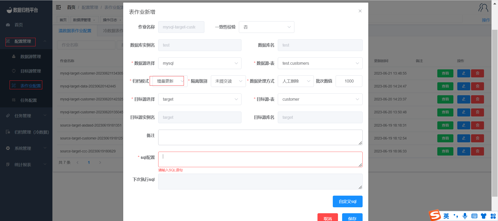

#### Adding a Warm Data Incremental Load Job

To add a new warm data incremental load job to the platform, follow these steps:

1. Click on the "Configuration Management" menu and select "Table Job Configuration".
2. In the Warm Data Table Job page, click the blue "Add" button to open the form.
3. Choose the data source database table and the target destination database table that you want to synchronize.
4. Select "Incremental Load" as the archive mode.
5. If you choose the incremental load mode, you need to fill in the SQL configuration. Click the blue "Custom SQL" button to open the form where you can select the completion conditions for the SQL. Click "Save" to generate the SQL.
6. The warm data table job also includes data consistency verification. If you choose to enable it, you can set the required verification percentage. After the synchronization, the platform will perform data consistency checks on the synchronized data.
7. For MySQL-related jobs, you can choose the isolation level for synchronization. For MongoDB to MongoDB synchronization, you can choose whether to sync Gridfs. If you choose "No," the platform will only synchronize regular documents.
8. Choose a data processing method, either manual deletion or automatic deletion, after synchronization. The data source table will be deleted according to your choice after synchronization is completed.

By following these steps, you can create a warm data incremental load job that synchronizes data from a data source database table to a target destination database table using incremental load mode. This allows for continuous synchronization of data within the Whaleal Data platform.