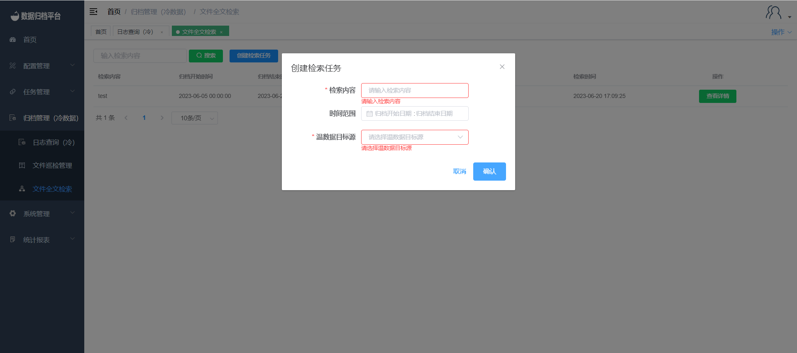

#### Cold Data Full-Text Search

To perform a full-text search on archived cold data, follow these steps:

1. Click on the "Archive Management" menu and select "File Full-Text Search". This will display all file full-text search log information.
2. Click the "Create Search Task" button to create a file full-text search task. The system will execute a global search on the files. For the files that match the search criteria, you can perform a file rollback operation.

##### Searching

The green button on the top is the search button. The left-side filter options can be filled in as needed. After filling in the conditions, click the search button to filter the desired search content.

##### Creating a Search Task

Click the blue button to create a search task. This will open a form where you can enter the necessary details. After filling in the required information, click "Confirm".

By following these steps, you can search for archived cold data using the full-text search feature in the Whaleal Data platform. You can filter and retrieve specific files based on your search criteria and even perform file rollback operations as needed.