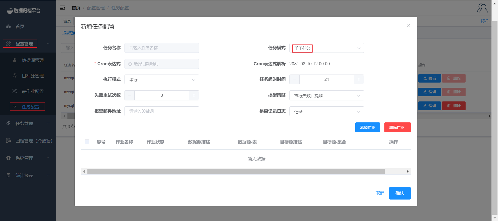

#### Creating Manual Tasks

Creating a manual task follows the same steps as creating a one-time task. The key difference with manual tasks is that they don't require setting an execution time, as they are intended to be triggered manually when needed. Here's how you can create and manage manual tasks:

1. Begin by creating a task configuration, just as you did for the one-time task.
2. In the task configuration, set the execution mode to "Manual."
3. Complete the rest of the task configuration details and save the configuration.

Once the manual task is configured, it will be available for execution by authorized users. An administrator needs to review and approve the manual task, just like with other tasks, before it can be executed.

To execute a manual task:

1. Navigate to the "Task Management" menu and select "Task Scheduling."
2. Locate the manual task you want to execute.
3. Click the "Execute Now" button next to the task. This will trigger the immediate execution of the task.

Manual tasks are particularly useful when you want to perform specific data archiving or synchronization tasks on-demand, giving you full control over when these tasks are executed.

