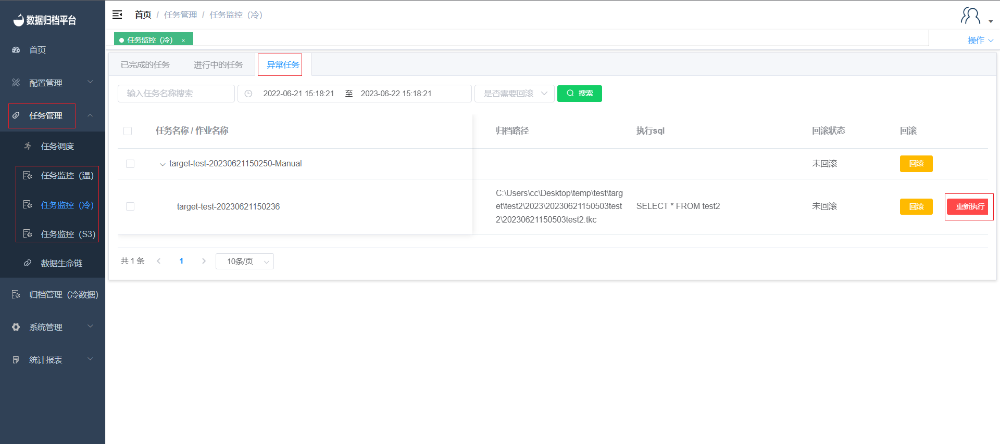

#### Re-Execution of Failed Tasks

Under the "Task Management" menu, there are three sections for task monitoring: "Completed," "In Progress," and "Exception." For tasks that have encountered exceptions or failures, you have the option to manually trigger a re-execution of these tasks.

Here's how you can re-execute a failed task:

1. Go to the "Task Monitoring" section.
2. Click on the "Exception" tab to view tasks that encountered exceptions.
3. Find the specific task you want to re-execute and click on it to view its details.
4. Within the task details view, you'll find an option to "Re-Execute." Clicking this option will initiate the re-execution process.
5. The task will first be rolled back to its previous state, and then it will be re-executed.

This functionality provides a way to address and resolve exceptions that may have occurred during task execution, allowing you to retry the task and ensure its successful completion.

